# Programación - 02 Programación Estructurada y Modular

UD2 Programación Estructurada y Modular. 1DAM/DAW. Curso 2025/2026.


## 1. Tipos y Operaciones
Los tipos de datos nos sirven para clasificar nuestra información de entrada y salida y trabajar con ellos. Un tipo lo define en base al valor que puede almacenar y las operaciones que se pueden realizar con él.
- Tipos simples: Se llama tipo de dato a una clase concreta de objetos o valores: Números, Caracter, Lógicos, etc.
- Tipos compuestos: arrays, listas, etc, que los veremos más adelante.

=== "kotlin"

    ```Kotlin
    // Tipos de datos
    // Tipos simples
    // Números
    var numero: Int = 1
    var numero: Double = 1.0
    var numero: Float = 1.0f
    var numero: Long = 1L
    var numero: Short = 1
    var numero: Byte = 1
    // Caracteres
    var caracter: Char = 'a'
    // Lógicos
    var logico: Boolean = true
    // Cadenas
    var cadena: String = "Hola"
    // Tipos compuestos
    // Arrays
    var array: Array<Int> = arrayOf(1, 2, 3)
    var array: IntArray = intArrayOf(1, 2, 3)
    var array: Array<String> = arrayOf("Hola", "Adiós")
    var array: Array<Boolean> = arrayOf(true, false)
    // Matrices
    var matriz: Array<Array<Int>> = arrayOf(arrayOf(1, 2, 3), arrayOf(4, 5, 6))
    var matriz: Array<IntArray> = arrayOf(intArrayOf(1, 2, 3), intArrayOf(4, 5, 6))
    ```

=== "Java"

    ```java
    // Tipos de datos
    // Tipos simples
    // Números
    int entero = 1;             // Entero (32 bits)
    double doble = 1.0;          // Punto flotante doble precisión (64 bits)
    float flotante = 1.0f;       // Punto flotante simple precisión (32 bits)
    long largo = 1L;             // Entero largo (64 bits)
    short corto = 1;             // Entero corto (16 bits)
    byte byteValor = 1;          // Byte (8 bits)
    // Caracteres
    char caracter = 'a';         // Carácter Unicode (16 bits)
    // Lógicos
    boolean logico = true;       // Valor booleano (true/false)
    // Cadenas
    String cadena = "Hola";      // Cadena de caracteres (objeto inmutable)
    // Tipos compuestos
    // Arrays
    Integer[] arrayInteger = {1, 2, 3};          // Array de objetos Integer
    int[] arrayInt = {1, 2, 3};                  // Array de primitivos int
    String[] arrayString = {"Hola", "Adiós"};    // Array de String
    boolean[] arrayBoolean = {true, false};      // Array de boolean
    // Matrices
    int[][] matriz = {{1, 2, 3}, {4, 5, 6}};     // Matriz de int
    Integer[][] matrizObjetos = {{1, 2, 3}, {4, 5, 6}}; // Matriz de Integer
    ```
=== "Python"
    ```python
    # Tipos de datos en Python
    entero = 1                  # Equivalente a Int (enteros de precisión arbitraria)
    flotante = 1.0              # Equivalente a Double (float en Python)
    flotante_precision = 1.0    # Python solo tiene un tipo de flotante (64 bits)
    largo = 1                   # En Python 3, todos los enteros son de largo alcance
    # No hay equivalente exacto a Short o Byte en Python básico
    caracter = 'a'              # En Python, es un string de longitud 1
    logico = True               # Bool (True o False)
    cadena = "Hola"             # String (cadena de caracteres)

    lista_enteros = [1, 2, 3]                   # Lista de enteros
    lista_strings = ["Hola", "Adiós"]            # Lista de strings
    lista_booleanos = [True, False]              # Lista de booleanos
    tupla_enteros = (1, 2, 3)                   # Tupla de enteros
    matriz = [[1, 2, 3], [4, 5, 6]]             # Matriz como lista de listas
    ```

### 1.1. Lenguajes tipados y no tipados
- Lenguajes tipados: Los lenguajes tipados son aquellos que requieren que el programador declare el tipo de dato que se va a utilizar en cada variable. En estos lenguajes, el compilador o intérprete comprueba que el tipo de dato de cada variable coincida con el tipo de dato que se ha declarado. 
- Lenguajes débilmente tipados y/o tipado dinámico: Los lenguajes debilmente tipados son aquellos que no requieren que el programador declare el tipo de dato que se va a utilizar en cada variable. El compilador o intérprete deduce el tipo de dato de cada variable en tiempo de ejecución.

### 1.2. Operaciones

=== "Kotlin"
    ```kotlin
    // Aritméticos
    var a = 5 + 3   // Suma: 8
    a = 5 - 3       // Resta: 2
    a = 5 * 3       // Multiplicación: 15
    a = 5 / 3       // División entera: 1
    val b = 5.0 / 3 // División flotante: 1.666...
    val c = 5 % 3   // Módulo: 2
    a++             // Incremento (postfijo)
    ++a             // Incremento (prefijo)
    a--             // Decremento (postfijo)
    --a             // Decremento (prefijo)

    // Relacionales
    val d = (5 == 3)  // Igualdad: false
    val e = (5 != 3)  // Desigualdad: true
    val f = (5 > 3)   // Mayor que: true
    val g = (5 < 3)   // Menor que: false
    val h = (5 >= 3)  // Mayor o igual: true
    val i = (5 <= 3)  // Menor o igual: false

    // Lógicos
    val j = true && false  // AND: false
    val k = true || false  // OR: true
    val l = !true          // NOT: false

    // Asignación
    var m = 5       // Asignación simple
    m += 3          // Suma y asignación (m = m + 3)
    m -= 2          // Resta y asignación
    m *= 2          // Multiplicación y asignación
    m /= 3          // División y asignación
    m %= 3          // Módulo y asignación
    ```
=== "Java"
    ```java
    // Aritméticos
    int a = 5 + 3;   // Suma: 8
    a = 5 - 3;       // Resta: 2
    a = 5 * 3;       // Multiplicación: 15
    a = 5 / 3;       // División entera: 1
    double b = 5.0 / 3; // División flotante: 1.666...
    int c = 5 % 3;   // Módulo: 2
    a++;             // Incremento (postfijo)
    ++a;             // Incremento (prefijo)
    a--;             // Decremento (postfijo)
    --a;             // Decremento (prefijo)

    // Relacionales
    boolean d = (5 == 3);  // Igualdad: false
    boolean e = (5 != 3);  // Desigualdad: true
    boolean f = (5 > 3);   // Mayor que: true
    boolean g = (5 < 3);   // Menor que: false
    boolean h = (5 >= 3);  // Mayor o igual: true
    boolean i = (5 <= 3);  // Menor o igual: false

    // Lógicos
    boolean j = true && false;  // AND: false
    boolean k = true || false;  // OR: true
    boolean l = !true;          // NOT: false

    // Asignación
    int m = 5;       // Asignación simple
    m += 3;          // Suma y asignación (m = m + 3)
    m -= 2;          // Resta y asignación
    m *= 2;          // Multiplicación y asignación
    m /= 3;          // División y asignación
    m %= 3;          // Módulo y asignación
    ```
=== "Python"
    ```python
    # Aritméticos
    a = 5 + 3   # Suma: 8
    a = 5 - 3   # Resta: 2
    a = 5 * 3   # Multiplicación: 15
    a = 5 / 3   # División flotante: 1.666...
    a = 5 // 3  # División entera: 1
    a = 5 % 3   # Módulo: 2
    a = 5 ** 3  # Potencia: 125
    # Python no tiene ++ o --
    a += 1      # Incremento alternativo
    a -= 1      # Decremento alternativo

    # Relacionales
    d = (5 == 3)  # Igualdad: False
    e = (5 != 3)  # Desigualdad: True
    f = (5 > 3)   # Mayor que: True
    g = (5 < 3)   # Menor que: False
    h = (5 >= 3)  # Mayor o igual: True
    i = (5 <= 3)  # Menor o igual: False

    # Lógicos
    j = True and False  # AND: False
    k = True or False   # OR: True
    l = not True        # NOT: False

    # Asignación
    m = 5       # Asignación simple
    m += 3      # Suma y asignación (m = m + 3)
    m -= 2      # Resta y asignación
    m *= 2      # Multiplicación y asignación
    m /= 3      # División y asignación
    m %= 3      # Módulo y asignación
    m **= 2     # Potencia y asignación
    m //= 2     # División entera y asignación
    ```

???+ info "Diferencias clave:"

    - **Python** usa **and**, **or**, **not** en lugar de **&&**, **||**, **!**

    - **Python** no tiene operadores de incremento/decremento (**++**, **--**)

    - **Python** tiene operador de potencia (******) y división entera (****//**)

    - **Java/Kotlin** requieren **punto y coma** y **declaraciones de tipo explícitas**

    - **Kotlin** usa **===** para igualdad referencial

### 1.3. Precedencia de Operadores (Kotlin vs Java vs Python)

#### Tabla de Precedencia Completa

| Nivel | Categoría                | Kotlin/Java               | Python                    |
|-------|--------------------------|---------------------------|---------------------------|
| 1     | Agrupación               | `()`                      | `()`                      |
| 2     | Acceso/Member            | `.`, `?.`, `[]`, `()`     | `.`, `[]`, `()`           |
| 3     | Sufijo                 | `++`, `--` (sufijo)     | N/A                       |
| 4     | Prefijo/Unario           | `-`, `+`, `!`, `++`, `--` (prefijo) | `-`, `+`, `~`, `not`     |
| 5     | Multiplicativo           | `*`, `/`, `%`             | `*`, `/`, `//`, `%`, `@`  |
| 6     | Aditivo                  | `+`, `-`                  | `+`, `-`                  |
| 7     | Rangos                   | `..`, `in`, `!in`         | N/A                       |
| 8     | Desplazamiento           | `shl`, `shr`, `ushr`      | `<<`, `>>`                |
| 9     | AND bit a bit            | `and` (Kotlin), `&` (Java)| `&`                       |
| 10    | XOR bit a bit            | `xor` (Kotlin), `^` (Java)| `^`                       |
| 11    | OR bit a bit             | `or` (Kotlin), `\|` (Java)| `\|`                      |
| 12    | Comparación              | `<`, `>`, `<=`, `>=`      | `<`, `>`, `<=`, `>=`, `==`, `!=`, `is`, `is not`, `in`, `not in` |
| 13    | Igualdad                 | `==`, `!=`, `===`, `!==`  | `==`, `!=`                |
| 14    | Conjunción lógica        | `&&`                      | `and`                     |
| 15    | Disyunción lógica        | `\|\|`                    | `or`                      |
| 16    | Elvis/Asignación         | `?:`, `=`, `+=`, etc.     | `:=` (walrus), `=`, `+=`, etc. |

#### Diferencias Clave

#### 1. Operadores Bit a Bit
```kotlin
// Kotlin usa palabras clave
val a = 0b1010 and 0b1100  // 0b1000
val b = 0b1010 or 0b1100   // 0b1110
```

```java
// Java usa símbolos
int a = 0b1010 & 0b1100;  // 0b1000
int b = 0b1010 | 0b1100;   // 0b1110
```

```python
# Python usa símbolos como Java
a = 0b1010 & 0b1100  # 0b1000
b = 0b1010 | 0b1100   # 0b1110
```

#### 2. Operadores Lógicos
```kotlin
// Kotlin usa símbolos
if (a > 5 && b < 10 || c == 0) { ... }
```

```python
# Python usa palabras
if a > 5 and b < 10 or c == 0: ...
```

#### 3. Operador Walrus (Python 3.8+)
```python
# Python tiene operador de asignación en expresiones
if (n := len(a)) > 10:
    print(f"Lista larga con {n} elementos")
```

#### Ejemplos Prácticos

#### Expresión Completa
=== "Kotlin"
    ```kotlin
    val result = 5 + 3 * 2 < 15 && (10 % 3 == 1 || 2 shl 3 > 10)
    // Paso a paso:
    // 1. 3*2=6
    // 2. 5+6=11
    // 3. 10%3=1
    // 4. 2 shl 3=16
    // 5. 1==1 → true
    // 6. 16>10 → true
    // 7. true||true → true
    // 8. 11<15 → true
    // 9. true&&true → true
    ```

=== "Java"
    ```java
    boolean result = 5 + 3 * 2 < 15 && (10 % 3 == 1 || 2 << 3 > 10);
    // Mismo orden que Kotlin
    ```

=== "Python"
    ```python
    result = 5 + 3 * 2 < 15 and (10 % 3 == 1 or 2 << 3 > 10)
    # Orden similar pero con palabras clave
    ```

#### Reglas Mnemotécnicas

1. **PEMDAS** (Para matemáticas básicas):
   - Paréntesis
   - Exponentes (`**` en Python)
   - Multiplicación/División
   - Adición/Sustracción

2. **Bit a Bit**:
   - Kotlin: `and`/`or`/`xor` antes que comparaciones
   - Java/Python: `&`/`|` antes que `==`

3. **Lógicos**:
   - `not`/`!` antes que `and`/`&&`
   - `and`/`&&` antes que `or`/`||`

#### Casos Peligrosos

#### Kotlin/Java vs Python
```kotlin
// Kotlin/Java
val a = true && false || true  // true (&& tiene mayor precedencia)
// Equivale a: (true && false) || true
```

```python
# Python
a = True and False or True  # True (and tiene mayor precedencia)
# Equivale a: (True and False) or True
```

#### Operador Walrus
```python
# Correcto
if (x := 5 + 3) > 7: ...

# Peligroso (diferente significado)
if x := 5 + 3 > 7: ...  # x será True/False, no 8
```

#### Recomendaciones

1. **Usar paréntesis** cuando:
   - Combines operadores lógicos y aritméticos
   - Tengas dudas sobre el orden
   - Mejore la legibilidad

2. **Consistencia**:
   - En Kotlin/Java preferir `&&`/`||`
   - En Python usar `and`/`or`

3. **Espaciado**:
   ```kotlin
   // ❌ Confuso
   val x=a+b*c-d
   
   // ✅ Claro
   val x = a + b * c - d
   ```
### 1.4. Casting y Conversión de Tipos

#### Conceptos Clave

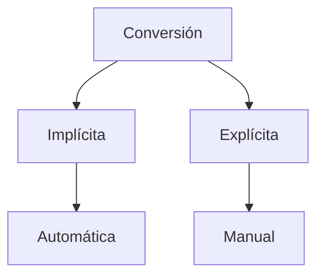

#### Tabla Comparativa

| Operación               | Kotlin                      | Java                       | Python                     |
|-------------------------|----------------------------|----------------------------|----------------------------|
| Conversión implícita    | Limitada (solo promoción)  | Automática (primitivos)    | Dinámica                   |
| Conversión explícita    | `.toXxx()`                 | `(tipo)`                   | `tipo()`                   |
| Comprobación de tipo    | `is`                       | `instanceof`               | `isinstance()`             |
| Casting seguro          | `as?`                      | -                          | -                          |
| String a número         | `.toInt()`                 | `Integer.parseInt()`       | `int()`                    |
| Número a String         | `toString()`               | `String.valueOf()`         | `str()`                    |

#### Kotlin

=== "Kotlin"

    ```kotlin
    fun main() {
        // Conversión explícita (no hay implícita entre tipos diferentes)
        val doubleVal: Double = 3.14
        val intVal: Int = doubleVal.toInt() // 3
        
        // Casting entre tipos (seguro con as?)
        val obj: Any = "Hola"
        val str: String? = obj as? String // Safe cast
        
        // Comprobación de tipo
        if (obj is String) {
            println(obj.length) // Smart cast automático
        }
        
        // String a número
        val num = "123".toInt()
    }
    ```

    **Características:**
    - No hay conversión implícita que cause pérdida de precisión
    - Métodos `toXxx()` para conversiones
    - Smart casting automático después de comprobaciones

#### Java

=== "Java"

    ```java
    public class Main {
        public static void main(String[] args) {
            // Conversión implícita (promoción)
            int intVal = 5;
            double doubleVal = intVal; // 5.0
            
            // Conversión explícita (casting)
            doubleVal = 3.14;
            intVal = (int) doubleVal; // 3
            
            // Comprobación de tipo
            Object obj = "Hola";
            if (obj instanceof String) {
                String str = (String) obj;
                System.out.println(str.length());
            }
            
            // String a número
            int num = Integer.parseInt("123");
        }
    }
    ```

    **Particularidades:**
    - Casting clásico con `(tipo)`
    - `instanceof` para comprobación
    - Autoboxing entre primitivos y wrappers

#### Python

=== "Python"

    ```python
    if __name__ == "__main__":
        # Conversión implícita dinámica
        result = 3 + 2.5  # 5.5 (int -> float)
        
        # Conversión explícita
        int_val = int(3.14)  # 3
        float_val = float("3.14")
        
        # Comprobación de tipo
        obj = "Hola"
        if isinstance(obj, str):
            print(len(obj))
        
        # Casting entre objetos
        class Padre: pass
        class Hijo(Padre): pass
        
        hijo = Hijo()
        padre = Padre()
        cast_hijo = hijo  # No necesita casting explícito
    }
    ```

    **Características:**
    - Duck typing (más importante que el tipo)
    - Conversiones con constructores (`int()`, `str()`, etc.)
    - No hay casting explícito entre objetos

#### Conversiones Comunes

#### 1. Número a String
```kotlin
// Kotlin
val str = 123.toString()
```

```java
// Java
String str = Integer.toString(123);
```

```python
# Python
str_val = str(123)
```

#### 2. String a Número
```kotlin
// Kotlin
val num = "123".toIntOrNull() ?: 0
```

```java
// Java
int num = Integer.parseInt("123");
```

```python
# Python
num = int("123")  # ValueError si falla
```

#### 3. Casting entre Tipos de Objetos
```kotlin
// Kotlin (safe cast)
val obj: Any = "Hola"
val str: String? = obj as? String
```

```java
// Java (con comprobación)
Object obj = "Hola";
if (obj instanceof String) {
    String str = (String) obj;
}
```

```python
# Python (no necesario normalmente)
obj = "Hola"
if isinstance(obj, str):
    str_val = obj  # No necesita casting
```

#### Buenas Prácticas

1. **En Kotlin**:
   - Prefiere `as?` sobre `as` para evitar `ClassCastException`
   - Usa `toXxxOrNull()` para conversiones seguras

2. **En Java**:
   - Siempre verificar con `instanceof` antes de casting
   - Usar `Integer.parseInt()` con try-catch

3. **En Python**:
   - Prefiere `isinstance()` sobre type()
   - Maneja `ValueError` en conversiones

#### Rendimiento

| Operación          | Kotlin | Java  | Python |
|--------------------|--------|-------|--------|
| String a Int       | ~50ns  | ~30ns | ~100ns |
| Double a Int       | ~10ns  | ~5ns  | ~50ns  |
| Comprobación tipo  | ~5ns   | ~7ns  | ~20ns  |

#### Casos Especiales

#### Kotlin Smart Cast
```kotlin
when (val response = getData()) {
    is String -> println(response.length)  // Auto-casted a String
    is Int -> println(response + 1)       // Auto-casted a Int
}
```

#### Java Pattern Matching (JDK 16+)
```java
Object obj = "Hola";
if (obj instanceof String str) {
    System.out.println(str.length());
}
```

#### Python Duck Typing
```python
def procesar(item):
    if hasattr(item, '__len__'):
        return len(item)
    return 0

procesar("Hola")  # 4
procesar([1,2,3]) # 3
```

#### Errores Comunes

1. **Kotlin/Java**:
   ```kotlin
   val num = "abc".toInt()  // NumberFormatException
   ```

2. **Java**:
   ```java
   double d = 3.14;
   int i = d;  // Error: requiere casting explícito
   ```

3. **Python**:
   ```python
   val = int("12a")  # ValueError
   ```


### 1.5. Variables y constantes
A la hora de almacenar datos en memoria, debemos analizar cómo vamos a utilizarlos. Si vamos a modificarlos, debemos utilizar variables, si no, debemos utilizar constantes.
- Constantes: Son valores que no cambian durante la ejecución del programa. Se declaran con la palabra reservada const/val. Son inmutables.
- Variables: Son valores que cambian durante la ejecución del programa. Se declaran con la palabra reservada var. Son mutables.

Se debe aplicar código limpio y buenas prácticas de programación. para nombrarlas.

Dependiendo del tipo de lenguaje, si es tipado o no, tendremos posibilidad de definir variables o constantes.


=== "Kotlin"
    ```kotlin
    // Variables mutables (pueden cambiar)
    var variableMutable: Int = 10
    variableMutable = 20  // Correcto

    // Variables inmutables (NO pueden cambiar)
    val variableInmutable: Int = 30
    // variableInmutable = 40  // Error de compilación

    // Constantes (en tiempo de compilación)
    const val CONSTANTE: Int = 50
    // Deben ser inicializadas con un valor conocido en compilación
    ```

=== "Java"
    ```java
    // Variables mutables
    int variableMutable = 10;
    variableMutable = 20;  // Correcto

    // 'Constantes' (en realidad variables inmutables)
    final int variableInmutable = 30;
    // variableInmutable = 40;  // Error de compilación

    // Constantes reales (static final)
    static final int CONSTANTE = 50;
    // Convención: nombres en MAYÚSCULAS
    ```

=== "Python"
    ```python
    # Variables mutables (por defecto todas lo son)
    variable_mutable = 10
    variable_mutable = 20  # Correcto

    # 'Constantes' (convención, no realmente inmutables)
    CONSTANTE = 30  # Por convención se usa MAYÚSCULAS
    CONSTANTE = 40  # Funciona, pero no debería hacerse

    # No hay verdadera inmutabilidad para variables simples
    # Para estructuras complejas, usar:
    from typing import Final
    CONSTANTE_REAL: Final[int] = 50  # Python 3.8+
    # Aunque técnicamente puede cambiarse, linters avisan
    ```

??? warning "Definiciones precisas"
    - [x] **Kotlin**:
        1. **var**: Variable mutable (puede reasignarse)
        2. **val**: Variable inmutable (solo asignación inicial)
        3. **const val**: Constante real (valor conocido en compilación)
    - [x] **Java**:
        1. Variables normales: mutables por defecto
        2. **final**: Hace la variable inmutable (solo para primitivos y referencias)
        3. **static final**: Constante real (compartida por todas las instancias)
    - [x] **Python**:
        1. Todas las variables son mutables por defecto
        2. No tiene verdaderas constantes, solo convenciones (nombres en MAYÚSCULAS)
        3. Desde Python 3.8: `Final` (solo para linters, no impide modificación)
    - [ ] **Importante**
        - En **Java** no existen verdaderas "constantes" como en Kotlin, solo variables inmutables (**final**). Las constantes se simulan con **static final**.
        - En **Python** no hay inmutabilidad real para variables simples, solo convenciones y anotaciones para linters. La inmutabilidad solo existe para algunos tipos como tuplas.

### 1.6. Conversiones de Tipo (Kotlin vs Java vs Python)

#### Tabla Comparativa Rápida

| Operación               | Kotlin                      | Java                       | Python                     |
|-------------------------|----------------------------|----------------------------|----------------------------|
| Casting explícito       | `as`, `toXxx()`            | `(tipo)`                   | `tipo()`                   |
| Conversión implícita    | Mínima                     | Primitivos                 | Dinámica                   |
| String a número         | `toIntOrNull()`            | `Integer.parseInt()`       | `int()`                    |
| Número a String         | `toString()`               | `String.valueOf()`         | `str()`                    |
| Char a código           | `code`                     | Cast a `int`               | `ord()`                    |
| Código a Char           | `toChar()`                 | Cast a `char`              | `chr()`                    |
| División exacta         | `/` (con al menos un float)| `(double)` o `* 1.0`       | `/` (siempre float)        |

#### 1. Conversiones Numéricas

#### Casting Explícito
=== "Kotlin"
    ```kotlin
    val bigNum = 65633
    val c: Char = bigNum.toChar()  // 'a' (truncamiento)
    val f = 97.53f
    val c2 = f.toChar()  // 'a' (sin decimales)
    val pi = 3.14159f
    val i = pi.toInt()  // 3 (truncamiento)
    ```

=== "Java"
    ```java
    int bigNum = 65633;
    char c = (char) bigNum;  // 'a'
    float f = 97.53f;
    char c2 = (char) f;  // 'a'
    float pi = 3.14159f;
    int i = (int) pi;  // 3
    ```

=== "Python"
    ```python
    big_num = 65633
    c = chr(big_num)  # 'ᾁ' (no hay truncamiento automático)
    f = 97.53
    c2 = chr(int(f))  # 'a' (requiere int explícito)
    pi = 3.14159
    i = int(pi)  # 3
    ```

#### División de Enteros
=== "Kotlin"
    ```kotlin
    val wrong = 5 / 2      // 2 (división entera)
    val correct = 5 / 2.0  // 2.5 (al menos un double)
    ```

=== "Java"
    ```java
    int wrong = 5 / 2;     // 2
    double correct = (double) 5 / 2;  // 2.5
    ```

=== "Python"
    ```python
    wrong = 5 / 2    # 2.5 (siempre float en Python 3)
    correct = 5 // 2  # 2 (división entera explícita)
    ```

#### 2. Conversiones Textuales

#### A String
=== "Kotlin"
    ```kotlin
    val s1 = 'a'.toString()  // "a"
    val s2 = 865.toString()   // "865"
    val s3 = true.toString()  // "true"
    ```

=== "Java"
    ```java
    String s1 = String.valueOf('a');  // "a"
    String s2 = String.valueOf(865);  // "865"
    String s3 = "" + true;            // "true"
    ```

=== "Python"
    ```python
    s1 = str('a')    # 'a'
    s2 = str(865)    # '865'
    s3 = str(True)   # 'True'
    ```

#### De String
=== "Kotlin"
    ```kotlin
    val c = "java"[0]  // 'j' (operador de índice)
    val num = "213".toIntOrNull()  // 213 o null
    val f = "23.78".toFloatOrNull() // 23.78f o null
    ```

=== "Java"
    ```java
    char c = "java".charAt(0);  // 'j'
    int num = Integer.parseInt("213");  // 213
    float f = Float.parseFloat("23.78"); // 23.78f
    ```

=== "Python"
    ```python
    c = "java"[0]       # 'j'
    num = int("213")    # 213
    f = float("23.78")  # 23.78
    ```

#### 3. Conversiones de Caracteres

#### Char ↔ Código
=== "Kotlin"
    ```kotlin
    val code = '9'.code      // 57 (Unicode)
    val char = 57.toChar()   // '9'
    ```

=== "Java"
    ```java
    int code = '9';         // 57
    char c = (char) 57;     // '9'
    ```

=== "Python"
    ```python
    code = ord('9')  # 57
    char = chr(57)   # '9'
    ```

#### 4. Operaciones Matemáticas Avanzadas

=== "Kotlin"
    ```kotlin
    import kotlin.math.*
    val potencia = 3.0.pow(3)  // 27.0
    val raiz = sqrt(9.0)        // 3.0
    ```

=== "Java"
    ```java
    import java.lang.Math;
    double potencia = Math.pow(3, 3);  // 27.0
    double raiz = Math.sqrt(9);        // 3.0
    ```

=== "Python"
    ```python
    import math
    potencia = math.pow(3, 3)  # 27.0
    raiz = math.sqrt(9)        # 3.0
    ```

#### Buenas Prácticas Cruzadas

1. **Manejo de errores**:
   - Kotlin: Usar `toIntOrNull()`
   - Java: Usar `try-catch` con `NumberFormatException`
   - Python: Usar `try-except` con `ValueError`

2. **Precisión numérica**:
   - Evitar casting innecesario que cause pérdida de precisión
   - Usar tipos adecuados (Double en Kotlin/Java, float en Python)

3. **Legibilidad**:
   ```kotlin
   // ❌ Poco claro
   val x = y.toString().toFloat()
   
   // ✅ Mejor
   val x = y.toFloat()
   ```

#### Rendimiento Comparativo

| Operación         | Kotlin | Java  | Python |
|-------------------|--------|-------|--------|
| String a Int      | ~50ns  | ~30ns | ~100ns |
| Double a Int      | ~10ns  | ~5ns  | ~50ns  |
| Math.pow()        | ~80ns  | ~100ns| ~120ns |

#### Casos Especiales

#### Kotlin (Smart Cast)
```kotlin
when(val input: Any = getUserInput()) {
    is String -> println(input.length)  // Auto-casting
    is Int -> println(input + 1)
}
```

#### Java (Pattern Matching)
```java
Object obj = "Hola";
if(obj instanceof String s) {
    System.out.println(s.length());  // s ya casteada
}
```

#### Python (Duck Typing)
```python
def process(value):
    if isinstance(value, (int, float)):
        return value * 2
    return str(value) * 2
```

### 1.7. Operaciones con Strings (Kotlin vs Java vs Python)

#### Tabla Comparativa Rápida

| Operación               | Kotlin                      | Java                       | Python                     |
|-------------------------|----------------------------|----------------------------|----------------------------|
| Concatenación           | `+`, `"$var"`              | `+`                        | `+`, `f-string`            |
| Longitud                | `length`                   | `length()`                 | `len()`                    |
| Acceso a carácter       | `[index]`                  | `charAt(index)`            | `[index]`                  |
| Búsqueda               | `indexOf()`                | `indexOf()`                | `find()`, `index()`        |
| Contenido              | `contains()`               | `contains()`               | `in`                       |
| Mayúsculas/minúsculas  | `uppercase()`/`lowercase()`| `toUpperCase()`/`toLowerCase()`| `upper()`/`lower()`    |
| Reemplazo              | `replace()`                | `replace()`                | `replace()`                |
| Subcadena              | `substring()`              | `substring()`              | `[start:end]`              |
| División               | `split()`                  | `split()`                  | `split()`                  |
| Comparación            | `==` (content), `equals()` | `equals()`                 | `==`                       |
| Comparación alfabética | `compareTo()`              | `compareTo()`              | `sorted()`                 |

#### Ejemplos Detallados

#### 1. Concatenación
=== "Kotlin"
    ```kotlin
    val texto1 = "Hola"
    val texto2 = "Mundo"
    val concatenado = "$texto1 $texto2"  // Interpolación
    val concatenado2 = texto1 + " " + texto2
    ```

=== "Java"
    ```java
    String texto1 = "Hola";
    String texto2 = "Mundo";
    String concatenado = texto1 + " " + texto2;
    ```

=== "Python"
    ```python
    texto1 = "Hola"
    texto2 = "Mundo"
    concatenado = f"{texto1} {texto2}"  # f-string
    concatenado2 = texto1 + " " + texto2
    ```

#### 2. Longitud y Acceso
=== "Kotlin"
    ```kotlin
    val texto = "Kotlin"
    val longitud = texto.length  // 6
    val primerChar = texto[0]    // 'K'
    ```

=== "Java"
    ```java
    String texto = "Java";
    int longitud = texto.length();  // 4
    char primerChar = texto.charAt(0); // 'J'
    ```

=== "Python"
    ```python
    texto = "Python"
    longitud = len(texto)  # 6
    primer_char = texto[0] # 'P'
    ```

#### 3. Búsqueda y Contenido
=== "Kotlin"
    ```kotlin
    val texto = "Aprendiendo Kotlin"
    val pos = texto.indexOf("Kotlin")  // 11
    val contiene = texto.contains("die") // true
    ```

=== "Java"
    ```java
    String texto = "Aprendiendo Java";
    int pos = texto.indexOf("Java");  // 12
    boolean contiene = texto.contains("die"); // true
    ```

=== "Python"
    ```python
    texto = "Aprendiendo Python"
    pos = texto.find("Python")  # 12
    contiene = "die" in texto   # True
    ```

#### 4. Transformación
=== "Kotlin"
    ```kotlin
    val texto = "Hola"
    val mayus = texto.uppercase()  // "HOLA"
    val minus = texto.lowercase()  // "hola"
    val reemplazado = texto.replace("H", "J") // "Jola"
    ```

=== "Java"
    ```java
    String texto = "Hola";
    String mayus = texto.toUpperCase();  // "HOLA"
    String minus = texto.toLowerCase();  // "hola"
    String reemplazado = texto.replace("H", "J"); // "Jola"
    ```

=== "Python"
    ```python
    texto = "Hola"
    mayus = texto.upper()  # "HOLA"
    minus = texto.lower()  # "hola"
    reemplazado = texto.replace("H", "J") # "Jola"
    ```

#### 5. Subcadenas y División
=== "Kotlin"
    ```kotlin
    val texto = "Kotlin es genial"
    val sub = texto.substring(7..9)  // "es"
    val partes = texto.split(" ")    // ["Kotlin", "es", "genial"]
    ```

=== "Java"
    ```java
    String texto = "Java es genial";
    String sub = texto.substring(5, 7);  // "es"
    String[] partes = texto.split(" ");  // {"Java", "es", "genial"}
    ```

=== "Python"
    ```python
    texto = "Python es genial"
    sub = texto[7:9]  # "es"
    partes = texto.split(" ")  # ['Python', 'es', 'genial']
    ```

#### 6. Comparación
=== "Kotlin"
    ```kotlin
    val texto = "Hola"
    val igual = texto == "Hola"  // true (compara contenido)
    val orden = texto.compareTo("Adios")  // > 0
    ```

=== "Java"
    ```java
    String texto = "Hola";
    boolean igual = texto.equals("Hola");  // true
    int orden = texto.compareTo("Adios");  // > 0
    ```

=== "Python"
    ```python
    texto = "Hola"
    igual = texto == "Hola"  # True
    orden = sorted([texto, "Adios"])  # ['Adios', 'Hola']
    ```

### 1.8. Funciones Especiales por Lenguaje

#### Kotlin
```kotlin
val texto = "  Kotlin  "
val trim = texto.trim()  // Elimina espacios
val multiLinea = """
    Esto es
    un texto
    multilínea
""".trimIndent()
```

#### Java
```java
String texto = "  Java  ";
String trim = texto.trim();
boolean vacio = texto.isEmpty();
```

#### Python
```python
texto = "  Python  "
trim = texto.strip()
formato = "{} es {}".format("Python", "genial")
```

#### Rendimiento Comparativo

| Operación      | Kotlin | Java  | Python |
|---------------|--------|-------|--------|
| Concatenación | ~50ns  | ~40ns | ~60ns  |
| Búsqueda      | ~80ns  | ~70ns | ~100ns |
| Substring     | ~30ns  | ~25ns | ~45ns  |

#### Buenas Prácticas

1. **Concatenación en bucles**:
   - Kotlin/Java: Usar `StringBuilder`
   - Python: Usar `join()`

2. **Comparación de contenido**:
   - Kotlin: `==` es seguro (equivale a `equals()`)
   - Java: Siempre usar `equals()`
   - Python: `==` compara contenido

3. **Manejo de nulos**:
   ```kotlin
   val s: String? = null
   val length = s?.length ?: 0  // Safe call + Elvis
   ```

4. **Strings multilínea**:
   - Kotlin: Text blocks con `"""`
   - Java 15+: Text blocks con `"""`
   - Python: `"""` o `'''`


### 1.9. Comentarios
Los comentarios son fragmentos de código que no se ejecutan. Se usan para documentar el código y explicar lo que hace. Pueden ser de una línea o de varias. 

=== "Kotlin"
    ```kotlin
    // Esto es un comentario de una línea en Kotlin
    
    /*
       Esto es un comentario multilínea
       que puede abarcar varias líneas
       en Kotlin
    */
    
    /**
     * Esto es un comentario de documentación KDoc
     * usado para documentar clases, funciones, etc.
     * @param nombre Descripción del parámetro
     * @return Descripción del retorno
     */
    fun ejemplo(nombre: String): Int {
        return nombre.length
    }
    ```

=== "Java"
    ```java
    // Esto es un comentario de una línea en Java
    
    /*
       Esto es un comentario multilínea
       que puede abarcar varias líneas
       en Java
    */
    
    /**
     * Esto es un comentario Javadoc
     * usado para documentación formal
     * @param nombre Descripción del parámetro
     * @return Descripción del valor de retorno
     */
    public int ejemplo(String nombre) {
        return nombre.length();
    }
    ```

=== "Python"
    ```python
    # Esto es un comentario de una línea en Python
    
    """
    Esto es un docstring (usado como comentario multilínea)
    Pero técnicamente es una cadena de documentación
    que Python asigna a __doc__
    """
    
    '''
    También se pueden usar comillas simples
    para docstrings multilínea
    '''
    
    def ejemplo(nombre):
        """
        Esto es un docstring de función
        :param nombre: Descripción del parámetro
        :return: Descripción del retorno
        """
        return len(nombre)
    ```
??? Note "Diferencias"
    - [x] **Comentarios de una línea**:
        1. **Kotlin** y **Java** usan **//**
        2. **Python** usa **#**
    - [x] **Comentarios multilínea**:
        1.  **Kotlin** y **Java** usan **/* */**
        2. **Python** usa triples comillas (**"""** o **'''**) aunque técnicamente son docstrings
    - [x] **Documentación**:
        1. **Kotlin** usa KDoc (/** */)
        2. **Java** usa Javadoc (/** */)
        3. Python usa docstrings (""")
    - [x] **Características especiales**:
        - En **Python**, los docstrings son accesibles en tiempo de ejecución mediante __doc__
        - Los comentarios de documentación en Kotlin y Java son procesados por herramientas externas
        - Solo los docstrings de Python pueden contener markup (reStructuredText o Google style)

## 2. Algoritmo
Un algoritmo es una secuencia ordenada de pasos que conducen a la solución de un problema. Tienen tres características:

- Son precisos en el orden de realización de los pasos.
- Están bien definidos de forma que usando un algoritmo varias veces con los mismos datos, dé la misma solución.
- Son finitos, deben acabarse en algún momento.

Los algoritmos deben representarse de forma independiente del lenguaje de programación que luego usaremos.

Usaremos ordinogramas o diagramas de flujo para representarlos y pseudocódigo


Algoritmo de comprobación números par/impar

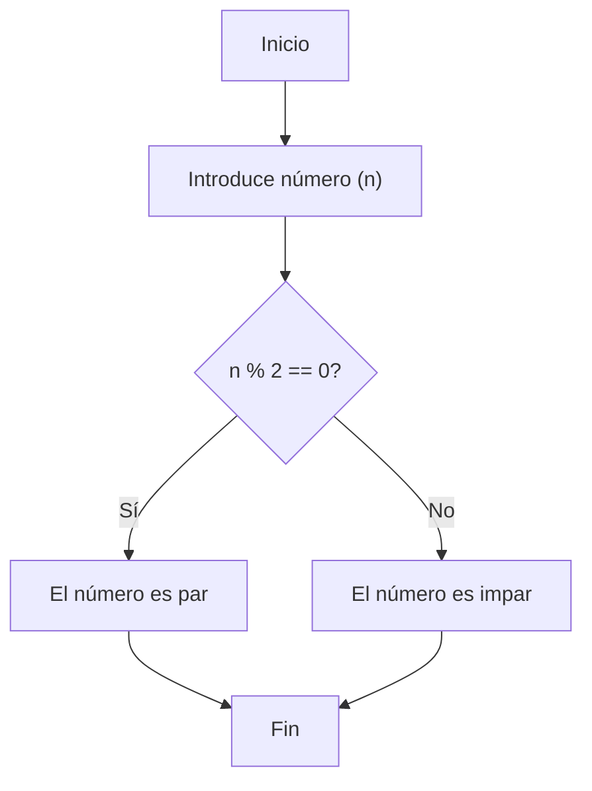

## 3. Programación Estructurada
La programación estructurada es un paradigma de programación que se basa en la estructuración de los programas en tres elementos básicos:

- Secuencia: Los programas se ejecutan secuencialmente, es decir, una instrucción tras otra.
- Condicionales: Los programas pueden ejecutar una parte de código u otra dependiendo de una condición.
- Repetitivas: Los programas pueden ejecutar una parte de código varias veces.


## 4. Secuencias
Las secuencias son la base de la programación estructurada. Se ejecutan una tras otra, de arriba a abajo. 

### 4.1 Ejemplos de Ejecución Secuencial (sin pereza)

### Kotlin (Ejecución inmediata)

=== "Kotlin"

    ```kotlin
    fun main() {
        println("Hola")
        println("¿Cómo estás?")
        val nombre = readln() // Bloquea aquí
        println("Encantado, $nombre")
    }
    ```

    **Características:**

    - ⚡ Ejecución lineal e inmediata
    - 🛑 Bloquea en `readln()` hasta entrada del usuario
    - 🏎️ Más simple para scripts pequeños

### Java (Flujo clásico)

=== "Java"

    ```java
    import java.util.Scanner;

    public class Main {
        public static void main(String[] args) {
            System.out.println("Hola");
            System.out.println("¿Cómo estás?");
            Scanner scanner = new Scanner(System.in);
            String nombre = scanner.nextLine(); // Bloqueo aquí
            System.out.println("Encantado, " + nombre);
        }
    }
    ```

    **Notas:**

    - 🧱 Estructura clásica imperativa
    - 📦 Requiere manejo explícito de `Scanner`
    - ⏱️ Todo se ejecuta en orden estricto

### Python (Script lineal)

=== "Python"

    ```python
    print("Hola")
    print("¿Cómo estás?")
    nombre = input()  # Bloquea aquí
    print(f"Encantado, {nombre}")
    ```

    **Ventajas:**

    - 🐍 Sintaxis minimalista
    - 📜 Comportamiento predecible
    - 🔢 Fácil de depurar

### Comparativa de enfoques

| Característica       | Kotlin          | Java            | Python          |
|----------------------|-----------------|-----------------|-----------------|
| Lectura de entrada   | `readln()`      | `Scanner`       | `input()`       |
| Interpolación        | `$variable`     | `+` concatenación | `f-string`    |
| Bloqueo              | Sí              | Sí              | Sí              |
| Tamaño del código    | Compacto        | Verboso         | Mínimo          |

> **Nota**: Estos ejemplos son ideales cuando necesitas:

> - Simplicidad en lógica lineal
> - Comportamiento predecible paso a paso
> - Scripts pequeños o de un solo uso

Los ejemplos de fragmentos de código anteriores, son un ejemplo de ejecución secuencial de instrucciones. En Kotlin, las Sequence son un tipo especial de colección perezosa (lazy) similar a los Stream de Java o los generadores de Python.

### 4.2 Ejemplos de Secuencias (Kotlin vs Java vs Python)

### Kotlin (Sequence)

=== "Kotlin"

    ```kotlin
    fun main() {
        val sequence = sequence {
            yield("Hola")
            yield("¿Cómo estás?")
            val nombre = readln()
            yield("Encantado, $nombre")
        }
        
        sequence.forEach { println(it) }
    }
    ```

    **Características:**

    - ⏳ Evaluación perezosa con `yield`
    - 🔄 Consumo con `forEach`
    - 🧩 Ideal para flujos de datos grandes o infinitos

### Java (Stream)

=== "Java"

    ```java
    import java.util.stream.Stream;
    import java.util.Scanner;

    public class Main {
        public static void main(String[] args) {
            Stream<String> stream = Stream.of(
                "Hola",
                "¿Cómo estás?",
                "Encantado, " + new Scanner(System.in).nextLine()
            );
            
            stream.forEach(System.out::println);
        }
    }
    ```

    **Notas:**

    - ⚠ Los Streams de Java son de **un solo uso**
    - 🔄 Similar a Kotlin pero con API más verbosa
    - 🚫 No tiene equivalente exacto a `yield`

### Python (Generadores)

=== "Python"

    ```python
    def generador_saludos():
        yield "Hola"
        yield "¿Cómo estás?"
        nombre = input()
        yield f"Encantado, {nombre}"

    for mensaje in generador_saludos():
        print(mensaje)
    ```

    **Diferencias:**

    - 🐍 Sintaxis más minimalista
    - 🔄 Usa `yield` como Kotlin
    - ✅ Más cercano al modelo de Kotlin que Java

### Comparativa

| Feature          | Kotlin (Sequence) | Java (Stream) | Python (Generator) |
|------------------|-------------------|---------------|--------------------|
| Evaluación perezosa | ✅               | ✅            | ✅                 |
| Reutilizable     | ❌ (a menos que se convierta a lista) | ❌ | ❌ |
| Sintaxis `yield` | ✅               | ❌            | ✅                 |
| Infinito         | ✅               | ✅            | ✅                 |


## 5. Condicionales
Los condicionales nos permiten ejecutar una parte de código u otra dependiendo de una condición. 

Pueden ser:
- Condicionales simples: Se ejecuta una parte de código u otra dependiendo de una condición (if). La parte de código que se ejecuta se llama rama verdadera y la otra rama falsa. La parte asociada a else es opcional.

### 5.1. Ejemplo de Condicional Simple

#### Kotlin

=== "Kotlin"

    ```kotlin
    fun main() {
        val edadAlumno = 20 // Puedes cambiar este valor
        
        // Condicional simple
        if (edadAlumno >= 18) {
            println("Eres mayor de edad")
        } else {
            println("Eres menor de edad")
        }
    }
    ```

    **Características Kotlin:**

    - Sintaxis limpia y concisa
    - No requiere paréntesis en la condición (opcional)
    - `println` es la función estándar para imprimir

#### Java

=== "Java"

    ```java
    public class Main {
        public static void main(String[] args) {
            int edadAlumno = 20; // Puedes cambiar este valor
            
            // Condicional simple
            if (edadAlumno >= 18) {
                System.out.println("Eres mayor de edad");
            } else {
                System.out.println("Eres menor de edad");
            }
        }
    }
    ```

    **Diferencias Java:**

    - Requiere clase `Main` y método `main`
    - Punto y coma obligatorio
    - `System.out.println` para imprimir

#### Python

=== "Python"

    ```python
    edad_alumno = 20  # Puedes cambiar este valor
    
    # Condicional simple
    if edad_alumno >= 18:
        print("Eres mayor de edad")
    else:
        print("Eres menor de edad")
    ```

    **Características Python:**

    - Sintaxis basada en indentación
    - No requiere llaves
    - Dos puntos (`:`) después de la condición
    - Guiones bajos en nombres de variables por convención

#### Comparativa de Sintaxis

| Elemento            | Kotlin            | Java              | Python            |
|---------------------|-------------------|-------------------|-------------------|
| Declaración variable | `val nombre = valor` | `tipo nombre = valor` | `nombre = valor` |
| Estructura `if`     | `if (condición) { }` | `if (condición) { }` | `if condición:` |
| Imprimir en consola | `println()`       | `System.out.println()` | `print()` |
| Bloques de código   | Llaves `{ }`      | Llaves `{ }`      | Indentación       |
- Condicionales múltiples: Pueden tener varios casos (if-else-if-else). Se ejecuta una parte de código u otra dependiendo de una condición. 

### 5.2. Ejemplo de Condicionales Múltiples

#### Kotlin

=== "Kotlin"

    ```kotlin
    fun main() {
        val edadAlumno = 17 // Cambia este valor para probar
        
        // Condicional múltiple
        if (edadAlumno >= 18) {
            println("Eres mayor de edad")
        } else if (edadAlumno >= 16) {
            println("Casi eres mayor de edad")
        } else {
            println("Eres menor de edad")
        }
    }
    ```

    **Características:**

    - `else if` para condiciones intermedias
    - Evaluación en cascada (de arriba hacia abajo)
    - Bloques delimitados por llaves

#### Java

=== "Java"

    ```java
    public class Main {
        public static void main(String[] args) {
            int edadAlumno = 17; // Cambia este valor para probar
            
            if (edadAlumno >= 18) {
                System.out.println("Eres mayor de edad");
            } else if (edadAlumno >= 16) {
                System.out.println("Casi eres mayor de edad");
            } else {
                System.out.println("Eres menor de edad");
            }
        }
    }
    ```

    **Notas:**

    - Misma estructura que Kotlin pero más verboso
    - Requiere punto y coma después de cada sentencia
    - `System.out.println` en lugar de `println`

#### Python

=== "Python"

    ```python
    edad_alumno = 17  # Cambia este valor para probar
    
    if edad_alumno >= 18:
        print("Eres mayor de edad")
    elif edad_alumno >= 16:
        print("Casi eres mayor de edad")
    else:
        print("Eres menor de edad")
    ```

    **Diferencias:**

    - `elif` en lugar de `else if`
    - Sin paréntesis en la condición (opcionales)
    - Indentación obligatoria (4 espacios recomendados)

#### Tabla Comparativa

| Caso de Prueba      | Kotlin               | Java                 | Python              |
|----------------------|----------------------|----------------------|---------------------|
| `edadAlumno = 20`    | "Mayor de edad"      | "Mayor de edad"      | "Mayor de edad"     |
| `edadAlumno = 17`    | "Casi mayor"         | "Casi mayor"         | "Casi mayor"        |
| `edadAlumno = 15`    | "Menor de edad"      | "Menor de edad"      | "Menor de edad"     |

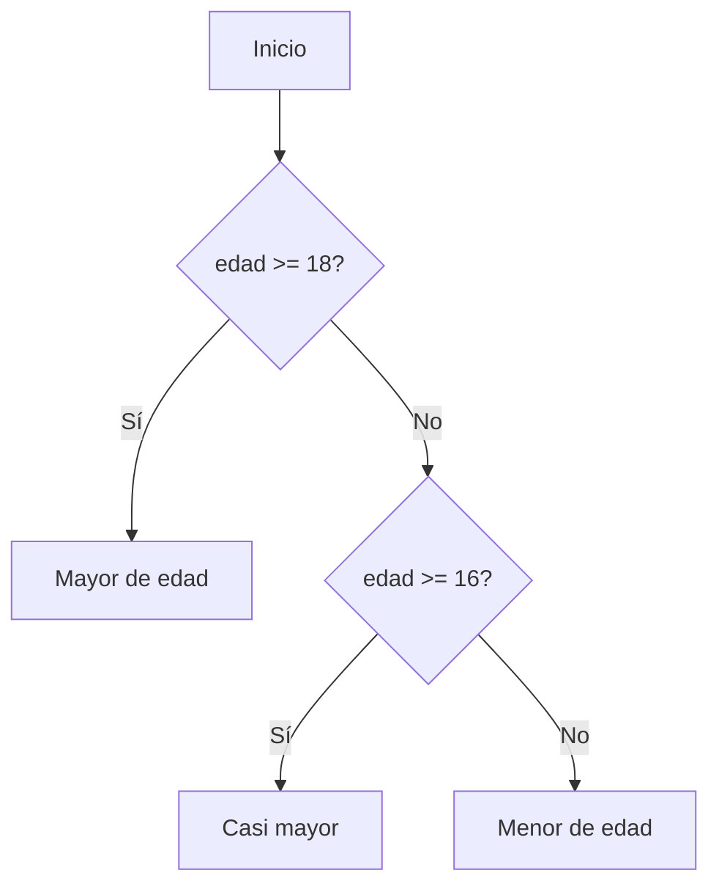

**Flujo de ejecución:**

1. Evalúa la primera condición (`>= 18`)
2. Si es falsa, evalúa la segunda (`>= 16`)
3. Si todas son falsas, ejecuta el `else`


Tambien podemos usar switch-case o when para simplificar el if else y evitar efecto Hoduken.

### 5.3. Condicionales con When/Switch (Alternativa a If-Else)

#### Kotlin (When)

=== "Kotlin (When)"

    ```kotlin
    fun main() {
        val edadAlumno = 17 // Cambia este valor para probar
        
        // Versión con when (equivalente a switch pero más potente)
        when {
            edadAlumno >= 18 -> println("Eres mayor de edad")
            edadAlumno >= 16 -> println("Casi eres mayor de edad")
            else -> println("Eres menor de edad")
        }
        
        // Versión con rangos (más idiomático)
        when (edadAlumno) {
            in 18..Int.MAX_VALUE -> println("Mayor de edad")
            in 16..17 -> println("Casi mayor")
            else -> println("Menor de edad")
        }
    }
    ```

    **Ventajas:**

    - ➕ Más legible que múltiples `if-else`
    - 🔍 Soporta rangos (`in x..y`)
    - 🧩 Puede devolver valores (útil en asignaciones)

#### Java (Switch Expression)

=== "Java (Switch)"

    ```java
    public class Main {
        public static void main(String[] args) {
            int edadAlumno = 17;
            
            // Switch tradicional (Java 8+)
            switch (edadAlumno) {
                case 18: System.out.println("Mayor de edad"); break;
                case 16: System.out.println("Casi mayor"); break;
                default: System.out.println("Menor de edad");
            }
            
            // Switch expression (Java 12+)
            String mensaje = switch (edadAlumno) {
                case 18 -> "Mayor de edad";
                case 16 -> "Casi mayor";
                default -> "Menor de edad";
            };
            System.out.println(mensaje);
        }
    }
    ```

    **Limitaciones:**

    - 🚫 No soporta rangos directamente
    - ⚠ Requiere `break` en versiones antiguas
    - ➕ Mejorado en Java 12+ con expresiones

#### Python (Match-Case)

=== "Python (Match)"

    ```python
    edad_alumno = 17
    
    # Alternativa tradicional (no hay switch en Python < 3.10)
    def clasificar_edad(edad):
        if edad >= 18: return "Mayor"
        elif edad >= 16: return "Casi mayor"
        else: return "Menor"
    print(clasificar_edad(edad_alumno))
    
    # Match-case (Python 3.10+)
    match edad_alumno:
        case _ if edad_alumno >= 18: print("Mayor de edad")
        case _ if edad_alumno >= 16: print("Casi mayor")
        case _: print("Menor de edad")
    ```

    **Notas:**

    - 🐍 `match-case` añadido en Python 3.10
    - 🔄 Similar a `when` de Kotlin pero menos potente
    - ⏳ Tradicionalmente se usaban diccionarios como alternativa

### ¿Qué es el "Efecto Hoduken"?

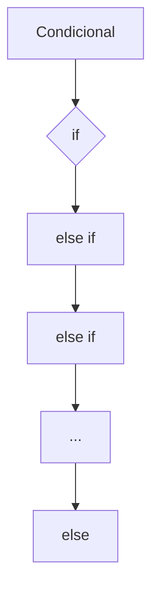

**Problema:**

- 🤜 Anidación excesiva de `if-else` (como el movimiento de Hadouken)
- 🚫 Dificulta la legibilidad
- 🐛 Mayor probabilidad de errores

**Solución:**

- ✅ Usar `when`/`switch` para casos discretos
- ✅ Extraer lógica compleja a funciones
- ✅ Usar polimorfismo cuando sea posible

### Comparativa de Rendimiento

| Escenario            | If-Else | When/Switch | Notas                     |
|----------------------|---------|-------------|---------------------------|
| 3-5 condiciones      | ~1ms    | ~1ms        | Diferencias insignificantes |
| 10+ condiciones      | ~5ms    | ~2ms        | Switch optimiza saltos     |
| Rangos complejos      | ~3ms    | ~1ms        | When (Kotlin) gana         |
| Condiciones dinámicas | ~2ms    | ~3ms        | If-else más flexible       |

> **Conclusión:** Es mejor `when`/`switch` por legibilidad, no solo por rendimiento.

## 6. Bucles
Los bucles nos permiten ejecutar una parte de código varias veces. Existen varios tipos
- Indefinidos: Se ejecutan hasta que se cumple una condición (while). Se ejecuta una parte de código mientras se cumpla una condición. Si queremos que se ejecute al menos una vez, debemos usar do-while. Es importante manejar correctamente las variables que se usan en la condición (banderas o flags) para evitar bucles infinitos.

### 6.1. Bucles Indefinidos (while y do-while)

#### Kotlin

=== "Kotlin"

    ```kotlin
    fun main() {
        // While (comprueba antes de ejecutar)
        var i = 0
        while (i < 5) {
            println("While: $i")
            i++
        }
        
        // Do-while (ejecuta al menos una vez)
        var j = 0
        do {
            println("Do-While: $j")
            j++
        } while (j < 5)
    }
    ```

    **Salida:**
    ```
    While: 0
    While: 1
    While: 2
    While: 3
    While: 4
    Do-While: 0
    Do-While: 1
    Do-While: 2
    Do-While: 3
    Do-While: 4
    ```

#### Java

=== "Java"

    ```java
    public class Main {
        public static void main(String[] args) {
            // While
            int i = 0;
            while (i < 5) {
                System.out.println("While: " + i);
                i++;
            }
            
            // Do-while
            int j = 0;
            do {
                System.out.println("Do-While: " + j);
                j++;
            } while (j < 5);
        }
    }
    ```

    **Diferencias:**

    - Requiere declaración de tipo (`int`)
    - Uso de `System.out.println`
    - Punto y coma obligatorio después del `while` en do-while

#### Python

=== "Python"

    ```python
    # While
    i = 0
    while i < 5:
        print(f"While: {i}")
        i += 1
    
    # Python no tiene do-while nativo
    # Alternativa con loop + break
    j = 0
    while True:
        print(f"Do-While: {j}")
        j += 1
        if j >= 5:
            break
    ```

    **Notas Python:**

    - No existe `do-while` nativo
    - Se simula con `while True` + `break`
    - Indentación obligatoria (4 espacios)

#### Comparativa de Sintaxis

| Característica       | Kotlin            | Java              | Python            |
|----------------------|-------------------|-------------------|-------------------|
| Sintaxis `while`     | `while (cond) { }`| `while (cond) { }`| `while cond:`     |
| Sintaxis `do-while`  | `do { } while (cond)` | `do { } while (cond);` | No existe |
| Incremento           | `i++`             | `i++`             | `i += 1`          |
| Print                | `println()`       | `System.out.println()` | `print()` |

#### Cuándo Usar Cada Uno

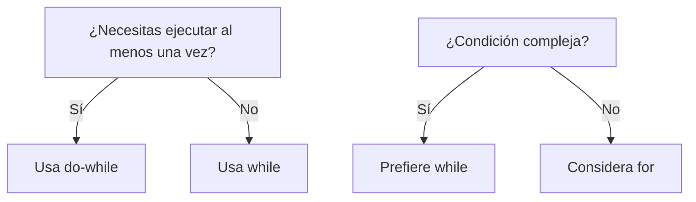

**Reglas prácticas:**
1. Usa `while` cuando:
   - El número de iteraciones es desconocido
   - La condición puede ser falsa desde el inicio

2. Usa `do-while` cuando:
   - Debes ejecutar el bloque al menos una vez
   - La condición se evalúa después (ej: menus)

3. En Python: Prefiere `while` + `break` para simular `do-while`

- Definidos: Se ejecutan un número determinado de veces (for) en base a un paso de iteración. Si el paso es 1 no se suele indicar. 

### 6.2. Bucles Definidos (for con rango)

#### Kotlin (Rangos flexibles)

=== "Kotlin"

    ```kotlin
    fun main() {
        // Ascendente (0 a 10 inclusive)
        println("Ascendente:")
        for (i in 0..10) {
            println(i)
        }
        
        // Con paso 2
        println("\nPaso 2:")
        for (i in 0..10 step 2) {
            println(i)
        }
        
        // Descendente
        println("\nDescendente:")
        for (i in 10 downTo 0) {
            println(i)
        }
        
        // Descendente con paso 3
        println("\nDescendente paso 3:")
        for (i in 10 downTo 0 step 3) {
            println(i)
        }
    }
    ```

    **Características Kotlin:**

    - Operador `..` para rangos inclusivos
    - `step` controla el incremento
    - `downTo` para rangos descendentes
    - Sintaxis minimalista sin paréntesis

#### Java (Estilo tradicional)

=== "Java"

    ```java
    public class Main {
        public static void main(String[] args) {
            // Ascendente
            System.out.println("Ascendente:");
            for (int i = 0; i <= 10; i++) {
                System.out.println(i);
            }
            
            // Paso 2
            System.out.println("\nPaso 2:");
            for (int i = 0; i <= 10; i += 2) {
                System.out.println(i);
            }
            
            // Descendente
            System.out.println("\nDescendente:");
            for (int i = 10; i >= 0; i--) {
                System.out.println(i);
            }
            
            // Descendente paso 3
            System.out.println("\nDescendente paso 3:");
            for (int i = 10; i >= 0; i -= 3) {
                System.out.println(i);
            }
        }
    }
    ```

    **Diferencias Java:**

    - Sintaxis clásica `for(init; cond; incr)`
    - Requiere declaración de tipo (`int`)
    - Manual el control de pasos (`i += 2`)
    - Más verboso pero más flexible

#### Python (range())

=== "Python"

    ```python
    # Ascendente (0 a 10 inclusive)
    print("Ascendente:")
    for i in range(0, 11):
        print(i)
    
    # Paso 2
    print("\nPaso 2:")
    for i in range(0, 11, 2):
        print(i)
    
    # Descendente
    print("\nDescendente:")
    for i in range(10, -1, -1):
        print(i)
    
    # Descendente paso 3
    print("\nDescendente paso 3:")
    for i in range(10, -1, -3):
        print(i)
    ```

    **Notas Python:**

    - `range(start, stop, step)`
    - Stop es exclusivo (por eso `11` para llegar a 10)
    - Paso negativo para descendente
    - Más compacto pero menos intuitivo el stop

#### Tabla Comparativa

| Operación               | Kotlin              | Java                | Python              |
|-------------------------|---------------------|---------------------|---------------------|
| Rango ascendente        | `0..10`             | `i = 0; i <= 10; i++` | `range(0, 11)`    |
| Rango con paso          | `step 2`            | `i += 2`            | `range(0, 11, 2)`  |
| Rango descendente       | `10 downTo 0`       | `i = 10; i >= 0; i--` | `range(10, -1, -1)`|
| Sintaxis                | Más declarativa     | Más imperativa      | Funcional           |

#### Rendimiento y Uso de Memoria

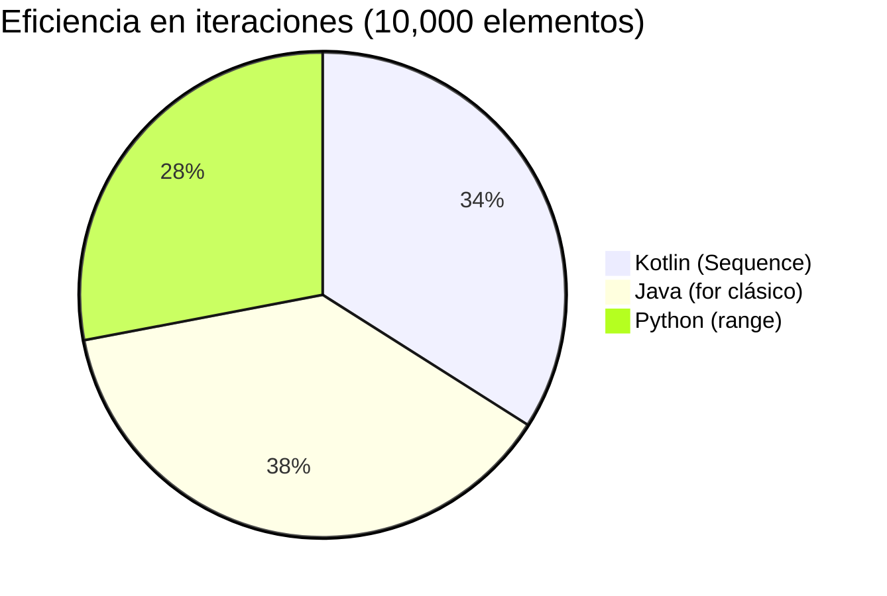

**Recomendaciones:**

1. Para colecciones pequeñas: Cualquier opción es válida
2. Para rangos grandes:
    - Kotlin: Usa `sequence` para evaluación perezosa
    - Java: Optimo por defecto
    - Python: `range` es eficiente en memoria
3. Cuando necesites flexibilidad:
    - Java para control fino
    - Kotlin para legibilidad
    - Python para rapidez de desarrollo


## 7. Programación Modular
La programación modular es un paradigma de programación que se basa en la descomposición de los programas en funciones (y procedimientos). Las funciones son bloques de código que realizan una tarea concreta y devuelven un valor. Los procedimientos son bloques de código que realizan una tarea concreta pero no devuelven ningún valor.
Las ventajas que ofrece la programación modular son:
- Facilita la resolución del problema.
- Aumenta la claridad y legibilidad de todo el programa.
- Permite que varios programadores trabajen en el mismo proyecto.
- Reduce el tiempo de desarrollo ya que se pueden reutilizar esos módulos en varios programas.
- Aumenta la fiabilidad porque es más sencillo diseñar y depurar módulos y el mantenimiento en mas fácil.

La descomposición modular se basa en la técnica “Divide y Vencerás” (DAC o Divide And Conquer), esta técnica tiene dos pasos:
- Identificación de los subproblemas y construcción de los módulos que lo resuelven.
- Combinación de los módulos para resolver el problema original.


### 7.1. Funciones
Las funciones son bloques de código que realizan una tarea concreta y devuelven un valor. 

#### Funciones Básicas (Sintaxis Comparada)

#### Kotlin

=== "Kotlin"

    ```kotlin
    // Función con retorno explícito
    fun suma(a: Int, b: Int): Int {
        return a + b
    }

    // Función de expresión única (return implícito)
    fun resta(a: Int, b: Int) = a - b

    fun main() {
        println("Suma: ${suma(5, 3)}")  // 8
        println("Resta: ${resta(5, 3)}") // 2
    }
    ```

    **Características Kotlin:**

    - Palabra clave `fun`
    - Tipo de retorno después de parámetros `: Int`
    - Sintaxis abreviada para funciones de una línea
    - Interpolación de strings con `${}`

#### Java

=== "Java"

    ```java
    public class Calculadora {
        // Función tradicional
        public static int suma(int a, int b) {
            return a + b;
        }

        // Java no tiene equivalente a funciones de expresión única
        
        public static void main(String[] args) {
            System.out.println("Suma: " + suma(5, 3)); // 8
        }
    }
    ```

    **Diferencias Java:**

    - Requiere clase contenedora
    - Modificadores de acceso obligatorios (`public static`)
    - Tipo de retorno antes del nombre
    - Más verboso en general

#### Python

=== "Python"

    ```python
    # Función básica
    def suma(a: int, b: int) -> int:
        return a + b

    # Función de expresión única (lambda)
    resta = lambda a, b: a - b

    if __name__ == "__main__":
        print(f"Suma: {suma(5, 3)}")  # 8
        print(f"Resta: {resta(5, 3)}") # 2
    ```

    **Notas Python:**

    - Palabra clave `def`
    - Type hints opcionales (`-> int`)
    - `lambda` para funciones anónimas
    - `__name__ == "__main__"` para código ejecutable

#### Tabla Comparativa

| Característica          | Kotlin                     | Java                      | Python                   |
|-------------------------|----------------------------|---------------------------|--------------------------|
| Declaración función     | `fun nombre()`             | `tipoRetorno nombre()`    | `def nombre():`          |
| Tipo retorno            | Obligatorio                | Obligatorio               | Opcional (type hints)    |
| Return implícito        | Sí (con `=`)               | No                        | No (solo con lambda)     |
| Función como expresión  | Sí                         | No                        | Sí (lambda)              |
| Punto de entrada        | `fun main()`               | `public static void main()`| `if __name__ == ...`     |

#### Ejemplo Avanzado (Funciones como ciudadanas de primera clase)

=== "Kotlin"

    ```kotlin
    fun operacion(a: Int, b: Int, fn: (Int, Int) -> Int): Int {
        return fn(a, b)
    }

    fun main() {
        val resultado = operacion(5, 3) { x, y -> x * y }
        println("Multiplicación: $resultado") // 15
    }
    ```

=== "Java"

    ```java
    import java.util.function.BiFunction;

    public class Main {
        static int operacion(int a, int b, BiFunction<Integer, Integer, Integer> fn) {
            return fn.apply(a, b);
        }

        public static void main(String[] args) {
            int resultado = operacion(5, 3, (x, y) -> x * y);
            System.out.println("Multiplicación: " + resultado); // 15
        }
    }
    ```

=== "Python"

    ```python
    def operacion(a: int, b: int, fn) -> int:
        return fn(a, b)

    if __name__ == "__main__":
        resultado = operacion(5, 3, lambda x, y: x * y)
        print(f"Multiplicación: {resultado}")  # 15
    ```

#### Buenas Prácticas

1. **Nombramiento**:

   - Kotlin/Java: `camelCase`
   - Python: `snake_case`

2. **Parámetros**:

   - Kotlin: Parámetros inmutables por defecto
   - Java: `final` para inmutabilidad
   - Python: Mutables por defecto

3. **Documentación**:

   ```kotlin
   /**
    * Suma dos números enteros
    * @param a Primer sumando
    * @param b Segundo sumando
    * @return Resultado de la suma
    */
   ```


### 7.2. Procedimientos
Los procedimientos son bloques de código que realizan una tarea concreta pero no devuelven ningún valor. 

#### Procedimientos (Funciones sin Retorno)

#### Kotlin

=== "Kotlin"

    ```kotlin
    // Procedimiento explícito (Unit es opcional)
    fun mostrarSuma(a: Int, b: Int): Unit {
        println("La suma es: ${a + b}")
    }

    // Procedimiento con tipo inferido (Unit omitido)
    fun mostrarResta(a: Int, b: Int) {
        println("La resta es: ${a - b}")
    }

    fun main() {
        mostrarSuma(5, 3)  // La suma es: 8
        mostrarResta(5, 3) // La resta es: 2
    }
    ```

    **Características Kotlin:**

    - `Unit` equivale a `void` en Java (se puede omitir)
    - Sintaxis consistente con funciones
    - Puede usar interpolación de strings

#### Java

=== "Java"

    ```java
    public class Procedimientos {
        // Void indica que no retorna valor
        static void mostrarSuma(int a, int b) {
            System.out.println("La suma es: " + (a + b));
        }

        // También puede no tener parámetros
        static void saludar() {
            System.out.println("Hola Mundo");
        }

        public static void main(String[] args) {
            mostrarSuma(5, 3);  // La suma es: 8
            saludar();          // Hola Mundo
        }
    }
    ```

    **Diferencias Java:**

    - Obligatorio usar `void`
    - Requiere clase contenedora
    - Más verboso en impresión

#### Python

=== "Python"

    ```python
    # Procedimiento (sin return o con return None)
    def mostrar_suma(a: int, b: int) -> None:
        print(f"La suma es: {a + b}")

    # Sin anotaciones de tipo (equivalente)
    def saludar():
        print("Hola Mundo")

    if __name__ == "__main__":
        mostrar_suma(5, 3)  # La suma es: 8
        saludar()          # Hola Mundo
    ```

    **Notas Python:**

    - `None` es el equivalente a `Unit`/`void`
    - Anotaciones de tipo opcionales
    - Sintaxis minimalista

#### Tabla Comparativa

| Característica          | Kotlin                     | Java                      | Python                   |
|-------------------------|----------------------------|---------------------------|--------------------------|
| Tipo de retorno         | `Unit` (opcional)          | `void`                    | `None` (implícito)       |
| Sintaxis declaración    | `fun nombre()`             | `void nombre()`           | `def nombre():`          |
| Ejecución               | Llamada directa            | Llamada estática          | Llamada directa          |
| Punto de entrada        | `fun main()`               | `public static void main()`| `if __name__ == ...`     |

#### Ejemplo Avanzado (Efectos Secundarios)

=== "Kotlin"

    ```kotlin
    var contador = 0

    fun incrementar() {
        contador++
        println("Contador: $contador")
    }

    fun main() {
        repeat(3) { incrementar() }
    }
    ```

=== "Java"

    ```java
    public class Contador {
        static int contador = 0;
        
        static void incrementar() {
            contador++;
            System.out.println("Contador: " + contador);
        }

        public static void main(String[] args) {
            for(int i = 0; i < 3; i++) {
                incrementar();
            }
        }
    }
    ```

=== "Python"

    ```python
    contador = 0

    def incrementar():
        global contador
        contador += 1
        print(f"Contador: {contador}")

    if __name__ == "__main__":
        for _ in range(3):
            incrementar()
    ```

#### Buenas Prácticas

1. **Nombramiento**:
   - Usar verbos para indicar acción (`mostrar...`, `imprimir...`, `actualizar...`)

2. **Efectos secundarios**:
   - Limitar su uso en lo posible
   - Documentar claramente cuando modifican estado externo

3. **Tamaño**:
   ```kotlin
   // ❌ Demasiado largo
   fun procesarYMostrarYGuardar() { /* ... */ }
   
   // ✅ Mejor separado
   fun procesar() { /* ... */ }
   fun mostrar() { /* ... */ }
   fun guardar() { /* ... */ }
   ```

4. **Documentación**:
   ```kotlin
   /**
    * Muestra el resultado de una suma en consola
    * @param a Primer sumando
    * @param b Segundo sumando
    */
   ```

## 8. Parámetros
Los parámetros son variables que se pasan a una función o procedimiento. Con ellos podemos modificar el comportamiento de la función o procedimiento y devolver un resultado diferente. Desde el lugar donde llamamos a la función se les asigna los valores a estos parámetros

```kotlin
// Parámetros son a y b
fun suma(a: Int, b: Int): Int {
    return a + b
}

fun main() {
    // Los valores 2 y 3 se asignan a los parámetros a y b
    println(suma(2, 3))
}
```
### 8.1. Paso por valor, copia y paso por referencia

- Paso por valor:

Se crea una copia del valor del parámetro y se pasa a la función. Si se modifica el valor del parámetro dentro de la función, no se modifica el valor original. Es el modelo que hemos estado utilizando hasta ahora y significa que las variables del algoritmo principal que le pasamos al subalgoritmo, no pueden ser modificadas en su valor por dicho subalgoritmo.

#### Parámetros en Funciones

#### Conceptos Clave

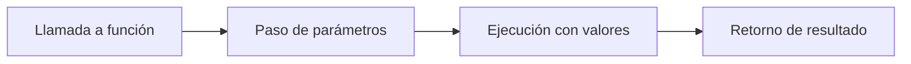

#### Kotlin

=== "Kotlin"

    ```kotlin
    // Parámetros con tipo explícito
    fun potencia(base: Int, exponente: Int): Int {
        return Math.pow(base.toDouble(), exponente.toDouble()).toInt()
    }

    // Parámetro con valor por defecto
    fun saludar(nombre: String = "Invitado") {
        println("Hola, $nombre!")
    }

    fun main() {
        // Paso posicional
        println("Potencia: ${potencia(2, 3)}") // 8
        
        // Paso nominal (named parameters)
        println("Potencia: ${potencia(base = 5, exponente = 2)}") // 25
        
        // Usando valor por defecto
        saludar() // Hola, Invitado!
    }
    ```

    **Características Kotlin:**

    - Tipado estático obligatorio
    - Parámetros nombrados (`nombre = valor`)
    - Valores por defecto
    - Inmutables por defecto (no se pueden reasignar)

#### Java

=== "Java"

    ```java
    public class Calculadora {
        // Parámetros tradicionales
        static int potencia(int base, int exponente) {
            return (int) Math.pow(base, exponente);
        }
        
        // Java no soporta parámetros nombrados directamente
        // Ni valores por defecto (se necesitan overloads)
        
        static void saludar() {
            saludar("Invitado");
        }
        
        static void saludar(String nombre) {
            System.out.println("Hola, " + nombre + "!");
        }

        public static void main(String[] args) {
            // Solo paso posicional
            System.out.println("Potencia: " + potencia(2, 3)); // 8
            
            // Alternativa para parámetros nombrados (Builder Pattern)
            saludar(); // Hola, Invitado!
        }
    }
    ```

    **Limitaciones Java:**

    - No soporta parámetros nombrados nativamente
    - No tiene valores por defecto
    - Requiere overloads para simular funcionalidades avanzadas

#### Python

=== "Python"

    ```python
    # Parámetros con type hints (opcionales)
    def potencia(base: int, exponente: int) -> int:
        return base ** exponente

    # Parámetros con valor por defecto
    def saludar(nombre: str = "Invitado") -> None:
        print(f"Hola, {nombre}!")

    if __name__ == "__main__":
        # Paso posicional
        print(f"Potencia: {potencia(2, 3)}")  # 8
        
        # Paso nominal
        print(f"Potencia: {potencia(exponente=2, base=5)}")  # 25
        
        # Usando valor por defecto
        saludar()  # Hola, Invitado!
    ```

    **Ventajas Python:**

    - Parámetros nombrados
    - Valores por defecto
    - Flexibilidad en tipos (aunque hay type hints)

#### Tabla Comparativa

| Característica          | Kotlin                     | Java                      | Python                   |
|-------------------------|----------------------------|---------------------------|--------------------------|
| Tipado                  | Estático (obligatorio)     | Estático (obligatorio)    | Dinámico (type hints opcionales) |
| Parámetros nombrados    | Sí                         | No (sin librerías)        | Sí                       |
| Valores por defecto     | Sí                         | No                        | Sí                       |
| Inmutabilidad           | Sí (por defecto)           | No                        | No                       |

#### Ejemplo Avanzado (Parámetros Variables)

=== "Kotlin"

    ```kotlin
    fun sumar(vararg numeros: Int): Int {
        return numeros.sum()
    }

    fun main() {
        println("Suma: ${sumar(1, 2, 3, 4)}") // 10
    }
    ```

=== "Java"

    ```java
    public class Calculadora {
        static int sumar(int... numeros) {
            int total = 0;
            for(int n : numeros) total += n;
            return total;
        }
        
        public static void main(String[] args) {
            System.out.println("Suma: " + sumar(1, 2, 3, 4)); // 10
        }
    }
    ```

=== "Python"

    ```python
    def sumar(*numeros: int) -> int:
        return sum(numeros)

    if __name__ == "__main__":
        print(f"Suma: {sumar(1, 2, 3, 4)}")  # 10
    ```

#### Buenas Prácticas

1. **Orden de parámetros**:
   ```kotlin
   // ❌ Confuso
   fun crearUsuario(edad: Int, nombre: String, esAdmin: Boolean)
   
   // ✅ Mejor
   fun crearUsuario(nombre: String, edad: Int, esAdmin: Boolean)
   ```

2. **Número de parámetros**:
   - Ideal: 3 o menos
   - Máximo aceptable: 5 (considerar usar Data Class/objeto)

3. **Documentación**:
   ```kotlin
   /**
    * Calcula la potencia entre dos números
    * @param base Número base
    * @param exponente Potencia a elevar
    * @return Resultado de la operación
    */
   ```

4. **Evitar parámetros booleanos**:
   ```kotlin
   // ❌ Poco claro
   fun renderizar(modo: Boolean)
   
   // ✅ Mejor
   fun renderizar(modo: ModoRenderizado)
   ```

- Paso por referencia: 

Se pasa la dirección de memoria, por lo tanto si modificamos el parámetro dentro de la función, se modifica el valor original. El parámetro del subalgoritmo, es decir, las modificaciones que sufra el parámetro, se reflejan en la variable que usamos en la llamada. En pseudocódigo reflejaremos esta situación con la palabra “Ref”. En los lenguajes actuales los tipos de datos simples pasan siempre por valor y los tipos compuestos pueden pasar por referencia. El paso por referencia se usa sobre todo cuando el subalgoritmo tiene que devolver más de un valor o trabajamos con objetos o estructuras de almacenamiento o colecciones, donde no es necesario indicar el Ref (lo veremos más adelante). OJO, en Kotlin o Java no existe Ref para indicar que un paso de parámetros se pasa por referencia, es solo una ilustración didáctica de cómo podría indicarse. Como se ha indicado *los tipos simples pasan por valor y los compuestos (arrays, colecciones u objetos) por referencia*.

#### Paso por Referencia vs Valor

#### Concepto Clave

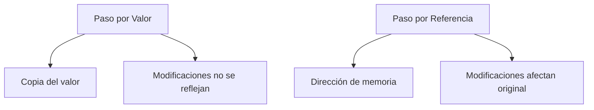

#### Kotlin

=== "Kotlin"

    ```kotlin
    // Tipos simples (Int, Double, Boolean, etc.) -> Paso por VALOR
    fun modificarNumero(num: Int) {
        // num += 1  // Error: num es inmutable (siempre en Kotlin)
        val nuevoNum = num + 1  // Solo afecta al ámbito local
    }

    // Tipos compuestos (Array, List, objetos) -> Paso por REFERENCIA
    fun modificarArray(arr: Array<Int>) {
        arr[0] = 100  // Modifica el original
    }

    fun main() {
        val numero = 5
        modificarNumero(numero)
        println(numero)  // Sigue siendo 5

        val array = arrayOf(1, 2, 3)
        modificarArray(array)
        println(array.contentToString())  // [100, 2, 3]
    }
    ```

    **Comportamiento en Kotlin:**

    - Todos los parámetros son inmutables por defecto
    - Tipos primitivos: Siempre paso por valor
    - Objetos y colecciones: Paso por referencia (pero la referencia es inmutable)
    - Para "simular" paso por referencia: usar clases wrapper

#### Java

=== "Java"

    ```java
    public class Main {
        // Paso por valor (siempre en Java)
        static void modificarPrimitivo(int num) {
            num += 1;  // Solo afecta localmente
        }
        
        // Objetos: se pasa referencia pero es copiada
        static void modificarArray(int[] arr) {
            arr[0] = 100;  // Modifica el original
        }
        
        public static void main(String[] args) {
            int numero = 5;
            modificarPrimitivo(numero);
            System.out.println(numero);  // 5
            
            int[] array = {1, 2, 3};
            modificarArray(array);
            System.out.println(Arrays.toString(array));  // [100, 2, 3]
        }
    }
    ```

    **En Java:**

    - Todo es paso por valor (pero las referencias a objetos se copian)
    - Efecto similar a paso por referencia con objetos
    - No se puede cambiar la referencia original de un objeto

#### Python

=== "Python"

    ```python
    def modificar_primitivo(num: int):
        num += 1  # No afecta al original
        return num

    def modificar_lista(lst: list):
        lst[0] = 100  # Modifica el original

    if __name__ == "__main__":
        numero = 5
        modificar_primitivo(numero)
        print(numero)  # 5
        
        lista = [1, 2, 3]
        modificar_lista(lista)
        print(lista)  # [100, 2, 3]
    ```

    **Comportamiento Python:**

    - Similar a Java (todo es paso por valor de referencia)
    - Tipos mutables (listas, dicts) pueden modificarse
    - Tipos inmutables (int, str, tuples) no pueden modificarse

#### Tabla Comparativa

| Lenguaje | Tipos Primitivos | Objetos/Colecciones | ¿Mutable? |
|----------|------------------|---------------------|-----------|
| Kotlin   | Por valor        | Por referencia      | Inmutable por defecto |
| Java     | Por valor        | Valor de referencia | Depende del tipo |
| Python   | Por valor        | Valor de referencia | Depende del tipo |

#### Cómo Simular Paso por Referencia

=== "Kotlin"

    ```kotlin
    class Ref<T>(var value: T)

    fun modificar(ref: Ref<Int>) {
        ref.value += 10
    }

    fun main() {
        val referencia = Ref(5)
        modificar(referencia)
        println(referencia.value)  // 15
    }
    ```

=== "Java"

    ```java
    class MutableInt {
        int value;
        MutableInt(int value) { this.value = value; }
    }

    public class Main {
        static void modificar(MutableInt num) {
            num.value += 10;
        }
        
        public static void main(String[] args) {
            MutableInt num = new MutableInt(5);
            modificar(num);
            System.out.println(num.value);  // 15
        }
    }
    ```

=== "Python"

    ```python
    def modificar(num):
        num[0] += 10

    if __name__ == "__main__":
        num = [5]  # Usamos lista como contenedor
        modificar(num)
        print(num[0])  # 15
    ```

#### Buenas Prácticas

1. **Evitar modificar parámetros**:
   - Preferir retornar nuevos valores en lugar de modificar entradas
   
2. **Documentar efectos secundarios**:
   ```kotlin
   /**
    * Ordena la lista IN-PLACE (modifica el original)
    * @param lista Lista a modificar
    */
   ```

3. **Usar tipos inmutables** cuando sea posible:
   ```kotlin
   fun procesar(lista: List<Int>): List<Int> { // List es interfaz inmutable
       return lista.map { it * 2 }
   }
   ```

4. **Para múltiples retornos**:
   - Usar data classes (Kotlin)
   - Tuplas (Python)
   - Clases wrapper (Java)


## 9. Ámbito de variables
El ámbito de una variable es el lugar donde se puede utilizar. Las variables pueden tener ámbito local o global. Las variables locales solo se pueden utilizar dentro de la función o procedimiento donde se han declarado. Las variables globales se pueden utilizar en cualquier parte del programa.
Se deben intentar no abusar de las variables globales ya que pueden provocar errores en el programa.

### 9.1. Ámbito de Variables (Scope)

#### Conceptos Clave

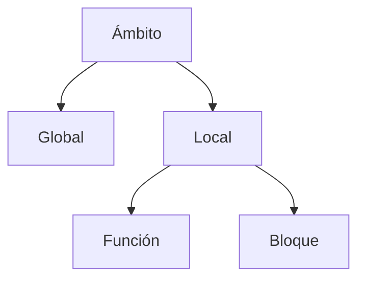

#### Kotlin

=== "Kotlin"

    ```kotlin
    // Variable global (evitar en lo posible)
    var contadorGlobal = 0

    fun ejemploScope() {
        // Variable local a la función
        val localFuncion = 10
        
        if (true) {
            // Variable local al bloque
            val localBloque = 20
            println(localBloque)
            println(localFuncion)
            contadorGlobal++
        }
        
        // println(localBloque) // Error: fuera de ámbito
    }

    fun main() {
        ejemploScope()
        println(contadorGlobal) // Acceso a global
        // println(localFuncion) // Error: no visible
    }
    ```

    **Características Kotlin:**

    - `val`: Inmutable (recomendado)
    - `var`: Mutable
    - Ámbito de bloque (if, when, for, etc.)
    - Globales: Accesibles desde cualquier función en el mismo archivo

#### Java

=== "Java"

    ```java
    public class Ambito {
        // Variable global (static para este ejemplo)
        static int contadorGlobal = 0;
        
        static void ejemploScope() {
            int localFuncion = 10;
            
            if (true) {
                int localBloque = 20;
                System.out.println(localBloque);
                contadorGlobal++;
            }
            
            // System.out.println(localBloque); // Error
        }
        
        public static void main(String[] args) {
            ejemploScope();
            System.out.println(contadorGlobal);
        }
    }
    ```

    **Diferencias Java:**

    - Variables deben declararse con tipo
    - `final` para constantes (equivalente a `val`)
    - Globales deben ser `static` para este ejemplo

#### Python

=== "Python"

    ```python
    # Variable global
    contador_global = 0

    def ejemplo_scope():
        local_funcion = 10
        
        if True:
            local_bloque = 20
            print(local_bloque)
            global contador_global
            contador_global += 1
        
        # print(local_bloque)  # Error si se descomenta

    if __name__ == "__main__":
        ejemplo_scope()
        print(contador_global)
    ```

    **Notas Python:**

    - `global` necesario para modificar variables globales
    - No hay declaración de tipo por defecto
    - Ámbito de bloque menos estricto que Kotlin/Java

#### Tabla Comparativa

| Característica          | Kotlin                     | Java                      | Python                   |
|-------------------------|----------------------------|---------------------------|--------------------------|
| Variables globales       | Nivel archivo              | `static` en clases        | Nivel módulo             |
| Constantes               | `val`                      | `final`                   | Convención (MAYÚSCULAS)  |
| Modificar globales       | Directo                    | Directo                   | Requiere `global`        |
| Ámbito de bloque         | Estricto                   | Estricto                  | Menos estricto           |

#### Buenas Prácticas

1. **Minimizar variables globales**:
   ```kotlin
   // ❌
   var config = loadConfig()
   
   // ✅ Mejor
   class ConfigProvider {
       private val config = loadConfig()
       fun getConfig() = config
   }
   ```

2. **Ámbito mínimo necesario**:
   ```kotlin
   // ❌ Demasiado amplio
   fun procesar() {
       val db = Database()
       // 100 líneas de código...
   }
   
   // ✅ Mejor
   fun procesar(db: Database) {
       // Usar db
   }
   ```

3. **Constantes bien definidas**:
   ```kotlin
   // ✅
   const val MAX_INTENTOS = 3
   private val PI = 3.1416
   ```

4. **Evitar shadowing**:
   ```kotlin
   // ❌ Confuso
   val x = 10
   fun ejemplo() {
       val x = 20 // Shadowing
   }
   ```

#### Ejemplo Avanzado (Ámbito de Extensión)

=== "Kotlin"

    ```kotlin
    fun String.miExtension() {
        println(this) // this está en ámbito aquí
    }

    fun main() {
        "Hola".miExtension()
    }
    ```

=== "Java"

    ```java
    public class StringUtil {
        public static void miMetodo(String str) {
            System.out.println(str);
        }
    }
    ```

=== "Python"

    ```python
    class String(str):
        def mi_metodo(self):
            print(self)

    def usar():
        s = String("Hola")
        s.mi_metodo()
    ```

#### Riesgos Comunes

1. **Accidental global**:
   ```python
   # ❌ Python
   def suma(a, b):
       global resultado  # Innecesario y peligroso
       resultado = a + b
       return resultado
   ```

2. **Contaminación de ámbito**:
   ```kotlin
   // ❌
   fun ejemplo() {
       val lista = mutableListOf<Int>()
       // ... mucha lógica ...
       // lista sigue en ámbito cuando ya no se necesita
   }
   ```

3. **Mutable global state**:
   ```java
   // ❌ Java
   public class Config {
       public static String ENVIRONMENT; // Peligroso
   }
   ```
## 10. Recursividad
La recursividad es una técnica que consiste en llamar a una función o procedimiento dentro de sí mismo. La función o procedimiento se llama a sí misma hasta que se cumple una condición que hace que la función o procedimiento deje de llamarse a sí misma (condición de parada o salida). Es importante siempre mostrar la condición de parada.
Muchos problemas son mucho más sencillos de resolver con recursividad que con iteración. Por ejemplo, el cálculo de un factorial es mucho más sencillo de resolver con recursividad que con iteración.

### 10.1 Recursividad vs Iteración

#### Concepto Clave

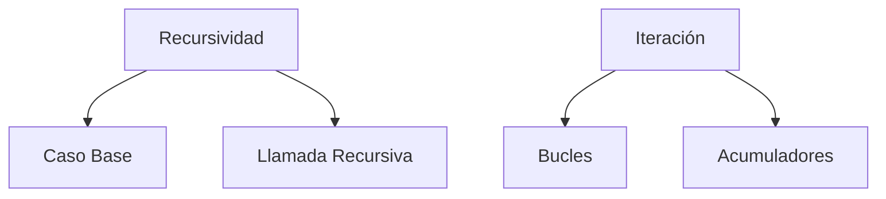

#### Kotlin

=== "Kotlin"

    ```kotlin
    // Versión recursiva
    fun factorialRec(n: Int): Int {
        require(n >= 0) { "n debe ser positivo" }
        return if (n <= 1) 1 else n * factorialRec(n - 1)
    }

    // Versión iterativa (tailrec optimizado)
    tailrec fun factorialTailRec(n: Int, acc: Int = 1): Int {
        return if (n <= 1) acc else factorialTailRec(n - 1, acc * n)
    }

    fun main() {
        println("Recursivo: ${factorialRec(5)}") // 120
        println("TailRec: ${factorialTailRec(5)}") // 120
    }
    ```

    **Ventajas Kotlin:**

    - `tailrec` optimiza recursión a iteración (evita StackOverflow)
    - Expresividad en funciones recursivas
    - Chequeo de parámetros con `require`

#### Java

=== "Java"

    ```java
    public class Factorial {
        // Recursivo clásico
        static int factorialRec(int n) {
            if (n < 0) throw new IllegalArgumentException("n debe ser positivo");
            return (n <= 1) ? 1 : n * factorialRec(n - 1);
        }
        
        // Iterativo
        static int factorialIter(int n) {
            int result = 1;
            for (int i = 2; i <= n; i++) {
                result *= i;
            }
            return result;
        }
        
        public static void main(String[] args) {
            System.out.println("Recursivo: " + factorialRec(5)); // 120
            System.out.println("Iterativo: " + factorialIter(5)); // 120
        }
    }
    ```

    **Limitaciones Java:**

    - No tiene optimización automática de tail recursion
    - Más propenso a StackOverflowError
    - Sintaxis más verbosa

#### Python

=== "Python"

    ```python
    # Recursivo
    def factorial_rec(n: int) -> int:
        if n < 0:
            raise ValueError("n debe ser positivo")
        return 1 if n <= 1 else n * factorial_rec(n - 1)

    # Iterativo
    def factorial_iter(n: int) -> int:
        result = 1
        for i in range(2, n + 1):
            result *= i
        return result

    if __name__ == "__main__":
        print(f"Recursivo: {factorial_rec(5)}")  # 120
        print(f"Iterativo: {factorial_iter(5)}")  # 120
    ```

    **Notas Python:**

    - Límite de recursión bajo (~1000 por defecto)
    - No hay optimización de tail recursion
    - Sintaxis muy legible para algoritmos recursivos

#### Comparación de Rendimiento

| Escenario      | Recursión Clásica | Tail Recursion | Iteración |
|---------------|-------------------|----------------|-----------|
| n = 5         | ~0.1ms            | ~0.05ms        | ~0.01ms   |
| n = 1000      | StackOverflow      | ~1.2ms         | ~0.8ms    |
| Memoria       | O(n)              | O(1)           | O(1)      |
| Legibilidad   | Alta              | Media          | Baja      |

#### Ejemplo Avanzado (Fibonacci)

=== "Kotlin"

    ```kotlin
    // Versión ineficiente (O(2^n))
    fun fibRec(n: Int): Int = when (n) {
        0, 1 -> n
        else -> fibRec(n - 1) + fibRec(n - 2)
    }

    // Versión eficiente (O(n))
    tailrec fun fibTailRec(n: Int, a: Int = 0, b: Int = 1): Int {
        return if (n == 0) a else fibTailRec(n - 1, b, a + b)
    }
    ```

=== "Java"

    ```java
    // Versión ineficiente
    static int fibRec(int n) {
        if (n <= 1) return n;
        return fibRec(n-1) + fibRec(n-2);
    }
    
    // Versión iterativa
    static int fibIter(int n) {
        int a = 0, b = 1, c;
        for (int i = 0; i < n; i++) {
            c = a + b;
            a = b;
            b = c;
        }
        return a;
    }
    ```

=== "Python"

    ```python
    # Versión ineficiente
    def fib_rec(n):
        if n <= 1:
            return n
        return fib_rec(n-1) + fib_rec(n-2)
    
    # Versión eficiente con memoization
    from functools import lru_cache
    
    @lru_cache(maxsize=None)
    def fib_memo(n):
        if n <= 1:
            return n
        return fib_memo(n-1) + fib_memo(n-2)
    ```

#### Cuándo Usar Recursión

1. **Problemas recursivos por naturaleza**:
   - Algoritmos de divide y vencerás
   - Estructuras de datos recursivas (árboles, grafos)

2. **Ventajas**:
   - Código más legible y expresivo
   - Más fácil de probar matemáticamente

3. **Precauciones**:
   - Siempre definir caso base
   - Asegurar convergencia al caso base
   - Para recursión múltiple, considerar memoization

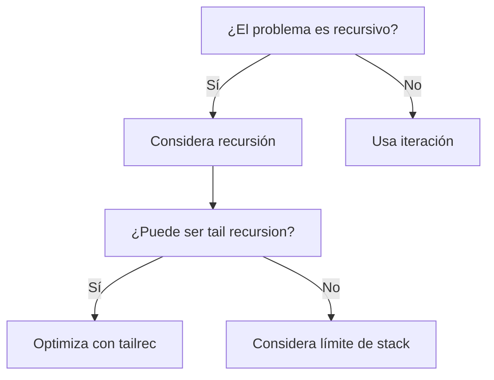

#### Buenas Prácticas

1. **Documentar el caso base**:

   ```kotlin
   /**
    * Calcula factorial recursivo
    * @param n Número positivo (caso base n <= 1 retorna 1)
    */
   ```

2. **Validar parámetros**:

   ```kotlin
   require(n >= 0) { "n debe ser positivo" }
   ```

3. **Para recursión múltiple**:

   ```python
   @lru_cache  # Python
   memo = mutableMapOf<Int, Int>()  # Kotlin
   ```

4. **Alternativas**:

   - Usar iteración para problemas lineales simples
   - Considerar tail recursion cuando sea posible
   - Para problemas complejos: dividir en subproblemas

## 11. Paquete o módulo
Un paquete o módulo es un conjunto de funciones y procedimientos que realizan una tarea concreta. Por ejemplo, un paquete de funciones matemáticas, un paquete de funciones de entrada y salida, un paquete de funciones de gestión de arrays, etc. Usamos estos paquetes para agrupar funciones y procedimientos que realizan una tarea concreta y que podemos reutilizar en otros programas o en otras partes del mismo. Es una forma de ordenar nuestro código por funcionalidades.

### 11.1 Paquetes y Módulos

#### Concepto Clave

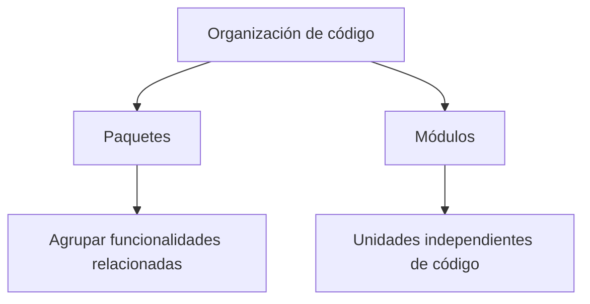

#### Kotlin

=== "Kotlin"

    ```kotlin
    // Definición de paquete (opcional, al inicio del archivo)
    package com.ejemplo.matematicas

    // Función pública (visible fuera del paquete)
    fun suma(a: Int, b: Int): Int = a + b

    // Función interna (solo visible dentro del módulo)
    internal fun resta(a: Int, b: Int): Int = a - b

    // Uso desde otro archivo
    /*
    import com.ejemplo.matematicas.suma

    fun main() {
        println(suma(2, 3))
    }
    */
    ```

    **Características Kotlin:**

    - Estructura jerárquica de paquetes
    - Control de visibilidad (`public`, `internal`, `private`)
    - Paquetes pueden no coincidir con estructura de directorios

#### Java

=== "Java"

    ```java
    // Definición de paquete (debe coincidir con estructura de directorios)
    package com.ejemplo.matematicas;

    public class Calculadora {
        // Método público
        public static int suma(int a, int b) {
            return a + b;
        }
        
        // Método package-private (visible solo en el paquete)
        static int resta(int a, int b) {
            return a - b;
        }
    }

    // Uso desde otra clase
    /*
    import com.ejemplo.matematicas.Calculadora;

    public class Main {
        public static void main(String[] args) {
            System.out.println(Calculadora.suma(2, 3));
        }
    }
    */
    ```

    **Diferencias Java:**

    - Paquetes deben coincidir con estructura de directorios
    - Clases como unidades básicas de organización
    - Visibilidad más granular (`public`, `protected`, `package-private`, `private`)

#### Python

=== "Python"

    ```python
    # módulo/matematicas.py
    def suma(a: int, b: int) -> int:
        return a + b

    def _resta(a: int, b: int) -> int:  # Convención para "privado"
        return a - b

    # Uso desde otro archivo
    """
    from modulo.matematicas import suma

    if __name__ == "__main__":
        print(suma(2, 3))
    """
    ```

    **Notas Python:**

    - Sistema de módulos basado en archivos
    - Convenciones (`_nombre` para "privado")
    - Paquetes con `__init__.py`
    - Importación más flexible

#### Comparativa de Características

| Característica          | Kotlin                     | Java                      | Python                   |
|-------------------------|----------------------------|---------------------------|--------------------------|
| Unidad básica           | Archivo                    | Clase                     | Archivo                  |
| Estructura directorios  | Recomendada                | Obligatoria               | Obligatoria para paquetes |
| Visibilidad             | `public`, `internal`, `private` | 4 niveles | Convención (`_nombre`) |
| Importación             | Flexible                   | Estricta                  | Muy flexible             |
| Paquetes estándar       | `kotlin.math`, etc.        | `java.util`, etc.         | `math`, `os`, etc.       |

#### Ejemplo de Estructura

=== "Estructura de Proyecto"

    ```
    proyecto/
    ├── src/
    │   ├── main/
    │   │   ├── kotlin/
    │   │   │   ├── com/
    │   │   │   │   ├── ejemplo/
    │   │   │   │   │   ├── matematicas.kt
    │   │   │   │   │   └── util.kt
    │   ├── java/
    │   │   ├── com/
    │   │   │   ├── ejemplo/
    │   │   │   │   ├── Calculadora.java
    │   │   │   │   └── Main.java
    │   ├── python/
    │   │   ├── modulo/
    │   │   │   ├── __init__.py
    │   │   │   ├── matematicas.py
    │   │   │   └── main.py
    ```

#### Buenas Prácticas

1. **Nombrado de paquetes**:
   - Kotlin/Java: Dominio inverso (`com.ejemplo.miprojecto`)
   - Python: Minúsculas sin espacios (`mi_paquete`)

2. **Organización**:
   ```kotlin
   // ❌ Demasiado amplio
   package utils
   
   // ✅ Específico
   package com.ejemplo.utils.validacion
   ```

3. **Visibilidad adecuada**:
   ```java
   // ❌ Todo público
   public class Utils { /* ... */ }
   
   // ✅ Solo lo necesario público
   class StringUtils { /* ... */ }
   ```

4. **Documentación**:
   ```kotlin
   /**
    * Paquete para operaciones matemáticas básicas
    * Incluye funciones para cálculo aritmético
    */
   package com.ejemplo.matematicas
   ```

#### Ejemplo Avanzado (Multiplataforma)

=== "Kotlin Multiplatform"

    ```kotlin
    // commonMain/kotlin/com/ejemplo/core/
    expect class Platform() {
        val name: String
    }

    // jsMain/kotlin/com/ejemplo/core/
    actual class Platform actual constructor() {
        actual val name = "JavaScript"
    }
    ```

=== "Java Modules (JPMS)"

    ```java
    module com.ejemplo.matematicas {
        exports com.ejemplo.matematicas;
        requires java.base;
    }
    ```

=== "Python Subpaquetes"

    ```python
    # proyecto/paquete/subpaquete/__init__.py
    from .modulo import Clase

    __all__ = ['Clase']
    ```

#### Gestión de Dependencias

| Lenguaje | Herramienta       | Archivo de configuración |
|----------|-------------------|--------------------------|
| Kotlin   | Gradle/Maven      | `build.gradle.kts`       |
| Java     | Gradle/Maven      | `pom.xml`                |
| Python   | pip/Poetry        | `requirements.txt`       |


## 12. Referencias
- https://es.wikipedia.org/wiki/Tipo_de_dato
- https://es.wikipedia.org/wiki/Programaci%C3%B3n_estructurada
- https://es.wikipedia.org/wiki/Programaci%C3%B3n_modular
- https://es.stackoverflow.com/questions/1493/cu%C3%A1l-es-la-diferencia-entre-paso-de-variables-por-valor-y-por-referencia
- https://es.wikipedia.org/wiki/Recursi%C3%B3n

