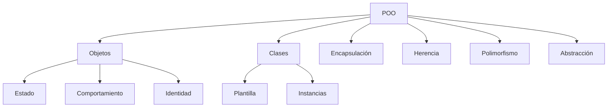

# Programación - 04 y 05 Programación Orientada a Objetos (Base y Avanzado)

## Programación Orientada a Objetos

La programación orientada a objetos es un paradigma de programación que se basa en el concepto de objetos, los cuales contienen información en forma de campos (atributos o propiedades) y código en forma de métodos.


## Clases

Una clase es un modelo o plantilla para crear objetos. Una clase define el estado en base a propiedades y el comportamiento en base a los métodos de un objeto.

=== "Kotlin"
    ```kotlin
    // Definiendo una clase
    class Persona {
    // Estado del objeto
    var nombre: String = ""
    var apellidos: String = ""

    // Comportamiento del objeto
    fun programar(lenguaje: String) {
        println("Programando en $lenguaje")
        }
    }
    ```
=== "Java"
    ```java
    // Definiendo una clase
    public class Persona {
    // Estado del objeto
    private String nombre = "";
    private String apellidos = "";

    // Comportamiento del objeto
    public void programar(String lenguaje) {
        System.out.println("Programando en " + lenguaje);
    }

    // Getters y setters
    public String getNombre() { return nombre; }
    public void setNombre(String nombre) { this.nombre = nombre; }
    public String getApellidos() { return apellidos; }
    public void setApellidos(String apellidos) { this.apellidos = apellidos; 
    }
    }
    ```
=== "Python"
    ```python
    # Definiendo una clase
    class Persona:
    def **init**(self):
    # Estado del objeto
    self.nombre = ""
    self.apellidos = ""

    # Comportamiento del objeto
    def programar(self, lenguaje):
        print(f"Programando en {lenguaje}")
    ```
    
## Objetos

Un objeto es una entidad que tiene un estado y un comportamiento. El estado de un objeto es almacenado en campos (atributos) y el comportamiento es mostrado por métodos (funciones).

=== "Kotlin"

    ```kotlin 
    // Llamando a un objeto 
    val persona = Persona() 
    persona.nombre = "José Luis" 
    persona.apellidos = "González Sánchez" 
    persona.programar(lenguaje = "Kotlin")
    ```

=== "Java"

    ```java 
    // Llamando a un objeto 
    Persona persona = new Persona(); 
    persona.setNombre("José Luis"); 
    persona.setApellidos("González Sánchez"); 
    persona.programar("Java")
    ```

=== "Python"

    ```python 
    # Llamando a un objeto 
    persona = Persona() 
    persona.nombre = "José Luis" 
    persona.apellidos = "González Sánchez" 
    persona.programar("Python")
    ```

## Creación e Instanciación de Objetos

La instanciación de objetos es el proceso de crear un objeto a partir de una clase.

=== "Kotlin"
    ```kotlin 
    // Instanciando un objeto 
    val persona = Persona() 
    persona.nombre = "José Luis" 
    persona.programar(lenguaje = "Kotlin")
    ```

=== "Java"
    ```java 
    // Instanciando un objeto 
    Persona persona = new Persona(); 
    persona.setNombre("José Luis"); 
    persona.programar("Java");
    ```

=== "Python"
    ```python 
    # Instanciando un objeto 
    persona = Persona() 
    persona.nombre = "José Luis" 
    persona.programar("Python")
    ```

## Propiedades y métodos

Los atributos definen el estado de un objeto. Los métodos definen el comportamiento de un objeto.

=== "Kotlin"
    ```kotlin
    class Persona {
    var nombre: String = ""
    var apellidos: String = ""
    private var experiencia: Int = 99

        fun programar(lenguaje: String) {
            println("Programando en $lenguaje")
        }
        
        private fun dormir() {
            println("Durmiendo...")
        }
    }
    ```

=== "Java"
    ```java
    public class Persona {
    public String nombre = "";
    public String apellidos = "";
    private int experiencia = 99;


        public void programar(String lenguaje) {
            System.out.println("Programando en " + lenguaje);
        }
        
        private void dormir() {
            System.out.println("Durmiendo...");
        }
    }
    ```

=== "Python"
    ```python
    class Persona:
    def **init**(self):
    self.nombre = ""
    self.apellidos = ""
    self._experiencia = 99

        def programar(self, lenguaje):
            print(f"Programando en {lenguaje}")
        
        def _dormir(self):
            print("Durmiendo...")
    ```

## Constructores e instanciadores

### Constructores

Los constructores son métodos especiales que se utilizan para inicializar los objetos.

=== "Kotlin"
    ```kotlin
    class Persona(val nombre: String, val apellidos: String, var experiencia: Int = 0) {
    var direccion: String = ""
    private val nivel: Int = 0

        // Constructor secundario
        constructor(nombre: String, apellidos: String, experiencia: Int, nivel: Int, direccion: String) : 
                this(nombre, apellidos, experiencia) {
            this.direccion = direccion
        }
        
        init {
            println("Inicializando instancia")
        }
        
        fun programar(lenguaje: String) {
            println("Programando en $lenguaje")
        }
    }
    ```

=== "Java"
    ```java
    public class Persona {
        private final String nombre;
        private final String apellidos;
        private int experiencia;
        private String direccion;
        private final int nivel;

        // Constructor primario
        public Persona(String nombre, String apellidos, int experiencia) {
            this.nombre = nombre;
            this.apellidos = apellidos;
            this.experiencia = experiencia;
            this.nivel = 0;
            this.direccion = "";
            System.out.println("Inicializando instancia");
        }

        // Constructor secundario
        public Persona(String nombre, String apellidos, int experiencia, int nivel, String direccion) {
            this(nombre, apellidos, experiencia);
            this.nivel = nivel;
            this.direccion = direccion;
        }
        
        public void programar(String lenguaje) {
            System.out.println("Programando en " + lenguaje);
        }
    }
    ```


=== "Python"
    ```python
    class Persona:
    def **init**(self, nombre, apellidos, experiencia=0, nivel=0, direccion=""):
    self.nombre = nombre
    self.apellidos = apellidos
    self.experiencia = experiencia
    self.direccion = direccion
    self._nivel = nivel
    print("Inicializando instancia")


        def programar(self, lenguaje):
            print(f"Programando en {lenguaje}")
    ```


## Referencia this

La referencia this es una referencia al objeto actual.

=== "Kotlin"
    ```kotlin 
    class Persona(val nombre: String, val apellidos: String, var experiencia: Int = 0) 
    { 
        fun setExperiencia(experiencia: Int) 
        { 
            this.experiencia = experiencia 
            }

    }
    ```

=== "Java"
    ```java
    public class Persona {
        private String nombre;
        private String apellidos;
        private int experiencia;

        public Persona(String nombre, String apellidos, int experiencia) {
            this.nombre = nombre;
            this.apellidos = apellidos;
            this.experiencia = experiencia;
        }
        
        public void setExperiencia(int experiencia) {
            this.experiencia = experiencia;
        }
    }
    ```

=== "Python"
    ```python
    class Persona:
    def **init**(self, nombre, apellidos, experiencia=0):
    self.nombre = nombre
    self.apellidos = apellidos
    self.experiencia = experiencia

        def set_experiencia(self, experiencia):
            self.experiencia = experiencia
    ```


## Getters y Setters

Los getters y setters son métodos especiales que se utilizan para acceder/cambiar a los atributos de un objeto.

=== "Kotlin"
    ```kotlin
    class Persona {
        var nombre: String = ""
        var apellidos: String = ""
        private var _maxEnergy: Int = 99

        // Campo calculado
        val nombreCompleto: String
            get() = "$nombre $apellidos"

        // Campo con almacenamiento personalizado
        var maxEnergy: Int
            get() = _maxEnergy
            set(value) {
                if (value >= 0) {
                    _maxEnergy = value
                } else {
                    _maxEnergy = 0
                }
            }
    }
    ```

=== "Java"
    ```java
    public class Persona {
        private String nombre = "";
        private String apellidos = "";
        private int maxEnergy = 99;

        // Campo calculado
        public String getNombreCompleto() {
            return nombre + " " + apellidos;
        }

        public int getMaxEnergy() {
            return maxEnergy;
        }

        public void setMaxEnergy(int value) {
            if (value >= 0) {
                this.maxEnergy = value;
            } else {
                this.maxEnergy = 0;
            }
        }
    }
    ```

=== "Python"
    ```python
    class Persona:
        def **init**(self):
        self.nombre = ""
        self.apellidos = ""
        self._max_energy = 99

        @property
        def nombre_completo(self):
            return f"{self.nombre} {self.apellidos}"

        @property
        def max_energy(self):
            return self._max_energy

        @max_energy.setter
        def max_energy(self, value):
            if value >= 0:
                self._max_energy = value
            else:
                self._max_energy = 0
    ```


## Igualdad e identidad

Para comparar objetos, debemos utilizar el operador `==` para comparar el contenido y `===` para comparar la identidad.

=== "Kotlin"
    ```kotlin
    data class Persona(val nombre: String, val apellidos: String, var experiencia: Int)

    val persona1 = Persona("Juan", "Pérez", 99)
    val persona2 = Persona("Juan", "Pérez", 99)
    val persona3 = persona1

    println(persona1 == persona2)  // true
    println(persona1 === persona2) // false
    println(persona1 === persona3) // true
    ```
=== "Java"
    ```java
    import java.util.Objects;

    public class Persona {
        private String nombre;
        private String apellidos;
        private int experiencia;

        // Constructor, getters, setters...

        @Override
        public boolean equals(Object o) {
            if (this == o) return true;
            if (o == null || getClass() != o.getClass()) return false;
            Persona persona = (Persona) o;
            return experiencia == persona.experiencia && 
                Objects.equals(nombre, persona.nombre) && 
                Objects.equals(apellidos, persona.apellidos);
        }

        @Override
        public int hashCode() {
            return Objects.hash(nombre, apellidos, experiencia);
        }
    }

    // Uso
    Persona persona1 = new Persona("Juan", "Pérez", 99);
    Persona persona2 = new Persona("Juan", "Pérez", 99);
    Persona persona3 = persona1;

    System.out.println(persona1.equals(persona2)); // true
    System.out.println(persona1 == persona2);      // false
    System.out.println(persona1 == persona3);      // true
    ```

=== "Python"
    ```python
    class Persona:
    def **init**(self, nombre, apellidos, experiencia):
    self.nombre = nombre
    self.apellidos = apellidos
    self.experiencia = experiencia

        def __eq__(self, other):
            if not isinstance(other, Persona):
                return False
            return (self.nombre == other.nombre and 
                    self.apellidos == other.apellidos and 
                    self.experiencia == other.experiencia)

        def __hash__(self):
            return hash((self.nombre, self.apellidos, self.experiencia))

    # Uso
    persona1 = Persona("Juan", "Pérez", 99)
    persona2 = Persona("Juan", "Pérez", 99)
    persona3 = persona1

    print(persona1 == persona2)  # True
    print(persona1 is persona2)  # False
    print(persona1 is persona3)  # True
    ```


## Representación de objetos como cadenas

El método `toString` se utiliza para representar un objeto como una cadena.

=== "Kotlin"
    ```kotlin
    class Persona(val nombre: String, val apellidos: String, var experiencia: Int) {
    override fun toString(): String {
    return "Persona(nombre=$nombre, apellidos=$apellidos, experiencia=$experiencia)"
    }
    }

    val persona = Persona("Juan", "Pérez", 10)
    println(persona) // Persona(nombre=Juan, apellidos=Pérez, experiencia=10)
    ```


=== "Java"
    ```java
    public class Persona {
    private String nombre;
    private String apellidos;
    private int experiencia;

    // Constructor, getters, setters...

        @Override
        public String toString() {
            return "Persona{" +
                "nombre='" + nombre + '\'' +
                ", apellidos='" + apellidos + '\'' +
                ", experiencia=" + experiencia +
                '}';
        }
    }

    Persona persona = new Persona("Juan", "Pérez", 10);
    System.out.println(persona); // Persona{nombre='Juan', apellidos='Pérez', experiencia=10}
    ```


=== "Python"
    ```python
    class Persona:
    def **init**(self, nombre, apellidos, experiencia):
    self.nombre = nombre
    self.apellidos = apellidos
    self.experiencia = experiencia

        def __str__(self):
            return f"Persona(nombre={self.nombre}, apellidos={self.apellidos}, experiencia={self.experiencia})"

        def __repr__(self):
            return self.__str__()

    persona = Persona("Juan", "Pérez", 10)
    print(persona)  # Persona(nombre=Juan, apellidos=Pérez, experiencia=10)
    ```


## Introducción a las Excepciones

Las excepciones son errores que se producen durante la ejecución de un programa.


=== "Kotlin"
    ```kotlin
    // Manejo de excepciones
    try {
    val resultado = 10 / 0
    } catch (e: ArithmeticException) {
    println("Error: ${e.message}")
    } finally {
    println("Bloque finally")
    }

    // Lanzar excepciones
    fun dividir(a: Int, b: Int): Int {
        require(b != 0) { "No se puede dividir por cero" }
        return a / b
    }

    // Validar estado
    fun validarEstado(energia: Int) {
        check(energia >= 0) { "La energía no puede ser negativa" }
    }
    ```

=== "Java"
    ```java
    // Manejo de excepciones
    try {
    int resultado = 10 / 0;
    } catch (ArithmeticException e) {
    System.out.println("Error: " + e.getMessage());
    } finally {
    System.out.println("Bloque finally");
    }

    // Lanzar excepciones
    public int dividir(int a, int b) {
        if (b == 0) {
            throw new IllegalArgumentException("No se puede dividir por cero");
        }
        return a / b;
    }

    // Validar argumentos
    public void setEnergia(int energia) {
        if (energia < 0) {
            throw new IllegalStateException("La energía no puede ser negativa");
        }
        this.energia = energia;
    }
    ```

=== "Python"
    ```python
    # Manejo de excepciones
    try:
    resultado = 10 / 0
    except ZeroDivisionError as e:
    print(f"Error: {e}")
    finally:
    print("Bloque finally")

    # Lanzar excepciones
    def dividir(a, b):
        if b == 0:
            raise ValueError("No se puede dividir por cero")
        return a / b

    # Validar argumentos
    def set_energia(self, energia):
        if energia < 0:
            raise ValueError("La energía no puede ser negativa")
        self._energia = energia
    ```
## Data classes: POJOS y POKOS

Los POJOS (Plain Old Java Objects) y POKOS (Plain Old Kotlin Objects) son objetos simples que no tienen lógica de negocio compleja.

=== "Kotlin"
    ```kotlin
    data class Persona(val nombre: String, val apellidos: String, var experiencia: Int)

    val persona1 = Persona("Juan", "Pérez", 99)
    val persona2 = persona1.copy(nombre = "Pepe")

    // Desestructuración
    val (nombre, apellidos, experiencia) = persona1
    println("$nombre $apellidos tiene $experiencia años de experiencia")
    ```


=== "Java"
    ```java
    // Java 14+ Records
    public record Persona(String nombre, String apellidos, int experiencia) {}

    // O con clase tradicional
    public class Persona {
        private final String nombre;
        private final String apellidos;
        private final int experiencia;

        public Persona(String nombre, String apellidos, int experiencia) {
            this.nombre = nombre;
            this.apellidos = apellidos;
            this.experiencia = experiencia;
        }

        // Getters, equals, hashCode, toString...
    }

    Persona persona1 = new Persona("Juan", "Pérez", 99);
    ```

=== "Python"
    ```python
    from dataclasses import dataclass
    from typing import Any

    @dataclass
    class Persona:
        nombre: str
        apellidos: str
        experiencia: int

    persona1 = Persona("Juan", "Pérez", 99)
    persona2 = Persona("Juan", "Pérez", 99)

    # Desestructuración (Python 3.7+)
    nombre, apellidos, experiencia = persona1.nombre, persona1.apellidos, persona1.experiencia
    print(f"{nombre} {apellidos} tiene {experiencia} años de experiencia")
    ```


## Atributos y métodos de clase

Los atributos y métodos de clase se asocian a la clase misma, no a las instancias.

=== "Kotlin"
    ```kotlin
    class Persona(val nombre: String, val apellidos: String, var experiencia: Int) {
    val id = Persona.nextId()

        companion object {
            private var contador = 0
            
            private fun nextId(): Int {
                return contador++
            }
            
            fun gritar() {
                println("¡Gritando!")
            }
        }
    }

    Persona.gritar()
    ```

=== "Java"
    ```java
    public class Persona {
    private static int contador = 0;
    private final int id;
    private String nombre;
    private String apellidos;
    private int experiencia;

        public Persona(String nombre, String apellidos, int experiencia) {
            this.id = nextId();
            this.nombre = nombre;
            this.apellidos = apellidos;
            this.experiencia = experiencia;
        }

        private static int nextId() {
            return contador++;
        }

        public static void gritar() {
            System.out.println("¡Gritando!");
        }
    }

    Persona.gritar();
    ```
=== "Python"
    ```python
    class Persona:
    contador = 0

        def __init__(self, nombre, apellidos, experiencia):
            self.id = Persona.next_id()
            self.nombre = nombre
            self.apellidos = apellidos
            self.experiencia = experiencia

        @classmethod
        def next_id(cls):
            cls.contador += 1
            return cls.contador

        @staticmethod
        def gritar():
            print("¡Gritando!")

    Persona.gritar()
    ```


## Enums class

Los tipos enumerados son una forma de definir un conjunto de constantes.

=== "Kotlin"
    ```kotlin
    enum class Color(val rgb: Int) {
    ROJO(0xFF0000),
    VERDE(0x00FF00),
    AZUL(0x0000FF);

        fun descripcion(): String {
            return when (this) {
                ROJO -> "Color rojo"
                VERDE -> "Color verde"
                AZUL -> "Color azul"
            }
        }
    }

    println(Color.ROJO.rgb) // 16711680
    println(Color.ROJO.descripcion()) // Color rojo
    ```

=== "Java"
    ```java
    public enum Color {
    ROJO(0xFF0000),
    VERDE(0x00FF00),
    AZUL(0x0000FF);

        private final int rgb;

        Color(int rgb) {
            this.rgb = rgb;
        }

        public int getRgb() {
            return rgb;
        }

        public String getDescripcion() {
            switch (this) {
                case ROJO: return "Color rojo";
                case VERDE: return "Color verde";
                case AZUL: return "Color azul";
                default: return "Color desconocido";
            }
        }
    }

    System.out.println(Color.ROJO.getRgb()); // 16711680
    System.out.println(Color.ROJO.getDescripcion()); // Color rojo
    ```
=== "Python"
    ```python
    from enum import Enum

    class Color(Enum):
        ROJO = 0xFF0000
        VERDE = 0x00FF00
        AZUL = 0x0000FF

        def descripcion(self):
            if self == Color.ROJO:
                return "Color rojo"
            elif self == Color.VERDE:
                return "Color verde"
            elif self == Color.AZUL:
                return "Color azul"
            return "Color desconocido"

    print(Color.ROJO.value)  # 16711680
    print(Color.ROJO.descripcion())  # Color rojo
    ```


## Paquetes y visibilidad

Los paquetes son un mecanismo para organizar el código fuente y controlar la visibilidad.

=== "Kotlin"
    ```kotlin
    package com.ejemplo.personas

    class Persona(private val nombre: String, internal val apellidos: String, protected val edad: Int) {
        public fun getNombre(): String = nombre
    }
    ```

=== "Java"
    ```java
    package com.ejemplo.personas;

    public class Persona {
        private String nombre;
        String apellidos; // package-private
        protected int edad;

        public Persona(String nombre, String apellidos, int edad) {
            this.nombre = nombre;
            this.apellidos = apellidos;
            this.edad = edad;
        }

        public String getNombre() {
            return nombre;
        }
    }
    ```

=== "Python"
    ```python
    # En Python la visibilidad es por convención
    class Persona:
    def **init**(self, nombre, apellidos, edad):
    self._nombre = nombre # protected por convención
    self.apellidos = apellidos # public
    self.__edad = edad # private (name mangling)

        def get_nombre(self):
            return self._nombre

        def _metodo_protected(self):
            pass

        def __metodo_private(self):
            pass
    ```

## Composición de objetos

La composición de objetos es una forma de reutilizar código creando clases que contienen objetos de otras clases.

=== "Kotlin"
    ```kotlin
    data class Motor(val tipo: String, val potencia: Int)
    data class Rueda(val diametro: Int, val presion: Double)

    class Coche(val marca: String, val modelo: String, val motor: Motor, val ruedas: List<Rueda>) {
        fun arrancar() {
            println("Coche $marca $modelo arrancado con motor ${motor.tipo}")
        }
    }

    val motor = Motor("Gasolina", 150)
    val ruedas = listOf(Rueda(17, 2.5), Rueda(17, 2.5), Rueda(17, 2.5), Rueda(17, 2.5))
    val coche = Coche("Seat", "Ibiza", motor, ruedas)
    coche.arrancar()
    ```


=== "Java"
    ```java
    public class Motor {
    private String tipo;
    private int potencia;

        public Motor(String tipo, int potencia) {
            this.tipo = tipo;
            this.potencia = potencia;
        }

        // Getters y setters...
    }

    public class Rueda {
        private int diametro;
        private double presion;

        public Rueda(int diametro, double presion) {
            this.diametro = diametro;
            this.presion = presion;
        }

        // Getters y setters...
    }

    public class Coche {
        private String marca;
        private String modelo;
        private Motor motor;
        private List<Rueda> ruedas;

        public Coche(String marca, String modelo, Motor motor, List<Rueda> ruedas) {
            this.marca = marca;
            this.modelo = modelo;
            this.motor = motor;
            this.ruedas = ruedas;
        }

        public void arrancar() {
            System.out.println("Coche " + marca + " " + modelo + " arrancado con motor " + motor.getTipo());
        }
    }
    ```

=== "Python"
    ```python
    from typing import List

    class Motor:
        def __init__(self, tipo, potencia):
            self.tipo = tipo
            self.potencia = potencia

    class Rueda:
        def __init__(self, diametro, presion):
            self.diametro = diametro
            self.presion = presion

    class Coche:
        def __init__(self, marca, modelo, motor, ruedas):
            self.marca = marca
            self.modelo = modelo
            self.motor = motor
            self.ruedas = ruedas

        def arrancar(self):
            print(f"Coche {self.marca} {self.modelo} arrancado con motor {self.motor.tipo}")

    motor = Motor("Gasolina", 150)
    ruedas = [Rueda(17, 2.5) for _ in range(4)]
    coche = Coche("Seat", "Ibiza", motor, ruedas)
    coche.arrancar()
    ```


## Clases internas y anidadas

Las clases internas son clases que se definen dentro de otras clases.

=== "Kotlin"
    ```kotlin
    class Persona(val nombre: String, val apellidos: String) {
    // Clase interna - puede acceder a propiedades de la clase exterior
    inner class Coche(val marca: String, val modelo: String) {
    fun mostrar() {
    println("Coche de $nombre: $marca $modelo")
    }
    }

        // Clase anidada - no puede acceder a propiedades de la clase exterior
        class Direccion(val calle: String, val ciudad: String)
    }

    val persona = Persona("Juan", "Pérez")
    val coche = persona.Coche("Renault", "Megane")
    coche.mostrar()

    val direccion = Persona.Direccion("Calle Falsa 123", "Madrid")
    ```


=== "Java"
    ```java
    public class Persona {
    private String nombre;
    private String apellidos;


        public Persona(String nombre, String apellidos) {
            this.nombre = nombre;
            this.apellidos = apellidos;
        }

        // Clase interna - puede acceder a propiedades de la clase exterior
        public class Coche {
            private String marca;
            private String modelo;

            public Coche(String marca, String modelo) {
                this.marca = marca;
                this.modelo = modelo;
            }

            public void mostrar() {
                System.out.println("Coche de " + nombre + ": " + marca + " " + modelo);
            }
        }

        // Clase anidada estática - no puede acceder a propiedades de la clase exterior
        public static class Direccion {
            private String calle;
            private String ciudad;

            public Direccion(String calle, String ciudad) {
                this.calle = calle;
                this.ciudad = ciudad;
            }
        }
    }

    Persona persona = new Persona("Juan", "Pérez");
    Persona.Coche coche = persona.new Coche("Renault", "Megane");
    coche.mostrar();

    Persona.Direccion direccion = new Persona.Direccion("Calle Falsa 123", "Madrid");
    ```

=== "Python"
    ```python
    class Persona:
    def **init**(self, nombre, apellidos):
    self.nombre = nombre
    self.apellidos = apellidos

        class Coche:
            def __init__(self, persona, marca, modelo):
                self.persona = persona
                self.marca = marca
                self.modelo = modelo

            def mostrar(self):
                print(f"Coche de {self.persona.nombre}: {self.marca} {self.modelo}")

        class Direccion:
            def __init__(self, calle, ciudad):
                self.calle = calle
                self.ciudad = ciudad

    persona = Persona("Juan", "Pérez")
    coche = Persona.Coche(persona, "Renault", "Megane")
    coche.mostrar()

    direccion = Persona.Direccion("Calle Falsa 123", "Madrid")
    ```


## Inyección de dependencias

La inyección de dependencias es un patrón de diseño que permite desacoplar componentes.

=== "Kotlin"
    ```kotlin
    interface Motor {
    fun arrancar()
    fun parar()
    }

    class MotorGasolina : Motor {
        override fun arrancar() = println("Motor gasolina arrancado")
        override fun parar() = println("Motor gasolina parado")
    }

    class Coche(private val motor: Motor) {
        fun conducir() {
            motor.arrancar()
            println("Coche en movimiento")
        }
    }

    val motor = MotorGasolina()
    val coche = Coche(motor) // Inyección de dependencia
    coche.conducir()
    ```


=== "Java"

    ```java
    public interface Motor {
    void arrancar();
    void parar();
    }

    public class MotorGasolina implements Motor {
        @Override
        public void arrancar() {
            System.out.println("Motor gasolina arrancado");
        }

        @Override
        public void parar() {
            System.out.println("Motor gasolina parado");
        }
    }

    public class Coche {
        private final Motor motor;

        // Inyección por constructor
        public Coche(Motor motor) {
            this.motor = motor;
        }

        public void conducir() {
            motor.arrancar();
            System.out.println("Coche en movimiento");
        }
    }

    Motor motor = new MotorGasolina();
    Coche coche = new Coche(motor); // Inyección de dependencia
    coche.conducir();
    ```


=== "Python"
    ```python
    from abc import ABC, abstractmethod


    class Motor(ABC):
        @abstractmethod
        def arrancar(self):
            pass

        @abstractmethod
        def parar(self):
            pass

    class MotorGasolina(Motor):
        def arrancar(self):
            print("Motor gasolina arrancado")

        def parar(self):
            print("Motor gasolina parado")

    class Coche:
        def __init__(self, motor: Motor):
            self.motor = motor  # Inyección de dependencia

        def conducir(self):
            self.motor.arrancar()
            print("Coche en movimiento")

    motor = MotorGasolina()
    coche = Coche(motor)
    coche.conducir()
    ```


## Singleton

El patrón singleton garantiza que una clase tenga solo una instancia.

=== "Kotlin"
    ```kotlin
    object Configuracion {
    var lenguaje: String = "es"
    var tema: String = "oscuro"

    fun mostrarConfig() {
            println("Lenguaje: $lenguaje, Tema: $tema")
        }
    }

    Configuracion.mostrarConfig()
    Configuracion.lenguaje = "en"
    ```


=== "Java"
    ```java
    public class Configuracion {
    private static Configuracion instancia;
    private String lenguaje = "es";
    private String tema = "oscuro";

    private Configuracion() {}

        public static Configuracion getInstancia() {
            if (instancia == null) {
                instancia = new Configuracion();
            }
            return instancia;
        }

        public void mostrarConfig() {
            System.out.println("Lenguaje: " + lenguaje + ", Tema: " + tema);
        }

        // Getters y setters...
    }

    Configuracion config = Configuracion.getInstancia();
    config.mostrarConfig();
    ```


=== "Python"
    ```python
    class Configuracion:
    _instancia = None

        def __new__(cls):
            if cls._instancia is None:
                cls._instancia = super().__new__(cls)
                cls._instancia.lenguaje = "es"
                cls._instancia.tema = "oscuro"
            return cls._instancia

        def mostrar_config(self):
            print(f"Lenguaje: {self.lenguaje}, Tema: {self.tema}")

    config = Configuracion()
    config.mostrar_config()
    ```


## Factory

El patrón factory proporciona una interfaz para crear objetos.

=== "Kotlin"
    ```kotlin
    interface Vehiculo {
    fun conducir()
    }

    class Coche : Vehiculo {
        override fun conducir() = println("Conduciendo coche")
    }

    class Moto : Vehiculo {
        override fun conducir() = println("Conduciendo moto")
    }

    object VehiculoFactory {
        fun crearVehiculo(tipo: String): Vehiculo {
            return when (tipo) {
                "coche" -> Coche()
                "moto" -> Moto()
                else -> throw IllegalArgumentException("Tipo desconocido: $tipo")
            }
        }
    }

    val vehiculo = VehiculoFactory.crearVehiculo("coche")
    vehiculo.conducir()
    ```

=== "Java"
    ```java
    public interface Vehiculo {
    void conducir();
    }

    public class Coche implements Vehiculo {
        @Override
        public void conducir() {
            System.out.println("Conduciendo coche");
        }
    }

    public class Moto implements Vehiculo {
        @Override
        public void conducir() {
            System.out.println("Conduciendo moto");
        }
    }

    public class VehiculoFactory {
        public static Vehiculo crearVehiculo(String tipo) {
            switch (tipo) {
                case "coche": return new Coche();
                case "moto": return new Moto();
                default: throw new IllegalArgumentException("Tipo desconocido: " + tipo);
            }
        }
    }

    Vehiculo vehiculo = VehiculoFactory.crearVehiculo("coche");
    vehiculo.conducir();
    ```


=== "Python"
    ```python
    from abc import ABC, abstractmethod

    class Vehiculo(ABC):
        @abstractmethod
        def conducir(self):
            pass

    class Coche(Vehiculo):
        def conducir(self):
            print("Conduciendo coche")

    class Moto(Vehiculo):
        def conducir(self):
            print("Conduciendo moto")

    class VehiculoFactory:
        @staticmethod
        def crear_vehiculo(tipo):
            if tipo == "coche":
                return Coche()
            elif tipo == "moto":
                return Moto()
            else:
                raise ValueError(f"Tipo desconocido: {tipo}")

    vehiculo = VehiculoFactory.crear_vehiculo("coche")
    vehiculo.conducir()
    ```


## Fachada

El patrón fachada proporciona una interfaz simplificada a un sistema complejo.

=== "Kotlin"
    ```kotlin
    class SubsistemaA {
    fun operacionA() = println("Operación A")
    }

    class SubsistemaB {
        fun operacionB() = println("Operación B")
    }

    class SubsistemaC {
        fun operacionC() = println("Operación C")
    }

    class Fachada {
        private val subsistemaA = SubsistemaA()
        private val subsistemaB = SubsistemaB()
        private val subsistemaC = SubsistemaC()

        fun operacionCompleja() {
            subsistemaA.operacionA()
            subsistemaB.operacionB()
            subsistemaC.operacionC()
        }
    }

    val fachada = Fachada()
    fachada.operacionCompleja()
    ```


=== "Java"
    ```java
    public class SubsistemaA {
    public void operacionA() {
    System.out.println("Operación A");
    }
    }


    public class SubsistemaB {
        public void operacionB() {
            System.out.println("Operación B");
        }
    }

    public class SubsistemaC {
        public void operacionC() {
            System.out.println("Operación C");
        }
    }

    public class Fachada {
        private SubsistemaA subsistemaA;
        private SubsistemaB subsistemaB;
        private SubsistemaC subsistemaC;

        public Fachada() {
            this.subsistemaA = new SubsistemaA();
            this.subsistemaB = new SubsistemaB();
            this.subsistemaC = new SubsistemaC();
        }

        public void operacionCompleja() {
            subsistemaA.operacionA();
            subsistemaB.operacionB();
            subsistemaC.operacionC();
        }
    }

    Fachada fachada = new Fachada();
    fachada.operacionCompleja();
    ```


=== "Python"
    ```python
    class SubsistemaA:
    def operacion_a(self):
    print("Operación A")


    class SubsistemaB:
        def operacion_b(self):
            print("Operación B")

    class SubsistemaC:
        def operacion_c(self):
            print("Operación C")

    class Fachada:
        def __init__(self):
            self.subsistema_a = SubsistemaA()
            self.subsistema_b = SubsistemaB()
            self.subsistema_c = SubsistemaC()

        def operacion_compleja(self):
            self.subsistema_a.operacion_a()
            self.subsistema_b.operacion_b()
            self.subsistema_c.operacion_c()

    fachada = Fachada()
    fachada.operacion_compleja()
    ```


## Herencia

La herencia permite crear nuevas clases a partir de clases existentes.


=== "Kotlin"
    ```kotlin
    open class Vehiculo(val marca: String, val modelo: String) {
    open fun arrancar() {
    println("$marca $modelo arrancando...")
    }

        open fun parar() {
            println("$marca $modelo parando...")
        }
    }

    class Coche(marca: String, modelo: String, val numPuertas: Int) : Vehiculo(marca, modelo) {
        override fun arrancar() {
            super.arrancar()
            println("Coche con $numPuertas puertas")
        }
    }

    class Moto(marca: String, modelo: String, val cilindrada: Int) : Vehiculo(marca, modelo) {
        override fun arrancar() {
            println("Moto $marca $modelo de $cilindrada cc arrancando...")
        }
    }

    val coche = Coche("Toyota", "Corolla", 4)
    coche.arrancar()
    ```


=== "Java"
    ```java
    public class Vehiculo {
    protected String marca;
    protected String modelo;


        public Vehiculo(String marca, String modelo) {
            this.marca = marca;
            this.modelo = modelo;
        }

        public void arrancar() {
            System.out.println(marca + " " + modelo + " arrancando...");
        }

        public void parar() {
            System.out.println(marca + " " + modelo + " parando...");
        }
    }

    public class Coche extends Vehiculo {
        private int numPuertas;

        public Coche(String marca, String modelo, int numPuertas) {
            super(marca, modelo);
            this.numPuertas = numPuertas;
        }

        @Override
        public void arrancar() {
            super.arrancar();
            System.out.println("Coche con " + numPuertas + " puertas");
        }
    }

    public class Moto extends Vehiculo {
        private int cilindrada;

        public Moto(String marca, String modelo, int cilindrada) {
            super(marca, modelo);
            this.cilindrada = cilindrada;
        }

        @Override
        public void arrancar() {
            System.out.println("Moto " + marca + " " + modelo + " de " + cilindrada + " cc arrancando...");
        }
    }

    Coche coche = new Coche("Toyota", "Corolla", 4);
    coche.arrancar();
    ```


=== "Python"
    ```python
    class Vehiculo:
    def **init**(self, marca, modelo):
    self.marca = marca
    self.modelo = modelo

        def arrancar(self):
            print(f"{self.marca} {self.modelo} arrancando...")

        def parar(self):
            print(f"{self.marca} {self.modelo} parando...")

    class Coche(Vehiculo):
        def __init__(self, marca, modelo, num_puertas):
            super().__init__(marca, modelo)
            self.num_puertas = num_puertas

        def arrancar(self):
            super().arrancar()
            print(f"Coche con {self.num_puertas} puertas")

    class Moto(Vehiculo):
        def __init__(self, marca, modelo, cilindrada):
            super().__init__(marca, modelo)
            self.cilindrada = cilindrada

        def arrancar(self):
            print(f"Moto {self.marca} {self.modelo} de {self.cilindrada} cc arrancando...")

    coche = Coche("Toyota", "Corolla", 4)
    coche.arrancar()
    ```


## Modificadores de acceso

Los modificadores de acceso controlan la visibilidad de clases, métodos y propiedades.

| Modificador | Kotlin        | Java          | Python               |
| :---------- | :------------ | :------------ | :------------------- |
| Público     | (por defecto) | `public`      | (por defecto)        |
| Privado     | `private`     | `private`     | `__` (name mangling) |
| Protegido   | `protected`   | `protected`   | `_` (convención)     |
| Paquete     | `internal`    | (por defecto) | N/A                  |

## Polimorfismo

El polimorfismo permite que una referencia de tipo padre pueda apuntar a objetos de tipo hijo.

=== "Kotlin"
    ```kotlin
    open class Animal {
    open fun hacerSonido() {
    println("Sonido genérico de animal")
    }
    }

    class Perro : Animal() {
        override fun hacerSonido() {
            println("Guau guau!")
        }
    }

    class Gato : Animal() {
        override fun hacerSonido() {
            println("Miau miau!")
        }
    }

    fun hacerSonidoAnimal(animal: Animal) {
        animal.hacerSonido()
    }

    val animales = listOf(Perro(), Gato(), Animal())
    animales.forEach { hacerSonidoAnimal(it) }
    ```


=== "Java"
    ```java
    public class Animal {
    public void hacerSonido() {
    System.out.println("Sonido genérico de animal");
    }
    }

    public class Perro extends Animal {
        @Override
        public void hacerSonido() {
            System.out.println("Guau guau!");
        }
    }

    public class Gato extends Animal {
        @Override
        public void hacerSonido() {
            System.out.println("Miau miau!");
        }
    }

    public class Main {
        public static void hacerSonidoAnimal(Animal animal) {
            animal.hacerSonido();
        }

        public static void main(String[] args) {
            List<Animal> animales = Arrays.asList(new Perro(), new Gato(), new Animal());
            animales.forEach(Main::hacerSonidoAnimal);
        }
    }
    ```


=== "Python"
    ```python
    class Animal:
    def hacer_sonido(self):
    print("Sonido genérico de animal")

    class Perro(Animal):
        def hacer_sonido(self):
            print("Guau guau!")

    class Gato(Animal):
        def hacer_sonido(self):
            print("Miau miau!")

    def hacer_sonido_animal(animal):
        animal.hacer_sonido()

    animales = [Perro(), Gato(), Animal()]
    for animal in animales:
        hacer_sonido_animal(animal)
    ```


## Interfaces

Las interfaces definen un contrato que las clases deben implementar.

=== "Kotlin"
    ```kotlin
    interface Volador {
    fun volar()
    fun aterrizar() {
    println("Aterrizando...")
    }
    }

    interface Nadador {
        fun nadar()
    }

    class Pato : Volador, Nadador {
        override fun volar() {
            println("Pato volando")
        }
        
        override fun nadar() {
            println("Pato nadando")
        }
    }

    val pato = Pato()
    pato.volar()
    pato.nadar()
    pato.aterrizar()
    ```


=== "Java"
```java
public interface Volador {
void volar();

    default void aterrizar() {
        System.out.println("Aterrizando...");
    }
}

public interface Nadador {
    void nadar();
}

public class Pato implements Volador, Nadador {
    @Override
    public void volar() {
        System.out.println("Pato volando");
    }

    @Override
    public void nadar() {
        System.out.println("Pato nadando");
    }
}

Pato pato = new Pato();
pato.volar();
pato.nadar();
pato.aterrizar();
```
=== "Python"
    ```python
        from abc import ABC, abstractmethod


        class Volador(ABC):
            @abstractmethod
            def volar(self):
                pass

            def aterrizar(self):
                print("Aterrizando...")

        class Nadador(ABC):
            @abstractmethod
            def nadar(self):
                pass

        class Pato(Volador, Nadador):
            def volar(self):
                print("Pato volando")

            def nadar(self):
                print("Pato nadando")

        pato = Pato()
        pato.volar()
        pato.nadar()
        pato.aterrizar()
    ```


## Sealed Classes

Las clases selladas restringen qué clases pueden heredar de ellas.

=== "Kotlin"
    ```kotlin
    sealed class Resultado<out T> {
    data class Exito<T>(val datos: T) : Resultado<T>()
    data class Error(val mensaje: String) : Resultado<Nothing>()
    object Cargando : Resultado<Nothing>()
    }

    fun procesarResultado(resultado: Resultado<String>) {
        when (resultado) {
            is Resultado.Exito -> println("Éxito: ${resultado.datos}")
            is Resultado.Error -> println("Error: ${resultado.mensaje}")
            Resultado.Cargando -> println("Cargando...")
        }
    }

    val exito = Resultado.Exito("Datos obtenidos")
    procesarResultado(exito)
    ```

=== "Java"

    ```java
    // Java 17+ sealed classes
    public sealed class Resultado permits Resultado.Exito, Resultado.Error, Resultado.Cargando {
    public static final class Exito<T> extends Resultado {
    private final T datos;
    public Exito(T datos) { this.datos = datos; }
    public T getDatos() { return datos; }
    }


        public static final class Error extends Resultado {
            private final String mensaje;
            public Error(String mensaje) { this.mensaje = mensaje; }
            public String getMensaje() { return mensaje; }
        }

        public static final class Cargando extends Resultado {}
    }

    public void procesarResultado(Resultado resultado) {
        if (resultado instanceof Resultado.Exito exito) {
            System.out.println("Éxito: " + exito.getDatos());
        } else if (resultado instanceof Resultado.Error error) {
            System.out.println("Error: " + error.getMensaje());
        } else if (resultado instanceof Resultado.Cargando) {
            System.out.println("Cargando...");
        }
    }
    ```

=== "Python"

    ```python
    from abc import ABC
    from dataclasses import dataclass
    from typing import Generic, TypeVar


    T = TypeVar('T')

    class Resultado(ABC):
        pass

    @dataclass
    class Exito(Resultado, Generic[T]):
        datos: T

    @dataclass
    class Error(Resultado):
        mensaje: str

    class Cargando(Resultado):
        pass

    def procesar_resultado(resultado: Resultado):
        if isinstance(resultado, Exito):
            print(f"Éxito: {resultado.datos}")
        elif isinstance(resultado, Error):
            print(f"Error: {resultado.mensaje}")
        elif isinstance(resultado, Cargando):
            print("Cargando...")

    exito = Exito("Datos obtenidos")
    procesar_resultado(exito)
    ```


## Smart Casts

Los smart casts permiten el casting automático de tipos.

=== "Kotlin"

    ```kotlin
    fun procesar(valor: Any) {
    when (valor) {
    is String -> println(valor.uppercase()) // Smart cast a String
    is Int -> println(valor * 2) // Smart cast a Int
    else -> println("Tipo desconocido")
    }
    }

    fun safeCast(valor: Any) {
        val str = valor as? String // Cast seguro que devuelve null si falla
        println(str?.length)
    }

    procesar("hola")
    procesar(42)
    safeCast("test")
    safeCast(123)
    ```


=== "Java"

    ```java
    public void procesar(Object valor) {
    if (valor instanceof String str) { // Pattern matching (Java 16+)
    System.out.println(str.toUpperCase());
    } else if (valor instanceof Integer num) {
    System.out.println(num * 2);
    } else {
    System.out.println("Tipo desconocido");
    }
    }

    public void safeCast(Object valor) {
        if (valor instanceof String) {
            String str = (String) valor; // Cast tradicional
            System.out.println(str.length());
        }
    }

    // Java 14+ con instanceof mejorado
    public void procesarModerno(Object valor) {
        if (valor instanceof String str && !str.isEmpty()) {
            System.out.println(str.toUpperCase());
        }
    }
    ```


=== "Python"

    ```python
    def procesar(valor):
    if isinstance(valor, str):
    print(valor.upper()) # No necesita cast explícito
    elif isinstance(valor, int):
    print(valor * 2)
    else:
    print("Tipo desconocido")

    def safe_cast(valor):
        try:
            str_val = str(valor)  # Conversión segura
            print(len(str_val))
        except (ValueError, TypeError):
            print("No se puede convertir a string")

    procesar("hola")
    procesar(42)
    safe_cast("test")
    safe_cast(123)
    ```


## Inlining

El inlining permite optimizaciones en tiempo de compilación.

=== "Kotlin"

    ```kotlin
    inline fun <T> medirTiempo(block: () -> T): T {
    val start = System.currentTimeMillis()
    val result = block()
    val end = System.currentTimeMillis()
    println("Tiempo ejecución: ${end - start} ms")
    return result
    }

    // Uso
    val resultado = medirTiempo {
        // Código a medir
        (1..1000000).sum()
    }
    println("Resultado: $resultado")
    ```


=== "Java"

    ```java
    public final class Utilidades {
    // Los métodos final/private/static pueden ser inlineados por el JIT compiler
    public static <T> T medirTiempo(Supplier<T> block) {
    long start = System.currentTimeMillis();
    T result = block.get();
    long end = System.currentTimeMillis();
    System.out.println("Tiempo ejecución: " + (end - start) + " ms");
    return result;
    }
    }


    // Uso
    Integer resultado = Utilidades.medirTiempo(() -> {
        int sum = 0;
        for (int i = 1; i <= 1000000; i++) {
            sum += i;
        }
        return sum;
    });
    System.out.println("Resultado: " + resultado);
    ```


=== "Python"
    ```python
    import time
    from contextlib import contextmanager

    @contextmanager
    def medir_tiempo(descripcion=""):
        start = time.time()
        try:
            yield
        finally:
            end = time.time()
            print(f"{descripcion} - Tiempo ejecución: {(end - start) * 1000:.2f} ms")

    # Uso
    with medir_tiempo("Cálculo suma"):
        resultado = sum(range(1, 1000001))

    print(f"Resultado: {resultado}")
    ```


## Type Aliases

Los alias de tipos permiten crear nombres alternativos para tipos existentes.

=== "Kotlin"

    ```kotlin
    typealias UserId = Int
    typealias UserMap = Map<UserId, String>
    typealias ClickHandler = (UserId, String) -> Unit

    fun procesarUsuario(id: UserId, nombre: String, handler: ClickHandler) {
        handler(id, nombre)
    }

    val usuarios: UserMap = mapOf(
        1 to "Juan",
        2 to "María"
    )
    ```


=== "Java"

    ```java
    // Java no tiene type aliases nativos, se usan wrappers o se definen interfaces
    public class UserId {
    private final int id;
    public UserId(int id) { this.id = id; }
    public int getValue() { return id; }
    }

    public interface ClickHandler {
        void handle(UserId id, String nombre);
    }

    // O usando anotaciones para documentación
    /**
    * @param userId ID del usuario
    */
    public void procesarUsuario(int userId, String nombre) {
        // implementación
    }
    ```


=== "Python"

    ```python
    from typing import TypeAlias, Dict, Callable

    UserId: TypeAlias = int
    UserMap: TypeAlias = Dict[UserId, str]
    ClickHandler: TypeAlias = Callable[[UserId, str], None]

    def procesar_usuario(id: UserId, nombre: str, handler: ClickHandler):
        handler(id, nombre)

    usuarios: UserMap = {
        1: "Juan",
        2: "María"
    }
    ```


## Inicialización tardía y perezosa

La inicialización tardía y perezosa permite diferir la creación de objetos hasta que sean necesarios.

=== "Kotlin"

    ```kotlin
    class Configurador {
    lateinit var config: String

        val configuracionPerezosa: String by lazy {
            println("Inicializando configuración perezosa...")
            "Configuración cargada"
        }
        
        fun inicializar() {
            config = "Configuración inicializada"
        }
    }

    val configurador = Configurador()
    configurador.inicializar()
    println(configurador.config)
    println(configurador.configuracionPerezosa) // Se inicializa aquí
    println(configurador.configuracionPerezosa) // Ya está inicializada
    ```


=== "Java"

    ```java
    public class Configurador {
    private String config;
    private String configuracionPerezosa;

        public void inicializar() {
            this.config = "Configuración inicializada";
        }
        
        public String getConfig() {
            if (config == null) {
                throw new IllegalStateException("Config no inicializada");
            }
            return config;
        }
        
        public String getConfiguracionPerezosa() {
            if (configuracionPerezosa == null) {
                System.out.println("Inicializando configuración perezosa...");
                configuracionPerezosa = "Configuración cargada";
            }
            return configuracionPerezosa;
        }
    }

    Configurador configurador = new Configurador();
    configurador.inicializar();
    System.out.println(configurador.getConfig());
    System.out.println(configurador.getConfiguracionPerezosa());
    System.out.println(configurador.getConfiguracionPerezosa());
    ```

=== "Python"

    ```python
    class Configurador:
    def **init**(self):
    self._config = None
    self._configuracion_perezosa = None

        def inicializar(self):
            self._config = "Configuración inicializada"

        @property
        def config(self):
            if self._config is None:
                raise ValueError("Config no inicializada")
            return self._config

        @property
        def configuracion_perezosa(self):
            if self._configuracion_perezosa is None:
                print("Inicializando configuración perezosa...")
                self._configuracion_perezosa = "Configuración cargada"
            return self._configuracion_perezosa

    configurador = Configurador()
    configurador.inicializar()
    print(configurador.config)
    print(configurador.configuracion_perezosa)  # Se inicializa aquí
    print(configurador.configuracion_perezosa)  # Ya está inicializada
    ```
