# Unidad 5 - Estructuras de datos dinámicas

## 1. Introducción

Cuando el volumen de datos a manejar por una aplicación es elevado, no basta con utilizar variables. Manejar los datos de un único pedido en una aplicación puede ser relativamente sencillo, pues un pedido está compuesto por una serie de datos y eso simplemente se traduce en varias variables. Pero, ¿qué ocurre cuando en una aplicación tenemos que gestionar varios pedidos a la vez?

Lo mismo ocurre en otros casos. Para poder realizar ciertas aplicaciones se necesita poder manejar datos que van más allá de meros **datos simples** (números y letras). A veces, los datos que tiene que manejar la aplicación son **datos compuestos**, es decir, datos que están compuestos a su vez de varios datos más simples. Por ejemplo, un pedido está compuesto por varios datos, los datos podrían ser el cliente que hace el pedido, la dirección de entrega, la fecha requerida de entrega y los artículos del pedido.

Ya hemos trabajo con arrays, pero, a veces, los datos tienen estructuras aún más complejas, y son necesarias soluciones adicionales.

En esta UD aprenderemos esas soluciones adicionales que consisten básicamente en la capacidad de poder manejar varios datos del mismo o diferente tipo de forma dinámica y flexible. Aunque hablaremos de diferentes estructuras de datos dinámicas, nos centraremos en manejar las listas y en concretos los ArrayLists.

## 2. Colecciones

El manejo de las estructuras de datos dinámicas es una tarea muy importante en el desarrollo de software. Sin embargo, su manejo, creando y manipulando directamente sus elementos y las referencias a ellos, podría considerarse un trabajo de bajo nivel.

### Java

Java incluye un conjunto de interfaces y clases genéricas, conocido como el **Java Collection Framework** (marco de trabajo de colecciones de Java), el cuál contiene estructuras de datos, interfaces y algoritmos pre empaquetados para manipular estructuras de datos tales como listas, pilas, colas, conjuntos y mapas clave – valor. **Podríamos considerarlo como la librería de las estructuras dinámicas**.

### Kotlin

Kotlin utiliza las colecciones de Java pero proporciona dos variantes: colecciones mutables y colecciones de solo lectura. Además, ofrece una API más segura y funcional con extensiones específicas para operaciones comunes.

### Python

Python tiene estructuras de datos incorporadas como listas, tuplas, diccionarios y conjuntos, además del módulo `collections` que proporciona tipos de datos especializados adicionales.

Las colecciones definen un conjunto de interfaces, clases genéricas y algoritmos que permiten manejar grupos de objetos, todo ello enfocado a potenciar la reusabilidad del software y facilitar las tareas de programación. Parecerá increíble el tiempo que se ahorra empleando colecciones y cómo se reduce la complejidad del software usándolas adecuadamente. Las colecciones permiten almacenar y manipular grupos de objetos que, a priori, están relacionados entre sí (aunque no es obligatorio que estén relacionados, lo lógico es que si se almacenan juntos es porque tienen alguna relación entre sí), pudiendo trabajar con cualquier tipo de objeto.

### Estructuras básicas en los tres lenguajes:

| Estructura      | Java      | Kotlin         | Python |
| :-------------- | :-------- | :------------- | :----- |
| Lista mutable   | ArrayList | MutableList    | list   |
| Lista inmutable | List.of() | listOf()       | tuple  |
| Conjunto        | HashSet   | mutableSetOf() | set    |
| Mapa            | HashMap   | mutableMapOf() | dict   |

#### 2.1. Interfaz básica

Las colecciones en Java parten de una serie de interfaces básicas. Cada interfaz define un **modelo** de colección y las operaciones que se pueden llevar a cabo sobre los datos almacenados, por lo que es necesario conocerlas.

La **interfaz inicial**, a través de la cual se han construido el resto de colecciones, es la interfaz `java.util.Collection`, que define las **operaciones comunes a todas las colecciones** derivadas.

A continuación se muestran las operaciones más importantes definidas por esta interfaz. Ten en cuenta que `Collection` es una interfaz genérica donde la **letra E** se utiliza para representar **cualquier clase** y al utilizarse se deberá sustituir por una clase concreta.

| Método   | Descripción                     | Java               | Kotlin           | Python             |
| :------- | :------------------------------ | :----------------- | :--------------- | :----------------- |
| Tamaño   | Devuelve el número de elementos | `size()`           | `size`           | `len()`            |
| Vacío    | Verifica si está vacía          | `isEmpty()`        | `isEmpty()`      | not collection     |
| Contiene | Verifica si tiene un elemento   | `contains(Object)` | `contains()`     | `in` operator      |
| Añadir   | Añade un elemento               | `add(E)`           | `add()`          | `append()`/`add()` |
| Eliminar | Elimina un elemento             | `remove(Object)`   | `remove()`       | `remove()`         |
| Iterador | Crea iterador                   | `iterator()`       | `iterator()`     | `iter()`           |
| Array    | Convierte a array               | `toArray()`        | `toTypedArray()` | `list()`           |
| Vaciar   | Vacía la colección              | `clear()`          | `clear()`        | `clear()`          |

En todos los tipos de colecciones en Java dispondremos de estos métodos comunes más otros particulares dependiendo de sus funcionalidades. Más adelante veremos como se usan estos métodos.

#### 2.2. Elegir una colección

En esta parte nos centraremos en trabajar con la colección ArrayList en Java, MutableList en Kotlin y list en Python.

Sin embargo, cuando vayamos a desarrollar una nueva aplicación es importante tener en cuenta los siguientes puntos:

- ¿Qué información queremos guardar?
- ¿Puede haber datos repetidos?
- ¿Es importante que los datos estén ordenados?

En función de las respuestas que demos, existirán colecciones que debido a su estructura y funcionamiento interno, serán más eficientes que otras y deberemos tenerlo en cuenta.

## 3. Listas

Las listas son una estructura de datos que nos recuerdan a los arrays pero que proporcionan mayor flexibilidad ya que podemos añadir y eliminar elementos sin preocuparnos por el tamaño de la lista. La lista crece según añadimos elementos y se reduce cuando los eliminarnos sin que nosotros tengamos que hacer nada al respecto. De echo, las listas son una de las estructuras de datos fundamentales que te vas ha encontrar en programación.

Sus características son las siguientes:

- Pueden almacenar elementos duplicados. Si no queremos duplicados, hay que verificar manualmente que el elemento no esté en la lista antes de su inserción.
- Permiten acceso posicional. Es decir, podemos acceder a un elemento indicando su posición en la lista.
- Es posible buscar elementos en la lista y obtener su posición.
- Es posible la extracción de sublistas. Es decir se puede obtener una lista que contenga solo una parte de los elementos de forma muy sencilla.

Para ello, además de los métodos heredados de Collection, añade métodos que permiten esas funcionalidades.

Dentro de las listas podemos encontrar *ArrayList* y *LinkedList* en Java. Las 2 son muy parecidas de manejar estando su diferencia en la estructura y funcionamiento interno. Cuando la lista vaya a cambiar frecuentemente, es decir cuando tengamos que introducir elementos nuevos y borrar otros de forma habitual, las LinkedList serán más eficientes. Para la mayoría de las soluciones sin embargo, los ArrayLists son suficientes y por ello vamos a centrar esta UD en su manejo.

#### 3.1. Métodos

**Java:**
En Java, para las listas se dispone de una interfaz llamada `java.util.List`, y dos implementaciones básicas, `java.util.LinkedList` y `java.util.ArrayList`, con diferencias significativas entre ellas.

**Kotlin:**
Kotlin distingue entre listas de solo lectura (`List`) y listas mutables (`MutableList`). Las operaciones son similares pero con nombres más intuitivos.

**Python:**
Python tiene listas integradas (`list`) que son mutables por defecto y proporcionan una sintaxis muy expresiva para operaciones comunes.

Los métodos de la interfaz List, que obviamente estarán en todas las implementaciones, y que permiten las operaciones anteriores son:

| Método                | Descripción                   | Java          | Kotlin           | Python               |
| :-------------------- | :---------------------------- | :------------ | :--------------- | :------------------- |
| Obtener               | Obtiene elemento por posición | `get(int)`    | `get()`/`[]`     | `[]`                 |
| Modificar             | Cambia elemento en posición   | `set(int, E)` | `set()`          | `lista[pos] = valor` |
| Añadir en posición    | Inserta en posición           | `add(int, E)` | `add(index, E)`  | `insert(pos, valor)` |
| Eliminar por posición | Elimina en posición           | `remove(int)` | `removeAt()`     | `pop(pos)`           |
| Añadir al final       | Añade al final                | `add(E)`      | `add()`          | `append()`           |
| Vaciar                | Elimina todos                 | `clear()`     | `clear()`        | `clear()`            |
| Tamaño                | Número de elementos           | `size()`      | `size`           | `len()`              |
| Representación        | Devuelve string               | `toString()`  | `toString()`     | `str()`              |
| Array                 | Convierte a array             | `toArray()`   | `toTypedArray()` | `list()`             |

Fíjate que las listas conservan los métodos de las colecciones (add, clear, size...) y de la clase Object (toString) y añade otras más para posibilitar las funcionalidades descritas.

Al igual que los arrays, los elementos de una lista empiezan a numerarse por 0. Es decir, que el primer elemento de la lista es el 0.

Recuerda también que `List` es una interfaz genérica, podemos crear listas con elementos de cualquier clase, por lo que `<E>` se corresponderá con la clase usada para crear esa lista.

Hay otros métodos que para funcionar correctamente necesitan encontrar un elemento en la lista. Funcionan con los tipos básicos, enteros, double, String.. pero no con el resto de objetos:

| Método          | Descripción         | Java                  | Kotlin          | Python        |
| :-------------- | :------------------ | :-------------------- | :-------------- | :------------ |
| Eliminar objeto | Elimina elemento    | `remove(Object)`      | `remove()`      | `remove()`    |
| Índice de       | Primera aparición   | `indexOf(Object)`     | `indexOf()`     | `index()`     |
| Contiene        | Verifica existencia | `contains(Object)`    | `contains()`    | `in` operator |
| Último índice   | Última aparición    | `lastIndexOf(Object)` | `lastIndexOf()` | `-`           |

##### Métodos Comunes de la Interfaz List


#### 3.2. Uso de listas

**Java:**
Para usar una lista haremos uso de su implementación `ArrayList`. El siguiente ejemplo muestra como usar un `ArrayList` pero valdría también para `LinkedList.`

=== "Java"
    ```java
    import java.util.ArrayList;

    ArrayList<String> t = new ArrayList<String>();      // Crea un ArrayList de cadenas de caracteres.
    t.add("hola");                                      // Añade el valor "hola" al final de la lista.
    t.add("Agur");                                      // Añade "Agur" al final de la lista.
    t.add(1, "Adios");                                  // Añade "Adios" en la posición 1 de la lista (la segunda).
    t.remove(0);                                        // Elimina el primer elementos de la lista.
    t.set(1, "kaixo");                                  // Modifica el valor del elemento 1

    // Muestra los elementos de la lista.
    for (int i = 0; i < t.size(); i++) {
        System.out.println("Elemento:" + t.get(i));
    }

    t.set(t.indexOf("kaixo"), "Agur");                  // Busca el elemento "kaixo" y lo sustituye por "Agur".

    // Muestra los elementos de la lista mediante el método toString de las clases
    System.out.println(t);
    ```


=== "Kotlin"

    ```kotlin
    // Crea una MutableList de cadenas de caracteres
    val t = mutableListOf<String>()  
    t.add("hola")                                      // Añade el valor "hola" al final de la lista.
    t.add("Agur")                                      // Añade "Agur" al final de la lista.
    t.add(1, "Adios")                                  // Añade "Adios" en la posición 1 de la lista (la segunda).
    t.removeAt(0)                                      // Elimina el primer elementos de la lista.
    t[1] = "kaixo"                                     // Modifica el valor del elemento 1

    // Muestra los elementos de la lista.
    for (i in t.indices) {
        println("Elemento: ${t[i]}")
    }

    val index = t.indexOf("kaixo")
    if (index != -1) {
        t[index] = "Agur"                             // Busca el elemento "kaixo" y lo sustituye por "Agur".
    }

    // Muestra los elementos de la lista
    println(t)
    ```


=== "Python"

    ```python
    # Crea una lista de cadenas de caracteres
    t = []
    t.append("hola")                                   # Añade el valor "hola" al final de la lista.
    t.append("Agur")                                   # Añade "Agur" al final de la lista.
    t.insert(1, "Adios")                               # Añade "Adios" en la posición 1 de la lista (la segunda).
    t.pop(0)                                           # Elimina el primer elementos de la lista.
    t[1] = "kaixo"                                     # Modifica el valor del elemento 1

    # Muestra los elementos de la lista.
    for i in range(len(t)):
        print(f"Elemento: {t[i]}")

    try:
        index = t.index("kaixo")                      # Busca el elemento "kaixo"
        t[index] = "Agur"                             # Lo sustituye por "Agur".
    except ValueError:
        pass

    # Muestra los elementos de la lista
    print(t)
    ```


La lista ArrayList<E> en Java, MutableList<T> en Kotlin y list en Python representan una familia de listas que se diferencian en la clase de elemento que almacenan. Usaremos ArrayList<String> para almacenar una lista de cadenas de caracteres en Java, MutableList<Punto> en Kotlin para diferentes elementos todos ellos de la clase Punto y ArrayList<Cliente> será una lista de Clientes.

Fíjate que nunca podemos declarar algo de la clase ArrayList<E>. Siempre tendremos que sustituir la E por la clase concreta que queremos utilizar.

En el ejemplo anterior, se realizan muchas operaciones, ¿cuál será el contenido de la lista al final? Pues será "Adios" y "Agur". 

##### Métodos Específicos de ArrayList


#### 3.3. Otros tipos de listas

##### Java LinkedList vs ArrayList

¿Y en qué se diferencia una `LinkedList` de una `ArrayList`? Los `LinkedList` utilizan listas doblemente enlazadas.

Las listas enlazadas sus elementos se encapsulan en los llamados nodos. Los nodos van enlazados unos a otros para no perder el orden y no limitar el tamaño de almacenamiento. Cuando queremos añadir un elemento al final solo tenemos que enlazarlo al último elemento. Para eliminar un elemento de una lista, solo hay que "puentearlo". Es decir, hay que cambiar el enlace del elemento anterior para que conecte directamente con el siguiente, dejando el elemento a borrar fuera de la lista.

Tener un doble enlace significa que en cada nodo se almacena la información de cuál es el siguiente nodo y también, información de cuál es el nodo anterior. Si un nodo no tiene nodo siguiente o nodo anterior, se almacena null para ambos casos.

En el caso de los `ArrayList,` éstos se implementan utilizando arrays que se van redimensionando conforme se necesita más espacio o menos. La redimensión es transparente a nosotros, no nos enteramos cuando se produce, pero eso redunda en una diferencia de rendimiento notable dependiendo del uso.

Los `ArrayList` son más rápidos en cuanto a acceso a los elementos. Acceder a un elemento según su posición es más rápido en un array que en una lista doblemente enlazada que exige recorrer la lista. En cambio, eliminar un elemento implica muchas más operaciones en un array que en una lista enlazada de cualquier tipo.

¿Y esto que quiere decir? **Que si se van a realizar muchas operaciones de eliminación de elementos sobre la lista, conviene usar una lista enlazada (`LinkedList`), pero si no se van a realizar muchas eliminaciones, sino que solamente se van a insertar y consultar elementos por posición, conviene usar una lista basada en arrays redimensionados (`ArrayList`)**.


**Resumen de operaciones**


##### ¿ArrayList vs LinkedList?


##### Análisis Detallado por Operación


##### Comparativa de Consumo de Memoria


`LinkedList` tiene otras ventajas que nos puede llevar a su uso. Implementa las interfaces `java.util.Queue` y `java.util.Deque`. Dichas interfaces permiten hacer uso de las listas como si fueran una cola de prioridad o una pila, respectivamente.

##### Python deque

En Python, la estructura equivalente a LinkedList es `collections.deque` (cola doblemente terminada), que permite inserciones y eliminaciones eficientes en ambos extremos.

```python
from collections import deque

# Crear un deque
d = deque(['a', 'b', 'c'])
d.append('d')           # Añadir al final
d.appendleft('z')       # Añadir al principio
d.pop()                 # Eliminar del final
d.popleft()             # Eliminar del principio
```


##### Kotlin LinkedList

Kotlin también tiene LinkedList en su API de colecciones:


```kotlin
import java.util.LinkedList

val linkedList = LinkedList<String>()
linkedList.add("A")
linkedList.addFirst("Primero")
linkedList.addLast("Último")
```


Las colas, también conocidas como colas de prioridad, son una lista pero que aportan métodos para trabajar de forma diferente. ¿Recordáis una cola para que te atiendan en una ventanilla? Pues igual. Se trata de que el que primero llega es el primero en ser atendido (FIFO). Simplemente se aportan tres métodos nuevos:

- meter en el final de la lista (`add` y `offer`)
- sacar y eliminar el elemento más antiguo (`poll`)
- examinar el elemento al principio de la lista sin eliminarlo (`peek`).

Las pilas, mucho menos usadas, son todo lo contrario a las listas. Una pila es igual que una montaña de hojas en blanco, para añadir hojas nuevas se ponen encima del resto, y para retirar una se coge la primera que hay, encima de todas. En las pilas el último en llegar es el primero en ser atendido. Para ello se proveen de tres métodos:

- meter al principio de la pila (`push`)
- sacar y eliminar del principio de la pila (`pop`)
- examinar el primer elemento de la pila (`peek`, igual que si usara la lista como una cola).

##### ArrayList vs. LinkedList

La clase LinkedList es una colección que puede contener muchos objetos del mismo tipo, al igual que ArrayList.

La clase LinkedList tiene todos los mismos métodos que la clase ArrayList porque <u>ambas implementan la interfaz List</u>. Esto significa que puede agregar elementos, cambiar elementos, eliminar elementos y limpiar la lista de la misma manera.

Sin embargo, si bien la clase ArrayList y la clase LinkedList se pueden usar de la misma manera, se construyen de manera muy diferente.

##### Cómo funciona ArrayList

La clase ArrayList tiene una matriz regular dentro de ella. Cuando se agrega un elemento, se coloca en la matriz. Si la matriz no es lo suficientemente grande, se crea una matriz nueva, más grande, para reemplazar la anterior y se elimina la anterior.

##### Cómo funciona LinkedList

La LinkedList almacena sus elementos en "contenedores". La lista tiene un vínculo al primer contenedor y cada contenedor tiene un vínculo al siguiente contenedor en la lista. Para agregar un elemento a la lista, el elemento se coloca en un nuevo contenedor y ese contenedor se vincula a uno de los otros contenedores de la lista.

**Cuándo se usa**
Use una ArrayList para almacenar y acceder a los datos, y LinkedList para manipularlos.

##### Métodos de LinkedList

En muchos casos, ArrayList es más eficiente, ya que es común necesitar acceso a elementos aleatorios en la lista, pero LinkedList proporciona varios métodos para realizar ciertas operaciones de manera más eficiente:

| Método           | Descripción             | Java            | Kotlin          | Python (deque) |
| :--------------- | :---------------------- | :-------------- | :-------------- | :------------- |
| Añadir primero   | Agrega al principio     | `addFirst()`    | `addFirst()`    | `appendleft()` |
| Añadir último    | Agrega al final         | `addLast()`     | `addLast()`     | `append()`     |
| Eliminar primero | Elimina del principio   | `removeFirst()` | `removeFirst()` | `popleft()`    |
| Eliminar último  | Elimina del final       | `removeLast()`  | `removeLast()`  | `pop()`        |
| Obtener primero  | Obtiene primer elemento | `getFirst()`    | `first()`       | `[0]`          |
| Obtener último   | Obtiene último elemento | `getLast()`     | `last()`        | `[-1]`         |

=== "Java"
    ```java
    import java.util.LinkedList;

    public class Main {
        public static void main(String[] args) {
            LinkedList<String> coches = new LinkedList<String>();
            coches.add("Volvo");
            coches.add("BMW");
            coches.add("Ford");
            coches.add("Mazda");
            

            coches.addFirst("SEAT"); //Añadimos a principio de la lista
            System.out.println(coches);
            coches.addLast("MG"); //Añadimos al final de la lista
            System.out.println(coches);
            coches.removeFirst(); // Eliminamos el primero
            System.out.println(coches);
            coches.removeLast(); // Eliminamos el último
            System.out.println(coches);
            String primero = coches.getFirst(); // Obtenemos el primer coche
            String ultimo = coches.getLast(); // Obtenemos el último coche
            coches.remove(2);
            System.out.println(coches);
        }
    }
    ```


=== "Kotlin"

    ```kotlin
    fun main() {
        val coches = LinkedList<String>()
        coches.add("Volvo")
        coches.add("BMW")
        coches.add("Ford")
        coches.add("Mazda")
        
        coches.addFirst("SEAT") // Añadimos a principio de la lista
        println(coches)
        coches.addLast("MG") // Añadimos al final de la lista
        println(coches)
        coches.removeFirst() // Eliminamos el primero
        println(coches)
        coches.removeLast() // Eliminamos el último
        println(coches)
        val primero = coches.first // Obtenemos el primer coche
        val ultimo = coches.last // Obtenemos el último coche
        coches.removeAt(2)
        println(coches)
    }
    ```


=== "Python"
    ```python
    from collections import deque

    coches = deque(["Volvo", "BMW", "Ford", "Mazda"])

    coches.appendleft("SEAT")  # Añadimos a principio de la lista
    print(coches)
    coches.append("MG")  # Añadimos al final de la lista
    print(coches)
    coches.popleft()  # Eliminamos el primero
    print(coches)
    coches.pop()  # Eliminamos el último
    print(coches)
    primero = coches[0]  # Obtenemos el primer coche
    ultimo = coches[-1]  # Obtenemos el último coche
    del coches[2]
    print(coches)
    ```

    

#### 3.4 Ordenación de listas

Otra clase útil en el paquete **java.util** es la clase **Collections**, que incluye el método **sort()** para ordenar listas alfabéticamente o numéricamente. Sirven tanto para **ArrayList** como para **LinkedList**

Por defecto la ordenación es ascendente.

**Java:**


=== "Java LinkedList"

    ```java
    import java.util.Collections;
    import java.util.LinkedList;

    public class Main {
        public static void main(String[] args) {
            LinkedList<String> coches = new LinkedList<String>();
            coches.add("Volvo");
            coches.add("BMW");
            coches.add("Ford");
            coches.add("Mazda");
            coches.add("Audi");
            coches.add("SEAT");
            coches.add("Tesla");

            // Ordenación ascendente alfabeticamente
            Collections.sort(coches);
            System.out.println(coches);

            // Ordenación descendente alfabeticamente
            Collections.sort(coches, Collections.reverseOrder());
            System.out.println(coches);
        }
    }
    ```

=== "Java ArrayList"

    ```java 
    import java.util.ArrayList;
    import java.util.Collections;  // Import the Collections class

    public class Main {
        public static void main(String[] args) {
            ArrayList<Integer> numeros = new ArrayList<Integer>();
            numeros.add(33);
            numeros.add(15);
            numeros.add(20);
            numeros.add(34);
            numeros.add(8);
            numeros.add(12);

            // La ordenamos ascendentemente
            Collections.sort(numeros);
            System.out.println("Ascendente");
            System.out.println("*".repeat(20));

            for (int i : numeros) {
                System.out.println(i);
            }
            // La ordenamos descendentemente
            Collections.sort(numeros, Collections.reverseOrder()); // Sort myNumbers
            System.out.println("Descendente");
            System.out.println("*".repeat(20));
            for (int i : numeros) {
                System.out.println(i);
            }
        }
    }
    ```


=== "Kotlin"

    ```kotlin
    fun main() {
        val coches = mutableListOf("Volvo", "BMW", "Ford", "Mazda", "Audi", "SEAT", "Tesla")
        
        // Ordenación ascendente alfabéticamente
        coches.sort()
        println(coches)
        
        // Ordenación descendente alfabéticamente
        coches.sortDescending()
        println(coches)
    }

    fun main() {
        val numeros = mutableListOf(33, 15, 20, 34, 8, 12)
        
        // Ordenamos ascendentemente
        numeros.sort()
        println("Ascendente")
        println("*".repeat(20))
        
        for (i in numeros) {
            println(i)
        }
        
        // Ordenamos descendentemente
        numeros.sortDescending()
        println("Descendente")
        println("*".repeat(20))
        for (i in numeros) {
            println(i)
        }
    }
    ```
=== "Python"

    ```python
    coches = ["Volvo", "BMW", "Ford", "Mazda", "Audi", "SEAT", "Tesla"]

    # Ordenación ascendente alfabéticamente
    coches.sort()
    print(coches)

    # Ordenación descendente alfabéticamente
    coches.sort(reverse=True)
    print(coches)
    ```


=== "Python ordenacion"


    ```python
    numeros = [33, 15, 20, 34, 8, 12]

    # Ordenamos ascendentemente
    numeros.sort()
    print("Ascendente")
    print("*" * 20)

    for i in numeros:
        print(i)

    # Ordenamos descendentemente
    numeros.sort(reverse=True)
    print("Descendente")
    print("*" * 20)
    for i in numeros:
        print(i)
    ```


## 4. Mapas (HashMap/Dictionary)

En el apartado de ArrayList, aprendiste que los Arrays almacenan elementos como una colección ordenada y que debes acceder a ellos con un número de índice (tipo int). Sin embargo, un HashMap almacena elementos en pares "**clave/valor**" y puedes acceder a ellos mediante un índice de otro tipo (por ejemplo, una cadena).

Un objeto se usa como clave (índice) para otro objeto (valor). Puede almacenar diferentes tipos: claves de tipo String y valores de tipo int, o el mismo tipo, como: claves de tipo String y valores de tipo String:


=== "Java"

    ```java
    import java.util.HashMap; // import the HashMap class

    public class Main {
        public static void main(String[] args) {
            // Creamos un HashMap que almacena capitales de provincia
            HashMap<String, String> CapitalesProvincia = new HashMap<String, String>();

            // Añadimos las claves y los valores keys and values (Provincia, Ciudad)
            // El método que se utiliza es put
            CapitalesProvincia.put("Valencia", "Valencia");
            CapitalesProvincia.put("Castellón", "Castellón de la Plana");
            CapitalesProvincia.put("Alicante", "Alicante");
            CapitalesProvincia.put("Alava", "Victoria");
            CapitalesProvincia.put("Gipuzcoa", "San Sebastián");
            CapitalesProvincia.put("Vizcaya", "Bilbao");

            // Acceder a un elemento. Se hace por la clave
            String capital = CapitalesProvincia.get("Vizcaya");

            // Eliminar un elemento. Se hace de nuevo por clave
            CapitalesProvincia.remove("Valencia");

            // Eliminar todos los elementos
            CapitalesProvincia.clear();

            // Obtener el tamaño del HashMap
            int tamaño = CapitalesProvincia.size();
        }
    }
    ```


=== "Kotlin"

    ```kotlin
    fun main() {
        // Creamos un HashMap que almacena capitales de provincia
        val capitalesProvincia = mutableMapOf<String, String>()
        
        // Añadimos las claves y los valores (Provincia, Ciudad)
        capitalesProvincia["Valencia"] = "Valencia"
        capitalesProvincia["Castellón"] = "Castellón de la Plana"
        capitalesProvincia["Alicante"] = "Alicante"
        capitalesProvincia["Alava"] = "Victoria"
        capitalesProvincia["Gipuzcoa"] = "San Sebastián"
        capitalesProvincia["Vizcaya"] = "Bilbao"
        
        // Acceder a un elemento. Se hace por la clave
        val capital = capitalesProvincia["Vizcaya"]
        
        // Eliminar un elemento. Se hace de nuevo por clave
        capitalesProvincia.remove("Valencia")
        
        // Eliminar todos los elementos
        capitalesProvincia.clear()
        
        // Obtener el tamaño del HashMap
        val tamaño = capitalesProvincia.size
    }
    ```

=== "Python"


    ```python
    # Creamos un diccionario que almacena capitales de provincia
    capitales_provincia = {}

    # Añadimos las claves y los valores (Provincia, Ciudad)
    capitales_provincia["Valencia"] = "Valencia"
    capitales_provincia["Castellón"] = "Castellón de la Plana"
    capitales_provincia["Alicante"] = "Alicante"
    capitales_provincia["Alava"] = "Victoria"
    capitales_provincia["Gipuzcoa"] = "San Sebastián"
    capitales_provincia["Vizcaya"] = "Bilbao"

    # Acceder a un elemento. Se hace por la clave
    capital = capitales_provincia.get("Vizcaya")

    # Eliminar un elemento. Se hace de nuevo por clave
    capitales_provincia.pop("Valencia", None)

    # Eliminar todos los elementos
    capitales_provincia.clear()

    # Obtener el tamaño del diccionario
    tamaño = len(capitales_provincia)
    ```


### 4.1 Recorrer un HashMap en bucle

Recorrer los elementos de un HashMap con un bucle for-each.

Nota: utilice el método keySet() si solo desea las claves y el método values() si solo desea los valores:

=== "Java"

    ```java
    import java.util.HashMap; // import the HashMap class

    public class Main {
        public static void main(String[] args) {
            // Creamos un HashMap que almacena capitales de provincia
            HashMap<String, String> CapitalesProvincia = new HashMap<String, String>();

            // Añadimos las claves y los valores keys and values (Provincia, Ciudad)
            // El método que se utiliza es put
            CapitalesProvincia.put("Valencia", "Valencia");
            CapitalesProvincia.put("Castellón", "Castellón de la Plana");
            CapitalesProvincia.put("Alicante", "Alicante");
            CapitalesProvincia.put("Alava", "Victoria");
            CapitalesProvincia.put("Gipuzcoa", "San Sebastián");
            CapitalesProvincia.put("Vizcaya", "Bilbao");
            System.out.println("*".repeat(30));
            // Imprimimos las claves
            for (String i : CapitalesProvincia.keySet()) {
                System.out.println(i);
            }
            System.out.println("*".repeat(30));
            // Imprimimos los valores
            for (String i : CapitalesProvincia.values()) {
                System.out.println(i);
            }
            System.out.println("*".repeat(30));
            // Obtengo las claves y los valores

            // Print keys and values
            for (String i : CapitalesProvincia.keySet()) {
                System.out.println("Clave: " + i + " Valor: " + CapitalesProvincia.get(i));
            }
        }
    }
    ```

=== "Kotlin"

    ```kotlin
    fun main() {
        // Creamos un HashMap que almacena capitales de provincia
        val capitalesProvincia = mutableMapOf(
            "Valencia" to "Valencia",
            "Castellón" to "Castellón de la Plana",
            "Alicante" to "Alicante",
            "Alava" to "Victoria",
            "Gipuzcoa" to "San Sebastián",
            "Vizcaya" to "Bilbao"
        )
        
        println("*".repeat(30))
        // Imprimimos las claves
        for (clave in capitalesProvincia.keys) {
            println(clave)
        }
        
        println("*".repeat(30))
        // Imprimimos los valores
        for (valor in capitalesProvincia.values) {
            println(valor)
        }
        
        println("*".repeat(30))
        // Obtengo las claves y los valores
        for ((clave, valor) in capitalesProvincia) {
            println("Clave: $clave Valor: $valor")
        }
    }
    ```


=== "Python"

    ```python
    # Creamos un diccionario que almacena capitales de provincia
    capitales_provincia = {
        "Valencia": "Valencia",
        "Castellón": "Castellón de la Plana",
        "Alicante": "Alicante",
        "Alava": "Victoria",
        "Gipuzcoa": "San Sebastián",
        "Vizcaya": "Bilbao"
    }

    print("*" * 30)
    # Imprimimos las claves
    for clave in capitales_provincia.keys():
        print(clave)

    print("*" * 30)
    # Imprimimos los valores
    for valor in capitales_provincia.values():
        print(valor)

    print("*" * 30)
    # Obtengo las claves y los valores
    for clave, valor in capitales_provincia.items():
        print(f"Clave: {clave} Valor: {valor}")
    ```

##### Métodos Principales de HashMap


##### Constructores y Configuración de HashMap


##### Comparativa Directa: HashMap vs ArrayList


### 4.2 Otros tipos

Las claves y los valores de un HashMap son en realidad objetos. En los ejemplos anteriores, utilizamos objetos de tipo "String". Recuerda que **un String en Java es un objeto** (**no un tipo primitivo**). Para utilizar otros tipos, como int, debe especificar una clase contenedora equivalente: **Integer**. Para otros tipos primitivos, utilice: **Boolean** para boolean, **Character** para char, **Double** para double, etc.

=== "Java"

    ```java
    // Import the HashMap class
    import java.util.HashMap;

    public class Main {
        public static void main(String[] args) {
            // Creamos el HashMap alumnos cuya clave es un String y los valores de tipo entero
            HashMap<String, Integer> alumnos = new HashMap<String, Integer>();

            // Añadimos clave y valor (Nombre, Edad)
            alumnos.put("Pepe", 12);
            alumnos.put("Maria", 33);
            alumnos.put("Adela", 18);

            for (String i : alumnos.keySet()) {
                System.out.println("Clave: " + i + " Valor: " + alumnos.get(i));
            }
        }
    }
    ```


=== "Kotlin"

    ```kotlin
    fun main() {
        // Creamos el mapa alumnos cuya clave es un String y los valores de tipo entero
        val alumnos = mutableMapOf<String, Int>()
        
        // Añadimos clave y valor (Nombre, Edad)
        alumnos["Pepe"] = 12
        alumnos["Maria"] = 33
        alumnos["Adela"] = 18
        
        for ((nombre, edad) in alumnos) {
            println("Clave: $nombre Valor: $edad")
        }
    }
    ```


=== "Python"

    ```python
    # Creamos el diccionario alumnos cuya clave es un string y los valores de tipo entero
    alumnos = {}

    # Añadimos clave y valor (Nombre, Edad)
    alumnos["Pepe"] = 12
    alumnos["Maria"] = 33
    alumnos["Adela"] = 18

    for nombre, edad in alumnos.items():
        print(f"Clave: {nombre} Valor: {edad}")
    ```


## 5. Conjuntos (HashSet/Set)

Un HashSet es una colección de elementos donde **cada elemento es único** y se encuentra en el paquete java.util:


=== "Java"

    ```java
    import java.util.HashSet;

    public class Main {
        public static void main(String[] args) {
            // Creación del HashSet
            HashSet<String> coches = new HashSet<String>();
            // Añadimos elementos únicos
            coches.add("Volvo");
            coches.add("BMW");
            coches.add("Ford");
            coches.add("Mazda");
            coches.add("Audi");
            coches.add("SEAT");
            coches.add("Tesla");

            // Comprobamos si un elemento existe. Retorna un booleano
            boolean esta = coches.contains("Volvo");

            // Eliminamos un elemento
            coches.remove("Volvo");

            // Eliminamos todos los elementos
            coches.clear();

            // Tamaño
            int tamaño = coches.size();

            // Bucle. Con un for each
            for (String i : coches) {
                System.out.println(i);
                }
            }
        }
    ```


=== "Kotlin"

    ```kotlin
    fun main() {
        // Creación del HashSet
        val coches = mutableSetOf<String>()
        // Añadimos elementos únicos
        coches.add("Volvo")
        coches.add("BMW")
        coches.add("Ford")
        coches.add("Mazda")
        coches.add("Audi")
        coches.add("SEAT")
        coches.add("Tesla")

        // Comprobamos si un elemento existe. Retorna un booleano
        val esta = coches.contains("Volvo")

        // Eliminamos un elemento
        coches.remove("Volvo")

        // Eliminamos todos los elementos
        coches.clear()

        // Tamaño
        val tamaño = coches.size

        // Bucle. Con un for each
        for (i in coches) {
            println(i)
        }
    }
    ```


=== "Python"


    ```python
    # Creación del set
    coches = set()
    # Añadimos elementos únicos
    coches.add("Volvo")
    coches.add("BMW")
    coches.add("Ford")
    coches.add("Mazda")
    coches.add("Audi")
    coches.add("SEAT")
    coches.add("Tesla")

    # Comprobamos si un elemento existe. Retorna un booleano
    esta = "Volvo" in coches

    # Eliminamos un elemento
    coches.discard("Volvo")  # O remove(), pero discard no lanza error si no existe

    # Eliminamos todos los elementos
    coches.clear()

    # Tamaño
    tamaño = len(coches)

    # Bucle. Con un for each
    for i in coches:
        print(i)
    ```

##### Métodos Set y HashSet en Java


##### Operaciones Comunes con HashSet


##### Flujo de Trabajo con HashSet - Ejemplo Práctico


Todo esto también lo podemos realizar con otras clases envolventes, Wrapper.

## 6. Trabajando con colecciones

Cuando trabajemos con colecciones hay una serie de aspectos que es importante tener en cuenta:

1. ¿Cómo crear colecciones de datos de los tipos primitivos (int, double, char o boolean)?
2. ¿Cómo recorrer una colección para trabajar con sus elementos?
3. ¿Qué posibilidades ofrecen los métodos estáticos de las diferentes colecciones?
4. Diferencias ente objetos mutables e inmutables

A continuación, profundizaremos en estos aspectos.

#### 6.1. Clases Wrapper o envoltorio.

##### 6.1.1. Introducción

¿Habéis probado a crear un ArrayList de números enteros? ¿Ha sido posible?

**Java:**
Seguramente al compilar se ha producido un error "unexpected type". Es decir, que el tipo int no era uno de los tipos esperados.

Si repasáis lo que hemos visto sobre las colecciones, veréis que son estructuras de datos que pueden almacenar elementos de cualquier tipo de clase. No nos dice nada de los tipos primitivos pero ya vemos que no los admite. Las colecciones son clase genéricas y pueden almacenar cualquier objeto o tipo referenciado (como las clases, arrays...). Los tipos primitivos (int, double, char o boolean) no se pueden usar como tipo de dato en las colecciones.

Entonces ¿qué hacemos si necesitamos almacenar números pero en una colección no podemos almacenar tipos primitivos? La respuestas son las denominadas clases Wrapper o envoltorio.

Wrapper o envoltorio es el calificativo que se da a unas clases especiales cuyo único objetivo es almacenar los tipo primitivos como clases. Es decir, son clases que tendrán un único atributo que coincidirá con el tipo y el valor del tipo primitivo. De esta manera cuando necesitemos trabajar con objetos podremos seguir manejando números, letras y boleanos.

Además, se les ha añadido una serie de métodos que pueden resultar especialmente útiles.

Las clases que necesitaremos para los tipos primitivos seras:

- Integer
- Double
- Boolean
- Char

**Kotlin:**
Kotlin tiene tipos integrados que corresponden a los tipos primitivos de Java, pero el compilador los optimiza automáticamente. Los tipos básicos en Kotlin son: `Int`, `Double`, `Boolean`, `Char`. Cuando se usan en colecciones, Kotlin automáticamente utiliza las clases envoltorio de Java cuando es necesario.

**Python:**
Python no distingue entre tipos primitivos y objetos; todos son objetos. Los tipos básicos son `int`, `float`, `bool`, `str`. Se pueden usar directamente en colecciones.

##### 6.1.2. Métodos más usados.

**Java:**
Como el resto de clases tendrán sus constructores propios:


```java
Integer x = new Integer(34);
Double y = new Double("3.58");
int z = 61;
Integer w = new Integer(z);
Boolean bo = new Boolean("false");
Character co = new Character('a');
```


Además, las clases Wrapper proporcionan los siguientes métodos interesantes:


```java
int a = x.intValue();
double b = y.doubleValue();
boolean c = bo.booleanValue();
char d = co.charValue();
```


Métodos de instancia para extraer el dato numérico del envoltorio. xxxValue(). Permiten pasar de un objeto a un tipo primitivo. Se habla de "Unboxing".


```java
int i = Integer.parseInt("123");
double d = Double.parseDouble("34.89");
```


Métodos estáticos de clase para crear números a partir de cadenas de caracteres. Xxx.parseXxx(String). Permiten leer texto por teclado o de un fichero y luego convertirlo a su tipo primitivo.

Las clases envoltorio y en especial los métodos parseXxx, son **muy utilizados para leer datos tanto de ficheros como desde el teclado**. Permiten leer todos los datos como texto con next, comprobar que cumplen un patrón concreto y después convertirlos al tipo adecuado.


```java
Integer x = Integer.valueOf("123");
Double y = Double.valueOf("34.89");
```


Métodos estáticos de clase para crear envoltorios de números a partir de cadenas de caracteres. Xxx.valueOf(String). Pasamos de un texto a un objeto de una de las clases envoltorio. Se habla de "Boxing".

=== "Kotlin"

    ```kotlin
    // Conversiones en Kotlin
    val x = 34  // Int
    val y = "3.58".toDouble()
    val z = 61
    val w = z  // Asignación directa
    val bo = "false".toBoolean()
    val co = 'a'

    // Métodos de conversión
    val a = x.toInt()
    val b = y.toDouble()
    val c = bo
    val d = co

    // Parseo de strings
    val i = "123".toInt()
    val d2 = "34.89".toDouble()

    // Conversión segura (devuelve null si falla)
    val iOrNull = "123".toIntOrNull()
    val dOrNull = "34.89".toDoubleOrNull()
    ```


=== "Python"

    ```python
    # Conversiones en Python
    x = 34  # int
    y = float("3.58")
    z = 61
    w = int(z)  # Aunque generalmente no es necesario
    bo = bool("false")  # Cuidado: bool("false") es True en Python
    co = 'a'

    # Conversiones entre tipos
    a = int(x)
    b = float(y)
    c = bool(bo)
    d = str(co)

    # Parseo de strings
    i = int("123")
    d2 = float("34.89")

    # Conversión segura con try/except
    try:
        i_value = int("123")
    except ValueError:
        i_value = None

    try:
        d_value = float("34.89")
    except ValueError:
        d_value = None
    ```


##### 6.1.3. Manejando las colecciones.

Ya conocemos las clases envoltorio. ¿Cómo las usamos para crear colecciones?

**Java:**
Para crear una colección, las usaremos igual que lo hemos hecho con cualquier otra clase en Java:


```java
ArrayList<Integer> listaInt = new ArrayList<Integer>();
ArrayList<Double> listaDouble = new ArrayList<Double>();
ArrayList<Character> listaChar = new ArrayList<Character>();
```


A la hora de añadir y leer elementos podemos utilizar los métodos vistos en el apartado anterior:


```java
// Añadir un elemento. Creamos un objeto Integer y lo añadimos
Integer x = new Integer(34);
listaInt.add(x);
// Leer un valor. Obtenemos un objeto Integer y lo pasamos a int.
x = listaInt.get(0);
int num = x.intValue();
```


La buena noticia es que a partir de la version 5 de Java este proceso lo realiza Java automáticamente y podemos escribir:


```java
// Añadir un elemento. Añadimos directamente un int y Java lo convierte en un objeto Integer
listaInt.add(34);

// Leer un valor. Obtenemos un objeto Integer y Java lo pasa a int para poderlo almacenar
int num = listaInt.get(0);
```


De esta manera, solo tendremos que usar la clase envoltorio para crear la colección. En el resto de operaciones podemos trabajar con los tipos primitivos directamente y Java se encargará de realizar las conversiones necesarias.

=== "Kotlin"

    ```kotlin
    // Listas con tipos básicos
    val listaInt = mutableListOf<Int>()
    val listaDouble = mutableListOf<Double>()
    val listaChar = mutableListOf<Char>()

    // Añadir elementos
    listaInt.add(34)
    listaDouble.add(3.14)
    listaChar.add('a')

    // Leer elementos
    val num = listaInt[0]  // Devuelve Int directamente
    ```


=== "Python"


    ```python
    # Listas con tipos básicos
    lista_int = []
    lista_float = []
    lista_str = []

    # Añadir elementos
    lista_int.append(34)
    lista_float.append(3.14)
    lista_str.append('a')

    # Leer elementos
    num = lista_int[0]  # Devuelve int directamente
    ```


##### 6.1.4.- Leer datos según un patrón

Hemos visto que las clases envoltorio permiten convertir un texto a int o double mediante los métodos parseInt y parseDouble. Pero, ¿podríamos **comprobar si esa cadena de caracteres es realmente un número entero** antes de convertirla para evitar que se produzca una excepción?

Para ello, podríamos utilizar las **expresiones regulares** o regex de Java.

Vamos a ver las características que tiene los números int. Son números de 32-bit que van del -231 al 231-1. Es decir toman valores comprendidos entre el -2147483648 y el 2147483647. Identificar todos estos valores con una expresión regular es difícil pero si los límitamos a valores entre -999999999 y +999999999 la cosa se simplifica. Estaríamos descartando algunos números enteros pero evitaríamos excepciones.

¿Cómo sería la expresión regular para ese rango de valores?

1. Puede tener signo o no. Si lo tiene siempre será -. La expresión sería: -? que significa que el signo - puede aparecer o no.
2. Todos los dígitos pueden tener valores entre 0 y 9. La expresión sería: [0-9] o \d que significa que los caracteres que pueden aparecer en la cadena son los dígitos del 0 al 9.
3. Siempre debe aparecer al menos un dígito y como máximo 9. La expresión sería: {1,9} que significa que un carácter puede aparecer entre 1 y 9 veces.

Si las juntamos, la expresión completa será:


```bash
-?[0-9]{1,9} ó -?\\d{1,9}
```


Es importante **no dejar ningún espacio en blanco**, ya que producirá un error al ejecutarse.

=== "Java"


    ```java
    import java.util.Scanner;
    import java.util.regex.Pattern;
    import java.util.regex.Matcher;

    Scanner leerDatos = new Scanner(System.in);
    // Pide palabras hasta que el texto introducido cumpla con el patrón
    String dato = null;
    Matcher comparaFormato = null;
    Pattern formatoInt = Pattern.compile("-?[0-9]{1,9}");          // Genera la expresión regular para enteros
    do {
        System.out.println("Introduce un entero: ");
        dato = leerDatos.next();
        comparaFormato = formatoInt.matcher(dato);
    } while (!comparaFormato.matches());
    // Convierte el texto a un int
    int numero = Integer.parseInt(dato);
    System.out.println(numero + " es un entero");
    ```


=== "Kotlin"


    ```kotlin
    import java.util.Scanner
    import kotlin.text.Regex

    val leerDatos = Scanner(System.`in`)
    var dato: String
    val formatoInt = Regex("-?[0-9]{1,9}")  // Expresión regular para enteros

    do {
        println("Introduce un entero: ")
        dato = leerDatos.next()
    } while (!formatoInt.matches(dato))

    // Convierte el texto a un int
    val numero = dato.toInt()
    println("$numero es un entero")
    ```


=== "Python"


    ```python
    import re

    formato_int = re.compile(r"-?[0-9]{1,9}")  # Expresión regular para enteros

    while True:
        dato = input("Introduce un entero: ")
        if formato_int.fullmatch(dato):
            break
        print("Por favor, introduce un número entero válido")

    # Convierte el texto a un int
    numero = int(dato)
    print(f"{numero} es un entero")
    ```


Las expresiones regulares las podemos usar también para comprobar que el texto introducido es un DNI válido, un correo electrónico, un télefono o una fecha. Conviene consultar si existe la expresión que queremos usar antes de empezar a diseñar una. Hay muchos ejemplos en [Internet](http://chuwiki.chuidiang.org/index.php?title=Expresiones_Regulares_en_Java).

#### 6.2.- Recorrer una colección

Para recorrer un array hemos usado el siguiente código basado en un bucle for:

**Java:**


```java
String[] palabras = {"Hola", "Kaixo", "Hello"};

for (int i = 0; i < palabras.length; i++) {
    System.out.println("Elemento: " + palabras[i]);
}

System.out.println(Arrays.toString(palabras));
```


Para ello, es indispensable que los elementos de la estructura de datos se referencien mediante un índice.

Una estructura parecida nos puede servir también para las listas pero no para el resto de colecciones.

=== "Java"

    ```java
    ArrayList<String> lista = new ArrayList<String>();
    lista.add("Hola");
    lista.add("Kaixo");
    lista.add("Hello");
    for (int i = 0; i < lista.size(); i++) {
        System.out.println("Elemento: " + lista.get(i));
    }
    System.out.println(lista);
    ```


=== "Kotlin"


    ```kotlin
    val lista = mutableListOf("Hola", "Kaixo", "Hello")
    for (i in lista.indices) {
        println("Elemento: ${lista[i]}")
    }
    println(lista)
    ```


=== "Python"

    ```python
    lista = ["Hola", "Kaixo", "Hello"]
    for i in range(len(lista)):
        print(f"Elemento: {lista[i]}")
    print(lista)
    ```


Por ello, vamos a ver otras 2 maneras de recorrer colecciones expresamente diseñadas para ellas. Estas son:

1. El bucle for-each
2. La clase Iterator

##### 6.2.1.- Bucle for-each

El bucle "for-each" o bucle "para cada", se parece mucho a un bucle for con la diferencia de que no hace falta una variable i de inicialización.

Existe a partir de Java 5 y en principio puede resultar más cómoda y compacta que el uso de la clase Iterator. Sin embargo, como veremos, tendrá sus limitaciones y en algunos casos deberemos recurrir obligatoriamente a los iteradores.

**Java:**
En el siguiente código se usa un bucle for-each, en el que texto va tomando los valores de todos los elementos almacenados en el conjunto hasta que llega al último. En este caso, no se necesita ningún índice para recorrer la estructura de datos. La sentencia for-each se encarga de pasar por cada uno de los elementos y guardarlo en texto. Fíjate que se llama for-each pero solo se escribe for:


```java
for (String texto : conjunto) { 
     System.out.println("Elemento almacenado: " + texto); 
}
```


La estructura for-each es muy sencilla: la palabra `for` seguida de "(tipoDatos nombre : estructura)" y el cuerpo del bucle.

- tipoDatos es el tipo de dato que se ha utilizado para crear la estructura de datos. Puede ser una colección pero también un Array.
- nombre es el nombre del objeto o la variable donde se almacenará cada elemento de la estructura
- estructura es el nombre de la colección en sí.

**Kotlin:**


```kotlin
val conjunto = listOf("Hola", "Kaixo", "Hello")
for (texto in conjunto) {
    println("Elemento almacenado: $texto")
}
```


**Python:**


```python
conjunto = ["Hola", "Kaixo", "Hello"]
for texto in conjunto:
    print(f"Elemento almacenado: {texto}")
```


Los bucles for-each se pueden usar para todas las colecciones y también para los arrays pero no permiten modificar la colección dentro del bucle. Es decir, obtenemos el valor de cada elemento, podemos trabajar con él pero no podríamos borrarlo. Para ello, habría que recurrir a la clase Iterator.

##### 6.2.2.- Iteradores.

¿Qué son los iteradores? Son un mecanismo que nos permite recorrer todos los elementos de una colección de forma sencilla, de forma secuencial, y de forma segura.

Cuando queremos modificar una colección mientras la estamos recorriendo, en concreto cuando queremos borrar el último elemento que hemos procesado, necesitaremos utilizar iteradores. Además, los podemos encontrar en programas de versiones antiguas de Java, anteriores a la aparición del bucle for-each.

Ahora la pregunta es, ¿cómo se crea un iterador? Pues creando un objeto de la clase Iterator a partir de la colección que queremos recorrer. Es decir, invocando el método "`iterator()`" de cualquier colección.

**Java:**
Veamos un ejemplo en el que `t` es una colección cualquiera:


```java
Iterator<String> it = t.iterator();
```


Fijate que se ha especificado un parámetro para el tipo de dato genérico en el iterador (poniendo `"<String>"` después de `Iterator`). Esto es porque los iteradores son también clases genéricas (podemos tener iteradores de cualquier clase), y es necesario especificar el tipo base que contendrá el iterador. Sino se especifica el tipo base del iterador, igualmente nos permitiría recorrer la colección, pero retornará objetos tipo `Object` (clase de la que derivan todas las clases), con lo que nos veremos obligados a forzar la conversión de tipo.

Para recorrer y gestionar la colección, el iterador ofrece tres métodos básicos:

- `boolean hasNext()`. Retornará true si le quedan más elementos a la colección por visitar. False en caso contrario.
- `E next()`. Retornará el siguiente elemento de la colección, si no existe siguiente elemento, lanzará una excepción (`NoSuchElementException` para ser exactos), con lo que conviene chequear primero si el siguiente elemento existe.
- `remove()`. Elimina de la colección el último elemento retornado en la última invocación de next (no es necesario pasarselo por parámetro). Cuidado, si next no ha sido invocado todavía, saltará una incomoda excepción.

¿Cómo recorreríamos una colección con estos métodos? Pues de una forma muy parecida a como leemos datos por teclado y un fichero. Un bucle mientras (`while`) con la condición `hasNext()` nos permite hacerlo:


```java
while (it.hasNext()) {        // Mientras que haya otro elemento, seguiremos en el bucle.
   String t = it.next();      // Recogemos el siguiente elemento.
   if (t.equals("borrar")) {
       it.remove();       // Si el elemento es igual a "borrar" es extraído de la lista.
   }
}
```


¿Qué elementos contendría la lista después de ejecutar el bucle? Efectivamente, todas las palabras menos las que coinciden con "borrar".

Tenemos que pensar que las listas permiten acceso posicional a través de los métodos `get` y `set`, y acceso secuencial a través de iteradores, ¿cuál es para tí la forma más cómoda de recorrer todos los elementos? ¿Un acceso posicional a través un bucle "`for (int i = 0; i < lista.size(); i++)`" o un acceso secuencial usando un bucle "`while (iterador.hasNext())`"?

¿Qué inconvenientes tiene usar los iteradores sin especificar el tipo de objeto? En el siguiente ejemplo, se genera una lista con los números del 0 al 10. De la lista, se eliminan aquellos que son pares y solo se dejan los impares. En el primer ejemplo se especifica el tipo de objeto del iterador y en el segundo ejemplo no, observa el uso de la conversión de tipos en la línea 6.


```java
ArrayList <Integer> lista = new ArrayList<Integer>();
for (int i = 0; i < 10; i++) {
    lista.add(i);
}
Iterator<Integer> it = lista.iterator();
while (it.hasNext()) {
    Integer t = it.next();
    if (t % 2 == 0) {
        it.remove();
    }
}
```


```java
ArrayList <Integer> lista = new ArrayList<Integer>();
for (int i = 0; i < 10; i++)  {
    lista.add(i);
}
Iterator it = lista.iterator();
while (it.hasNext()) {
    Integer t = (Integer) it.next();
    if (t % 2 == 0) {
        it.remove();
    }
}
```


**Kotlin:**


```kotlin
val lista = mutableListOf<Int>()
for (i in 0..9) {
    lista.add(i)
}

val iterator = lista.iterator()
while (iterator.hasNext()) {
    val t = iterator.next()
    if (t % 2 == 0) {
        iterator.remove()
    }
}
```


**Python:**
Python tiene iteradores pero no tiene un método `remove()` en sus iteradores. Para eliminar elementos mientras se itera, se debe usar una copia de la lista o una lista por comprensión:


```python
# Método 1: Usando una copia de la lista
lista = list(range(10))
for item in lista[:]:  # Copia de la lista
    if item % 2 == 0:
        lista.remove(item)

# Método 2: Usando list comprehension
lista = list(range(10))
lista = [x for x in lista if x % 2 != 0]

# Método 3: Usando filter
lista = list(range(10))
lista = list(filter(lambda x: x % 2 != 0, lista))
```


Un iterador es seguro porque esta pensado para no sobrepasar los límites de la colección, ocultando operaciones más complicadas que pueden repercutir en errores de software. Pero realmente se convierte en inseguro cuando es necesario hacer la operación de conversión de tipos. Si la colección no contiene los objetos esperados, al intentar hacer la conversión, saltará una incomoda excepción. Usar genéricos aporta grandes ventajas, pero usándolos adecuadamente.

Si al final usas iteradores, y piensas eliminar elementos de la colección (e incluso de un mapa), debes usar el método `remove` del iterador y no el de la colección. Si eliminas los elementos utilizando el método `remove` de la colección, mientras estás dentro de un bucle de iteración, o dentro de un bucle for-each, los fallos que pueden producirse en tu programa son impredecibles. ¿Logras adivinar porqué se pueden producir dichos problemas?

Los problemas son debidos a que el método `remove` del iterador elimina el elemento de dos sitios: de la colección y del iterador en sí (que mantiene interiormente información del orden de los elementos). Si usas el método `remove` de la colección, la información solo se elimina de un lugar, de la colección.

##### 6.2.3.- ListIterator vs Iterator.

Iterator y ListIterator son los dos de los tres **cursores** de Java. Tanto Iterator como ListIterator están definidos por **Collection Framework** en el paquete **Java.Util** . ListIterator es la interfaz secundaria de la interfaz Iterator. La principal diferencia entre Iterator y ListIterator es que Iterator puede atravesar los elementos de la colección solo en dirección **hacia adelante**, mientras que **ListIterator** puede atravesar los elementos en una colección tanto en dirección **hacia adelante** como **hacia atrás** .

Algunas diferencias más entre Iterator y ListIterator con la ayuda del cuadro de comparación que se muestra a continuación.

| Bases para la comparación | Iterador                                                     | ListIterator                                                 |
| :------------------------ | :----------------------------------------------------------- | :----------------------------------------------------------- |
| BASIC                     | El iterador puede atravesar los elementos en una colección solo en dirección hacia adelante. | ListIterator puede atravesar los elementos de una colección tanto hacia delante como hacia atrás. |
| Añadir                    | Iterator no puede agregar elementos a una colección.         | ListIterator puede agregar elementos a una colección.        |
| Modificar                 | El iterador no puede modificar los elementos de una colección. | ListIterator puede modificar los elementos de una colección usando set (). |
| atravesar                 | El iterador puede atravesar Mapa, Lista y Conjunto.          | ListIterator solo puede atravesar objetos de lista.          |
| Índice                    | Iterator no tiene un método para obtener un índice del elemento en una colección. | Usando ListIterator, puede obtener un índice del elemento en una colección. |

ListIterator es una interfaz en un **marco de Colección** y extiende la interfaz **Iterator** . Usando ListIterator, puede recorrer los elementos de la colección en ambas direcciones **hacia** **adelante** y **hacia atrás** . También puede **agregar**, **eliminar** o **modificar** cualquier elemento de la colección. En resumen, podemos decir que elimina los inconvenientes del iterador.

Los métodos de ListIterator son los siguientes:

| Método               | Descripción                                                  |
| :------------------- | :----------------------------------------------------------- |
| **hasNext ()**       | si devuelve true, se confirma que hay más elementos en una colección. |
| **next ()**          | Devuelve los siguientes elementos de la lista.               |
| **nextIndex ()**     | devuelve el índice de los siguientes elementos de la lista.  |
| **hasPrevious ()**   | devuelve true si hay elementos en la dirección inversa en una colección. |
| **previous ()**      | Devuelve el elemento anterior en una colección.              |
| **previousIndex ()** | devuelve el índice del elemento anterior en una colección.   |
| **remove ()**        | elimina el elemento de una colección.                        |
| **set ()**           | modifica el elemento en una colección.                       |
| **add ()**           | agrega el nuevo elemento en una colección.                   |

Diferencias clave entre el iterador y el listador :

1. La diferencia básica entre Iterator y ListIterator es que, al ser el cursor, Iterator puede atravesar elementos en una colección solo en dirección hacia adelante. Por otro lado, el ListIterator puede atravesar en ambas direcciones hacia adelante y hacia atrás.
2. Usando iterador no puedes agregar ningún elemento a una colección. Pero, al usar ListIterator puedes agregar elementos a una colección.
3. Usando Iterator, no puede eliminar un elemento de una colección donde, como Puede eliminar un elemento de una colección usando ListIterator.
4. Usando Iterator puedes recorrer todas las colecciones como Mapa, Lista, Conjunto. Pero, mediante ListIteror, puede atravesar la lista de objetos implementados solamente.
5. Puede recuperar un índice de un elemento utilizando Iterator. Pero como la Lista es secuencial y está basada en índices, puede recuperar un índice de un elemento utilizando ListIterator.

Por lo que podemos concluir que se puede usar ListIterator cuando tiene que atravesar particularmente un objeto List en dirección tanto hacia adelante como hacia atrás. De lo contrario, puede utilizar Iterator ya que admite todos los objetos de colección de tipos.

## Anexo I.- Introducción a las excepciones

En Java los errores en tiempo de ejecución (cuando se esta ejecutando el programa) se denominan ***excepciones***, y esto ocurre cuando se produce un error en alguna de las instrucciones de nuestro programa, como por ejemplo cuando se hace una división entre cero, cuando un objeto es 'null' y no puede serlo, cuando no se abre correctamente un fichero, etc. Cuando se produce una excepción se muestra en la pantalla un mensaje de error y finaliza la ejecución del programa.

En Java (al igual que en otros lenguajes de programación), existen mucho tipos de excepciones y enumerar cada uno de ellos seria casi una labor infinita. En lo referente a las excepciones hay que decir que se aprenden a base experiencia, de encontrarte con ellas y de saber solucionarlas.

Cuando en Java se produce una excepción se crear un objeto de una determina clase (dependiendo del tipo de error que se haya producido), que mantendrá la información sobre el error producido y nos proporcionará los métodos necesarios para obtener dicha información. Estas clases tienen como clase padre la clase ***Throwable***, por tanto se mantiene una jerarquía en las excepciones.

A continuación vamos a mostrar un ejemplo de como al hacer una división entre cero, se produce una excepción.

=== "Kotlin"

    ```kotlin
    fun main() {
        println("ANTES DE HACER LA DIVISIÓN")
        val resultado = 10 / 0  // Esto lanzará ArithmeticException
        println("DESPUES DE HACER LA DIVISIÓN")
    }
    ```

=== "Python"

    ```python
    print("ANTES DE HACER LA DIVISIÓN")
    resultado = 10 / 0  # Esto lanzará ZeroDivisionError
    print("DESPUES DE HACER LA DIVISIÓN")
    ```


Por suerte Java nos permite hacer un control de las excepciones para que nuestro programa no se pare inesperadamente y aunque se produzca una excepción, nuestro programa siga su ejecución. Para ello tenemos la estructura "try – catch – finally" que la mostramos a continuación:

=== "Java"

    ```java
    try {
        // Instrucciones cuando no hay una excepción
    } catch (TypeException ex) {
        // Instrucciones cuando se produce una excepcion
    } finally {
        // Instruciones que se ejecutan, tanto si hay como sino hay excepciones
    }
    ```

=== "Kotlin"

    ```kotlin
    try {
        // Instrucciones cuando no hay una excepción
    } catch (e: TypeException) {
        // Instrucciones cuando se produce una excepción
    } finally {
        // Instrucciones que se ejecutan, tanto si hay como si no hay excepciones
    }
    ```


=== "Python"

    ```python
    try:
        # Instrucciones cuando no hay una excepción
    except TypeException as ex:
        # Instrucciones cuando se produce una excepción
    finally:
        # Instrucciones que se ejecutan, tanto si hay como si no hay excepciones
    ```


Respecto a la estructura "try – catch – finally", se ha de decir que primero se ejecuta el bloque "try", si se produce una excepción se ejecuta el bloque "catch" y por último el bloque "finally". En esta estructura se puede omitir el bloque "catch" o el bloque "finally", pero no ambos.

Sabiendo esta estructura, podemos reescribir nuestro programa para que se ejecuten las tres instrucciones aunque se produzca una excepción. Previamente debemos de saber cual va a ser la clase de la excepción que puede aparecer que seria la "***ArithmeticException***" para definirla en la parte del "catch". Nuestro programa quedaría de la siguiente forma y se ejecutaría sin problema obteniendo también la información de la excepción:

=== "Java"

    ```java
    public class EjemploExcepcion {
        public static void main(String[] args) {
            try {
                System.out.println("ANTES DE HACER LA DIVISIÓN");
                int resultado = 10 / 0;
                System.out.println("DESPUES DE HACER LA DIVISIÓN");
            } catch (ArithmeticException ex) {
                System.out.println("Se ha producido un error aritmético: " + ex.getMessage());
            } finally {
                System.out.println("Esto se ejecuta siempre");
            }
        }
    }
    ```


=== "Kotlin"


    ```kotlin
    fun main() {
        try {
            println("ANTES DE HACER LA DIVISIÓN")
            val resultado = 10 / 0
            println("DESPUES DE HACER LA DIVISIÓN")
        } catch (e: ArithmeticException) {
            println("Se ha producido un error aritmético: ${e.message}")
        } finally {
            println("Esto se ejecuta siempre")
        }
    }
    ```


=== "Python"

    ```python
    try:
        print("ANTES DE HACER LA DIVISIÓN")
        resultado = 10 / 0
        print("DESPUES DE HACER LA DIVISIÓN")
    except ZeroDivisionError as ex:
        print(f"Se ha producido un error aritmético: {ex}")
    finally:
        print("Esto se ejecuta siempre")
    ```


Como vemos capturamos la excepción en un objeto "ex" de la clase "ArithmeticException" y podemos obtener el mensaje de error que nos da la excepción. Vemos también que el programa termina su ejecución aunque se haya producido una excepción.

Dentro de una misma estructura podemos definir todas las excepciones que queramos. En el caso anterior hemos definido solo la excepción "ArithmeticException"; pero por ejemplo, podemos definir también la excepción "NullPointerException", por si nos viene un valor a 'null' al hacer la división:

=== "Java"

    ```java
    public class EjemploExcepcion {
        public static void main(String[] args) {
            try {
                System.out.println("ANTES DE HACER LA DIVISIÓN");
                Integer numero = null;
                int resultado = 10 / numero;
                System.out.println("DESPUES DE HACER LA DIVISIÓN");
            } catch (ArithmeticException ex) {
                System.out.println("Se ha producido un error aritmético: " + ex.getMessage());
            } catch (NullPointerException ex) {
                System.out.println("Se ha producido un error de null: " + ex.getMessage());
            } finally {
                System.out.println("Esto se ejecuta siempre");
            }
        }
    }
    ```


=== "Kotlin"


    ```kotlin
    fun main() {
        try {
            println("ANTES DE HACER LA DIVISIÓN")
            val numero: Int? = null
            val resultado = 10 / (numero ?: 0)
            println("DESPUES DE HACER LA DIVISIÓN")
        } catch (e: ArithmeticException) {
            println("Se ha producido un error aritmético: ${e.message}")
        } catch (e: NullPointerException) {
            println("Se ha producido un error de null: ${e.message}")
        } finally {
            println("Esto se ejecuta siempre")
        }
    }
    ```

=== "Python"


    ```python
    try:
        print("ANTES DE HACER LA DIVISIÓN")
        numero = None
        resultado = 10 / (numero if numero is not None else 0)
        print("DESPUES DE HACER LA DIVISIÓN")
    except ZeroDivisionError as ex:
        print(f"Se ha producido un error aritmético: {ex}")
    except TypeError as ex:
        print(f"Se ha producido un error de tipo: {ex}")
    finally:
        print("Esto se ejecuta siempre")
    ```


=== "Java"

    ```java
    public class EjemploExcepcion {
        public static void main(String[] args) {
            System.out.println("ANTES DE HACER LA DIVISIÓN");
            int resultado = 10 / 0;  // Esto lanzará ArithmeticException
            System.out.println("DESPUES DE HACER LA DIVISIÓN");
        }
    }
    ```
##### Jerarquía de Excepciones en Java

```mermaid
---
title: Jerarquía de Excepciones en Java
---
classDiagram
    Throwable <|-- Exception
    Throwable <|-- Error
    Exception <|-- RuntimeException
    Exception <|-- IOException
    Exception <|-- SQLException
    
    class Throwable {
        <<class>>
        +getMessage() String
        +getCause() Throwable
        +printStackTrace() void
        +fillInStackTrace() Throwable
    }
    
    class Exception {
        <<class>>
        #Exception()
        #Exception(String message)
        #Exception(String message, Throwable cause)
    }
    
    class Error {
        <<class>>
        #Error()
        #Error(String message)
        +OutOfMemoryError
        +StackOverflowError
        +VirtualMachineError
    }
    
    class RuntimeException {
        <<class>>
        #RuntimeException()
        #RuntimeException(String message)
        +NullPointerException
        +ArrayIndexOutOfBoundsException
        +IllegalArgumentException
        +ArithmeticException
    }
    
    class IOException {
        <<class>>
        #IOException()
        #IOException(String message)
        +FileNotFoundException
        +EOFException
    }
    
    class SQLException {
        <<class>>
        #SQLException()
        #SQLException(String message)
    }
    
    note for RuntimeException "Excepciones NO verificadas\n(Unchecked)"
    note for Exception "Excepciones verificadas\n(Checked) - excepto RuntimeException"

```



##### Flujo de Manejo de Excepciones con try-catch-finally


En resumen, hemos puesto en esta entrada un ejemplo muy sencillo para controlar un par de excepciones bastante obvias como la división entre '0' y un 'null', que perfectamente lo podríamos haber controlado con una sentencia de control "if" mirando el contenido de los atributos, pero la finalidad de esta entrada era ver como controlar las excepciones con la estructura "try – catch – finally", que si lo sabemos utilizar nuestro programa deberá seguir funcionando aunque se produzcan excepciones. Decir también que es casi imposible aprenderse todas las excepciones que hay en Java, ya que estas las iréis aprendiendo según os las vayáis encontrando en vuestros desarrollos. Estas que os hemos mostrados son bastante comunes al igual que las que os podéis encontrar con el tratamiento de ficheros, de arrays, etc.

## Anexo II.- Manejo de fechas

Para trabajar con fechas vamos a utilizar la **clase LocalDateTime** para lo que necesitamos la librería java.time.LocalDateTime.

Lo primero que vamos a hacer es **crear la fecha y hora actual** y mostrarla por consola:

=== "Java"

    ```java
    import java.time.LocalDateTime;

    // Crear una instancia de la clase Date
    // El objeto guardará la fecha y hora actual
    LocalDateTime fechaLocal = LocalDateTime.now();
    
    // Mostrar la fecha con formato predeterminado
    System.out.println(fechaLocal);
    ```

=== "Kotlin"


    ```kotlin
    import java.time.LocalDateTime

    // Crear una instancia de la clase Date
    // El objeto guardará la fecha y hora actual
    val fechaLocal = LocalDateTime.now()

    // Mostrar la fecha con formato predeterminado
    println(fechaLocal)
    ```

=== "Python"


    ```python
    from datetime import datetime

    # Crear una instancia de la clase datetime
    # El objeto guardará la fecha y hora actual
    fecha_local = datetime.now()

    # Mostrar la fecha con formato predeterminado
    print(fecha_local)
    ```


Lo que veremos es:


```bash
2024-12-18T12:36:06.224680500
```


Cómo se puede observar nos va a mostrar año, mes y día así como las horas, minutos, segundos y milisegundos.

En ocasiones no nos va a interesar la hora, **sólo la fecha**. Para ello haremos uso de la clase LocalDate que se encuentra en el paquete **java.time.LocalDate**.

=== "Java"

    ```java
    import java.time.LocalDate;

    LocalDate fechaLocal;
    fechaLocal = LocalDate.now();
    System.out.println(fechaLocal);
    ```

=== "Kotlin"


    ```kotlin
    import java.time.LocalDate

    val fechaLocal: LocalDate
    fechaLocal = LocalDate.now()
    println(fechaLocal)
    ```

=== "Python"

    ```python
    from datetime import date

    fecha_local = date.today()
    print(fecha_local)
    ```


y muestra lo siguiente:


```bash
2024-12-18
```


Año, mes y día.

**Mostrar la hora actual**

Para mostrar la hora actual (hora, minuto, segundo y nanosegundos), importe la clase **java.time.LocalTime** y utilice su método **now()**:

=== "Java"


    ```java
    import java.time.LocalTime;

    LocalTime miHora = LocalTime.now();
    System.out.println(miHora);
    ```

=== "Kotlin"


    ```kotlin
    import java.time.LocalTime

    val miHora = LocalTime.now()
    println(miHora)
    ```


=== "Python"


    ```python
    from datetime import datetime

    mi_hora = datetime.now().time()
    print(mi_hora)
    ```

```bash
13:37:15.349263300
```


**Crear un tipo de datos de tipo Fecha**

=== "Java"


    ```java
    import java.time.LocalDate;

    LocalDate fecha = LocalDate.of(2020,1,1);
    ```


=== "Kotlin"


    ```kotlin
    import java.time.LocalDate

    val fecha = LocalDate.of(2020, 1, 1)
    ```


=== "Python"


    ```python
    from datetime import date

    fecha = date(2020, 1, 1)
    ```


**Formato de fecha y hora**

La "T" en el ejemplo anterior se utiliza para separar la fecha de la hora. Puede utilizar la clase DateTimeFormatter con el método ofPattern() en el mismo paquete para formatear o analizar objetos de fecha y hora. El siguiente ejemplo eliminará tanto la "T" como los nanosegundos de la fecha y hora:

=== "Java"


    ```java
    import java.time.LocalDateTime;
    import java.time.format.DateTimeFormatter;

    LocalDateTime myFechaObjeto = LocalDateTime.now();
    System.out.println("Antes de formatear: " + myFechaObjeto);
    DateTimeFormatter myFormatFecha = DateTimeFormatter.ofPattern("dd-MM-yyyy HH:mm:ss");

    String formattedDate = myFechaObjeto.format(myFormatFecha);
    System.out.println("Después de formatear: " + formattedDate);
    ```


=== "Kotlin"

    ```kotlin
    import java.time.LocalDateTime
    import java.time.format.DateTimeFormatter

    val myFechaObjeto = LocalDateTime.now()
    println("Antes de formatear: $myFechaObjeto")
    val myFormatFecha = DateTimeFormatter.ofPattern("dd-MM-yyyy HH:mm:ss")

    val formattedDate = myFechaObjeto.format(myFormatFecha)
    println("Después de formatear: $formattedDate")
    ```


=== "Python"


    ```python
    from datetime import datetime

    my_fecha_objeto = datetime.now()
    print(f"Antes de formatear: {my_fecha_objeto}")
    formatted_date = my_fecha_objeto.strftime("%d-%m-%Y %H:%M:%S")
    print(f"Después de formatear: {formatted_date}")
    ```


```bash
Antes de formatear: 2024-12-18T13:45:52.642614100
Después de formatear: 18-12-2024 13:45:52
```


El método **ofPattern()** acepta todo tipo de valores, si desea mostrar la fecha y la hora en un formato diferente. Por ejemplo:

| Valor              | Resultado        |
| :----------------- | :--------------- |
| **yyyy-MM-dd**     | 1988-09-29       |
| **dd/MM/yyyy**     | 29/09/1988       |
| **dd-MMM-yyyy**    | 29-Sep-1988      |
| **E, MMM dd yyyy** | Thu, Sep 29 1988 |

Como se observa, **para incluir texto dentro del formato hay que usar las comillas simples**.

Las **letras principales** para definir el formato se muestran a continuación y dependiendo del número de veces que aparezca cambiará el valor que se muestre:

| Formato | Descripción                                                  |
| :------ | :----------------------------------------------------------- |
| y       | Año. Por ejemplo: yyyy --> 2018                              |
| M       | Mes. Por ejemplo: MM --> 01 o MMMM --> enero                 |
| d       | Día. Por ejemplo: dd --> 24                                  |
| E       | Día de la semana. Por ejemplo: EEEE --> jueves               |
| h       | Hora AM/PM (1-12). Por ejemplo: hh --> 04                    |
| m       | Minutos. Por ejemplo: mm --> 34                              |
| s       | Segundos. Por ejemplo: ss --> 25                             |
| H       | Hora 0-23. Por ejemplo: hh --> 16                            |
| a       | AM/PM                                                        |
| z       | Zona horaria. Por ejemplo: zzz --> CET (Central European Time) |

Prestad especial atención a cómo queremos formatear las horas. **No es lo mismo hh:mm:ss que HH:mm:ss**.

Si usamos la **"h" mínuscula**, las horas se mostrarán de la **1 a la 12** mientras que si usamos la **"H" mayúscul**a, las horas se mostrarán de la **0 a la 23**.


### Comparar objetos Date: compareTo.

Uno de los métodos más útiles para comparar fechas es el **método compareTo**.

Es un método de la clase Date que **devuelve un entero**.

- Si la **fecha es anterior** (más antigua) a la fecha que se pasa como parámetro el resultado será **negativo.**
- Si es **posterior** (más reciente) devolverá un número **positivo**.
- Si son **iguales** devolverá **0**.

Por ejemplo:

=== "Java"

    ```java
    import java.time.LocalDate;

    LocalDate fecha = LocalDate.of(2020,1,1);
    LocalDate fecha2 = LocalDate.of(2024,3,20);

    int comparacion = fecha.compareTo(fecha2);
    if (comparacion > 0) {
        System.out.println("La fecha introducida ocurre despues de 20_03_2024");
    } else if (comparacion < 0) {
        System.out.println("La fecha introducida ocurre antes del 20_03_2024");
    } else {
        System.out.println("Ambas fechas son iguales");
    }
    ```


=== "Kotlin"


    ```kotlin
    import java.time.LocalDate

    val fecha = LocalDate.of(2020, 1, 1)
    val fecha2 = LocalDate.of(2024, 3, 20)

    val comparacion = fecha.compareTo(fecha2)
    when {
        comparacion > 0 -> println("La fecha introducida ocurre después de 20_03_2024")
        comparacion < 0 -> println("La fecha introducida ocurre antes del 20_03_2024")
        else -> println("Ambas fechas son iguales")
    }
    ```


=== "Python"


    ```python
    from datetime import date

    fecha = date(2020, 1, 1)
    fecha2 = date(2024, 3, 20)

    if fecha > fecha2:
        print("La fecha introducida ocurre después de 20_03_2024")
    elif fecha < fecha2:
        print("La fecha introducida ocurre antes del 20_03_2024")
    else:
        print("Ambas fechas son iguales")
    ```


En este caso fecha, 01-01-2020, es más antigua que fecha, 20-03-2024, y el resultado será negativo.

Lo que veremos es:


```bash
La fecha introducida ocurre antes del 20_03_2024
```

## Anexo III: Formato decimal en Java

La clase **DecimalFormat** de java nos permite mostrar los números en pantalla con el formato que queramos, por ejemplo, con dos decimales, con una coma para separar los decimales, etc. **DecimalFormat** también es útil para presentar un número o recoger y reconstruir el número. Veamos unos ejemplos.

### Redondear decimales, por ejemplo, dos decimales

Antes de nada, dejar claro que por ejemplo, usar dos decimales en java, no es algo que se haga con las variables o el código. En código se usa `double` o `float` con todos sus decimales y lo único que se hace es, a la hora de presentarlo en pantalla, imprimirlo o mostrarlo en alguna ventana de nuestra aplicación, darle el formato que queramos, el formato de dos decimales, con separador de miles y coma decimal, o el que queramos. Para ello, la clase `DecimalFormat` de java es la clase que debemos usar.

**Java:**
Un uso simple de `DecimalFormat` puede ser este:


```java
import java.text.DecimalFormat;

DecimalFormat formateador = new DecimalFormat("####.##");

// Esto sale en pantalla con dos decimales, es decir, 3,43
System.out.println(formateador.format(3.43242383));
```


Hemos cogido un número con muchos decimales y lo hemos redondeado a dos decimales para sacarlo por pantalla. Para ello, sólo hemos tenido que indicar la máscara `####.##` en el constructor de la clase `DecimalFormat`. Las `#` representan una cifra, así que hemos puesto que el número se ponga en pantalla con cuatro cifras, un punto decimal y dos decimales.

En la [API de DecimalFormat](https://docs.oracle.com/javase/8/docs/api/java/text/DecimalFormat.html) podemos ver todos los posibles caracteres que admite la máscara.

Si usamos ceros en vez de #, los huecos se rellenarán con ceros por delante.


=== "Java"

    ```java
    import java.text.DecimalFormat;

    DecimalFormat formateador = new DecimalFormat("0000.00");

    // Esto sale en pantalla con cuatro cifras enteras
    // y cuatro decimales, es decir, 0003,40
    System.out.println(formateador.format(3.4));
    ```

=== "Kotlin"


    ```kotlin
    import java.text.DecimalFormat

    val formateador = DecimalFormat("####.##")
    println(formateador.format(3.43242383))  // 3,43

    val formateador2 = DecimalFormat("0000.00")
    println(formateador2.format(3.4))  // 0003,40
    ```

=== "Python"


    ```python
    # Formateo básico
    numero = 3.43242383
    print(f"{numero:.2f}")  # 3.43
    print("{:.2f}".format(numero))  # 3.43

    # Con ceros a la izquierda
    print(f"{3.4:07.2f}")  # 0003.40
    print("{:07.2f}".format(3.4))  # 0003.40
    ```

Al poner `0` en vez de `#`, las cifras que falten por delante o por detrás, se pondrán con ceros. Es una forma, por ejemplo, de obligar a presentar con dos decimales aunque el número sólo tenga uno o ninguno.

Por supuesto, podemos poner `#` en la parte entera y `0` en la parte decimal, para que salgan dos decimales aunque sean ceros, pero no se rellenen por delante los ceros de la parte entera.


### Mostrar porcentajes

Una característica curiosa, es que si usamos en la máscara el signo de porcentaje `%`, el número se multiplicará automáticamente por 100 al presentarlo en pantalla.

=== "Java"

    ```java
    import java.text.DecimalFormat;

    DecimalFormat formateador = new DecimalFormat("###.##%");
    
    // Esto saca en pantalla 34,44%
    System.out.println(formateador.format(0.3444));
    ```


=== "Kotlin"

    ```kotlin
    import java.text.DecimalFormat

    val formateador = DecimalFormat("###.##%")
    println(formateador.format(0.3444))  // 34,44%
    ```


=== "Python"

    ```python
    porcentaje = 0.3444
    print(f"{porcentaje:.2%}")  # 34.44%
    print("{:.2%}".format(porcentaje))  # 34.44%
    ```


### Redondeo al fijar el número de decimales

Como hemos visto al principio, con `DecimalFormat` podemos indicar cuántos decimales queremos mostrar en la salida. Un detalle a tener en cuenta es que la clase `DecimalFormat` es lo suficientemente lista como para redondear, es decir, incrementar en uno el último decimal visible si es necesario. Por ejemplo, si queremos dos decimales, el número 1.2345 se verá como 1.23, pero si la cifra del tercer decimal es 5 o más, como por ejemplo en 1.2356, entonces el resultado será 1.24. El siguiente código nos lo muestra:

=== "Java"


    ```java
    double a = 1.2345;
    double b = 1.2356;
        
    DecimalFormat formatter = new DecimalFormat("#.##");
        
    System.out.println(formatter.format(a));   // La salida es 1,23
    System.out.println(formatter.format(b));   // La salida es 1,24
    ```


=== "Kotlin"


    ```kotlin
    val a = 1.2345
    val b = 1.2356

    val formatter = DecimalFormat("#.##")

    println(formatter.format(a))  // La salida es 1,23
    println(formatter.format(b))  // La salida es 1,24
    ```


=== "Python"


    ```python
    a = 1.2345
    b = 1.2356

    print(f"{a:.2f}")  # La salida es 1.23
    print(f"{b:.2f}")  # La salida es 1.24
    ```


### Puntos decimales y separador de miles : DecimalFormatSymbols

La clase `DecimalFormat` usa por defecto el formato para el lenguaje que tengamos instalado en el ordenador. Es decir, si nuestro sistema operativo está en español, se usará la coma para los decimales y el punto para los separadores de miles. Si estamos en inglés, se usará el punto decimal.

Una opción para cambiar esto, es crear una clase `DecimalFormatSymbols` que vendrá rellena con lo del idioma por defecto, y cambiar en ella el símbolo que nos interese. Por ejemplo, si estamos en español y queremos usar el punto decimal en vez de la coma, podemos hacer esto:

=== "Java"


    ```java
    import java.text.DecimalFormat;
    import java.text.DecimalFormatSymbols;

    DecimalFormatSymbols simbolos = new DecimalFormatSymbols();
    simbolos.setDecimalSeparator('.');
    DecimalFormat formateador = new DecimalFormat("####.####",simbolos);

    // Esto sale en pantalla con punto decimal, es decir, 3.4324,
    System.out.println(formateador.format(3.43242383));
    ```


=== "Kotlin"


    ```kotlin
    import java.text.DecimalFormat
    import java.text.DecimalFormatSymbols

    val simbolos = DecimalFormatSymbols()
    simbolos.decimalSeparator = '.'
    val formateador = DecimalFormat("####.####", simbolos)

    println(formateador.format(3.43242383))  // 3.4324
    ```


=== "Python"


    ```python
    import locale

    # Configurar locale para usar punto decimal
    locale.setlocale(locale.LC_NUMERIC, 'en_US.UTF-8')
    numero = 3.43242383
    print(locale.format_string("%.4f", numero))  # 3.4324

    # O usando format directamente
    print(f"{numero:.4f}".replace(',', '.'))  # 3.4324
    ```


En la [API de DecimalFormatSymbols](https://docs.oracle.com/javase/8/docs/api/java/text/DecimalFormatSymbols.html) puedes ver qué más símbolos se pueden cambiar.

También es posible coger el `DecimalFormaSymbols` de alguna localización concreta que nos interese y modificar o no lo que haga falta. Por ejemplo, si nos interesa que la coma decimal sea un punto en vez de una coma, podríamos coger el `DecimalFormatSymbols` de Inglaterra:

**Java:**


```java
import java.text.DecimalFormat;
import java.text.DecimalFormatSymbols;
import java.util.Locale;

DecimalFormatSymbols simbolos = DecimalFormatSymbols.getInstance(Locale.ENGLISH);
DecimalFormat formateador = new DecimalFormat("####.####",simbolos);
```


### Reconstruir el número

Si suponemos que un usuario escribe un número, podemos leerlo y reconstruirlo con **DecimalFormat**:

=== "Java"


    ```java
    import java.text.DecimalFormat;
    import java.text.ParseException;
    import java.util.Scanner;

    Scanner teclado = new Scanner(System.in);
    DecimalFormat formateador = new DecimalFormat("####.####");
    String texto = teclado.nextLine();
    try {
        // parse() lanza una ParseException en caso de fallo que hay
        // que capturar.
        Number numero = formateador.parse(texto);
        double valor = numero.doubleValue();
        // Estas dos líneas se puede abreviar con
        // double valor = formateador.parse(texto).doubleValue();
    } catch (ParseException e) {
        // Error. El usuario ha escrito algo que no se puede convertir
        // a número.
    }
    ```


=== "Kotlin"


    ```kotlin
    import java.text.DecimalFormat
    import java.text.ParseException
    import java.util.Scanner

    val teclado = Scanner(System.`in`)
    val formateador = DecimalFormat("####.####")
    val texto = teclado.nextLine()
    try {
        val numero = formateador.parse(texto)
        val valor = numero.toDouble()
    } catch (e: ParseException) {
        // Error. El usuario ha escrito algo que no se puede convertir
        // a número.
    }
    ```


=== "Python"


    ```python
    texto = input("Introduce un número: ")
    try:
        # Intentamos convertir a float
        valor = float(texto)
        # Si queremos formatearlo después
        print(f"Número introducido: {valor}")
    except ValueError:
        print("Error. El usuario ha escrito algo que no se puede convertir a número.")
    ```


## Anexo IV.- Expresiones regulares

**¿Qué es una expresión regular?**

Una expresión regular es una secuencia de caracteres que forma un patrón de búsqueda. Cuando busca datos en un texto, puede utilizar este patrón de búsqueda para describir lo que está buscando.

Una expresión regular puede ser un solo carácter o un patrón más complicado.

Las expresiones regulares se pueden utilizar para realizar todo tipo de operaciones de búsqueda y reemplazo de texto.

Java no tiene una clase de expresión regular incorporada, pero podemos importar el paquete java.util.regex para trabajar con expresiones regulares. El paquete incluye las siguientes clases:

- **Clase Pattern**: define un patrón (que se utilizará en una búsqueda)
- **Clase Matcher**: se utiliza para buscar el patrón
- **Clase PatternSyntaxException**: indica un error de sintaxis en un patrón de expresión regular.

¿Tienen algo en común todos los números de DNI y de NIE? ¿Podrías hacer un programa que verificara si un DNI o un NIE es correcto? Seguro que sí. Si te fijas, los números de DNI y los de NIE tienen una estructura fija: X1234567Z (en el caso del NIE) y 1234567Z (en el caso del DNI). Ambos siguen un **patrón** que podría describirse como: una letra inicial opcional (solo presente en los NIE), seguida de una secuencia numérica y finalizando con otra letra. ¿Fácil no?

Pues esta es la función de las expresiones regulares: **permitir comprobar si una cadena sigue o no un patrón preestablecido**. Las expresiones regulares son un mecanismo para describir esos patrones, y se construyen de una forma relativamente sencilla. Existen muchas librerías diferentes para trabajar con expresiones regulares, y casi todas siguen, más o menos, una sintaxis similar, con ligeras variaciones. Dicha sintaxis nos permite indicar el patrón de forma cómoda, como si de una cadena de texto se tratase, en la que determinados símbolos tienen un significado especial. Por ejemplo "`[01]+`" es una expresión regular que permite comprobar si una cadena conforma un número binario.

Veamos cuáles son las reglas generales para construir una expresión regular:

- Podemos indicar que una cadena contiene un conjunto de símbolos fijo, simplemente poniendo dichos símbolos en el patrón, excepto para algunos símbolos especiales que necesitarán un carácter de escape como veremos más adelante. Por ejemplo, el patrón "`aaa`" admitirá cadenas que contengan tres aes.
- "`[xyz]`". Entre corchetes podemos indicar opcionalidad. Solo uno de los símbolos que hay entre los corchetes podrá aparecer en el lugar donde están los corchetes. Por ejemplo, la expresión regular "`aaa[xy]`" admitirá como válidas las cadenas "`aaax`" y la cadena "`aaay`". **Los corchetes representan una posición de la cadena que puede tomar uno de varios valores posibles.**
- "`[a-z]`" "`[A-Z]`" "`[a-zA-Z]`". Usando el guión y los corchetes podemos indicar que el patrón admite cualquier carácter entre la letra inicial y la final. Es importante que sepas que se diferencia entre letras mayúsculas y minúsculas, no son iguales de cara a las expresiones regulares.
- "`[0-9]`". Y nuevamente, usando un guión, podemos indicar que se permite la presencia de un dígito numérico entre 0 y 9, cualquiera de ellos, pero solo uno.

Con las reglas anteriores podemos indicar el conjunto de símbolos que admite el patrón y el orden que deben tener. Si una cadena no contiene los símbolos especificados en el patrón, en el mismo orden, entonces la cadena no encajará con el patrón. Veamos ahora como indicar repeticiones:

- "`a?`". Usaremos el interrogante para indicar que un símbolo puede aparecer una vez o ninguna. De esta forma la letra "`a`" podrá aparecer una vez o simplemente no aparecer.
- "`a*`". Usaremos el asterisco para indicar que un símbolo puede aparecer una vez o muchas veces, pero también ninguna. Cadenas válidas para esta expresión regular serían "`aa`", "`aaa`" o "`aaaaaaaa`".
- "`a+`". Usaremos el símbolo de suma para indicar que otro símbolo debe aparecer al menos una vez, pudiendo repetirse cuantas veces quiera.
- "`a{1,4}`" . Usando las llaves, podemos indicar el número mínimo y máximo de veces que un símbolo podrá repetirse. El primer número del ejemplo es el número 1, y quiere decir que la letra "`a`" debe aparecer al menos una vez. El segundo número, 4, indica que como máximo puede repetirse cuatro veces.
- "`a{2,}`". También es posible indicar solo el número mínimo de veces que un carácter debe aparecer (sin determinar el máximo), haciendo uso de las llaves, indicando el primer número y poniendo la coma (no la olvides).
- "`a{5}`". A diferencia de la forma anterior, si solo escribimos un número entre llaves, sin poner la coma detrás, significará que el símbolo debe aparecer un número exacto de veces. En este caso, la "`a`" debe aparecer exactamente 5 veces.
- "`[a-z]{1,4}[0-9]+`". Los indicadores de repetición se pueden usar también con corchetes, dado que los corchetes representan, básicamente, un símbolo. En el ejemplo anterior se permitiría de una a cuatro letras minúsculas, seguidas de al menos un dígito numérico.

=== "Java"

    ```java
    import java.util.regex.Matcher;
    import java.util.regex.Pattern;

    public class Main {
        public static void main(String[] args) {
            Pattern pattern = Pattern.compile("tres tristes tigres", Pattern.CASE_INSENSITIVE);
            Matcher matcher = pattern.matcher("Tres tristes tigres comian trigo en un trigal");
            boolean matchFound = matcher.find();
            if(matchFound) {
                System.out.println("Coincidencia encontrada");
            } else {
                System.out.println("Coincidencia no encontrada");
            }
        }
    }
    ```


=== "Kotlin"


    ```kotlin
    import java.util.regex.Pattern

    fun main() {
        val pattern = Pattern.compile("tres tristes tigres", Pattern.CASE_INSENSITIVE)
        val matcher = pattern.matcher("Tres tristes tigres comian trigo en un trigal")
        val matchFound = matcher.find()
        if (matchFound) {
            println("Coincidencia encontrada")
        } else {
            println("Coincidencia no encontrada")
        }
    }
    ```


=== "Python"


    ```python
    import re

    pattern = re.compile(r"tres tristes tigres", re.IGNORECASE)
    matcher = pattern.search("Tres tristes tigres comian trigo en un trigal")
    if matcher:
        print("Coincidencia encontrada")
    else:
        print("Coincidencia no encontrada")
    ```


**Ejemplo explicado**
En este ejemplo, se busca la secuencia de palabras "tres tristes tigres" en una texto.

Primero, se crea el patrón utilizando el método Pattern.compile(). El primer parámetro indica qué patrón se está buscando y el segundo parámetro tiene un indicador que indica que la búsqueda no debe distinguir entre mayúsculas y minúsculas. El segundo parámetro es opcional.

El método matcher() se utiliza para buscar el patrón en una cadena. Devuelve un objeto Matcher que contiene información sobre la búsqueda realizada.

El método find() devuelve verdadero si se encontró el patrón en la cadena y falso si no se encontró.

**Flags**
Los flags del método compile() cambian la forma en que se realiza la búsqueda. A continuación, se muestran algunas de ellas:

- **Pattern.CASE_INSENSITIVE**: se ignorará el uso de mayúsculas y minúsculas en las letras al realizar una búsqueda.
- **Pattern.LITERAL**: los caracteres especiales del patrón no tendrán ningún significado especial y se tratarán como caracteres comunes al realizar una búsqueda.
- **Pattern.UNICODE_CASE**: se usa junto con la bandera CASE_INSENSITIVE para ignorar también el uso de mayúsculas y minúsculas en las letras que no pertenecen al alfabeto inglés.

**Patrones de expresiones regulares**

El primer parámetro del método Pattern.compile() es el patrón. Describe lo que se busca.

Los corchetes se utilizan para buscar un rango de caracteres:

| Expresión | Descripción                                            |
| :-------- | :----------------------------------------------------- |
| [abc]     | Encuentra un carácter de las opciones entre corchetes. |
| [^abc]    | Encuentra un caracter que NO esté entre corchetes      |
| [0-9]     | Encuentra un carácter del rango 0 a 9                  |

**Metacaracteres**

Los metacaracteres son caracteres con un significado especial:

| Metacarácter | Descripción                                                  |
| :----------- | :----------------------------------------------------------- |
| \|           | Encuentra una coincidencia para cualquiera de los patrones separados por |
| .            | Encuentra solo una instancia de cualquier carácter           |
| ^            | Encuentra una coincidencia como el comienzo de una cadena como en: ^Hola |
| $            | Encuentra una coincidencia al final de la cadena como en: World$ |
| \d           | Encuentra un dígito                                          |
| \s           | Encontrar un carácter de espacio en blanco                   |
| \b           | Busque una coincidencia al principio de una palabra como esta: \bPALABRA, o al final de una palabra como esta: PALABRA\b |
| \uxxxx       | Busque el carácter Unicode especificado por el número hexadecimal xxxx |

**Cuantificadores**

Los cuantificadores definen cantidades:

| Cuantificador | Descripción                                                  |
| :------------ | :----------------------------------------------------------- |
| n+            | Coincide con cualquier cadena que contenga al menos un *n*   |
| n*            | Coincide con cualquier cadena que contenga cero o más ocurrencias de n |
| n?            | Coincide con cualquier cadena que contenga cero o una ocurrencia de n |
| n{x}          | Coincide con cualquier cadena que contenga una secuencia de X n's |
| n{x,y}        | Coincide con cualquier cadena que contenga una secuencia de X a Y n's |
| n{x,}         | Coincide con cualquier cadena que contenga una secuencia de al menos X n's |

### Uso de expresiones regulares I

¿Y cómo uso las expresiones regulares en un programa? Pues de una forma sencilla. Para su uso, Java ofrece las clases `Pattern` y `Matcher` contenidas en el paquete `java.util.regex.*`. La clase `Pattern` se utiliza para procesar la expresión regular y "compilarla", lo cual significa verificar que es correcta y dejarla lista para su utilización. La clase `Matcher` sirve para comprobar si una cadena cualquiera sigue o no un patrón. Veamoslo con un ejemplo:

=== "Java"

    ```java
    import java.util.regex.Pattern;
    import java.util.regex.Matcher;

    Pattern p = Pattern.compile("[01]+");
    Matcher m = p.matcher("00001010");
    if (m.matches()) {
        System.out.println("Si, contiene el patrón");
    } else {
        System.out.println("No, no contiene el patrón");
    }
    ```


=== "Kotlin"

    ```kotlin
    import java.util.regex.Pattern

    val p = Pattern.compile("[01]+")
    val m = p.matcher("00001010")
    if (m.matches()) {
        println("Si, contiene el patrón")
    } else {
        println("No, no contiene el patrón")
    }
    ```

=== "Python"

    ```python
    import re

    p = re.compile(r"[01]+")
    m = p.fullmatch("00001010")
    if m:
        print("Si, contiene el patrón")
    else:
        print("No, no contiene el patrón")
    ```


En el ejemplo, el método estático `compile` de la clase `Pattern` permite crear un patrón, dicho método compila la expresión regular pasada por parámetro y genera una instancia de `Pattern` (`p` en el ejemplo). El patrón `p` podrá ser usado múltiples veces para verificar si una cadena coincide o no con el patrón, dicha comprobación se hace invocando el método `matcher`, el cual combina el patrón con la cadena de entrada y genera una instancia de la clase `Matcher` (`m` en el ejemplo). La clase `Matcher` contiene el resultado de la comprobación y ofrece varios métodos para analizar la forma en la que la cadena ha encajado con un patrón:

- `m.matches()`. Devolverá `true` si toda la cadena (de principio a fin) encaja con el patrón o `false` en caso contrario.
- `m.lookingAt()`. Devolverá `true` si el patrón se ha encontrado al principio de la cadena. A diferencia del método `matches()`, la cadena podrá contener al final caracteres adicionales a los indicados por el patrón, sin que ello suponga un problema.
- `m.find()`. Devolverá `true` si el patrón existe en algún lugar la cadena (no necesariamente toda la cadena debe coincidir con el patrón) y `false` en caso contrario, pudiendo tener más de una coincidencia. Para obtener la posición exacta donde se ha producido la coincidencia con el patrón podemos usar los métodos `m.start()` y `m.end()`, para saber la posición inicial y final donde se ha encontrado. Una segunda invocación del método `find()` irá a la segunda coincidencia (si existe), y así sucesivamente. Podemos reiniciar el método `find()`, para que vuelva a comenzar por la primera coincidencia, invocando el método `m.reset()`.

Veamos algunas construcciones adicionales que pueden ayudarnos a especificar expresiones regulares más complejas:

- "`[^abc]`". El símbolo `"^"`, cuando se pone justo detrás del corchete de apertura, significa "negación". La expresión regular admitirá cualquier símbolo diferente a los puestos entre corchetes. En este caso, cualquier símbolo diferente de "a", "b" o "c".
- "`^[01]+$`". Cuando el símbolo `"^"` aparece al comienzo de la expresión regular, permite indicar comienzo de línea o de entrada. El símbolo "`$`" permite indicar fin de línea o fin de entrada. Usándolos podemos verificar que una línea completa (de principio a fin) encaje con la expresión regular, es muy útil cuando se trabaja en **modo multilínea** y con el método `find()`.
- "`.`". El punto simboliza cualquier carácter.
- "`\\d`". Un dígito numérico. Equivale a "`[0-9]`".
- "`\\D`". Cualquier cosa excepto un dígito numérico. Equivale a "`[^0-9]`".
- "`\\s`". Un espacio en blanco (incluye tabulaciones, saltos de línea y otras formas de espacio).
- "`\\S`". Cualquier cosa excepto un espacio en blanco.
- "`\\w`". Cualquier carácter que podrías encontrar en una palabra. Equivale a "`[a-zA-Z_0-9]`".

### Uso de expresiones regulares II

¿Te resultan difíciles las expresiones regulares? Al principio siempre lo son, pero no te preocupes. Hasta ahora has visto como las expresiones regulares permiten verificar datos de entrada, permitiendo comprobar si un dato indicado sigue el formato esperado: que un DNI tenga el formato esperado, que un email sea un email y no otra cosa, etc. Pero ahora vamos a dar una vuelta de tuerca adicional.

Los paréntesis, de los cuales no hemos hablado hasta ahora, tienen un significado especial, permiten indicar repeticiones para un conjunto de símbolos, por ejemplo: "`(#[01]){2,3}`". En el ejemplo anterior, la expresión "`#[01]`" admitiría cadenas como "`#0`" o "`#1`", pero al ponerlo entre paréntesis e indicar los contadores de repetición, lo que estamos diciendo es que la misma secuencia se tiene que repetir entre dos y tres veces, con lo que las cadenas que admitiría serían del estilo a: "`#0#1`" o "`#0#1#0`".

Pero los paréntesis tienen una función adicional, y es la de permitir definir grupos. Un grupo comienza cuando se abre un paréntesis y termina cuando se cierra el paréntesis. Los grupos permiten acceder de forma cómoda a las diferentes partes de una cadena cuando esta coincide con una expresión regular. Lo mejor es verlo con un ejemplo (seguro que te resultará familiar):

=== "Java"

    ```java
    import java.util.regex.Pattern;
    import java.util.regex.Matcher;

    Pattern p = Pattern.compile("([XY]?)([0-9]{1,9})([A-Za-z])");
    Matcher m = p.matcher("X123456789Z Y00110011M 999999T");
    while (m.find()) {
        System.out.println("Letra inicial (opcional):" + m.group(1));
        System.out.println("Número:" + m.group(2));
        System.out.println("Letra NIF:" + m.group(3));
    }
    ```


=== "Kotlin"


    ```kotlin
    import java.util.regex.Pattern

    val p = Pattern.compile("([XY]?)([0-9]{1,9})([A-Za-z])")
    val m = p.matcher("X123456789Z Y00110011M 999999T")
    while (m.find()) {
        println("Letra inicial (opcional): ${m.group(1)}")
        println("Número: ${m.group(2)}")
        println("Letra NIF: ${m.group(3)}")
    }
    ```

=== "Python"


    ```python
    import re

    p = re.compile(r"([XY]?)([0-9]{1,9})([A-Za-z])")
    m = p.finditer("X123456789Z Y00110011M 999999T")
    for match in m:
        print(f"Letra inicial (opcional): {match.group(1)}")
        print(f"Número: {match.group(2)}")
        print(f"Letra NIF: {match.group(3)}")
    ```


Usando los grupos, podemos obtener por separado el texto contenido en cada uno de los grupos. En el ejemplo anterior, en el patrón hay tres grupos: uno para la letra inicial (grupo 1), otro para el número del DNI o NIE (grupo 2), y otro para la letra final o letra NIF (grupo 3). Al ponerlo en grupos, usando el método `group()`, podemos extraer la información de cada grupo y usarla a nuestra conveniencia.

Ten en cuenta que el primer grupo es el 1, y no el 0. Si pones `m.group(0)` obtendrás una cadena con toda la ocurrencia o coincidencia del patrón en la cadena, es decir, obtendrás la secuencia entera de símbolos que coincide con el patrón.

En el ejemplo anterior se usa el método `find`, éste buscará una a una, cada una de las ocurrencias del patrón en la cadena. Cada vez que se invoca, busca la siguiente ocurrencia del patrón y devolverá `true` si ha encontrado una ocurrencia. Si no encuentra en una iteración ninguna ocurrencia es porque no existen más, y retornará `false`, saliendo del bucle. Esta construcción `while` es muy típica para este tipo de métodos y para las iteraciones, que veremos más adelante.

Lo último importante de las expresiones regulares que debes conocer son las secuencias de escape. Cuando en una expresión regular necesitamos especificar que lo que tiene que haber en la cadena es un paréntesis, una llave, o un corchete, tenemos que usar una secuencia de escape, dado que esos símbolos tienen un significado especial en los patrones. Para ello, simplemente antepondremos "`\\`" al símbolo. Por ejemplo, "`\\(`" significará que debe haber un paréntesis en la cadena y se omitirá el significado especial del paréntesis. Lo mismo ocurre con "`\\[`", "`\\]`", "`\\)`", etc. Lo mismo para el significado especial del punto, éste, tiene un significado especial (¿Lo recuerdas del apartado anterior?) salvo que se ponga "`\\.`", que pasará a significar "un punto" en vez de "cualquier carácter". **La excepción son las comillas, que se pondrían con una sola barra:** **"**`\"`**".**