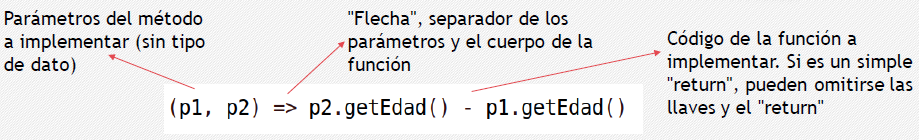
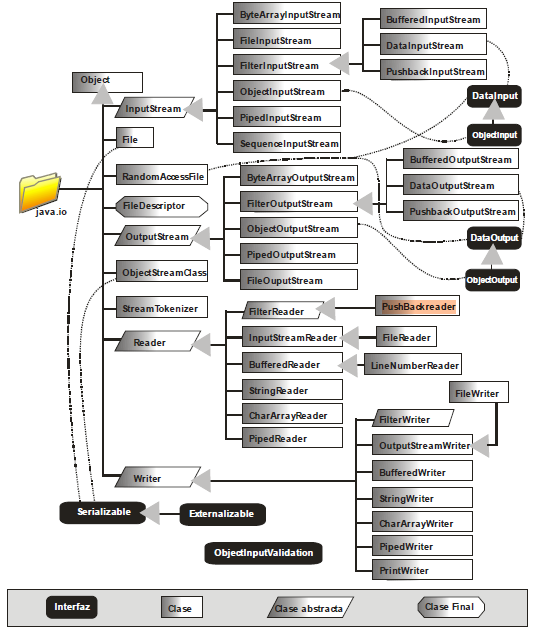
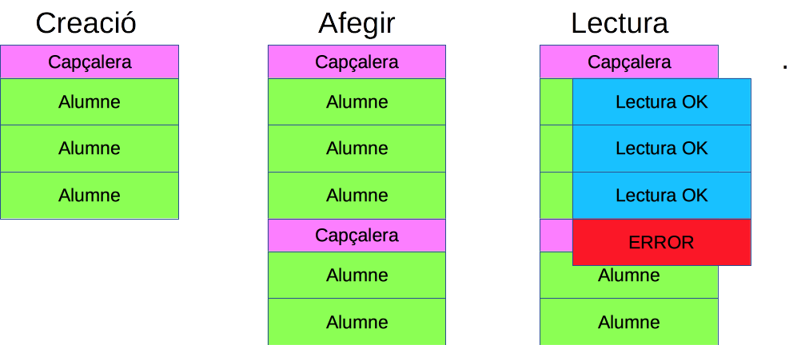

# Unidad 7. Programación funcional. Ficheros. WebServices

## 1. Introducción

- La programación funcional es una paradigma de programación **declarativo**, no imperativo.
  - Se dice como es el problema a resolver, en lugar de los pasos a seguir para resolverlo.
- Ejemplos de lenguajes de programación funcional puros: Miranda, Haskel.
- Ejemplos de lenguajes funcionales híbridos (también adaptados a otros paradigmas): Clojure, Scala.
- La mayoría de lenguajes populares actuales no se pueden considerar funcionales, ni puros ni híbridos, pero han adaptado su sintaxis y funcionalidad para ofrecer parte de este paradigma.

## 2. Características principales

- **Transparencia referencial**: la salida de una función debe depender exclusivamente de sus argumentos. Si llamamos varias veces con los mismos argumentos, debe producir siempre el mismo resultado.
- **Inmutabilidad de los datos**: los datos deben ser inmutables para evitar posibles efectos colaterales.
- **Composición de funciones**: las funciones se tratan como datos, de modo que la salida de una función se puede tomar como entrada para la siguiente.
- **Funciones de primer orden**: funciones que permiten tener otras funciones como parámetros, a modo de callback.

### 2.1 Transparencia referencial e inmutabilidad

Si llamamos repetidamente a esta función con el parámetro 1, cada vez producirá un resultado distinto (3, 4, 5 ...)


```java
public class Prueba {
    static int valorExterno =1;

    static int MiFuncion(int parametro)
    {
        valorExterno++;
        return valorExterno+parametro;
    }
}
```


### 2.2 Imperativo VS Declarativo

Veamos en Java como podemos obtener una sublista de personas adultas, utilizando un modelo **Imperativo** y un modelo **Declarativo**

**Clase Persona**


```java
public class Persona{
    protected String nombre;
    protected int edad;

    public Persona(String nombre, int edad)
    {
        this.nombre=nombre;
        this.edad=edad;
    }
    @Override
    public String toString() {
        return "Persona{" +
                "nombre='" + nombre + '\'' +
                ", edad=" + edad +
                '}';
    }

    public int getEdad() {
        return edad;
    }

    public String getNombre() {
        return nombre;
    }

    public void setEdad(int edad) {
        this.edad = edad;
    }

    public void setNombre(String nombre) {
        this.nombre = nombre;
    }
}
```


**Imperativa**


```java
import java.util.ArrayList;
import java.util.List;

public class Main {

    public static void main(String[] args) {
        ArrayList<Persona> misPersonas = new ArrayList<Persona>();
        misPersonas.add(new Persona("Paco", 10));
        misPersonas.add(new Persona("Juan", 8));
        misPersonas.add(new Persona("Manu", 40));
        misPersonas.add(new Persona("Loren", 42));
        misPersonas.add(new Persona("Alejo", 31));

        // Ahora vamos a obtener las personas mayores de 18

        List<Persona> adultos = new ArrayList<Persona>();
        for (int i = 0; i < misPersonas.size(); i++) {
            if(misPersonas.get(i).getEdad()>=18)
                adultos.add(misPersonas.get(i));
        }
        for (Persona p:adultos ) {
            System.out.println(p);
        }
    }
}
```


**Declarativa**


```java
import java.util.ArrayList;
import java.util.List;
import java.util.stream.Collectors;

public class Main {

    public static void main(String[] args) {
        ArrayList<Persona> misPersonas = new ArrayList<Persona>();
        misPersonas.add(new Persona("Paco", 10));
        misPersonas.add(new Persona("Juan", 8));
        misPersonas.add(new Persona("Manu", 40));
        misPersonas.add(new Persona("Loren", 42));
        misPersonas.add(new Persona("Alejo", 31));

        // Ahora vamos a obtener las personas mayores de 18

        List<Persona> AdultosF = misPersonas.stream()
                .filter(p -> p.getEdad() >= 18)
                .collect(Collectors.toList());

        for (Persona p : AdultosF) {
            System.out.println(p);
        }
    }
}
```


La programación declarativa es más compacta y menos propensa a errores. Como se puede observar en el ejemplo, hemos realizado una composición de funciones.

## 3. Introducción a las funciones Lambda

- Expresiones breves que simplifican la implementación de código de elementos más costosos en cuanto a líneas de código.
- Normalmente aplicados a la implementación de interfaces, aunque en algunos lenguajes tienen utilidades más prácticas.
- En algunos lenguajes se les suele denominar "**funciones flecha**" (**arrow functions**) ya que en su sintaxis es una característica una flecha, que separa la cabecera de la función de su cuerpo.

**Ejemplo en Java**

- API del método **List.sort** de Java:
  - **default void sort(Comparator <? super E> c )**
- La interfaz **Comparator** pide implementar un método **compare**, que recibe dos datos del tipo a tratar (T), y devuelve un entero si el primero es menor, mayor o iguales (de forma similar al método **compareTo** del interfaz **Comparable**)
  - **int compare(T o1, To2)**

**Ordenación de la lista con Comparator**

**Clase persona**


```java
public class Persona{
    protected String nombre;
    protected int edad;

    public Persona(String nombre, int edad)
    {
        this.nombre=nombre;
        this.edad=edad;
    }

    public int getEdad() {
        return edad;
    }

    public String getNombre() {
        return nombre;
    }

    public void setEdad(int edad) {
        this.edad = edad;
    }

    public void setNombre(String nombre) {
        this.nombre = nombre;
    }
    @Override
    public String toString() {
        return String.format("%s - %d", nombre, edad);
    }
    public int obtenerDiferenciaEdad(final Persona otra) {
        return edad - otra.edad;
    }
}
```


**Clase que implementa el comparador de personas**


```java
import java.util.Comparator;

public class ComparadorPersona implements Comparator<Persona> {
    @Override
    public int compare(Persona p1, Persona p2)
    {
        return p2.getEdad()-p1.getEdad();
    }

}
```


```java
import java.util.ArrayList;

public class Main {

    public static void main(String[] args) {
        ArrayList<Persona> misPersonas = new ArrayList<Persona>();
        misPersonas.add(new Persona("Paco", 10));
        misPersonas.add(new Persona("Juan", 8));
        misPersonas.add(new Persona("Manu", 40));
        misPersonas.add(new Persona("Loren", 42));
        misPersonas.add(new Persona("Alejo", 31));

        // Ordenamos las personas.

        misPersonas.sort(new ComparadorPersona());

        for (Persona p : misPersonas) {
            System.out.println(p);
        }

    }
}
```


**Implementación con Lambdas**


```java
import java.util.ArrayList;

public class Main {

    public static void main(String[] args) {
        ArrayList<Persona> misPersonas = new ArrayList<Persona>();
        misPersonas.add(new Persona("Paco", 10));
        misPersonas.add(new Persona("Juan", 8));
        misPersonas.add(new Persona("Manu", 40));
        misPersonas.add(new Persona("Loren", 42));
        misPersonas.add(new Persona("Alejo", 31));

        // Ordenamos las personas.
        misPersonas.sort((p1, p2)->p2.getEdad()-p1.getEdad());

        for (Persona p : misPersonas) {
            System.out.println(p);
        }

    }
}
```


### **Estructura de una función Lambda**



- Los paréntesis del lado izquierdo pueden omitirse si sólo hay un parámetro, por norma general, en casi todos los lenguajes que usan este tipo de expresiones.
- Si el código a la derecha de la flecha necesita hacer más de un simple "return", se pone entre llaves. En Java la flecha es **->**

## 4. Gestión de colecciones con streams en Java

- Desde Java 8, permiten procesar grandes cantidades de datos aprovechando la paralelización que permite el sistema.
- **No modifican la colección original**, sino que crean copias.
- Dos tipos de operaciones:
  - **Intermedias**: devuelven otro stream resultado de procesar el anterior de algún modo(filtrado, mapeo, ...), para ir enlazando operaciones.
  - **Finales**: cierran el stream devolviendo algún resultado (colección resultante, cálculo numérico, etc).
- Muchas de estas operaciones tienen como parámetro una interfaz, que puede implementarse muy brevemente empleando expresiones lambda.

### 4.1 Operaciones Intermedias streams

#### 4.1.1 Filtrado

El método **filter** es una operación intermedia que permite quedarnos con los datos de una colección que cumplan el criterio indicado como parámetro.


```java
ArrayList<Persona> misPersonas = new ArrayList<Persona>();

misPersonas.add(new Persona("Paco", 10));
misPersonas.add(new Persona("Juan", 8));
misPersonas.add(new Persona("Manu", 40));
misPersonas.add(new Persona("Loren", 42));
misPersonas.add(new Persona("Alejo", 31));

Stream <Persona> Adultos=
                misPersonas.stream()
                            .filter(p -> p.getEdad()>=18);
```


"Aquellas personas **p** de la colección que cumplen determinada condición"

**filter** recibe como parámetro una interfaz **Predicate**, cuyo método **test** recibe como parámetro un objeto y devuelve si ese objeto cumple o no una determinada condición.

#### 4.1.2 Mapeo

El método **map** es una operación intermedia que permite transformar la colección original para quedarnos con cierta parte de la información o crear otros datos.


```java
ArrayList<Persona> misPersonas = new ArrayList<Persona>();

misPersonas.add(new Persona("Paco", 10));
misPersonas.add(new Persona("Juan", 8));
misPersonas.add(new Persona("Manu", 40));
misPersonas.add(new Persona("Loren", 42));
misPersonas.add(new Persona("Alejo", 31));

 Stream <Integer> edades =
                misPersonas.stream()
                                .map(p -> p.getEdad());
```


"Las edades de aquellas personas p de la colección"

**map** recibe como parámetro una interfaz **Function**, cuyo método **apply** recibe como parámetro un objeto y devuelve otro objeto diferente, normalmente derivado del parámetro.

#### 4. 1. 3 Combinar

Se pueden combinar operaciones intermedias (composición de funciones) para producir resultados más complejos. Por ejemplo, obtener las edades de las personas adultas:


```java
ArrayList<Persona> misPersonas = new ArrayList<Persona>();

misPersonas.add(new Persona("Paco", 10));
misPersonas.add(new Persona("Juan", 8));
misPersonas.add(new Persona("Manu", 40));
misPersonas.add(new Persona("Loren", 42));
misPersonas.add(new Persona("Alejo", 31));

Stream <Integer> edadesAdultos =
                misPersonas.stream()
                        .filter(p -> p.getEdad()>=18)
                        .map(p -> p.getEdad());
```


#### 4.1.4 Ordenar

El método sorted es una operación intermedia que permite ordenar los elementos de una colección según cierto criterio. Por ejemplo, ordenar las personas adultas por edad:


```java
ArrayList<Persona> misPersonas = new ArrayList<Persona>();

misPersonas.add(new Persona("Paco", 10));
misPersonas.add(new Persona("Juan", 8));
misPersonas.add(new Persona("Manu", 40));
misPersonas.add(new Persona("Loren", 42));
misPersonas.add(new Persona("Alejo", 31));

        Stream <Persona> personasOrdenadas =
                misPersonas.stream()
                        .filter(p -> p.getEdad()>=18)
                                .sorted((p1,p2)-> p1.getEdad()- p2.getEdad());
```


"Para cada pareja de personas p1 y p2, ordénalas en función de la resta de la edad de p1 menos la edad de p2"

**sorted** recibe como parámetro una interfaz **Comparator**, que ya conocemos.

### 4,2 Operaciones finales streams

#### 4.2.1 Collect

El método **collect** es una operación final que te permite obtener algún tipo de colección a partir de los datos procesados por las operaciones intermedias. Por ejemplo, una lista con las edades de las personas adultas:


```java
ArrayList<Persona> misPersonas = new ArrayList<Persona>();

misPersonas.add(new Persona("Paco", 10));
misPersonas.add(new Persona("Juan", 8));
misPersonas.add(new Persona("Manu", 40));
misPersonas.add(new Persona("Loren", 42));
misPersonas.add(new Persona("Alejo", 31));

List<Integer> edadesAdultos2 =
                misPersonas.stream()
                        .filter(p -> p.getEdad()>=18)
                        .map(p -> p.getEdad())
                                .collect(Collectors.toList());
```


#### 4.2.2 Cadena

El método **collect** también permite obtener una cadena de texto que una los elementos resultantes, a través de un separador común. En la función ***Collectors.joining*** se puede indicar también un prefijo y un sufijo para el texto.

Por ejemplo, los nombres de las personas adultas:


```java
ArrayList<Persona> misPersonas = new ArrayList<Persona>();

misPersonas.add(new Persona("Paco", 10));
misPersonas.add(new Persona("Juan", 8));
misPersonas.add(new Persona("Manu", 40));
misPersonas.add(new Persona("Loren", 42));
misPersonas.add(new Persona("Alejo", 31));

        String nombresAdultos =
                misPersonas.stream()
                        .filter(p -> p.getEdad()>=18)
                        .map(p -> p.getNombre())
                        .collect(Collectors.joining(",","Adultos: ",""));
```


#### 4.2.3 forEach

El método **forEach** permite recorrer cada elemento del stream resultante, y hacer lo que necesite con él. Por ejemplo sacar por pantalla en líneas separadas los nombres de las personas adultas:


```java
ArrayList<Persona> misPersonas = new ArrayList<Persona>();

misPersonas.add(new Persona("Paco", 10));
misPersonas.add(new Persona("Juan", 8));
misPersonas.add(new Persona("Manu", 40));
misPersonas.add(new Persona("Loren", 42));
misPersonas.add(new Persona("Alejo", 31));

        misPersonas.stream()
                        .filter(p->p.getEdad()>=18)
                                .map(p ->p.getNombre())
                                        .forEach(p -> System.out.println(p));
```


#### 4.2.4 Media

El método **average** permite, junto a la operación intermedia **mapToint**, obtener la media de un *stream* que haya producido una colección resultante numérica. Por ejemplo, la media de edades de las personas adultas.


```java
ArrayList<Persona> misPersonas = new ArrayList<Persona>();

misPersonas.add(new Persona("Paco", 10));
misPersonas.add(new Persona("Juan", 8));
misPersonas.add(new Persona("Manu", 40));
misPersonas.add(new Persona("Loren", 42));
misPersonas.add(new Persona("Alejo", 31));

        double mediaEdadAdultos =
                misPersonas.stream()
                        .filter(p -> p.getEdad()>=18)
                                .mapToInt(p->p.getEdad()).average().getAsDouble();
```


#### 4.3 Miscelánea con ejemplos

**Clase Persona**


```java
public class Persona {
    protected String nombre;
    protected int edad;

    public Persona(String nombre, int edad)
    {
        this.nombre=nombre;
        this.edad=edad;
    }
    public int getEdad() {
        return edad;
    }

    public String getNombre() {
        return nombre;
    }

    public void setEdad(int edad) {
        this.edad = edad;
    }

    public void setNombre(String nombre) {
        this.nombre = nombre;
    }

    public int obtenerDiferenciaEdad(final Persona otra) {
        return edad - otra.edad;
    }
    @Override
    public String toString() {
        return String.format("%s - %d", nombre, edad);
    }
}
```


Ejemplos:


```java
import java.util.*;
import java.util.function.BinaryOperator;
import java.util.function.Function;
import java.util.function.Predicate;
import java.util.stream.Collectors;

import static java.util.Comparator.comparing;
import static java.util.stream.Collectors.*;

public class Main {
    public static void main(String[] args) {

        final List<String> amigos = Arrays.asList("Brian", "Nate", "Neal", "Raju", "Sara", "Scott");
        ArrayList<Persona> misPersonas = new ArrayList<Persona>();
        misPersonas.add(new Persona("Paco", 10));
        misPersonas.add(new Persona("Juan", 8));
        misPersonas.add(new Persona("Ana", 27));
        misPersonas.add(new Persona("Aurora", 33));
        misPersonas.add(new Persona("Manu", 40));
        misPersonas.add(new Persona("Carla", 40));
        misPersonas.add(new Persona("Loren", 42));
        misPersonas.add(new Persona("Alejo", 31));

//        for(String name : friends) {
//            System.out.println(name);
//        }
//        friends.forEach((name) -> System.out.println(name));
//        friends.forEach(name -> System.out.println(name));
        amigos.forEach(System.out::println);

        // Transformacion de la lista a UpperCase

        final List<String> uppercaseNames = new ArrayList<>();

        // Método tradicional
//        for(String name : friends) {
//            uppercaseNames.add(name.toUpperCase());
//        }

//        friends.forEach(name -> uppercaseNames.add(name.toUpperCase())); //BAD IDEA NO RECOMENDADO
//        System.out.println(uppercaseNames);
        //Usamos el iterador interno, pero eso aún requería la lista vacía y el esfuerzo de agregarle elementos. Además, modificamos una variable mutable compartida, la lista, desde dentro de la expresión lambda. Esa es una mala idea, ya que hace que no sea seguro paralelizar esta iteración si se desea, y ese tipo de código debe evitarse. Podemos hacerlo mucho mejor.

        //El método de mapa de Stream puede mapear o transformar una secuencia de entrada en una secuencia de salida, lo cual se adapta bastante bien a la tarea en cuestión.

        amigos.stream()
                .map(name -> name.toUpperCase())
                .forEach(name -> System.out.print(name + " "));
        System.out.println();

        // Obtenemos el stream, mapeamos el nombre en mayúsculas y para cada uno de los nombres, lo imprimimos seguido con el forEach

        misPersonas.stream()
                        .map(persona ->persona.getNombre().toUpperCase())
                        .forEach(nombre -> System.out.print(nombre + " "));


  // Con esta función, un String::toUpperCase corto puede reemplazar name -> name.toUpperCase(), de la siguiente manera:

//        amigos.stream()
//                .map(String::toUpperCase)
//                .forEach(name -> System.out.println(name));
        // Contar el número de carácteres de los nombres de las personas


        // Ahora contamos el número de carácteres de cada uno de los elementos de la colección

        misPersonas.stream()
                .map(persona -> persona.getNombre().length())
                .forEach(count -> System.out.print(count + " "));
        System.out.println();


        amigos.stream()
                .map(name -> name.length())
                .forEach(count -> System.out.print(count + " "));
        System.out.println();

       // Búsqueda de Elementos

       // Se hará uso del elemento Filter
       // Método tradicional
        final List<String> startsWithN = new ArrayList<>();
        for(String name : amigos) {
            if(name.startsWith("N")) {
                startsWithN.add(name);
            }
        }

        final List<Persona> startsWithA = new ArrayList<>();
        for(Persona p : misPersonas) {
            if(p.getNombre().startsWith("A"))
            {
                startsWithA.add(p);
            }
        }


        // Haciendo uso del método Filter

        final List<Persona> startsWithAA =
                misPersonas.stream()
                        .filter(persona -> persona.getNombre().startsWith("A"))
                        .collect(toList());

        System.out.println(String.format("Encontrados %d nombres", startsWithAA.size()));

        final List<String> startsWithNN =
                amigos.stream()
                        .filter(name -> name.startsWith("N"))
                        .collect(toList());

        System.out.println(String.format("Encontrados %d nombres", startsWithNN.size()));


        // Skipping Values

        // skip() or dropWhile() functions.
        // Con skip cortamos sin condiciones
        amigos.stream()
                .skip(4)
                .map(String::toUpperCase)
                .forEach(System.out::println);

        misPersonas.stream()
                .skip(1)
                .map(Persona::getNombre)
                .forEach(System.out::println);


//      Con dropWhile establecemos condiciones.
//
        amigos.stream()
                .dropWhile(name -> name.length() > 4)
                .map(String::toUpperCase)
                .forEach(System.out::println);


        misPersonas.stream()
                .dropWhile(persona -> persona.getNombre().length() > 4)
                .map(Persona::getNombre)
                .map(String::toUpperCase)
                .forEach(System.out::println);

//        //Terminating Iterations

        // Java proporciona al menos dos formas de salir de una iteración antes de llegar
        // al final de una colección: limit() y takeWhile().
//
        amigos.stream()
                .limit(3)
                .map(String::toUpperCase)
                .forEach(System.out::println);
//
        // Si, en lugar de un número específico de elementos, queremos finalizar la iteración
        // al encontrar un elemento que cumpla un criterio determinado, podemos utilizar takeWhile(),
        // como en el siguiente código:

        amigos.stream()
                .takeWhile(name -> name.length() > 4)
                .map(String::toUpperCase)
                .forEach(System.out::println);

        misPersonas.stream()
                .takeWhile(Persona->Persona.getNombre().length() >= 5)
                .map(Persona::getNombre)
                .map(String::toUpperCase)
                .forEach(System.out::println);


        // Reusing Lambda Expressions

        // El código duplicado genera un código de mala calidad que es difícil de mantener
//
        final List<String> amigos2 =
                Arrays.asList("Brian", "Nate", "Neal", "Raju", "Sara", "Scott");
        final List<String> editores =
                Arrays.asList("Brian", "Jackie", "John", "Mike");
        final List<String> camaradas =
                Arrays.asList("Kate", "Ken", "Nick", "Paula", "Zach");
//
//        // Filtramos en estos List y contamos las N
//
        final long countFriendsStartN =
                amigos2.stream()
                        .filter(name -> name.startsWith("N"))
                        .count();
        final long countEditorsStartN =
                editores.stream()
                        .filter(name -> name.startsWith("N"))
                        .count();

        final long countComradesStartN =
                camaradas.stream()
                        .filter(name -> name.startsWith("N"))
                        .count();
//
//        // Estas expresiones lambda están recimiendo el mismo predicate. Vamos a solucionarlo
//
      final Predicate<String> startsWithN2 = name -> name.startsWith("N");
//
        final long contacaramigosN =
                amigos2.stream()
                        .filter(startsWithN2)
                        .count();
        final long contareditoresN =
                editores.stream()
                        .filter(startsWithN2)
                        .count();
        final long contarcamaradasN =
                camaradas.stream()
                        .filter(startsWithN2)
                        .count();
//
//
        final long countFriendsStartN1 =
                amigos2.stream()
                        .filter(checkSiComienza("N"))
                        .count();
        final long countFriendsStartB =
                amigos2.stream()
                        .filter(checkSiComienza("B"))
                        .count();

        pickName(amigos2, "N");
        pickName(amigos2, "Z");
//
//
//    // Reducing a Collection to a Single Valuea

        System.out.println("Número total de caracteres en todos los nombres: " +
                amigos2.stream()
                        .mapToInt(name -> name.length())
                        .sum());

        System.out.println("Número total de caracteres en todos los nombres: " +
                misPersonas.stream()
                        .mapToInt(persona -> persona.getNombre().length())
                        .sum());


        //  Podemos utilizar el método reduce para comparar dos elementos entre sí y pasar el resultado para una comparación
        //  posterior con los elementos restantes de la colección. Al igual que las otras funciones de orden superior en
        //  colecciones que hemos visto hasta ahora, el método reduce itera sobre la colección. Además, traslada el resultado
        //  del cálculo que devolvió la expresión lambda. Un ejemplo ayudará a aclarar esto, así que vayamos al código.
//
        final Optional<String> aLongName =
                amigos2.stream()
                        .reduce((name1, name2) ->
                                name1.length() >= name2.length() ? name1 : name2);
        aLongName.ifPresent(name ->
                System.out.println(String.format("El nombre más largo es: %s", name)));
//
//        // Joining Elements

        System.out.println(
                amigos2.stream()
                        .map(String::toUpperCase)
                        .collect(joining(", ")));

        System.out.println(
                misPersonas.stream()
                        .map(Persona::getNombre)
                        .map(String::toUpperCase)
                        .collect(joining(", ")));


        // Implementando el Interfaz Comparator.

        //Podemos obtener un Stream de la Lista y llamar convenientemente al método sorted en él.
        // En lugar de modificar la colección dada, devolverá una colección ordenada. Podemos
        // configurar de forma elegante el parámetro Comparator al llamar a este método.

        List<Persona> edadAscendente =
                misPersonas.stream()
                        .sorted((persona1, persona2) -> persona1.obtenerDiferenciaEdad(persona2))
                        .collect(toList());

        edadAscendente.stream().toList().forEach(System.out::println);

        // Primero transformamos la lista de personas dada en un flujo usando el método stream.
        // Luego invocamos el método sorted en ella. Este método toma un Comparator como parámetro.
        // Dado que Comparator es una interfaz funcional, pasamos convenientemente una expresión lambda.
        // Finalmente, invocamos el método collect y le pedimos que coloque el resultado en una lista.
        // Recuerde que el método collect es un reductor que ayudará a orientar los miembros de la iteración transformada
        // a un tipo o formato deseado. toList es un método estático en la clase de conveniencia Collectors.

        Comparator<Persona> compareAscending =
                (persona1, persona2) -> persona1.obtenerDiferenciaEdad(persona2);
        Comparator<Persona> compareDescending = compareAscending.reversed();

        List<Persona> edadDescendente =
                misPersonas.stream()
                        .sorted(compareDescending)
                        .collect(toList());

        edadDescendente.stream().toList().forEach(System.out::println);


        // Obtener la persona más mayor

        misPersonas.stream()
                .max(Persona::obtenerDiferenciaEdad)
                .ifPresent(mayor -> System.out.println("El mayor es: " + mayor));


        //Multiple and Fluent Comparisons

        final Function<Persona, String> byName = persona -> persona.getNombre();
        misPersonas.stream()
                .sorted(comparing(byName));

        //En este código, importamos estáticamente el método de comparación en la interfaz Comparator.
        // El método de comparación utiliza la lógica incorporada en la expresión lambda proporcionada
        //  para crear un Comparator. En otras palabras, es una función de orden superior que toma una función (Función)
        //  y devuelve otra (Comparator). Además de hacer que la sintaxis sea más concisa, el código ahora se lee con
        //  fluidez para expresar el problema que se está solviendo. Podemos llevar esta fluidez más allá para hacer
        //  comparaciones múltiples. Por ejemplo, aquí hay una sintaxis coherente para ordenar a las personas en orden
        //  ascendente tanto por edad como por nombre:

        final Function<Persona, Integer> porEdad = persona -> persona.getEdad();
        final Function<Persona, String> porNombre = persona -> persona.getNombre();

        System.out.println("Ordenados ascendetemente por edad y nombre: ");
                misPersonas.stream()
                        .sorted(comparing(porEdad).thenComparing(porNombre))
                        .collect(toList())
                        .forEach(System.out::println);

     // Using the collect Method and the Collectors Class

        // Hemos utilizado el método de recopilación varias veces en los ejemplos para reunir
        // elementos de Stream en una lista ArrayList. Este método es una operación de reducción
        //  que resulta útil para transformar la colección en otra forma, a menudo una colección mutable.

        List<Persona> mayoresde20 =
                misPersonas.stream()
                        .filter(person -> person.getEdad() > 20)
                        .collect(Collectors.toList());
        System.out.println("Personas mayores de 20 años: " + mayoresde20);

        // groupingBy para agrupar personas por su edad.

        Map<Integer, List<Persona>> personasAgrupadasporEdad =
                misPersonas.stream()
                        .collect(groupingBy(Persona::getEdad));
        System.out.println("Agrupados por edad: " + personasAgrupadasporEdad);


        Map<Integer, List<String>> nombrePersonasAgrupadasporEdad =
                misPersonas.stream()
                        .collect(
                                groupingBy(Persona::getEdad, mapping(Persona::getNombre, toList())));
        System.out.println("Personas agrupadas por edad: " + nombrePersonasAgrupadasporEdad);

        //Veamos otra combinación. Agrupemos los nombres por su primer carácter y luego busquemos la persona
        // de mayor edad en cada grupo.

        Comparator<Persona> byAge = Comparator.comparing(Persona::getEdad);
        Map<Character, Optional<Persona>> oldestPersonOfEachLetter =
                misPersonas.stream()
                        .collect(groupingBy(persona -> persona.getNombre().charAt(0),
                                reducing(BinaryOperator.maxBy(byAge))));
        System.out.println("Persona de mayor edad de cada letra:");
        System.out.println(oldestPersonOfEachLetter);


 }

    public static Predicate<String> checkSiComienza(final String letra) {
        return name -> name.startsWith(letra);
    }

    public static void pickName(final List<String> names, final String startingLetter) {
        final Optional<String> foundName =
                names.stream()
                        .filter(name -> name.startsWith(startingLetter))
                        .findFirst();
        System.out.println(String.format("El nombre comienza con %s: %s",
                startingLetter, foundName.orElse("Nombre no encontrado")));


    }
}
```


## 5. Ficheros

### 5.1 Introducción

Cuando desarrollas programas, en la mayoría de ellos los usuarios pueden pedirle a la aplicación que realice cosas y pueda suministrarle datos con los que se quiere hacer algo. Una vez introducidos los datos y las órdenes, se espera que el programa manipule de alguna forma esos datos, para proporcionar una respuesta a lo solicitado.

Además, normalmente interesa que el programa guarde los datos que se le han introducido, de forma que si el programa termina, los datos no se pierdan y puedan ser recuperados en una sesión posterior. La forma más normal de hacer esto es mediante la utilización de ficheros, que se guardarán en un dispositivo de memoria no volátil (normalmente un disco).

También podemos necesitar acceder a datos que nos proporcionan en un fichero:

- Muchas platafomas de Internet como Internet Movie Database, [IMDb](https://www.imdb.com/interfaces/) , dejan sus datos accesibles como simples ficheros
- También los Gobiernos generan muchos datos estadísticos que están disponibles en diferentes formatos: [datos.gob.es](http://datos.gob.es/es/catalogo), [EUSTAT](http://www.eustat.eus/banku/id_All/indexArbol.html) ...
- En la Web [http://www.gutenberg.org ](http://www.gutenberg.org/)podemos encontrar miles de libros que podemos leer pero también procesar en nuestros programas.

Por tanto, vemos que el almacenamiento en variables es temporal, los datos se pierden en las variables cuando están fuera de su ámbito o cuando el programa termina. **Las computadoras utilizan ficheros para guardar los datos**, incluso después de que el programa termine su ejecución. Se suele denominar a los datos que se guardan en ficheros **datos persistentes**, porque existen, persisten más allá de la ejecución de la aplicación. Los ordenadores almacenan los ficheros en unidades de almacenamiento secundario como discos duros, discos ópticos, etc. En esta unidad veremos cómo hacer con Java estas operaciones de crear, actualizar y procesar ficheros.

Todas estas operaciones con ficheros suponen un flujo de información del programa con el exterior, con el dispositivo en el que está el fichero, y se las conoce como operaciones de **Entrada/Salida (E/S).**

Normalmente, distinguimos dos tipos de E/S:

- la **E/S estándar** que se realiza con el terminal del usuario y que hemos utilizado hasta ahora para mostrar mensajes por consola y pedir datos al usuario o usuaria a través del teclado
- y la **E/S a través de ficheros**, en la que se trabaja sobre ficheros.

Todas las operaciones de E/S en Java vienen proporcionadas por el paquete estándar del API de Java denominado `java.io` que incorpora interfaces, clases y excepciones para acceder a todo tipo de ficheros.

#### 5.1.1 Clase File

En el paquete **[java.io](https://java.io/)** se encuentra la clase File pensada para poder realizar operaciones de información sobre archivos. No proporciona métodos de acceso a los archivos, sino operaciones a nivel de sistema de archivos (listado de archivos, crear carpetas, borrar ficheros, cambiar nombre,...).
Un objeto File representa un archivo o un directorio y sirve para obtener información (permisos, tamaño,…). También sirve para navegar por la estructura de archivos.

**[Documentación oficial](https://docs.oracle.com/en/java/javase/23/docs/api/java.base/java/io/File.html)**:

**Construcción de objetos de archivo**

Utiliza como único argumento una cadena que representa una ruta en el sistema de archivo. También puede recibir, opcionalmente, un segundo parámetro con una ruta segunda que se define a partir de la posición de la primera.


```java
File archivo1=new File(“/datos/bd.txt”);
File carpeta=new File(“datos”);
```


El primer formato utiliza una ruta absoluta y el segundo una ruta relativa. En Java el separador de archivos tanto para Windows como para Linux es el símbolo /.
Otra posibilidad de construcción es utilizar como primer parámetro un objeto File ya hecho. A esto se añade un segundo parámetro que es una ruta que cuenta desde la posición actual.


```java
File carpeta1=new File(“c:/datos”);//ó c\\datos
File archivo1=new File(carpeta1,”bd.txt”);
```


Si el archivo o carpeta que se intenta examinar no existe, la clase File no devuelve una excepción. Habrá que utilizar el método **exists**. Este método recibe true si la carpeta o archivo es válido (puede provocar excepciones **SecurityException**). También se puede construir un objeto File a partir de un
objeto URI.

**El problema en las rutas**

Cuando se crean programas en Java hay que tener muy presente que no siempre sabremos qué sistema operativo utilizará el usuario del programa.
Esto provoca que la realización de rutas sea problemática porque la forma de denominar y recorrer rutas es distinta en cada sistema operativo.
Por ejemplo en Windows se puede utilizar la barra / o la doble barra invertida \ como separador de carpetas, en muchos sistemas Unix sólo es posible la primera opción.
También se pueden utilizar las variables estáticas que posee File. Estas son:

| Propiedad                         | Uso                                                          |
| :-------------------------------- | :----------------------------------------------------------- |
| **static char separatorChar**     | El carácter separador de nombres de archivo y carpetas. En Linux/Unix es / y en Windows es , que se debe escribir como \, ya que el carácter permite colocar caracteres de control, de ahí que haya que usar la doble barra. Pero Windows admite también la barra simple (/) |
| **static String separator**       | Como el anterior pero en forma de String                     |
| **static char pathSeparatorChar** | El carácter separador de rutas de archivo quepermite poner más de un archivo en una ruta. En Linux/Unix suele ser “:”, en Windows es “;” |
| **static String pathSeparator**   | Como el anterior, pero en forma de String                    |

Para poder garantizar que el separador usado es el del sistema en uso:


```java
String ruta=”documentos/manuales/2003/java.doc”;
ruta=ruta.replace(‘/’,File.separatorChar);
```


Normalmente no es necesaria esta comprobación ya que Windows acepta
también el carácter / como separador.

**<u>métodos generales</u>**

| método                                       | uso                                                          |
| :------------------------------------------- | :----------------------------------------------------------- |
| **toString()**                               | Para obtener la cadena descriptiva del objeto                |
| **boolean exists()**                         | Devuelve **true** si existe la carpeta o archivo.            |
| **boolean canRead()**                        | Devuelve **true** si el archivo se puede leer                |
| **boolean canWrite()**                       | Devuelve **true** si el archivo se puede escribir            |
| **boolean isHidden()**                       | Devuelve **true** si el objeto File es oculto                |
| **boolean isAbsolute()**                     | Devuelve **true** si la ruta indicada en el objeto           |
| **boolean equals(File** f2**)**              | Compara **f2** con el objeto **File** y devuelve             |
| **int compareTo(File** f2**)**               | Compara basado en el orden alfabético del texto (sólo funciona bien si ambos archivos son de texto) **f2** con el objeto **File** y devuelve cero si son iguales, un entero negativo si el orden de **f2** es mayor y positivo si es menor |
| **String getAbsolutePath()**                 | Devuelve una cadena con la ruta absoluta al Objeto File.     |
| **File getAbsoluteFile()**                   | Como la anterior pero el resultado es un objeto File         |
| **String getName()**                         | Devuelve el nombre del objeto File.                          |
| **String getParent()**                       | Devuelve el nombre de su carpeta superior si la hay y si no **null** |
| **File getParentFile()**                     | Como la anterior pero la respuesta se obtiene en forma de objeto File. |
| **boolean setReadOnly()**                    | Activa el atributo de sólo lectura en la carpeta o archivo.  |
| **URL toURL() throws MalformedURLException** | Convierte el archivo a su notación URL correspondiente       |
| **URI toURI()**                              | Convierte el archivo a su notación URI Correspondiente       |

**Métodos de Carpetas (Directorios)**

| método                        | uso                                                          |
| :---------------------------- | :----------------------------------------------------------- |
| **boolean isDirectory()**     | Devuelve **true** si el objeto File es una carpeta y **false** si es un archivo o si no existe. |
| **boolean mkdir()**           | Intenta crear una carpeta y devuelve **true** si fue posible hacerlo |
| **boolean mkdirs()**          | Usa el objeto para crear una carpeta con la ruta creada para el objeto y si hace falta crea toda la estructura de carpetas necesaria para crearla. |
| **boolean delete()**          | Borra la carpeta y devuelve **true** si puedo hacerlo        |
| **String[] list()**           | Devuelve la lista de archivos de la carpeta representada en el objeto File. |
| **static File[] listRoots()** | Devuelve un array de objetos File, donde cada objeto del array representa la carpeta raíz de una unidad de disco. |
| **File[] listfiles()**        | Igual que la anterior, pero el resultado es un array de objetos File. |

**Métodos de archivos**

| método                                                       | uso                                                          |
| :----------------------------------------------------------- | :----------------------------------------------------------- |
| **boolean isFile()**                                         | Devuelve **true** si el objeto File es un archivo y **false** si es carpeta o si no existe. |
| **boolean renameTo(File** f2**)**                            | Cambia el nombre del archivo por el que posee el archivo pasado como argumento. Devuelve **true** si se pudo completar la operación. |
| **boolean delete()**                                         | Borra el archivo y devuelve **true** si puedo hacerlo **long length()** Devuelve el tamaño del archivo en bytes (en el caso del texto devuelve los caracteres del archivo) |
| **boolean createNewFile() throws IOException**               | Crea un nuevo archivo basado en la ruta dada al objeto File. Hay que capturar la excepción *IOException* que ocurriría si hubo error crítico al crear el archivo. Devuelve **true** si se hizo la creación del archivo vacío y **false** si ya había otro archivo con ese nombre. |
| **static File createTempFile(String** prefijo**, String** sufijo**) throws IOException** | Crea un objeto File de tipo archivo temporal con el prefijo y sufijo indicados. Se creará en la carpeta de archivos temporales por defecto del sistema. El **prefijo** y el **sufijo** deben de tener al menos tres caracteres (el sufijo suele ser la extensión), de otro modo se produce una excepción del tipo **IllegalArgumentsException** Requiere capturar la excepción **IOException** que se produce ante cualquier fallo en la creación del archivo |
| **static File createTempFile( String** prefijo**, String** sufijo**, File** directorio**)** | Igual que el anterior, pero utiliza el directorio indicado.  |
| **void deleteOnExit()**                                      | Borra el archivo cuando finaliza la ejecución del programa   |

Más información aquí: https://docs.oracle.com/en/java/javase/23/docs/api/java.base/java/io/File.html#method-detail

#### 5.1.2 Clases para la entrada y la salida

  

Java se basa en las **secuencias de datos** para dar facilidades de entrada y salida. Una secuencia es una corriente de datos entre un emisor y un receptor de datos en cada extremo. Normalmente las secuencias son de bytes, pero se pueden formatear esos bytes para permitir transmitir cualquier tipo de datos.

Los datos fluyen en serie, byte a byte. Se habla entonces de un stream (corriente de datos, o mejor dicho, corriente de bytes). Pero también podemos utilizar **streams** que transmiten caracteres Java (tipo char Unicode, de two bytes), se habla entonces de un **reader** (si es de lectura) o un **writer** (escritura).

En el caso de las excepciones, todas las que provocan las excepciones de E/S son derivadas de **IOException** o de sus derivadas. Además son habituales ya que la entrada y salida de datos es una operación crítica porque con lo que la mayoría de operaciones deben ir inmersas en un **try**.

**<u>Corrientes de bytes. InputStream/ OutputStream</u>**

Los **Streams** de Java son corrientes de datos binarios accesibles byte a byte.
Estas dos clases abstractas, definen las funciones básicas de lectura y escritura de una secuencia de bytes pura (sin estructurar). Estas corrientes de bits, no representan ni textos ni objetos, sino datos binarios puros. Poseen numerosas subclases; de hecho casi todas las clases preparadas para la lectura y la escritura, derivan de estas.

Los métodos más importantes son read (leer) y write (escribir), que sirven para leer un byte del dispositivo de entrada o escribir un byte respectivamente.

**Métodos de InputStream**

| Método                         | uso                                                          |
| :----------------------------- | :----------------------------------------------------------- |
| **int available()**            | Devuelve el número de bytes de entrada                       |
| **void close()**               | Cierra la corriente de entrada. Cualquier acceso posterior generaría una **IOException**. |
| **void mark(int** bytes**)**   | Marca la posición actual en el flujo de datos de entrada. Cuando se lea el número de bytes indicado, la marca se elimina. |
| **boolean markSupported()**    | Devuelve verdadero si en la corriente de entrada es posible marcar mediante el método **mark.** |
| **int read()**                 | Lee el siguiente byte de la corriente de entrada y le almacena en formato de entero. Devuelve -1 si estamos al final del fichero |
| **int read(byte[]** búfer**)** | Lee de la corriente de entrada hasta llenar el array **búfer**. |
| **void reset()**               | Coloca el puntero de lectura en la posición marcada con **mark**. |
| **long skip()**                | Se salta de la lectura el número de bytes indicados          |

**Métodos de OutputStream**

| Método                                                       | uso                                                          |
| :----------------------------------------------------------- | :----------------------------------------------------------- |
| **void close()**                                             | Cierra la corriente de salida. Cualquier acceso posterior generaría una **IOException**. |
| **void flush()**                                             | Vacía los búferes de salida de la corriente de datos         |
| **void write(int** byte**)**                                 | Escribe un byte en la corriente de salida                    |
| **void write(byte[]** bufer**)**                             | Escribe todo el array de bytes en la corriente de salida     |
| **void write( byte[]** buffer**, int** posInicial**, int** numBytes **)** | Escribe el array de bytes en la salida, pero empezando por la posición inicial y sólo la cantidad indicada por **numBytes**. |

#### 5.1.3 Reader/Writer

Clases abstractas que definen las funciones básicas de escritura y lectura basada en texto Unicode. Se dice que estas clases pertenecen a la jerarquía de lectura/escritura orientada a caracteres, mientras que las anteriores pertenecen a la jerarquía orientada a bytes.
Aparecieron en la versión 1.1 y no substituyen a las anteriores. Siempre que se pueda es más recomendable usar clases que deriven de estas.

Poseen métodos **read** y **write** adaptados para leer arrays de caracteres.

**Métodos reader**

| Método                                                       | uso                                                          |
| :----------------------------------------------------------- | :----------------------------------------------------------- |
| **void close()**                                             | Cierra la corriente de entrada. Cualquier acceso posterior generaría una **IOException**. |
| **void mark(int** bytes**)**                                 | Marca la posición actual en el flujo de datos de entrada. Cuando se lea el número de bytes indicado, la marca se elimina. |
| **boolean markSupported()**                                  | Devuelve verdadero si en la corriente de entrada es posible marcar mediante el método **mark.** |
| **int read()**                                               | Lee el siguiente byte de la corriente de entrada y le almacena en formato de entero. Devuelve -1 si estamos al final del fichero |
| **int read(byte[]** búfer**)**                               | Lee de la corriente de entrada bytes y les almacena en el búfer. Lee hasta llenar el búfer. |
| **int read( byte[]** bufer, **int** posInicio, **int** despl**)** | Lee de la corriente de entrada bytes y les almacena en el búfer. La lectura la almacena en el array pero a partir de la posición indicada, el número máximo de bytes leídos es el tercer parámetro |
| **boolean ready()**                                          | Devuelve verdadero si la corriente de entrada está lista.    |
| **void reset()**                                             | Coloca el puntero de lectura en la posición marcada con **mark**. |
| **long skip()**                                              | Se salta de la lectura el número de bytes indicados.         |

**Métodos de Writer**

| Método                                                       | uso                                                          |
| :----------------------------------------------------------- | :----------------------------------------------------------- |
| **void close()**                                             | Cierra la corriente de salida. Cualquier acceso posterior generaría una **IOException**. |
| **void flush()**                                             | Vacía los búferes de salida de la corriente de datos.        |
| **void write(int** byte**)**                                 | Escribe un byte en la corriente de salida                    |
| **void write(byte[]** bufer**)**                             | Escribe todo el array de bytes en la corriente de salida.    |
| **void** **write(** **byte[]** buffer**,** **int** posInicial**,** **int** numBytes **)** | Escribe el array de bytes en la salida, pero empezando por la posición inicial y sólo la cantidad indicada por **numBytes**. |
| **void write(String** texto**)**                             | Escribe los caracteres en el **String** en la corriente de salida. |
| **void** **write( String** buffer**,** **int** posInicial**,** **int** numBytes **)** | Escribe el String en la salida, pero empezando por la posición inicial y sólo la cantidad indicada por **numBytes**. |

#### 5.1.4 InputStreamReader/ OutputStreamWriter

Son clases que sirven para adaptar la entrada y la salida. La razón es que las corrientes básicas de E/S son de tipo Stream. Estas clases consiguen adaptarlas a corrientes Reader/Writer.

Puesto que derivan de las clases **Reader** y **Writer**, ofrecen los mismos métodos que éstas.

Para ello poseen un constructor que permite crear objetos **InputStreamReader** pasando como parámetro una corriente de tipo y objetos **OutputStreamWriter** partiendo de objetos **OutputStream**.

#### 5.1.5 DataInputStream/DataOutputStream

Leen corrientes de datos de entrada en forma de byte, pero adaptándola a los tipos simples de datos (**int**, **short**, **byte**,..., **String**). Tienen varios métodos read y write para leer y escribir datos de todo tipo.

Ambas clases construyen objetos a partir de corrientes **InputStream** y **OutputStream** respectivamente.

**Métodos de DataInputStream**

| Método                    | uso                                                          |
| :------------------------ | :----------------------------------------------------------- |
| **boolean readBoolean()** | Lee un valor booleano de la corriente de entrada. Puede provocar excepciones de tipo **IOException** o excepciones de tipo **EOFException**, esta última se produce cuando se ha alcanzado el final del archivo y es una excepción derivada de la anterior, por lo que, si se capturan ambas, ésta debe ir en un catch anterior (de otro modo, el flujo del programa entraría siempre en la **IOException**). |
| **byte readByte()**       | Idéntica a la anterior, pero obtiene un byte. Las excepciones que produce son las mismas **…** **readChar(), readShort(), readLong(), readFloat(),** **readDouble()** Como las anteriores pero devolviendo el tipo de |
| **String readLine()**     | Lee de la entrada caracteres hasta llegar a un salto de línea o al fin del fichero y el resultado le obtiene en forma de **String** |
| **String readUTF()**      | Lee un String en formato UTF (codificación norteamericana). Además de las excepciones comentadas antes, puede ocurrir una excepción del tipo **UTFDataFormatException** **(**derivada de **IOException**) si el formato del texto no está en UTF. |

**Métodos de OutputStreamWriter**

La idea es la misma, los métodos son: **writeBoolean**, **writeByte**, **writeBytes** (para Strings), **writeFloat**, **writeShort**, **writeUTF**, **writeInt**, **writeLong**.

Todos poseen un argumento que son los datos a escribir (cuyo tipo debe coincidir con la función).

#### 5.1.6 ObjectInputStream/ObjectOutputStream

Filtros de secuencia que permiten leer y escribir objetos de una corriente de datos orientada a bytes. Sólo tiene sentido si los datos almacenados son objetos. Tienen los mismos métodos que la anterior, pero aportan un nuevo método de lectura:

- readObject. Devuelve un objeto Object de los datos de la entrada. En caso de que no haya un objeto o no sea serializable, da lugar a excepciones. Las excepciones pueden ser:
  - **ClassNotFoundExcepcion**
  - **InvalidClassExcepcion**
  - **StreamCorruptedException**
  - **OptionalDataException**
  - **IOException** genérica.

La clase **ObjectOutputStream** posee el método de escritura de objetos **writeObject** al que se le pasa el objeto a escribir. Este método podría dar lugar en caso de fallo a excepciones **IOException**, **NotSerializableException** o **InvalidClassException**.

#### 5.1.7 BufferedInputStream/BufferedOutputStream/ BufferedReader/BufferedWriter

La palabra buffered hace referencia a la capacidad de almacenamiento temporal en la lectura y escritura. Los datos se almacenan en una memoria temporal antes de ser realmente leídos o escritos. Se trata de cuatro clases que trabajan con métodos distintos pero que suelen trabajar con las mismas
corrientes de entrada que podrán ser de bytes (**Input/OutputStream**) o de caracteres (**Reader/Writer**).

La clase **BufferedReader** aporta el método **readLine** que permite leer caracteres hasta la presencia de null o del salto de línea.

#### 5.1.8 PrintWriter

Clase pensada para secuencias de datos orientados a la impresión de textos. Es una clase escritora de caracteres en flujos de salida, que posee los métodos print y println, que otorgan gran potencia a la escritura.

#### 5.1.9 PipedInputStream/PipedOutputStream

Permiten realizar canalizaciones entre la entrada y la salida; es decir lo que se lee se utiliza para una secuencia de escritura o al revés.

### 5.2 lectura y escritura en archivos


```java
File fichero = new File ("fichero.txt");
Scanner leerFichero = new Scanner(fichero);
```


Por último, cuando hayamos acabado de trabajar con el fichero, cerraremos la conexión con él mediante el método close de la clase Scanner:


```java
leerFichero.close();
```


Los objetos de la clase Scanner, **leen elementos separados por los delimitadores por defecto**. Estos son los **espacios en blanco y los saltos de línea** pero podemos configurar los que queramos mediante el método **delimiter()**.


```java
Scanner leer = new Scanner("Ana García/Mujer/18");
scan.useDelimiter("/");
System.out.println("Separador: " + leer.delimiter());
while(leer.hasNext()){
   System.out.println(leer.next());
}
```


Si integramos todo lo visto hasta ahora para crear un programa que cuente las palabras de un fichero de texto, el resultado sería:


```java
import java.io.*;
import java.util.*;

public class CuentaPalabras {
   public static void main(String[] args) throws FileNotFoundException {
      Scanner leerFichero = new Scanner(new File("fichero.txt"));
      int cont = 0;
      while (leerFichero.hasNext()) {
         String palabra = leerFichero.next();
         cont++;
      }
      leerFichero.close();
      System.out.println("Palabras totales = " + cont);
   }
}
```


Recuerda que:

- Importamos **[java.io](https://java.io/).*** para trabajar con la clase File y la excepción **FileNotFoundException**, y **java.util.*** para utilizar la clase Scanner.
- Añadimos **throws FileNotFoundException** para indicarle al compilador que sabemos que se puede producir esa excepción y que lo vamos a tener en cuenta.
- Si solo vamos a necesitar el objeto de tipo File para leer datos, podemos unir las 2 líneas en una.
- El método **hashNext()** nos permite comprobar que todavía podemos leer otro dato mientras que con next() lo leemos. Si no lo comprobáramos, se produciría una excepción al llegar al final del fichero.
- Usamos el algoritmo acumulador y la variable **cont** para contar cada una de las palabras que realmente leemos.
- Al final, cuando ya no necesitamos el fichero, cerramos la conexión mediante la línea **sc.close()**.

Si queremos leer números de tipo enteros o double o líneas enteras de caracteres, usaremos los métodos **nextInt()**, **nextDouble()** y **nextLine()** respectivamente.

Cuando leemos un número de tipo double, dependiendo de la configuración de nuestro sistema operativo, buscará un punto (US o EN) o una coma (ES) para identificar los decimales.

Podemos aprovechar los metodos locale() y useLocale de la clase Scanner para identificar la configuración que va a usar y cambiarla si nos interesa:


```java
Scanner teclado = new Scanner(System.in);    
System.out.println(teclado.locale());      // Configuración por defecto de Scanner
teclado.useLocale(Locale.US);             // Cambiamos el locale a US para escribir los números con punto
System.out.println(teclado.locale()); 
```


#### Leer ficheros línea a línea

Hasta ahora hemos leído el contenido de un fichero elemento a elemento, dependiendo del tipo de dato que era. Sin embargo, en algunos casos puede resultar útil leer cada una de las líneas del fichero y luego procesarlas. Todas tendrán el mismo formato y por tanto tendrán que ser procesadas de la misma manera, como en el siguiente fichero en el que en cada línea se almacena el identificador, el nombre y todas las calificaciones de un alumno o alumna.


```txt
43 Marta 7,5 8,10 8 8,5
57 Nerea 6,5 5,5 7 6 5,75
22 Miren 8 8 8
101 Aitor 6,5 8 9,25 8
87 Javier 2,5 3
```


En este caso, el main podría quedar como sigue y podría utilizarse para más de una aplicación:


```java
public static void main(String[] args) throws FileNotFoundException {
   Scanner sc = new Scanner(new File("alumnosId.txt"));
   while (sc.hasNextLine()) {
      String linea = sc.nextLine();
      procesarLinea(linea);
   }
   leerFichero.close();
}
```


La diferencia estaría en el nombre del fichero y en lo que hace el método procesarLinea().

Si quisiéramos leer el fichero anterior y mostrar la información con el siguiente formato:


```txt
Nota media de Marta (id#43) = 8.4
Nota media de Nerea (id#57) = 6.15
Nota media de Miren (id#22) = 8.0
Nota media de Aitor (id#101) = 7.9375
Nota media de Javier (id#87) = 2.75
```


El programa quedaría:


```java
import java.io.*;
import java.util.*;

public class MediaAlumnaLineas {
   public static void main(String[] args) throws FileNotFoundException {
      Scanner leerFichero = new Scanner(new File("alumnosId.txt"));
      while (leerFichero.hasNextLine()) {
         String linea = leerFichero.nextLine();
         procesarLinea(linea);
      }
      leerFichero.close();
   }

   // Procesa la cadena proporcionada (ID, name, and hours worked)
   public static void procesarLinea(String texto) {
      Scanner datos = new Scanner(texto);
      int id = datos.nextInt();
      String nombre = datos.next();
      double suma = 0.0;
      int cont = 0;
      while (datos.hasNextDouble()) {
         suma += datos.nextDouble();
         cont++;
      }
      System.out.println("Nota media de " + nombre + " (id#" + id + ") = " + suma / cont);
    }
}
```


En este caso, al método procesarLinea se le pasa como parámetro la línea que se ha leído del fichero y se utiliza para crear un nuevo objeto de la clase Scanner que nos permite leer el texto de esa línea como si viniera del teclado o de un fichero.

**Errores frecuentes**

Al principio nos puede ocurrir, que cuando juntamos las líneas que crean el objeto de la clase File y el objeto de clase Scanner para leer un fichero, se nos olvide crear la instancia de la clase File y en vez de escribir:


```java
Scanner leerFichero = new Scanner(new File("fichero.txt"));
```


Escribamos:


```java
Scanner leerFichero = new Scanner("fichero.txt");
```


La línea parece correcta y Java no nos da error al compilar. Crea el objeto a partir de la cadena de caracteres "fichero.txt" y por tanto cuenta una única palabra.

Código alternativo y mejorado. En este vamos a controlar el acceso a los datos. Desde revisar la existencia del fichero hasta en la gestión de **problemas de lectura** con **try-with-resources** y **try-catch tradicional**:


```java
import java.io.File;
import java.io.FileNotFoundException;
import java.util.Scanner;

public class Main {
    public static void procesarLinea(String texto) {
        // Recojo los datos y los paso al objeto Scanner.
        Scanner datos = new Scanner(texto);
        // La lectura de los datos la protejo
        try {
            if (!datos.hasNextInt()) {
                System.out.println("Error: Formato incorrecto, falta ID.");
                return;
            }
            int id = datos.nextInt();

            if (!datos.hasNext()) {
                System.out.println("Error: Formato incorrecto, falta nombre.");
                return;
            }
            String nombre = datos.next();

            double suma = 0.0;
            int cont = 0;

            while (datos.hasNextDouble()) {
                suma += datos.nextDouble();
                cont++;
            }

            if (cont > 0) {
                System.out.println("Nota media de " + nombre + " (id#" + id + ") = " + (suma / cont));
            } else {
                System.out.println("Error: No hay valores numéricos para " + nombre + " (id#" + id + ")");
            }
        } catch (Exception e) {
            System.out.println("Error al procesar la línea: " + texto);
        } finally {
            datos.close();
        }
    }

    public static void main(String[] args) {
        File archivo = new File("fichero.txt");

        // Comprobamos que el fichero exista antes de acceder a este
        if (!archivo.exists()) {
            System.out.println("Error: El archivo no existe.");
            return;
        }

        // En el caso de existir accedemos al mismo con un método protegido.
        // hacemos uso de un try-with-recources. Esto hace que en caso de error o al finalizar
        // Se encargará de cerrar los recursos

        try (Scanner sc = new Scanner(archivo)) {
            while (sc.hasNextLine()) {
                procesarLinea(sc.nextLine());
            }
            // Si no puedo abrir el fichero, lanzo esta excepción.
        } catch (FileNotFoundException e) {
            System.out.println("Error: No se pudo abrir el archivo.");
        }
    }
}
```


Ahora veamos como podemos realizar el proceso inverso, la escritura. Para ello haremos uso de **FileWriter** que nos va a permitir escribir en los ficheros y añadirle el método Append de tal manera que añadamos al final.


```java
import java.io.File;
import java.io.FileWriter;
import java.io.IOException;
import java.io.PrintWriter;
import java.util.Scanner;

public class Main {
    public static void escribirLinea(PrintWriter escritor, int id, String nombre, double[] notas) {
        escritor.print(id + " " + nombre);
        for (double nota : notas) {
            escritor.print(" " + nota);
        }
        escritor.println();
    }

    public static void main(String[] args) throws IOException {
        Scanner sc = new Scanner(System.in);
        // Creamos el descriptor del fichero
        File f = new File("salida.txt");
        // Si no existe lo creamos
        if(!f.exists()) {
            f.createNewFile();
        }
        // Protegemos con un try-with-resources el acceso al mismo
        try (PrintWriter escritor = new PrintWriter(new FileWriter(f , true))) { // `true` para añadir datos sin sobrescribir
            System.out.println("Introduce la cantidad de registros:");
            int registros = sc.nextInt();
            sc.nextLine(); // Elimino el salto de línea

            for (int i = 0; i < registros; i++) {
                System.out.println("Introduce el ID:");
                int id = sc.nextInt();
                sc.nextLine(); // Elimino el salto de línea

                System.out.println("Introduce el Nombre:");
                String nombre = sc.nextLine();

                System.out.println("Introduce la cantidad de notas:");
                int numNotas = sc.nextInt();
                double[] notas = new double[numNotas];

                for (int j = 0; j < numNotas; j++) {
                    System.out.println("Introduce la nota " + (j + 1) + ":");
                    notas[j] = sc.nextDouble();
                }

                escribirLinea(escritor, id, nombre, notas);
            }

            System.out.println("Datos guardados en 'salida.txt'");
        } catch (IOException e) {
            System.out.println("Error al escribir en el archivo: " + e.getMessage());
        } finally {
            sc.close();
        }
    }
}
```


#### 5.2.2 clases FileInputStream y FileOutputStream

Se trata de las clases que manipulan archivos. Son herederas de **Input/OutputStream**, por lo que manejan corrientes de datos en forma de bytes binarios. La diferencia es que se construyen a partir de objetos de tipo File.

#### 5.2.3 lectura y escritura byte a byte de un archivo

Para leer necesitamos un archivo del que dispongamos permisos de escritura y su ruta o bien un objeto File que le haga referencia. Con ello creamos una corriente de tipo **FileInputStream**:


```java
FileInputStream fis=new FileInputStream(objetoFile);
FileInputStream fos=new FileInputStream(“/textos/texto25.txt”);
```


La construcción de objetos **FileOutputStream** se hace igual, pero además se puede indicar un parámetro más de tipo booleano que con valor true permite añadir más datos al archivo (**normalmente al escribir se borra el contenido del archivo, valor false y por defecto**).

Estos constructores intentan abrir el archivo, generando una excepción del tipo **FileNotFoundException** si el archivo no existiera u ocurriera un error en la apertura. Los métodos de lectura y escritura de estas clases son los heredados de las clases **InputStream** y **OutputStream**; fundamentalmente los métodos **read** y **write** son los que permiten leer y escribir. El método read devuelve -1 en caso de llegar al final del archivo.

Este método lee el archivo de forma absolutamente binaria los archivos y sólo es válido cuando deseamos leer toda la información del archivo.

Ejemplo de lectura:


```java
import java.io.File;
import java.io.FileInputStream;
import java.io.IOException;

public class Main {
    public static void main(String[] args) {
        File f=new File("prueba.txt");
        try {
            FileInputStream fis=new FileInputStream(f);
            int x=0;
            while(x!=-1){
                x=fis.read();
                System.out.print((char)x);
            }
        }
        catch (IOException e) {
            e.printStackTrace();
        }
    }
}
```


**Ejemplo de escritura**


```java
import java.io.File;
import java.io.FileOutputStream;
import java.io.IOException;

public class Main {
    public static void main(String[] args) {

        File f = new File("prueba_escritura.txt");
        try (FileOutputStream fos = new FileOutputStream(f)) {
            String texto = "Texto ejemplo de escritura.\nOtra línea de texto.";
            fos.write(texto.getBytes()); // Convertimos el String a bytes y lo escribimos en el archivo
            // Escribir byte a byte
           // for (int i = 0; i < texto.length(); i++) {
           //     fos.write(texto.charAt(i));
           // }
        } catch (IOException e) {
            e.printStackTrace();
        }
 }
}
```


#### 5.2.4 lectura y escritura de archivos de texto

Como ocurría con la entrada estándar, se puede convertir un objeto **FileInputStream** o **FileOutputStream** a forma de **Reader** o **Writer** mediante las clases **InputStreamReader** y **OutputStreamWriter**. Y esto es más lógico cuando manejamos archivos de texto.

Existen además dos clases que manejan caracteres en lugar de bytes (lo que hace más cómodo su manejo), son **FileWriter** y **FileReader**.

La construcción de objetos del tipo **FileReader** se hace con un parámetro que puede ser un objeto **File** o un **String** que representarán a un determinado archivo.

La construcción de objetos **FileWriter** se hace igual sólo que se puede añadir un segundo parámetro booleano que, en caso de valer true, indica que se abre el archivo para añadir datos; en caso contrario se abriría para grabar desde cero (se borraría su contenido).

Para escribir se utiliza write que es un método void que recibe como parámetro lo que se desea escribir en formato int, String o en forma de array de caracteres.

Por ejemplo este el código de un programa que lee por teclado texto hasta que el usuario deja vacía la línea y todo lo escrito lo vuelca en un archivo llamado salida.txt:


```java
import java.io.*;

public class Main {
    public static void main(String[] args) {

        File f = new File("C://tmp//salida.txt");
        try {
            FileWriter fw = new FileWriter(f);
            BufferedReader br = new BufferedReader(new InputStreamReader(System.in));
            String texto = " ";
            while (!texto.isEmpty()) {
                texto = br.readLine();
                fw.write(texto + "\r\n");
            }
            fw.close();
        } catch (IOException e) {
            e.printStackTrace();
        }
    }
}
```


Para leer se utiliza el método read que devuelve un int y que puede recibir un array de caracteres en el que se almacenarían los caracteres leídos. Ambos métodos pueden provocar excepciones de tipo **IOException**.

No obstante sigue siendo un método todavía muy rudimentario. Por ello lo ideal es convertir el flujo de las clases File en clases de tipo **BufferedReader** y **BufferedWriter** vistas anteriormente . Su uso sería:


```java
import java.io.*;

public class Main {
    public static void main(String[] args) {

        File f = new File("C://tmp//salida.txt");
        try {
            FileReader fr = new FileReader(f);
            BufferedReader br = new BufferedReader(fr);
            String s = null;
            s=br.readLine();
            while (s != null) {
                System.out.println(s);
                s = br.readLine();
            }
        } catch (IOException e) {
            e.printStackTrace();
        }
    }
}
```


**Escritura mejorada con BufferedWriter. Tiene incorporado el método Append, que es un booleano:**


```java
import java.io.*;

public class Main {
    public static void main(String[] args) {
        File f = new File("C://tmp//salida.txt");
        
        boolean append = true;

        try (BufferedReader br = new BufferedReader(new InputStreamReader(System.in));
             BufferedWriter bw = new BufferedWriter(new FileWriter(f, append))) {

            System.out.println("Introduce texto (línea vacía para terminar):");

            String texto;
            while (!(texto = br.readLine()).isEmpty()) { // Leer hasta que se ingrese una línea vacía
                bw.write(texto);
                bw.newLine(); // Agregar salto de línea
            }

            System.out.println("Texto guardado en " + f.getAbsolutePath());

        } catch (IOException e) {
            e.printStackTrace();
        }
    }
}
```


La escritura se realiza con el método write que permite grabar caracteres, Strings y arrays de caracteres. **BufferedWriter** además permite utilizar el método **newLine** que escriba un salto de línea en el archivo; lo que arregla el problema de la compatibilidad entre plataformas por que los caracteres para el cambio de párrafo son distintos según cada sistema operativo (o incluso por diferentes circunstancias).

#### 5.2.5 archivos binarios

Para archivos binarios se suelen utilizar las clases **DataInputStream** y **DataOutputStream**. Estas clases están mucho más preparadas para escribir datos de todo tipo.

**escritura en archivos binarios**

El proceso sería:

1. Crear un objeto **FileOutputStream** a partir de un objeto File que posea la ruta al archivo que se desea escribir (para añadir usar el segundo parámetro del constructor indicando true)
2. Crear un objeto **DataOutputStream** asociado al objeto anterior. Esto se realiza mediante el constructor de **DataOutputStream**.
3. Usar el objeto del punto 2 para escribir los datos mediante los métodos **writeTipo** donde tipo es el tipo de datos a escribir (**int**, **double**, ...). A este método se le pasa como único argumentos los datos a escribir.
4. Se cierra el archivo mediante el método **close** del objeto **DataOutputStream**.

Ejemplo:


```java
import java.io.*;
import java.util.Random;

public class Main {
    public static void main(String[] args) {
        File f=new File("c://tmp//binario.bin");
        Random r=new Random();
        try{
            FileOutputStream fis=new FileOutputStream(f);
            DataOutputStream dos=new DataOutputStream(fis);
            for (int i=0;i<234;i++){ //Se repite 233 veces
                dos.writeDouble(r.nextDouble());//Nº aleatorio
            }
            dos.close();
        }
        catch(FileNotFoundException e){
            System.out.println("No se encontro el archivo");
        }
        catch(IOException e){
            System.out.println("Error al escribir");
        }
    }
}
```


Lectura de este y muestra por pantalla:


```java
import java.io.*;

public class Main {
    public static void main(String[] args) {
        File f = new File("c://tmp//binario.bin");

        try (FileInputStream fis = new FileInputStream(f);
             DataInputStream dis = new DataInputStream(fis)) {

            while (dis.available() > 0) { // Mientras haya datos para leer
                double num = dis.readDouble(); // Leer un número double
                System.out.println(num);
            }

        } catch (FileNotFoundException e) {
            System.out.println("No se encontró el archivo");
        } catch (IOException e) {
            System.out.println("Error al leer el archivo");
        }
    }
}
```


No obstante, haciendo uso de **FileInputStream/DataInputStream** para escritura y **FileOutputStream/DataOutputStream** para lectura no son los métodos más eficientes ya que se realizan numerosos accesos a discto.

Para mejorar este se puede hacer uso de BufferedOutputStream que reduce estos accesos al disco y escribe en bloques.

**Ejemplo de escritura y lectura**:


```java
import java.io.*;
import java.util.Random;

public class Main {
    public static void escribeFicherosBinarios(String filePath, int contador) {
        Random r = new Random();

        // Try with resources, de manera que gestionamos mejor el cierre de recursos. Es adecuado para ficheros
        // y conexiones.
        try (
                FileOutputStream fos = new FileOutputStream(filePath);
                BufferedOutputStream bos = new BufferedOutputStream(fos);
                DataOutputStream dos = new DataOutputStream(bos))
        {

            for (int i = 0; i < contador; i++) {
                dos.writeDouble(r.nextDouble()); // Escribe números aleatorios
            }
            System.out.println("Archivo binario escrito correctamente.");

        } catch (IOException e) {
            System.err.println("Error al escribir el archivo: " + e.getMessage());
        }
    }
    public static void leeFicherosBinarios(String filePath)
    {
        // Try with resources, de manera que gestionamos mejor el cierre de recursos. Es adecuado para ficheros
        // y conexiones.
        try (FileInputStream fis = new FileInputStream(filePath);
             BufferedInputStream bis = new BufferedInputStream(fis);
             DataInputStream dis = new DataInputStream(bis)) {

            while (dis.available() > 0) { // Lee mientras haya datos
                double num = dis.readDouble();
                System.out.println(num);
            }
            System.out.println("Lectura del archivo binario finalizada.");

        } catch (IOException e) {
            System.err.println("Error al leer el archivo: " + e.getMessage());
        }
    }

    public static void main(String[] args) {
        escribeFicherosBinarios("C://tmp//binarioNew.bin", 10);
        leeFicherosBinarios("C://tmp//binarioNew.bin");
    }
}
```


Puedes observar que hay una funcionalidad del Try /Catch que no habíamos trabajado previamente.

Se trata del Try with resources. Este nos va a facilitar el cierre de recursos cuando trabajamos con ficheros y conexiones.

Podemos ver un poco más de información aquí:

https://keepcoding.io/blog/que-es-try-with-resources-en-java/

| Método                                     | **Velocidad** | **Uso de memoria** | **Comentario**                                        |
| :----------------------------------------- | :------------ | :----------------- | :---------------------------------------------------- |
| FileOutputStream y FileInputStream         | Lento         | Bajo               | Muchas operaciones de E/S individuales                |
| DataOutputStream`y`DataInputStream         | Medio         | Medio              | Escribe y lee tipos primitivos de manera estructurada |
| BufferedOutputStream`y`BufferedInputStream | Rápido        | Medio-Alto         | Reduce accesos al disco, ideal para archivos grandes  |

#### 5.2.6 Archivos de acceso aleatorio

Hasta ahora los archivos se están leyendo secuencialmente. Es decir desde el inicio hasta el final. Pero es posible leer datos de una zona concreta del archivo.

Por supuesto esto implica necesariamente dominar la estructura del archivo, pero además permite crear programas muy potentes para manejar archivos de datos binarios.

**<u>Archivos de acceso aleatorio</u>**

Hasta ahora los archivos se están leyendo secuencialmente. Es decir desde el inicio hasta el final. Pero es posible leer datos de una zona concreta del archivo.

Por supuesto esto implica necesariamente dominar la estructura del archivo, pero además permite crear programas muy potentes para manejar archivos de datos binarios.

##### RandomAccessFile

Esta clase permite leer archivos en forma aleatoria. Es decir, se permite leer cualquier posición del archivo en cualquier momento. **Los archivos anteriores son llamados secuenciales, se leen desde el primer byte hasta el último**.

Esta es una clase primitiva que **implementa las interfaces DataInput y DataOutput** y sirve para leer y escribir datos**. La construcción requiere de una cadena que contenga una ruta válida a un archivo o de un archivo File**. **Hay un segundo parámetro obligatorio que se llama modo**. El modo es una cadena que puede contener una **r (lectura), w (escritura) o ambas, rw**.

**Como ocurría en las clases anteriores, hay que capturar la excepción FileNotFound** cuando se ejecuta el constructor para el caso de que haya problemas al crear el objeto File.


```java
File f=new File("C://tmp//prueba.out");
RandomAccessFile archivo = new RandomAccessFile( f, "rw");
```


Los métodos fundamentales son:

- **void seek(long pos)**. Permite colocarse en una posición concreta, contada en bytes, en el archivo. Lo que se coloca es el puntero de acceso que es la señal que marca la posición a leer o escribir.
- **long getFilePointer()**. Posición actual del puntero de acceso.
- **long length()**. Devuelve el tamaño del archivo.
- **void close()**. Cierra el archivo (si estaba abierto).
- **int skipBytes(int n)**. Salta los siguientes n bytes del archivo.
- **readBoolean**, **readByte**, **readChar**, **readInt**, **readDouble**, **readFloat**, **readUTF**, **readLine**. Funciones de lectura, equivalentes a las disponibles en la clase DataInputStream. Leen un dato del tipo indicado. En el caso de **readUTF** lee una cadena en formato Unicode.
- **writeBoolean**, **writeByte**, **writeBytes**, **writeChar**, **writeChars**, **writeInt**, **writeDouble**, **writeFloat**, **writeUTF**, **writeLine**. Funciones de escritura. Todas reciben como parámetro, el dato a escribir. Escriben encima de lo ya escrito. Para escribir al final hay que colocar el puntero de acceso al final del archivo.


```java
import java.io.*;

public class Main {
    public static void main(String[] args) {
        String filePath = "C://tmp//random_access.bin";


        escrituraAccesoAleatorio(filePath);


        lecturaAccesoAleatorio(filePath);
    }

    // Método para escribir en el archivo de manera aleatoria
    public static void escrituraAccesoAleatorio(String filePath) {
        // Se abre el recurso en modo lectura/escritura
        try (RandomAccessFile raf = new RandomAccessFile(filePath, "rw")) {
            // Escribir números double en posiciones específicas
            raf.seek(0);  // Posición inicial
            raf.writeDouble(3.14159); // Escribe Pi

            raf.seek(8);  // Avanzar 8 bytes (tamaño de un double)
            raf.writeDouble(2.71828); // Escribe Euler

            raf.seek(16); // Posición 16
            raf.writeDouble(1.61803); // Escribe Phi

            System.out.println("Datos escritos en posiciones específicas.");
        } catch (IOException e) {
            e.printStackTrace();
        }
    }

    // Método para leer de posiciones específicas
    public static void lecturaAccesoAleatorio(String filePath) {
        try (RandomAccessFile raf = new RandomAccessFile(filePath, "r")) {
            // Leer en el mismo orden que escribimos
            raf.seek(0);
            System.out.println("Dato en posición 0: " + raf.readDouble());

            raf.seek(8);
            System.out.println("Dato en posición 8: " + raf.readDouble());

            raf.seek(16);
            System.out.println("Dato en posición 16: " + raf.readDouble());
        } catch (IOException e) {
            e.printStackTrace();
        }
    }
}
```


## 6. Ficheros de objetos (Serialización)

El inconveniente de guardar la información en modo binario como hemos hecho antes es que es necesario leer en el mismo orden en el que hemos escrito los datos. Además, nosotros estamos trabajando ya en los objetos como unidad. Entonces lo que nos interesará es escribir en el fichero los distintos objetos y después leeremos objetos.

Para ello, los objetos necesitan ser ***serializados\*** (lo podemos entender cómo poner todos los datos de un objeto en binario y en serie, unos detrás de otros). Simplemente debemos indicarlo en la definición de la clase. Así:


```java
class NombreDeClase implements Serializable {
	//
}
```


Y en la siguiente tabla tenemos las clases que hay que utilizar para utilizar los métodos de lectura y escritura sobre ficheros de objetos:

| Clase o Método                | Descripción                                                  |
| :---------------------------- | :----------------------------------------------------------- |
| `ObjectOutputStream`          | Incorpora los métodos para escribir objetos en un archivo. La clase debe implementar `Serializable` |
| `writeObject(Object o)`       | Escribir el objeto `o`                                       |
| `close()`                     | Cerrar el archivo                                            |
| `writeTipo(Tipo t)`           | Similar a los archivos binarios                              |
| `ObjectInputStream`           | Incorpora los métodos para leer objetos de un archivo. La clase debe implementar `Serializable` |
| `(ObjecteDesti) readObject()` | Lee un objeto. Debemos realizar un casting en el objeto de destino (Persona, Alumno, Coche, etc.) |
| `Tipo readTipo()`             | Similar a los archivos binarios                              |
| `skipBytes()`                 | Salta una cierta cantidad de bytes                           |

Para escribir objetos en el archivo llamaremos al método `writeObject()`, pasándole como parámetro el objeto que queremos escribir. La escritura es secuencial y destructiva (cada vez se creará un nuevo archivo).

Para leer del archivo de objetos llamaremos al método `readObject()`, que nos devuelve un objeto pero de la clase `Object`. Por tanto, deberemos hacerle un casting para convertirlo al tipo de objeto que estamos leyendo. Ahora bien, antes de leer objetos, habrá que asegurarse de que quedan por leer. Para ello, llamaremos al método `available()` (de la clase `FileInputStream`), el cual devuelve la cantidad de bytes que faltan por leer en el archivo.

Si el tipo de Objeto que intentamos guardar no implementa la interfaz `Serializable`, saltará la excepción **`java.io.NotSerializableException`**.

### 6.1 Añadir objetos. Problemática

Si queremos añadir objetos a un archivo ya dado (con ciertos objetos) debemos realizar unas pequeñas modificaciones, debido al siguiente problema.

Cuando escribimos objetos con `writeObject()`, la clase `ObjectOutputStream` escribe una cabecera con metainformación del objeto que va a escribir a continuación. Si queremos añadir objetos, lo habitual es abrir el archivo de nuevo, con la opción `append` a `true` y situarse al final del archivo y escribir los nuevos objetos.

Después si intentamos leer el archivo en el que hemos guardado la información nos encontraremos que tenemos varias cabeceras en medio del archivo y como no sabemos a priori la cantidad de objetos tenemos, entonces nos dará errores nuestro código, ya que intentamos leer un objeto y estaremos leyendo una cabecera.



La solución pasa por evitar que se escriba la cabecera de los objetos en futuras adiciones. Por eso debemos hacer lo siguiente


```java
public class MiObjectOutputStream extends ObjectOutputStream
{
    /** Constructor */
    public MiObjectOutputStream(OutputStream out) throws IOException
    {
        super(out);
    }

    /** Constructor */
    protected MiObjectOutputStream() throws IOException, SecurityException
    {
        super();
    }

    /** Método que escribe la cabecera. Lo redefinimos y dejamos en blanco */
    protected void writeStreamHeader() throws IOException
    {
    }
}
```


Nos implementamos un ObjectOutputStream propio de forma que redefinimos el método encargado de escribir la cabecera que no haga nada. Entonces:

1. Cuando creamos el archivo utilizaremos **`ObjectOutputStream`**.
2. Cuando añadimos datos al archivo utilizaremos **`MiObjectOutputStream`**.

### 6.2 Manera de trabajar

Con programas con gran volumen de información, los datos inicialmente estarán en el disco duro dentro de un archivo. Nuestro programa, para utilizar y manipular esos datos, los llevará a memoria principal volcando los objetos del archivo en un vector de objetos.

A continuación, los datos podrán ser consultados, borrados, introducir nuevos objetos, etc.

Y, cuando queremos terminar, volcaremos el vector en el disco duro, escribiendo todos los objetos del vector en el archivo que teníamos.

Como alternativa, podemos leer y escribir todos los objetos de una manchada, puesto que, como un `ArrayList` o vector es un objeto también, podemos escribirlo todo entero con `writeObject`, en vez del típico bucle que va recorriendo el array y procesándolo uno a uno.

**Ejemplo**

**Clase Empleado**


```java
import java.io.*;
import java.util.Objects;

/**
 * Clase Empleado
 *
 * Contiene información de cada empleado.
 *
 * @author Manu
 * @version 1.0
 */
public class Empleado implements Serializable {

    private static final long serialVersionUID = -2873344211410398459L;

    // Constantes
    protected static final double SALARIO_DEF = 1000.0;

    // Atributos
    protected String nombre;
    protected String apellido;
    protected int edad;
    protected double salario;

    // Constructores
    public Empleado() {
        this("", "", 0, SALARIO_DEF);
    }

    public Empleado(String nombre, String apellido) {
        this(nombre, apellido, 0, SALARIO_DEF);
    }

    public Empleado(String nombre, String apellido, int edad) {
        this(nombre, apellido, edad, SALARIO_DEF);
    }

    public Empleado(String nombre, String apellido, int edad, double salario) {
        if (edad < 0) {
            throw new IllegalArgumentException("La edad no puede ser negativa.");
        }
        if (salario < 0) {
            throw new IllegalArgumentException("El salario no puede ser negativo.");
        }
        this.nombre = nombre;
        this.apellido = apellido;
        this.edad = edad;
        this.salario = salario;
    }

    // Getters y Setters
    public String getNombre() {
        return nombre;
    }

    public void setNombre(String nombre) {
        this.nombre = nombre;
    }

    public String getApellido() {
        return apellido;
    }

    public int getEdad() {
        return edad;
    }

    public void setEdad(int edad) {
        if (edad < 0) {
            throw new IllegalArgumentException("La edad no puede ser negativa.");
        }
        this.edad = edad;
    }

    public double getSalario() {
        return salario;
    }

    public void setSalario(double salario) {
        if (salario < 0) {
            throw new IllegalArgumentException("El salario no puede ser negativo.");
        }
        this.salario = salario;
    }

    /**
     * Aplica un aumento si el empleado tiene más de 40 años.
     * @param sueldoPlus cantidad a aumentar.
     * @return `true` si se aplicó el aumento, `false` en caso contrario.
     */
    public boolean plus(double sueldoPlus) {
        if (edad > 40) {
            salario += sueldoPlus;
            return true;
        }
        return false;
    }

    /**
     * Compara dos empleados por nombre y apellido.
     * @param obj objeto a comparar.
     * @return `true` si son iguales, `false` en caso contrario.
     */
    @Override
    public boolean equals(Object obj) {
        if (this == obj) return true;
        if (obj == null || getClass() != obj.getClass()) return false;
        Empleado empleado = (Empleado) obj;
        return Objects.equals(nombre, empleado.nombre) && Objects.equals(apellido, empleado.apellido);
    }

    @Override
    public int hashCode() {
        return Objects.hash(nombre, apellido);
    }

    @Override
    public String toString() {
        return "Empleado: " + nombre + " " + apellido + ", Edad: " + edad + ", Salario: " + salario;
    }
}
```


**Redifinición de ObjectOutputStream**


```java
import java.io.*;

// Clase que evita escribir la cabecera en archivos ya existentes
public class MiObjectOutputStream extends ObjectOutputStream {

    // Constructor que delega en el constructor padre
    public MiObjectOutputStream(OutputStream out) throws IOException {
        super(out);
    }

    // Sobrescribe el método que escribe la cabecera del stream
    @Override
    protected void writeStreamHeader() throws IOException {
        // No escribe nada para evitar duplicar la cabecera
    }
}
```


**Programa Principal**


```java
import POJO.Empleado;
import POJO.MiObjectOutputStream;

import java.io.*;

public class Main {
    public static void main(String[] args) {
        File fich = new File("empleados.bin");

        // Escritura en el fichero serializado
        try {
            Empleado empleado1 = new Empleado("Loren", "Diaz", 23, 800);
            Empleado empleado2 = new Empleado("Manu", "Romero", 35, 1000);
            boolean existe = fich.exists();

            try (FileOutputStream fos = new FileOutputStream(fich, true);
                 ObjectOutputStream oos = existe ? new MiObjectOutputStream(fos) : new ObjectOutputStream(fos)) {
                oos.writeObject(empleado1);
                oos.writeObject(empleado2);
            }

        } catch (IOException e) {
            System.err.println("Error al escribir en el archivo: " + e.getMessage());
        }

        // Lectura del fichero serializado
        try (FileInputStream fis = new FileInputStream(fich);
             ObjectInputStream ois = new ObjectInputStream(fis)) {

            while (true) {
                try {
                    Empleado empleado = (Empleado) ois.readObject();
                    System.out.println(empleado);
                } catch (EOFException e) {
                    break; // Salimos cuando alcanzamos el final del archivo
                }
            }

        } catch (IOException | ClassNotFoundException e) {
            System.err.println("Error al leer el archivo: " + e.getMessage());
        }
    }
}
```