# Unidad: Servicios Rest. Consumo de APIs de terceros. JSON

## 1. Introducción

En esta unidad vamos a trabajar con el procesado de ficheros JSON. Estos los obtendremos haciendo uso de una API REST a través de la cual podremos acceder a los mismos y, de paso, nos familiarizaremos con este concepto, REST, que es ampliamente utilizado en el desarrollo actual, bien sea para desarrollos locales, web o para dispositivos móviles.

## 2. Servicios REST

Si atendemos a la definición de [Wikipedia](https://es.wikipedia.org/wiki/Transferencia_de_Estado_Representacional) de los servicios REST encontraremos la siguiente definición:

> "La **transferencia de estado representacional** (en inglés *representational state transfer*) o **REST** es un estilo de arquitectura *software* para sistemas hipermedia distribuidos como la World Wide Web. El término se originó en el año 2000, en una tesis doctoral sobre la web escrita por Roy Fielding, uno de los principales autores de la especificación del protocolo HTTP y ha pasado a ser ampliamente utilizado por la comunidad de desarrollo."

Si atendemos a la definición que nos hace [Amazon Web Services](https://aws.amazon.com/es/what-is/restful-api/), desde mi punto de vista más explicativa, encontramos lo siguiente:

### ¿Qué es API RESTful?

La API RESTful es una interfaz que dos sistemas de computación utilizan para intercambiar información de manera segura a través de Internet. La mayoría de las aplicaciones para empresas deben comunicarse con otras aplicaciones internas o de terceros para llevar a cabo varias tareas. Por ejemplo, para generar nóminas mensuales, su sistema interno de cuentas debe compartir datos con el sistema bancario de su cliente para automatizar la facturación y comunicarse con una aplicación interna de planillas de horarios. Las API RESTful admiten este intercambio de información porque siguen estándares de comunicación de *software* seguros, confiables y eficientes.

### ¿Qué es una API?

Una interfaz de programa de aplicación (API) define las reglas que se deben seguir para comunicarse con otros sistemas de software. Los desarrolladores exponen o crean API para que otras aplicaciones puedan comunicarse con sus aplicaciones mediante programación. Por ejemplo, la aplicación de planilla de horarios expone una API que solicita el nombre completo de un empleado y un rango de fechas. Cuando recibe esta información, procesa internamente la planilla de horarios del empleado y devuelve la cantidad de horas trabajadas en ese rango de fechas.

Se puede pensar en una API web como una puerta de enlace entre los clientes y los recursos de la Web.

#### Clientes

Los clientes son usuarios que desean acceder a información desde la Web. El cliente puede ser una persona o un sistema de *software* que utiliza la API. Por ejemplo, los desarrolladores pueden escribir programas que accedan a los datos del tiempo desde un sistema de clima. También se puede acceder a los mismos datos desde el navegador cuando se visita directamente el sitio web de clima.

#### Recursos

Los recursos son la información que diferentes aplicaciones proporcionan a sus clientes. Los recursos pueden ser imágenes, videos, texto, números o cualquier tipo de datos. La máquina encargada de entregar el recurso al cliente también recibe el nombre de servidor. Las organizaciones utilizan las API para compartir recursos y proporcionar servicios web, a la vez que mantienen la seguridad, el control y la autenticación. Además, las API las ayudan a determinar qué clientes obtienen acceso a recursos internos específicos.

### ¿Qué es REST?

La transferencia de estado representacional (REST) es una arquitectura de software que impone condiciones sobre cómo debe funcionar una API. En un principio, REST se creó como una guía para administrar la comunicación en una red compleja como Internet. Es posible utilizar una arquitectura basada en REST para admitir comunicaciones confiables y de alto rendimiento a escala. Puede implementarla y modificarla fácilmente, lo que brinda visibilidad y portabilidad entre plataformas a cualquier sistema de API.

Los desarrolladores de API pueden diseñar API por medio de varias arquitecturas diferentes. Las API que siguen el estilo arquitectónico de REST se llaman API REST. Los servicios web que implementan una arquitectura de REST son llamados servicios web RESTful. El término API RESTful suele referirse a las API web RESTful. Sin embargo, los términos API REST y API RESTful se pueden utilizar de forma intercambiable.

A continuación, se presentan algunos de los principios del estilo arquitectónico de REST:

#### Interfaz uniforme

La interfaz uniforme es fundamental para el diseño de cualquier servicio web RESTful. Ella indica que el servidor transfiere información en un formato estándar. El recurso formateado se denomina representación en REST. Este formato puede ser diferente de la representación interna del recurso en la aplicación del servidor. Por ejemplo, el servidor puede almacenar los datos como texto, pero enviarlos en un formato de representación HTML.

La interfaz uniforme impone cuatro limitaciones de arquitectura:

1. Las solicitudes deben identificar los recursos. Lo hacen mediante el uso de un identificador uniforme de recursos.
2. Los clientes tienen información suficiente en la representación del recurso como para modificarlo o eliminarlo si lo desean. El servidor cumple esta condición por medio del envío de los metadatos que describen el recurso con mayor detalle.
3. Los clientes reciben información sobre cómo seguir procesando la representación. El servidor logra esto enviando mensajes autodescriptivos con metadatos sobre cómo el cliente puede utilizarlos de mejor manera.
4. Los clientes reciben información sobre todos los demás recursos relacionados que necesitan para completar una tarea. El servidor logra esto enviando hipervínculos en la representación para que los clientes puedan descubrir dinámicamente más recursos.

#### Tecnología sin estado

En la arquitectura de REST, la tecnología sin estado se refiere a un método de comunicación en el cual el servidor completa todas las solicitudes del cliente independientemente de todas las solicitudes anteriores. Los clientes pueden solicitar recursos en cualquier orden, y todas las solicitudes son sin estado o están aisladas del resto. Esta limitación del diseño de la API REST implica que el servidor puede comprender y cumplir por completo la solicitud todas las veces.

#### Sistema por capas

En una arquitectura de sistema por capas, el cliente puede conectarse con otros intermediarios autorizados entre el cliente y el servidor y todavía recibirá respuestas del servidor. Los servidores también pueden pasar las solicitudes a otros servidores. Es posible diseñar el servicio web RESTful para que se ejecute en varios servidores con múltiples capas, como la seguridad, la aplicación y la lógica empresarial, que trabajan juntas para cumplir las solicitudes de los clientes. Estas capas se mantienen invisibles para el cliente.

#### Almacenamiento en caché

Los servicios web RESTful admiten el almacenamiento en caché, que es el proceso de almacenar algunas respuestas en la memoria caché del cliente o de un intermediario para mejorar el tiempo de respuesta del servidor. Por ejemplo, suponga que visita un sitio web que tiene imágenes comunes en el encabezado y el pie de página en todas las páginas. Cada vez que visita una nueva página del sitio web, el servidor debe volver a enviar las mismas imágenes. Para evitar esto, el cliente guarda en la memoria caché o almacena estas imágenes después de la primera respuesta y, luego, utiliza las imágenes directamente desde la memoria caché. Los servicios web RESTful controlan el almacenamiento en caché mediante el uso de respuestas de la API que se pueden guardar en la memoria caché o no.

#### Código bajo demanda

En el estilo de arquitectura de REST, los servidores pueden extender o personalizar temporalmente la funcionalidad del cliente transfiriendo a este el código de programación del *software*. Por ejemplo, cuando completa un formulario de inscripción en cualquier sitio web, su navegador resalta de inmediato cualquier error que usted comete, como un número de teléfono incorrecto. El navegador puede hacer esto gracias al código enviado por el servidor.

### ¿Qué beneficios ofrecen las API RESTful?

Las API RESTful incluyen los siguientes beneficios:

- **Escalabilidad**: Los sistemas que implementan API REST pueden escalar de forma eficiente porque REST optimiza las interacciones entre el cliente y el servidor. La tecnología sin estado elimina la carga del servidor porque este no debe retener la información de solicitudes pasadas del cliente. El almacenamiento en caché bien administrado elimina de forma parcial o total algunas interacciones entre el cliente y el servidor. Todas estas características admiten la escalabilidad, sin provocar cuellos de botella en la comunicación que reduzcan el rendimiento.

- **Flexibilidad**: Los servicios web RESTful admiten una separación total entre el cliente y el servidor. Simplifican y desacoplan varios componentes del servidor, de manera que cada parte pueda evolucionar de manera independiente. Los cambios de la plataforma o la tecnología en la aplicación del servidor no afectan la aplicación del cliente. La capacidad de ordenar en capas las funciones de la aplicación aumenta la flexibilidad aún más. Por ejemplo, los desarrolladores pueden efectuar cambios en la capa de la base de datos sin tener que volver a escribir la lógica de la aplicación.

- **Independencia**: Las API REST son independientes de la tecnología que se utiliza. Puede escribir aplicaciones del lado del cliente y del servidor en diversos lenguajes de programación, sin afectar el diseño de la API. También puede cambiar la tecnología subyacente en cualquiera de los lados sin que se vea afectada la comunicación.

### ¿Cómo funcionan las API RESTful?

La función básica de una API RESTful es la misma que navegar por Internet. Cuando requiere un recurso, el cliente se pone en contacto con el servidor mediante la API. Los desarrolladores de API explican cómo el cliente debe utilizar la API REST en la documentación de la API de la aplicación del servidor. A continuación, se indican los pasos generales para cualquier llamada a la API REST:

1. El cliente envía una solicitud al servidor. El cliente sigue la documentación de la API para dar formato a la solicitud de una manera que el servidor comprenda.
2. El servidor autentica al cliente y confirma que este tiene el derecho de hacer dicha solicitud.
3. El servidor recibe la solicitud y la procesa internamente.
4. Luego, devuelve una respuesta al cliente. Esta respuesta contiene información que dice al cliente si la solicitud se procesó de manera correcta. La respuesta también incluye cualquier información que el cliente haya solicitado.

Los detalles de la solicitud y la respuesta de la API REST varían un poco en función de cómo los desarrolladores de la API la hayan diseñado.

### ¿Qué contiene la solicitud del cliente de la API RESTful?

Las API RESTful requieren que las solicitudes contengan los siguientes componentes principales:

#### Identificador único de recursos

El servidor identifica cada recurso con identificadores únicos de recursos. En los servicios REST, el servidor por lo general identifica los recursos mediante el uso de un localizador uniforme de recursos (URL). El URL especifica la ruta hacia el recurso. Un URL es similar a la dirección de un sitio web que se ingresa al navegador para visitar cualquier página web. El URL también se denomina punto de conexión de la solicitud y especifica con claridad al servidor qué requiere el cliente.

#### Método

Los desarrolladores a menudo implementan API RESTful mediante el uso del protocolo de transferencia de hipertexto (HTTP). Un método de HTTP informa al servidor lo que debe hacer con el recurso. A continuación, se indican cuatro métodos de HTTP comunes:

- **GET**: Los clientes utilizan GET para acceder a los recursos que están ubicados en el URL especificado en el servidor. Pueden almacenar en caché las solicitudes GET y enviar parámetros en la solicitud de la API RESTful para indicar al servidor que filtre los datos antes de enviarlos.

- **POST**: Los clientes usan POST para enviar datos al servidor. Incluyen la representación de los datos con la solicitud. Enviar la misma solicitud POST varias veces produce el efecto secundario de crear el mismo recurso varias veces.

- **PUT**: Los clientes utilizan PUT para actualizar los recursos existentes en el servidor. A diferencia de POST, el envío de la misma solicitud PUT varias veces en un servicio web RESTful da el mismo resultado.

- **DELETE**: Los clientes utilizan la solicitud DELETE para eliminar el recurso. Una solicitud DELETE puede cambiar el estado del servidor. Sin embargo, si el usuario no cuenta con la autenticación adecuada, la solicitud fallará.

#### Encabezados de HTTP

Los encabezados de solicitudes son los metadatos que se intercambian entre el cliente y el servidor. Por ejemplo, el encabezado de la solicitud indica el formato de la solicitud y la respuesta, proporciona información sobre el estado de la solicitud, etc.

- **Datos**: Las solicitudes de la API REST pueden incluir datos para que los métodos POST, PUT y otros métodos HTTP funcionen de manera correcta.

- **Parámetros**: Las solicitudes de la API RESTful pueden incluir parámetros que brindan al servidor más detalles sobre lo que se debe hacer. A continuación, se indican algunos tipos de parámetros diferentes:
    - Los parámetros de ruta especifican los detalles del URL.
    - Los parámetros de consulta solicitan más información acerca del recurso.
    - Los parámetros de cookie autentican a los clientes con rapidez.

### ¿Qué son los métodos de autenticación de la API RESTful?

Un servicio web RESTful debe autenticar las solicitudes antes de poder enviar una respuesta. La autenticación es el proceso de verificar una identidad. Por ejemplo, puede demostrar su identidad mostrando una tarjeta de identificación o una licencia de conducir. De forma similar, los clientes de los servicios RESTful deben demostrar su identidad al servidor para establecer confianza.

La API RESTful tiene cuatro métodos comunes de autenticación:

#### Autenticación HTTP

HTTP define algunos esquemas de autenticación que se pueden utilizar directamente cuando se implementa la API REST. A continuación, se indican dos de estos esquemas:

- **Autenticación básica**: En la autenticación básica, el cliente envía el nombre y la contraseña del usuario en el encabezado de la solicitud. Los codifica con base64, que es una técnica de codificación que convierte el par en un conjunto de 64 caracteres para su transmisión segura.

- **Autenticación del portador**: El término autenticación del portador se refiere al proceso de brindar el control de acceso al portador del *token*. El *token* del portador suele ser una cadena de caracteres cifrada que genera el servidor como respuesta a una solicitud de inicio de sesión. El cliente envía el *token* en los encabezados de la solicitud para acceder a los recursos.

#### Claves de la API

Las claves de la API son otra opción para la autenticación de la API REST. En este enfoque, el servidor asigna un valor único generado a un cliente por primera vez. Cada vez que el cliente intenta acceder a los recursos, utiliza la clave de API única para su verificación. Las claves de API son menos seguras debido a que el cliente debe transmitir la clave, lo que la vuelve vulnerable al robo de red.

#### OAuth

OAuth combina contraseñas y *tokens* para el acceso de inicio de sesión de alta seguridad a cualquier sistema. El servidor primero solicita una contraseña y luego solicita un *token* adicional para completar el proceso de autorización. Puede verificar el token en cualquier momento y, también, a lo largo del tiempo, con un alcance y duración específicos.

### ¿Qué contiene la respuesta del servidor de la API RESTful?

Los principios de REST requieren que la respuesta del servidor contenga los siguientes componentes principales:

#### Línea de estado

La línea de estado contiene un código de estado de tres dígitos que comunica si la solicitud se procesó de manera correcta o dio error. Por ejemplo, los códigos 2XX indican el procesamiento correcto, pero los códigos 4XX y 5XX indican errores. Los códigos 3XX indican la redirección de URL.

A continuación, se enumeran algunos códigos de estado comunes:

- **200**: respuesta genérica de procesamiento correcto
- **201**: respuesta de procesamiento correcto del método POST
- **400**: respuesta incorrecta que el servidor no puede procesar
- **404**: recurso no encontrado

#### Cuerpo del mensaje

El cuerpo de la respuesta contiene la representación del recurso. El servidor selecciona un formato de representación adecuado en función de lo que contienen los encabezados de la solicitud. Los clientes pueden solicitar información en los formatos XML o JSON, lo que define cómo se escriben los datos en texto sin formato. Por ejemplo, si el cliente solicita el nombre y la edad de una persona llamada John, el servidor devuelve una representación JSON como la siguiente:

```json
{"name":"John", "age":30}
```

#### Encabezados

La respuesta también contiene encabezados o metadatos acerca de la respuesta. Estos brindan más contexto sobre la respuesta e incluyen información como el servidor, la codificación, la fecha y el tipo de contenido.

## 3. APIs públicas para trabajar

El objetivo de este módulo no es el desarrollo de servicios REST, por lo tanto, vamos a hacer uso de APIs públicas que se ofrecen para poder realizar nuestros propios desarrollos, ya sean profesionales o de aprendizaje.

Existen múltiples APIs públicas para practicar:

- [API de Marvel](http://developer.marvel.com/)
- [PokeApi](https://pokeapi.co/)
- [COVID Tracking](https://covidtracking.com/data/)
- [Nomics](http://nomics.com/)
- [OpenWeather APIs](https://openweathermap.org/api)
- [JSON placeholder](https://jsonplaceholder.typicode.com/)

## 4. Conexiones HTTP

Para crear una conexión **HTTP** en Java haremos uso del paquete **[java.net](https://java.net/)**, el cual nos va a permitir realizar una conexión HTTP.

[java.net.http](https://docs.oracle.com/en/java/javase/23/docs/api/java.net.http/module-summary.html): Este paquete nos proporcionará todo lo necesario para conectar con un servicio web.

Dentro de este paquete haremos uso de las siguientes clases:

- [URL](https://docs.oracle.com/en/java/javase/23/docs/api/java.base/java/net/URL.html): La clase URL representa un localizador uniforme de recursos, un puntero a un "recurso" en la World Wide Web.
- [URLConnection](https://docs.oracle.com/en/java/javase/23/docs/api/java.base/java/net/URLConnection.html): La clase abstracta URLConnection es la superclase de todas las clases que representan un enlace de comunicaciones entre la aplicación y una URL.

Dentro de un objeto de tipo **URLConnection** hacemos uso del tipo de método request que vamos a utilizar. Las conexiones las abrimos desde el cliente, por lo tanto, debemos indicar qué realizaremos.

El método **setRequestMethod()** de Java HttpURLConnection establece el método para la solicitud de URL:

- GET
- POST
- HEAD
- OPTIONS
- PUT
- DELETE
- TRACE

El método **setRequestProperty(String key, String value)** de Java URLConnection establece la propiedad de solicitud general. Si ya existe una propiedad con la clave, sobrescribe su valor con el nuevo valor:


```java
conn.setRequestProperty("content-type", "txt");
conn.setRequestProperty("auth", "basic");
conn.setRequestProperty("content-type", "json");
conn.setRequestProperty("Accept", "application/json");
```


El método **getResponseCode()** de HttpURLConnection de Java devuelve el código de estado de un mensaje de respuesta HTTP. Por ejemplo, en el caso de las siguientes líneas de estado:


```java
if (conn.getResponseCode() != 200) {
    // Manejar error
}
```


### 4.1 Implementación de la conexión

Imaginemos que nos creamos un método estático en una clase encargado de la conexión:

```java
package org.manu.connect;

import java.io.IOException;
import java.net.HttpURLConnection;
import java.net.URI;
import java.net.URISyntaxException;
import java.net.URL;

public class Conexion {

    public static HttpURLConnection getConexion(String cadena) throws IOException, URISyntaxException {
        // Este es el método más adecuado para generar una URL. new URL(cadena) está deprecated.
        URL url = new URI(cadena).toURL();
        // Generamos la conexión
        HttpURLConnection conn = (HttpURLConnection) url.openConnection();
        // Establecemos el método GET, es decir, que vamos a recibir datos
        conn.setRequestMethod("GET");
        // Establecemos que tipo de información vamos a procesar en el GET, en nuestro caso va a ser un JSON
        conn.setRequestProperty("Accept", "application/json");
        // Comprobamos que el código sea 200, es decir, que ha funcionado. Si es distinto, generamos una excepción.
        if (conn.getResponseCode() != 200) {
            throw new RuntimeException("Error HTTP: " + conn.getResponseCode());
        }
        // Devolvemos el objeto conexión.
        return conn;
    }
}
```


Como se puede observar en el código y en los comentarios, lo que realizamos es establecer la cadena de conexión con un tipo URL. Luego establecemos la conexión, especificamos que vamos a realizar con esta conexión (un GET), y si esta es correcta y ha funcionado el GET, lo devolvemos.

### 4.2 Lectura de datos de la conexión

Una vez dispongo de la conexión con los datos, lo que voy a realizar es leer estos. Para ello haré uso de **BufferedReader** e **InputStreamReader**. Haré uso de un **StringBuilder** para concatenar resultados:

```java
package org.manu.pojo;

import java.io.BufferedReader;
import java.io.IOException;
import java.io.InputStreamReader;
import java.net.HttpURLConnection;
import java.net.URISyntaxException;
import static org.manu.connect.Conexion.getConexion;

public class ApiPokemon {

    public static String getPokemonData(String url) throws IOException, URISyntaxException {
        HttpURLConnection conn = getConexion(url);
        BufferedReader br = new BufferedReader(new InputStreamReader(conn.getInputStream()));
        StringBuilder response = new StringBuilder();
        String line;
        while ((line = br.readLine()) != null) {
            response.append(line);
        }
        br.close();
        conn.disconnect();

        return response.toString();
    }
}
```

### 4.3 Programa principal

En el programa principal vemos que invoco al último método creado que me devuelve el String con los datos de tipo **JSON** y los muestro por pantalla:

```java
package org.manu;

import org.manu.pojo.ApiPokemon;
import java.io.IOException;
import java.net.URISyntaxException;

public class Main {
    private static final String BASE_URL = "https://pokeapi.co/api/v2/pokemon/";

    public static void main(String[] args) throws IOException, URISyntaxException {
        String info = ApiPokemon.getPokemonData(BASE_URL);
        System.out.println(info);
    }
}
```


## 5. Tratamiento JSON con Gson

Para este apartado vamos a trabajar con la librería de Google, **Gson**, la cual facilita el desarrollo y el tratamiento de estas estructuras de datos.

Si vamos al repositorio de Maven: https://mvnrepository.com/artifact/com.google.code.gson/gson, podemos ver que nos indica lo siguiente:

> "Gson es una biblioteca Java que se puede utilizar para convertir objetos Java en su representación JSON. También se puede utilizar para convertir una cadena JSON en un objeto Java equivalente."

Una parte importante es que nos permite una serialización directa. Podemos ver un poco más de información aquí: https://es.wikipedia.org/wiki/Gson y en la [documentación oficial](https://javadoc.io/doc/com.google.code.gson/gson/2.12.0/com.google.gson/com/google/gson/Gson.html).

### 5.1 Configuración de Maven

Para poder gestionar nuestras dependencias en un proyecto, podemos hacer uso de **Maven**, un gestor de dependencias que nos va a facilitar la tarea de desarrollo.

Cuando creamos un proyecto, debemos seleccionar Maven:

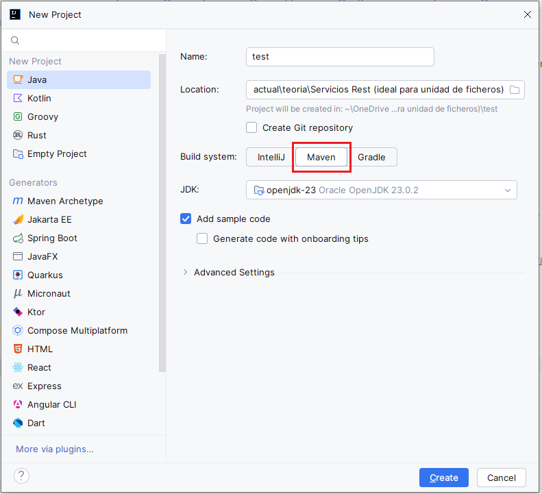

**¿Cómo añadir una dependencia?**

Esto se hace editando el fichero **pom.xml** y añadiendo en la sección `<dependencies>` las nuevas dependencias (`<dependency>`):


```xml
<dependencies>
    <dependency>
        <groupId>com.google.code.gson</groupId>
        <artifactId>gson</artifactId>
        <version>2.10.1</version>
    </dependency>
</dependencies>
```

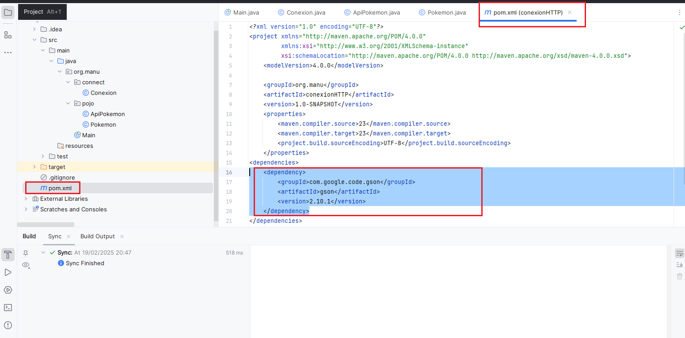

Pulsamos en "actualizar" y se conecta al repositorio de **Maven** y descarga esta dependencia.

### 5.2 Implementación con Gson

Con este método podemos recoger los datos. Aquí está el código y en los comentarios el funcionamiento:


```java
package org.manu.pojo;

import com.google.gson.Gson;
import com.google.gson.JsonArray;
import com.google.gson.JsonObject;
import java.io.BufferedReader;
import java.io.IOException;
import java.io.InputStreamReader;
import java.net.HttpURLConnection;
import java.net.URISyntaxException;
import java.util.ArrayList;
import static org.manu.connect.Conexion.getConexion;

public class ApiPokemon {

    private static final Gson gson = new Gson();
    
    public static String getPokemonData(String url) throws IOException, URISyntaxException {
        HttpURLConnection conn = getConexion(url);
        BufferedReader br = new BufferedReader(new InputStreamReader(conn.getInputStream()));
        StringBuilder response = new StringBuilder();
        String line;
        while ((line = br.readLine()) != null) {
            response.append(line);
        }
        br.close();
        conn.disconnect();
        return response.toString();
    }

    public static ArrayList<Pokemon> recogePokemons(String url) throws IOException, URISyntaxException {
        ArrayList<Pokemon> pokemonArrayList = new ArrayList<Pokemon>();
        try {
            // Invocamos el método para obtener tanto la conexión como el String que contiene el JSON con los Pokemons
            String jsonResponse = getPokemonData(url);

            // Transformamos este String en un objeto de tipo JsonObject, de tal manera que luego lo podamos manipular
            JsonObject jsonObject = gson.fromJson(jsonResponse, JsonObject.class);
            // Del Objeto jsonObject nos interesa el apartado results, por lo que lo cogemos
            JsonArray results = jsonObject.getAsJsonArray("results");
            
            // Iteramos por cada uno de los elementos de results y construimos un objeto Pokemon
            for (var element : results) {
                JsonObject obj = element.getAsJsonObject();
                // Método que me permite hacer uso de la serialización de objetos
                pokemonArrayList.add(gson.fromJson(obj, Pokemon.class));
            }
        } catch (Exception e) {
            e.printStackTrace();
        }
        return pokemonArrayList;
    }
}
```


### 5.3 Clase Pokemon


```java
package org.manu.pojo;

public class Pokemon {
    private String name;
    private String url;

    public Pokemon(String name, String url) {
        this.name = name;
        this.url = url;
    }

    public String getName() {
        return name;
    }

    public void setName(String name) {
        this.name = name;
    }

    public String getUrl() {
        return url;
    }

    public void setUrl(String url) {
        this.url = url;
    }

    @Override
    public String toString() {
        return "Pokemon{" +
                "name='" + name + '\'' +
                ", url='" + url + '\'' +
                '}';
    }
}
```


### 5.4 Programa principal completo


```java
package org.manu;

import org.manu.pojo.ApiPokemon;
import org.manu.pojo.Pokemon;
import java.io.IOException;
import java.net.URISyntaxException;
import java.util.ArrayList;

public class Main {
    private static final String BASE_URL = "https://pokeapi.co/api/v2/pokemon/";

    public static void main(String[] args) throws IOException, URISyntaxException {
        String info = ApiPokemon.getPokemonData(BASE_URL);
        System.out.println(info);

        ArrayList<Pokemon> misPokemon = ApiPokemon.recogePokemons(BASE_URL);
        misPokemon.forEach(System.out::println);
    }
}
```


### 5.5 Estructura del proyecto

Dejo aquí el resultado final de la explicación. Parto de la siguiente organización en paquetes:


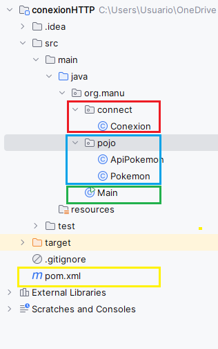

En la imagen he dejado el paquete **connect** que contiene la clase **Conexion** la cual implementará el GET para obtener los datos.

En el paquete **pojo**, implemento la recogida de datos y obtención del ArrayList de los Pokemon, en la clase **ApiPokemon**. Además, en este paquete se encuentran las clases necesarias, para este ejemplo **Pokemon**.

Recuerda que debemos añadir la dependencia en **Maven**, esto lo haremos en el **pom.xml**.

## 6. API de Marvel

Para aprender un poco el manejo de las mismas, vamos a hacer uso del API de Marvel. Para ello nos daremos de alta en la misma.

https://developer.marvel.com/


Pulsamos en **GET STARTED**, colocamos nuestro correo:


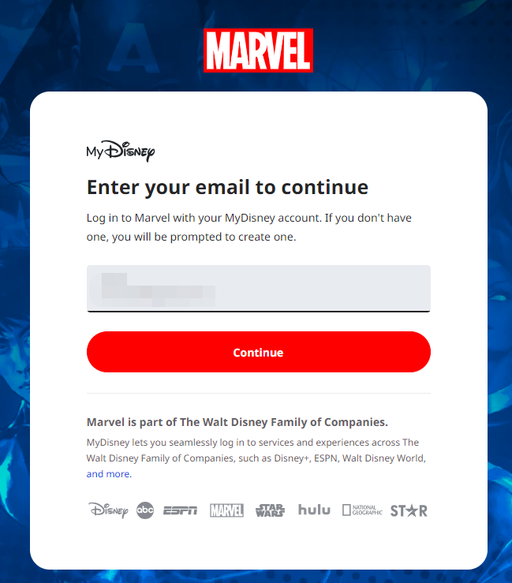


Indicamos el nombre, apellidos y contraseña:

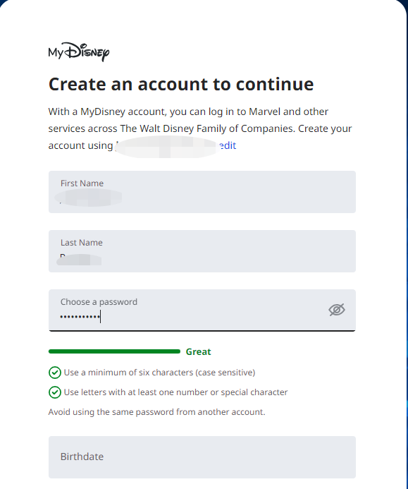

Y pulsamos en **Agree & Continue**:


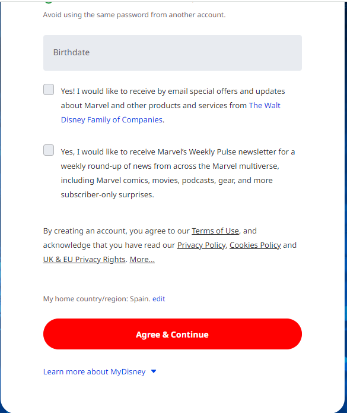

Deberás introducir la fecha de nacimiento en formato inglés. Aceptamos los términos y nos llevará a una página en la cual dispondremos de los datos de acceso al API. En esta dispondremos de un ID, una clave pública y otra privada.

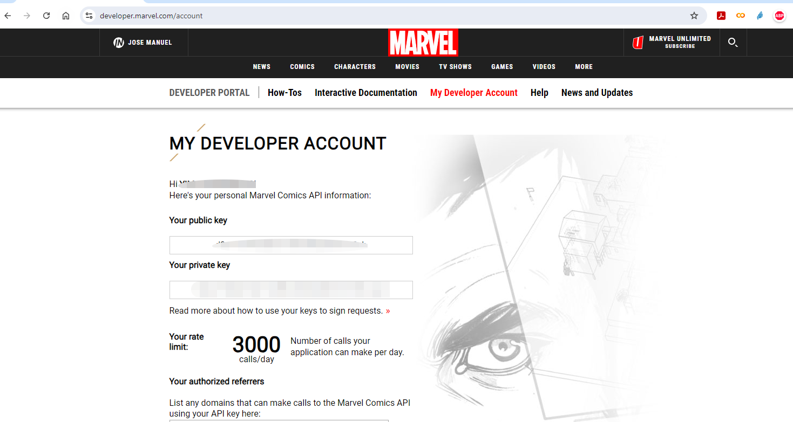

Como podemos observar, tan solo disponemos de 3000 llamadas diarias.

Si pulsamos en la opción de **Interactive Documentation** nos llevará al apartado en el cual podemos ver las llamadas GET que podemos realizar.


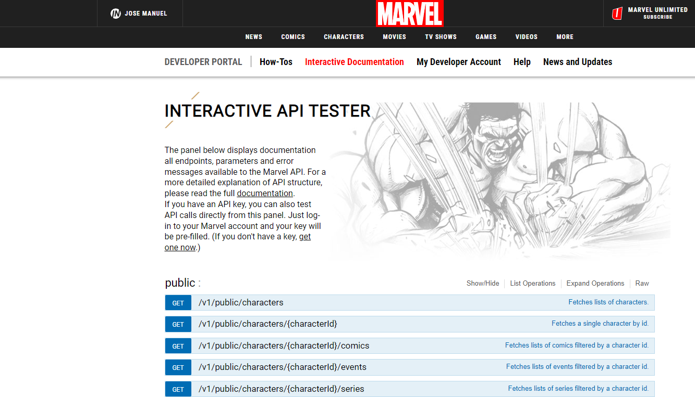

Si pulsamos dentro de la primera llamada, nos permitirá ver la información del servicio REST que nos permite obtener una lista de personajes de Marvel, cómo invocar el servicio y los resultados, así como errores que puede devolvernos. También lo podemos testear:


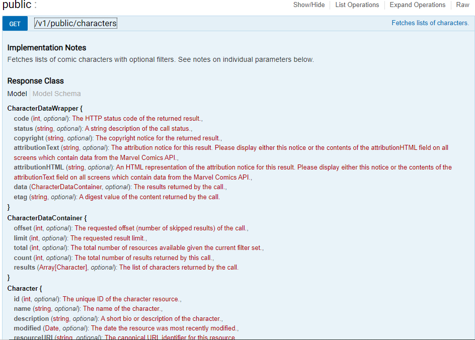

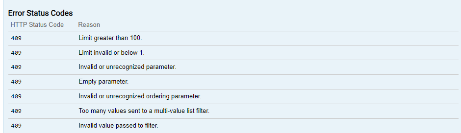


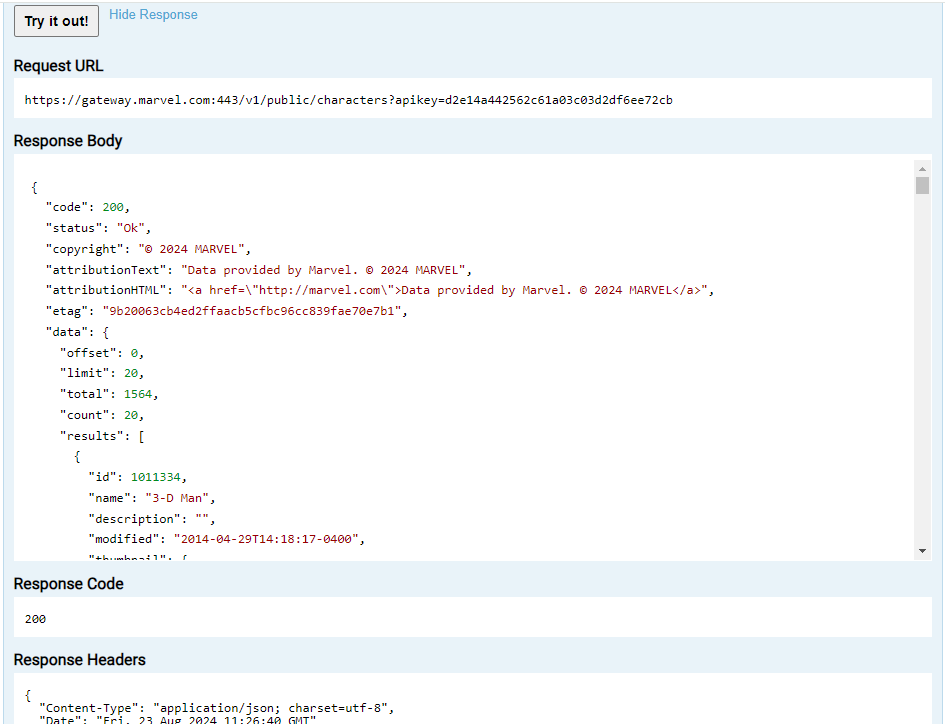

### 6.1 Implementación de la conexión con Marvel

Partimos de que has accedido al entorno de Marvel y te has creado una cuenta de desarrollador y, por lo tanto, dispones de unas credenciales para el uso de la API.

Deberemos crear en IntelliJ IDEA un proyecto de Java en el que se haga uso del gestor de dependencias Maven.

Una vez hecho esto, debemos añadir las dependencias de las que se hará uso. Esto lo haremos en el fichero `pom.xml`:


xml ```
<dependencies>
    <!-- Dependency for HttpClient (for Java 11 and above) -->
    <dependency>
        <groupId>org.apache.httpcomponents.client5</groupId>
        <artifactId>httpclient5</artifactId>
        <version>5.3</version>
    </dependency>

    <!-- Dependency for Gson -->
    <dependency>
        <groupId>com.google.code.gson</groupId>
        <artifactId>gson</artifactId>
        <version>2.8.9</version>
    </dependency>
</dependencies>
```


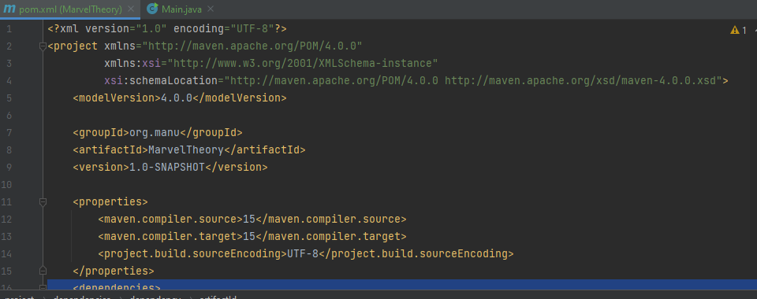

Maven nos detectará en este proyecto que nos faltan las dependencias. Le indicaremos que las descargue.

### 6.2 Código para consumir la API de Marvel

A continuación, introduciremos el código en el MAIN. Debemos tener en cuenta que para la conexión se necesita un hash para el cual se hace uso de un **timestamp**, así como de **nuestra clave privada** y **pública**.

Se utilizará la **clase MessageDigest** de **Java** para generar el hash.


``` java

import java.net.URI;
import java.net.http.HttpClient;
import java.net.http.HttpRequest;
import java.net.http.HttpResponse;
import java.security.MessageDigest;
import java.security.NoSuchAlgorithmException;
import java.math.BigInteger;
import com.google.gson.JsonObject;
import com.google.gson.JsonParser;

public class Main {

    private static final String PUBLIC_KEY = "tu clave publica";
    private static final String PRIVATE_KEY = "tu clave privada";
    private static final String BASE_URL = "https://gateway.marvel.com:443/v1/public/";

    public static void main(String[] args) throws Exception {
        // Nombre del personaje
        String name = "Abyss";
        // timestamp
        String timestamp = Long.toString(System.currentTimeMillis());
        // Generación del hash
        String hash = generaHash(timestamp, PRIVATE_KEY, PUBLIC_KEY);
        // URL de conexión
        String url = BASE_URL + "characters?name=" + name + "&ts=" + timestamp + "&apikey=" + PUBLIC_KEY + "&hash=" + hash;
        
        // Creación del cliente de conexión
        HttpClient client = HttpClient.newHttpClient();
        // Se lleva a cabo la conexión GET del API REST
        HttpRequest request = HttpRequest.newBuilder()
                .uri(URI.create(url))
                .build();
        // Se obtiene la respuesta
        HttpResponse<String> response = client.send(request, HttpResponse.BodyHandlers.ofString());
        
        // Se parsea la respuesta a String
        JsonObject jsonObject = JsonParser.parseString(response.body()).getAsJsonObject();
        
        // Se muestra por pantalla
        System.out.println(jsonObject.toString());
    }

    private static String generaHash(String timestamp, String privateKey, String publicKey) {
        try {
            String valor = timestamp + privateKey + publicKey;
            MessageDigest md = MessageDigest.getInstance("MD5");
            byte[] hashBytes = md.digest(valor.getBytes());
            BigInteger no = new BigInteger(1, hashBytes);
            StringBuilder hashText = new StringBuilder(no.toString(16));

            // Padding with leading zeros to make it 32 bits
            while (hashText.length() < 32) {
                hashText.insert(0, "0");
            }

            return hashText.toString();
        } catch (NoSuchAlgorithmException e) {
            throw new RuntimeException(e);
        }
    }
}
```


Una vez compilamos y ejecutamos, veremos que obtenemos por pantalla la información de este personaje:


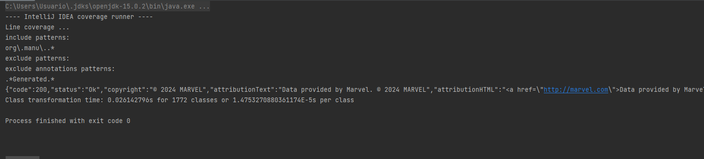

**Recuerda cambiar tus claves en el código.**