# Unidad 8. Acceso a BD Relacional desde Java

## 1. Introducción

JDBC es el interfaz común que Java proporciona para poder conectarnos a cualquier SGBD Relacional con dicho lenguaje de programación. Proporciona una API completa para trabajar con Bases de Datos Relacionales de forma que sea cual sea el motor con el que conectemos, la API siempre será la misma. Simplemente tendremos que *hacernos* con el Driver correspondiente al motor que queramos usar, que sí que dependerá totalmente de éste. A pesar de eso tampoco es mucho problema, ya que actualmente podemos encontrar un driver JDBC para prácticamente cualquier SGBDR existente.

Pero, ¿qué es una API? El término API es una abreviatura de **A**pplication **P**rogramming **I**nterface, que en español significa *interfaz de programación de aplicaciones*. Se trata de un conjunto de definiciones y protocolos que se utiliza para desarrollar e integrar el software de las aplicaciones, **permitiendo la comunicación entre dos aplicaciones** de software a través de un conjunto de reglas.

Así pues, podemos hablar de una API como una especificación formal que **establece cómo un módulo de un software se comunica o interactúa con otro** para cumplir una o muchas funciones. Todo dependiendo de las aplicaciones que las vayan a utilizar, y de los permisos que les dé el propietario de la API a los desarrolladores de terceros.

Con todo esto, deducimos que JDBC es una API que nos proporcionará un acceso a las bases de datos relacionales. El driver es lo único que depende exclusivamente del SGBD utilizado, siendo muy sencillo escribir aplicaciones cuyo código se pueda reutilizar si más adelante tenemos que cambiar de motor de Base de Datos o bien si queremos permitir que dicha aplicación pueda conectarse a más de un SGBD de forma que el usuario no tenga porque comprometerse a un SGBD concreto si la adquiere o quiere ponerla en marcha.

## 2. El desfase Objeto Relacional

Los objetos son elementos complejos sobre los que se fundamenta la Programación Orientada a Objetos (POO). El problema es que las Bases de Datos Relacionales (BDR) no son capaces de almacenar este tipo de elementos, ya que cada vez que los objetos deben almacenarse/extraerse en una BDR se requiere un mapeo desde las estructuras del modelo relacional a las del entorno de programación, por lo que el almacenamiento de objetos en las tablas relacionales se vuelve complejo.

Esto hace que se produzca un desfase entre la POO que realizamos y la información existente, en filas, en las bases de datos relacionales.

## 3. Protocolos de acceso a bases de datos

Existen dos normas de conexión a una BD SQL:

- **ODBC** (Open Data Base Connectivity). Define un API que pueden usar las aplicaciones para abrir una conexión con una BD, enviar consultas o actualizaciones.
- **JDBC** (Java Data Base Connectivity). Define un API que pueden usar los programas Java para conectarse a los servidores de BD relacionales.

Como existen muchos orígenes de datos que no son bases de datos propiamente dichas (ficheros planos, almacenes de correo electrónico, etc.), Microsoft proporciona OLE_DB, que es una API para datos que no son bases de datos.

También existe ADO, que es una API que ofrece una interfaz sencilla de utilizar por la funcionalidad OLE-DB.

### 3.1 Acceso a datos mediante ODBC

ODBC es un estándar de acceso a datos de Microsoft para posibilitar el acceso a datos desde cualquier aplicación con independencia del gestor de BD.

Cada SGBD compatible con ODBC debe proporcionar una biblioteca que se debe enlazar con el programa cliente.

Cuando el programa cliente hace una llamada a la API ODBC, el código de la biblioteca se comunica con el servidor para realizar la acción solicitada y obtener los resultados.

**Pasos para usar ODBC**

1. Configurar la interfaz ODBC, asignando un entorno SQL con la función `SQLAllocHandle()` y un manejador para la conexión a la BD en el entorno anterior. Así, el manejador traducirá las consultas de datos de la aplicación en comandos que el SGBD entienda. ODBC define los siguientes manejadores:
   - `SQLHENV`: Define el entorno de acceso a datos.
   - `SQLHDBC`: Identifica el estado y configuración de la conexión.
   - `SQLHSTMT`: Declaración SQL y conjunto de resultados asociados.
   - `SQLHDESC`: Recolección de metadatos usados para describir sentencias SQL.
2. Una vez reservados los manejadores, el programa abre la conexión a la BD usando `SQLDriverConnect()` o `SQLConnect()`.
3. Una vez realizada la conexión, el programa puede enviar órdenes SQL a la BD utilizando `SQLExecDirect()`.
4. Al finalizar la sesión, el programa se desconecta de la BD y libera la conexión y los manejadores del entorno SQL.

La API ODBC tiene una interfaz escrita en C y no es apropiada para su uso directo desde Java; existen inconvenientes de seguridad, implementación, robustez y portabilidad de las aplicaciones.

### 3.2 Acceso a datos mediante JDBC

JDBC proporciona una librería estándar para acceder a fuentes de datos principalmente orientados a BDR que usan SQL. Dispone de una interfaz distinta para cada BD, que es lo que se denomina driver o conector, que permite que las llamadas a los métodos Java de las clases JDBC se correspondan con el API de la BD.

JDBC consta de un conjunto de clases e interfaces que nos permiten escribir aplicaciones Java para gestionar las siguientes tareas con una BDR:

- Conectarse a la BD.
- Enviar consultas e instrucciones de actualización a la BD.
- Recuperar y procesar los resultados recibidos de la BD en respuesta a las consultas.

## 4. Arquitecturas JDBC

La API JDBC es compatible con los modelos de dos y tres capas para el acceso a BD (también lo podemos encontrar con la denominación de dos y tres niveles):

- **Modelo de 2 capas (Arquitectura de dos niveles)**: Esta arquitectura ayuda al programa o aplicación Java a comunicarse directamente con la base de datos. Necesita un controlador JDBC para comunicarse con una base de datos específica. El usuario envía una consulta o solicitud a la base de datos y el usuario recibe los resultados. La base de datos puede estar presente en la misma máquina o en cualquier máquina remota conectada a través de una red. Este enfoque se llama arquitectura o configuración cliente-servidor.

- **Modelo de 3 capas (Arquitectura de tres niveles)**: En esto, no hay comunicación directa. Las solicitudes se envían al nivel medio, es decir, el navegador HTML envía una solicitud a la aplicación Java que luego se envía a la base de datos. La base de datos procesa la solicitud y envía el resultado de vuelta al nivel medio que luego se comunica con el usuario. Aumenta el rendimiento y simplifica la implementación de la aplicación.

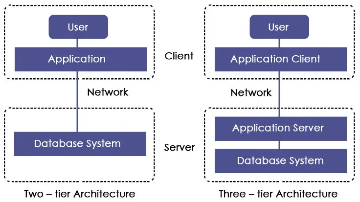

### 4.1 Componentes de la arquitectura JDBC

- **Driver Manager**: es una clase que contiene una lista de todos los controladores. Cuando se recibe una solicitud de conexión, coincide con la solicitud con el controlador de base de datos apropiado utilizando un protocolo llamado subprotocolo de comunicación. El controlador que coincide se utiliza para establecer una conexión.
- **Controlador**: es una interfaz que controla la comunicación con el servidor de la base de datos. Los objetos DriverManager se utilizan para realizar la comunicación.
- **Conexión**: es una interfaz que contiene métodos para contactar una base de datos.
- **Declaración**: esta interfaz crea un objeto para enviar consultas o declaraciones SQL a la base de datos.
- **ResultSet**: contiene los resultados recuperados después de la ejecución de las declaraciones o consultas SQL.
- **SQLException**: esta clase maneja cualquier error que ocurra en la aplicación de la base de datos.

### 4.2 Cómo funciona JDBC

JDBC define varias interfaces que permiten realizar operaciones con BD. A partir de ellas se derivan las clases correspondientes, definidas en el paquete **java.sql**.

JDBC define ocho interfaces para operaciones con bases de datos, de las que se derivan las clases correspondientes. La figura siguiente, con nomenclatura UML, muestra la interrelación entre estas clases según el modelo de objetos de la especificación de JDBC.

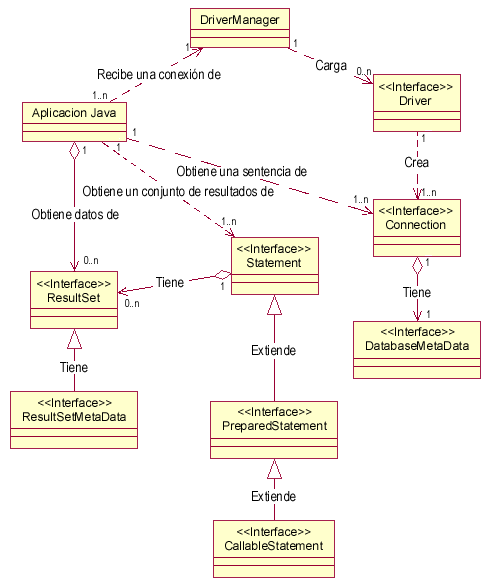

La clase que se encarga de cargar inicialmente todos los drivers JDBC disponibles es `DriverManager`. Una aplicación puede utilizar `DriverManager` para obtener un objeto de tipo conexión, `Connection`, con una base de datos. La conexión se especifica siguiendo una sintaxis basada en la especificación más amplia de los URL, de la forma:
jdbc:subprotocolo//servidor:puerto/base de datos

Por ejemplo, si se utiliza mSQL, el nombre del subprotocolo será `msql`. En algunas ocasiones es necesario identificar aún más el protocolo. Por ejemplo, si se usa el puente JDBC-ODBC no es suficiente con `jdbc:odbc`, ya que pueden existir múltiples drivers ODBC, y en este caso, hay que especificar aún más, mediante `jdbc:odbc:fuente de datos`.

Una vez que se tiene un objeto de tipo `Connection`, se pueden crear sentencias, `Statement`, ejecutables. Cada una de estas sentencias puede devolver cero o más resultados, que se devuelven como objetos de tipo `ResultSet`.

La tabla siguiente muestra la misma lista de clases e interfaces junto con una breve descripción:

| Clase/Interface        | Descripción                                                  |
| ---------------------- | ------------------------------------------------------------ |
| **Driver**             | Permite conectarse a una base de datos: cada gestor de base de datos requiere un driver distinto. |
| **DriverManager**      | Permite gestionar todos los drivers instalados en el sistema. |
| **DriverPropertyInfo** | Proporciona diversa información acerca de un driver.         |
| **Connection**         | Representa una conexión con una base de datos. Una aplicación puede tener más de una conexión a más de una base de datos. |
| **DatabaseMetadata**   | Proporciona información acerca de una Base de Datos, como las tablas que contiene, etc. |
| **Statement**          | Permite ejecutar sentencias SQL sin parámetros.              |
| **PreparedStatement**  | Permite ejecutar sentencias SQL con parámetros de entrada.   |
| **CallableStatement**  | Permite ejecutar sentencias SQL con parámetros de entrada y salida, típicamente procedimientos almacenados. |
| **ResultSet**          | Contiene las filas o registros obtenidos al ejecutar un SELECT. |
| **ResultSetMetadata**  | Permite obtener información sobre un **ResultSet**, como el número de columnas, sus nombres, etc. |

### 4.3 Ejemplo práctico con MySQL

Vamos a crear un ejemplo desde MySQL, de forma que crearemos una base de datos con los siguientes datos (proporcionamos el esquema para que podáis realizar la práctica, pero tendréis que crear el usuario y darle la contraseña y los privilegios adecuados):

- Nombre Base de Datos: `gestionalumnos`
- Nombre usuario: `profesor`
- Contraseña: `12345678`

Como hemos indicado antes, el usuario ha de tener todos los privilegios necesarios para trabajar correctamente con la base de datos (solo con dicha base de datos). Dicho usuario lo crearemos una vez creada la base de datos, que tendrá el siguiente esquema:

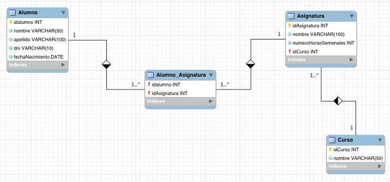

Tras tener la base de datos creada, la poblaremos lanzando el siguiente conjunto de sentencias de inserción. Las encontraremos en el fichero `datos.sql`.

Una vez que ya tenemos la base de datos creada, vamos a poner en marcha un ejemplo que nos permita ilustrar los pasos de funcionamiento de JDBC:

```java
import java.sql.*;

public class Main {
    public static void main(String[] args) {

        try (
              // Establecemos la conexion con la BD
              Connection conexión = DriverManager.getConnection(
                      "jdbc:mysql://localhost/gestionalumnos", "profesor", "12345678");
              // Preparamos la sentencia a ejecutar
              Statement sentencia = conexión.createStatement();
              // Ejecutamos la consulta SQL
              ResultSet result = sentencia.executeQuery("SELECT * FROM alumno")
        )
        {
            // Recorremos el resultado para visualizar cada fila
            while (result.next()){
                System.out.println(result.getInt(1) + " - " +
                        result.getString(2) + " - " + result.getString(3));
            }
        } catch (SQLException e) {
            throw new RuntimeException(e);
        }
    }
}
```


### 4.4 Configuración de Maven para MySQL

Para poder probar el programa anterior deberemos añadir la dependencia en Maven. Esto lo realizaremos de igual forma que hicimos con el proyecto del ejercicio anterior. No obstante, volvemos a ver esta información.

Lo primero que debo tener en cuenta es cuál es la versión de mi SGBD. En mi caso, en mi equipo en local he instalado un MySQL Server Community 8.4. No obstante, no es un requisito necesario para el driver, como veremos más hacia delante. Consulto en https://mvnrepository.com/ en el apartado de JDBC:


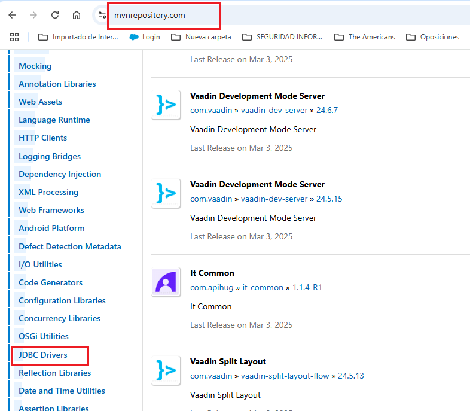

Pulso en **JDBC Drivers** y busco el de MySQL. No me quedo con el primero. No hay actualizaciones de este desde 2023, pero además, si accedo, puedo ver que las dependencias contienen vulnerabilidades.

Voy al siguiente:


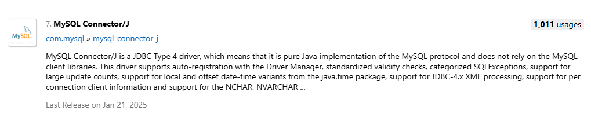

Pulso para ver las revisiones:


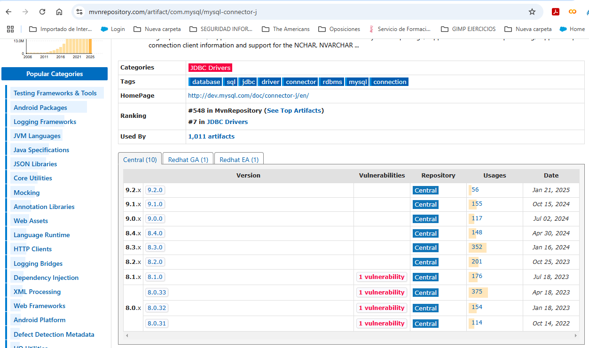

En mi caso la versión es una 8.4. Podéis observar que existen vulnerabilidades desde la **8.1.x** hacia abajo. Cuando accedo dentro de la misma, encuentro vulnerabilidades. Debería seleccionar esta dependencia y llevarla al fichero `pom.xml` de mi proyecto.

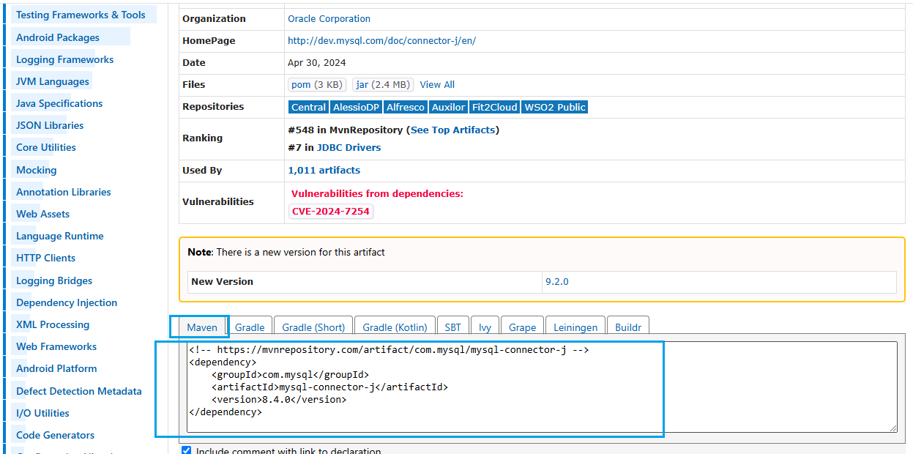

Detecto que esto me va a continuar suponiendo un problema. Hay una vulnerabilidad. Opto por la última versión que no la tiene. La **9.2.x**:

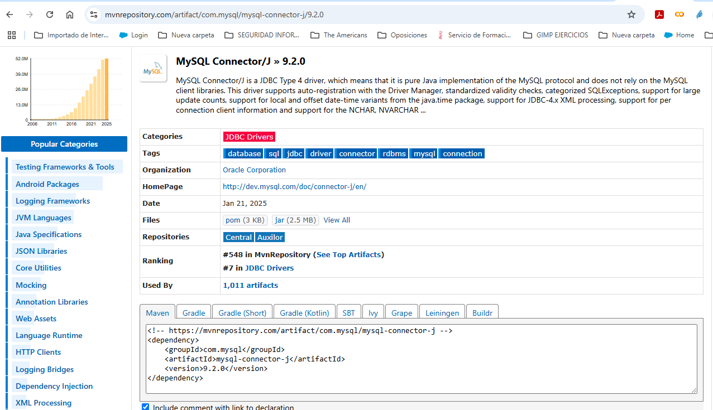

**¿Cómo lo podemos configurar con IntelliJ?**

Como anteriormente. Recuerda que debes generar un proyecto y elegir Maven como gestor de dependencias.

Una vez hecho esto, añade esta dependencia en el fichero **pom.xml**. En mi caso así:


```xml
<!-- https://mvnrepository.com/artifact/com.mysql/mysql-connector-j -->
<dependency>
    <groupId>com.mysql</groupId>
    <artifactId>mysql-connector-j</artifactId>
    <version>9.2.0</version>
</dependency>
```


y nos quedará así:

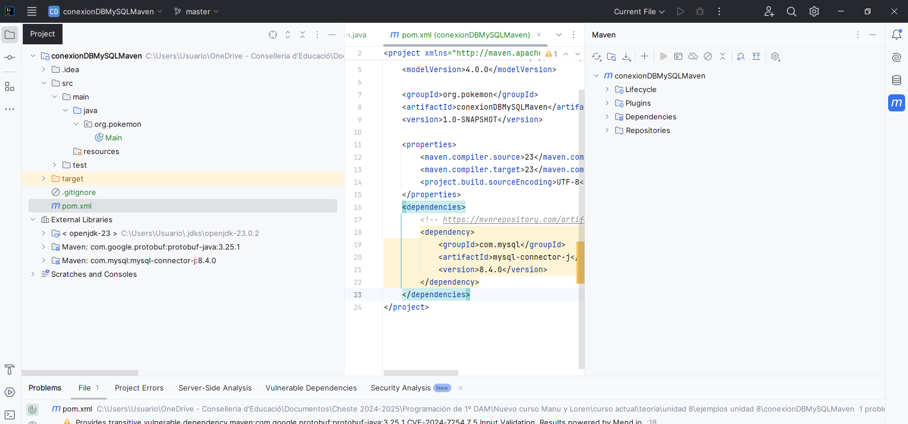

Desde el menú de la parte derecha podemos añadir nuevos repositorios de Maven (cuidado con los que no son oficiales) y recargar las dependencias.

Veremos que nos ha cargado la dependencia necesaria:

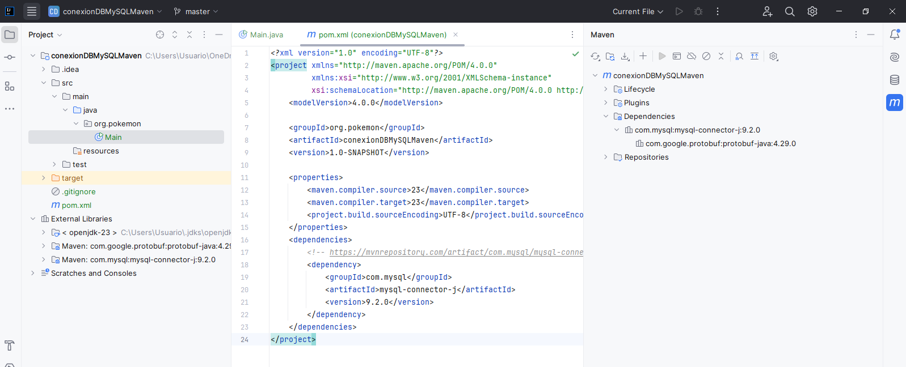

De este modo ya podemos ir al directorio `java` de `src` y crear la clase principal o como le queráis llamar:


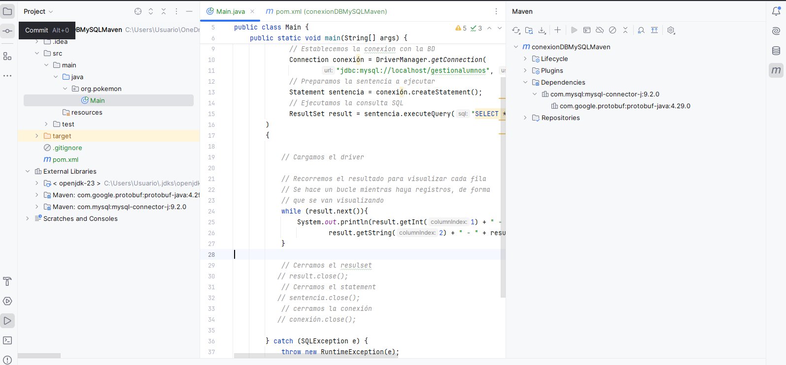

El código fuente a utilizar en este ejemplo es el siguiente (cuidado, recordad cambiar el nombre de la clase y el usuario y contraseña de conexión a la BD de MySQL):


```java
import java.sql.*;

public class Main {
    public static void main(String[] args) {

        try (
              // Establecemos la conexion con la BD
              Connection conexión = DriverManager.getConnection(
                      "jdbc:mysql://localhost/gestionalumnos", "profesor", "12345678");
              // Preparamos la sentencia a ejecutar
              Statement sentencia = conexión.createStatement();
              // Ejecutamos la consulta SQL
              ResultSet result = sentencia.executeQuery("SELECT * FROM alumno")
        )
        {
            // Recorremos el resultado para visualizar cada fila
            while (result.next()){
                System.out.println(result.getInt(1) + " - " +
                        result.getString(2) + " - " + result.getString(3));
            }
        } catch (SQLException e) {
            throw new RuntimeException(e);
        }
    }
}
```


Si lo ejecutamos obtendremos la siguiente información:


``` text
1 - Pedro - Inostroza
2 - Juan - Marchant
3 - Pamela - Aguirre
4 - Mónica - Villanueva
5 - Ignacio - Madariaga
6 - Camilo - Zuñiga
7 - Alejandro - Zurita
8 - Fernando - Condeza
9 - Andrés - Poblete
10 - Yilun - Hernández
11 - Andrés - Pasten
12 - Andrés - Mella
13 - Alejandro - Bustos
14 - Andrea - Muñoz
15 - Ignacio - Rojas
```


### 4.5 Secuencia del programa

**Cargar el driver (No es necesario)**

En teoría esto **no es necesario**, ya que `DriverManager` se encarga de leer todos los drivers JDBC compatibles, pero no siempre ocurre así, por lo que es mejor asegurarse.

El método `forName()` localiza, lee y enlaza dinámicamente una clase determinada.

En el ejemplo, como se accede a una base de datos MySQL, necesitamos cargar el driver `com.mysql.cj.jdbc.Driver`:


```java
Class.forName("com.mysql.cj.jdbc.Driver");
```


**Establecer la conexión**

A continuación, se solicita a `DriverManager` que proporcione una conexión para una fuente de datos JDBC, que en este caso se conecta con una base de datos MySQL. Para ello se utiliza el método `getConnection()`:


```java
String url = "jdbc:mysql://localhost/gestionalumnos";
String user = "profesor";
String passwd = "12345678";
Connection conn = DriverManager.getConnection(url, user, passwd);
```


El primer parámetro del método `getConnection()` representa la URL de conexión a la base de datos, de modo que:

- `jdbc:mysql` indica que estamos utilizando un driver JDBC para MySQL.
- `localhost` indica que el servidor de base de datos está en la misma máquina en la que se ejecuta el programa. Aquí es posible poner una IP o un nombre de una máquina.
- `gestionalumnos` es el nombre de la base de datos a la que nos vamos a conectar y que debe existir en MySQL.

El segundo y tercer parámetro son el nombre del **usuario** y la **clave** con la cual se intentará la conexión.

**Crear Statement**

Antes de ejecutar sentencias SQL deberemos crear un objeto de tipo `Statement`, el cual se encargará de enviar las sentencias SQL al servidor de BD:


```java
Statement sentencia = conn.createStatement();
```


**Ejecutar sentencias SQL**

A continuación, se solicita que proporcione un objeto de tipo `Statement` para poder ejecutar sentencias a través de esa conexión. Para ello se dispone de los métodos:

- `execute(String sentencia)` para ejecutar una petición SQL que no devuelve datos
- `executeQuery(String sentencia)` para ejecutar una consulta SQL. Este último método devuelve un objeto de tipo `ResultSet`.

En nuestro caso vamos a ejecutar la consulta `"SELECT * FROM gestionalumnos.alumno"`, donde obtendremos todos los datos de los alumnos:


```java
ResultSet result = sentencia.executeQuery("SELECT * FROM alumno");
```


El resultado nos lo devuelve como un `ResultSet`, que es un objeto similar a una lista en la que está el resultado de la consulta. Cada elemento de la lista es uno de los registros de la tabla ALUMNO. `ResultSet` no contiene todos los datos, sino que los va consiguiendo de la base de datos según se van pidiendo.

`ResultSet` tiene internamente un puntero que apunta al primer registro de la lista. Mediante el método `next()` el puntero avanza al siguiente registro. Para recorrer la lista de registros usaremos dicho método dentro de un bucle `while` que se ejecutará mientras `next()` devuelva `true` (es decir, mientras haya registros):


```java
while (result.next()) {
    System.out.println(result.getInt(1) + " - " +
            result.getString(2) + " - " + result.getString(3));
}
```


El acceso se puede hacer por el nombre de la columna o mediante su ubicación relativa (un ejemplo sería `resultado.getString(1)`). Además de `getString()`, están disponibles `getBoolean()`, `getByte()`, `getDouble()`, `getFloat()`, `getInt()`, `getLong()`, `getObject()`, `getShort()`, `getDate()`, `getTime()`, cada uno de los cuales devuelve la columna en el formato correspondiente, si es posible.


```java
while(result.next()) {
    String nombre = resultado.getString("NOMBRE");
    String apellido = resultado.getString("APELLIDO");
    String dni = resultado.getString("DNI");
    System.out.println("Nombre: " + nombre + " " + apellido + " – DNI: " + dni);
}
```


También es posible ejecutar sentencias de inserción, actualización o borrado. Por ejemplo:


```java
sentencia.execute("DELETE FROM alumno WHERE idAlumno=1");
```


**Liberar recursos**

Después de haber trabajado con una sentencia o una conexión, es recomendable cerrarla mediante `sentencia.close()` o `conexion.close()`.

El orden debería ser el siguiente:


```java
result.close();
sentencia.close();
conn.close();
```


Si te fijas, **no ha sido necesario cerrarlos** en el ejemplo porque cuando he creado los recursos lo he hecho dentro de un **try-with-resources**.

Si realizamos operaciones de tipo inserción, actualización o borrado, de forma predeterminada los drivers JDBC deben hacer un **COMMIT** de cada sentencia. Este comportamiento se puede modificar mediante el método `Connection.setAutoCommit(boolean nuevovalor)`. En el caso de que se establezca `AutoCommit` a `false`, será necesario llamar de forma explícita a `Connection.commit()` para guardar los cambios realizados o `Connection.rollback()` para deshacerlos.

## 5. Ejecución de consultas de descripción de datos

Cuando desarrollamos una aplicación JDBC conocemos la estructura de las tablas, los datos que estamos manejando y las relaciones que hay. Si desconocemos la estructura de la BD, puede obtenerse a través de los meta objetos.

El objeto **DatabaseMetaData** proporciona información sobre la BD a partir de los métodos de los cuales es posible obtener gran cantidad de información. El siguiente ejemplo conecta con la base de datos MySQL de nombre `gestionalumnos` y muestra información sobre el producto de base de datos, el driver, la URL para acceder a la base de datos, el nombre de usuario y las tablas y vistas del esquema actual (o de todos los esquemas dependiendo del sistema gestor de bases de datos). Un esquema se corresponde generalmente con un usuario de la base de datos; el método **getMetaData()** de la clase `Connection` devuelve un objeto `DataBaseMetaData` con el que se obtendrá la información sobre la base de datos:


```java
import com.mysql.cj.jdbc.DatabaseMetaData;
import java.sql.Connection;
import java.sql.DriverManager;
import java.sql.ResultSet;
import java.sql.SQLException;

public class Main {
    public static void main(String[] args) {
        try (Connection conexion = DriverManager.getConnection("jdbc:mysql://localhost/gestionalumnos",
                "profesor", "12345678"))
        {
            DatabaseMetaData dbmd = (DatabaseMetaData) conexion.getMetaData();

            String nombre = dbmd.getDatabaseProductName();
            String driver = dbmd.getDriverName();
            String url = dbmd.getURL();
            String usuario = dbmd.getUserName();
            System.out.println("INFORMACIÓN SOBRE LA BASE DE DATOS:");
            System.out.println("===================================");
            System.out.println("Nombre : " + nombre);
            System.out.println("Driver : " + driver);
            System.out.println("URL : " + url);
            System.out.println("Usuario: " + usuario);

            // Obtener información de las tablas y vistas que hay
            ResultSet resul = dbmd.getTables(null, "gestionalumnos", null, null);
            while (resul.next()) {
                String catalogo = resul.getString(1);
                String esquema = resul.getString(2);
                String tabla = resul.getString(3);
                String tipo = resul.getString(4);
                System.out.println(tipo + " - Catalogo: " + catalogo +
                        ", Esquema : " + esquema + ", Nombre : " + tabla);
            }
        }
        catch (SQLException e) {
            e.printStackTrace();
        }
    }
}
```


Y al ejecutarlo obtendremos lo siguiente:


```text
INFORMACIÓN SOBRE LA BASE DE DATOS:
===================================
Nombre : MySQL
Driver : MySQL Connector/J
URL : jdbc:mysql://localhost/gestionalumnos
Usuario: profesor@localhost
TABLE - Catalogo: gestionalumnos, Esquema : null, Nombre : alumno
TABLE - Catalogo: gestionalumnos, Esquema : null, Nombre : alumno_asignatura
TABLE - Catalogo: gestionalumnos, Esquema : null, Nombre : asignatura
TABLE - Catalogo: gestionalumnos, Esquema : null, Nombre : curso
```


El método `getTables()` devuelve un objeto `ResultSet` que proporciona información sobre las tablas y vistas de la base de datos. Necesita 4 parámetros que en el ejemplo anterior tenían el valor `null`:

- catálogo de la base de datos. Al poner `null`, estamos preguntando por el catálogo actual, que en nuestro ejemplo es el de la cadena de conexión, `gestionalumnos`.
- Esquema de la base de datos. Al poner `null`, es el actual.
- Patrón para las tablas en las que tenemos interés. En SQL el carácter que indica "todo" es `%`, equivalente al `*` a la hora de listar ficheros. Esto nos dará todas las tablas del catálogo y esquema actual. Podríamos poner cosas como `"person%"`, con lo que obtendríamos todas las tablas cuyo nombre empiece por `person`.
- El cuarto parámetro es un array de `String`, en el que pondríamos qué tipos de tablas queremos (normales, vistas, etc). Al poner `null`, nos devolverá todos los tipos de tablas. Si quisiéramos que nos devolviera solo las tablas, pondríamos lo siguiente:


```java
String tipos[] = {"TABLE"};
result = dbmd.getTables(null,null,null,tipos);
```


**Obtención de columnas de una tabla**

Un posible siguiente paso sería, para cada tabla, obtener las columnas que la componen: su nombre y tipo. Para ello, podemos usar el método `getColumns()` de `DataBaseMetaData`:


```java
ResultSet rs = metaDatos.getColumns(catalogo, null, tabla, null);
```


Los parámetros de la llamada son:

- El nombre del catálogo al que pertenece la tabla.
- El nombre del esquema, `null` para el esquema actual.
- El nombre de la tabla. Nuevamente podríamos poner comodines al estilo SQL para obtener, por ejemplo, las columnas de todas las tablas `"person%"` que empiecen por `person`.
- El nombre de las columnas buscadas, usando comodines. `null` nos devuelve todas las columnas.

El contenido del `ResultSet` será una fila por cada columna de la tabla. Las columnas del `ResultSet` en nuestro caso serán: **COLUMN_NAME** (el nombre de la columna), **TYPE_NAME** (el tipo de datos de la columna), **COLUMN_SIZE** (el tamaño de la columna) y **IS_NULLABLE** (si permite almacenar valores nulos o no). También es posible acceder a dichos valores por posiciones.


```java
System.out.println("Columnas Tabla Alumno");
System.out.println("================================");

ResultSet columnas = dbmd.getColumns(null, "gestionalumnos", "alumno", null);
while(columnas.next()){
    String nombreCol = columnas.getString("COLUMN_NAME");
    String tipoCol = columnas.getString("TYPE_NAME");
    String tamCol = columnas.getString("COLUMN_SIZE");
    String nula = columnas.getString("IS_NULLABLE");
    System.out.println("Columna: " + nombreCol + " - Tipo: " + tipoCol +
            " - Tamaño: " + tamCol + " - ¿Nula?: " + nula);
}
```


La salida sería:


```text
Columnas Tabla Alumno
================================
Columna: id - Tipo: INT - Tamaño: 10 - ¿Nula?: NO
Columna: nombre - Tipo: VARCHAR - Tamaño: 50 - ¿Nula?: NO
Columna: apellidos - Tipo: VARCHAR - Tamaño: 100 - ¿Nula?: NO
Columna: edad - Tipo: INT - Tamaño: 10 - ¿Nula?: NO
```


## 6. Ejecución de consultas de Manipulación de Datos (DML)

Como ya hemos visto, es posible ejecutar consultas SQL mediante la interfaz `Statement`, la cual dispone de los métodos necesarios para ejecutar SQL y recuperar los resultados.

Al tratarse de una interfaz, no puede crear objetos directamente; estos se crean con el método `createStatement()` de un objeto `Connection` válido:


```java
Statement sentencia = conexión.createStatement();
```


Al crear un objeto `Statement` se crea un espacio de trabajo para crear consultas SQL, ejecutarlas y obtener sus resultados. Los métodos disponibles son:

- `executeQuery(String)`: Para sentencias SQL que recuperan datos (**SELECT**) de un único objeto `ResultSet`.
- `executeUpdate(String)`: Se utiliza con sentencias de manipulación de datos (**DML**): **INSERT**, **UPDATE**, **DELETE** y de definición de datos (**DDL**): **CREATE**, **DROP**, **ALTER**.
- `execute(String)`: Se utiliza para sentencias que devuelven más de un `ResultSet`, como por ejemplo la ejecución de procedimientos almacenados.

### 6.1 Ejemplo de inserción

El siguiente ejemplo insertará un alumno en la tabla ALUMNO, de forma que los datos los recogerá con un `showInputDialog`. Recogeremos el nombre, apellidos y edad:


```java
import java.sql.*;
import javax.swing.JOptionPane;

public class Main {
    public static void main(String[] args) {
        try ( Connection conexion =
                      DriverManager.getConnection("jdbc:mysql://localhost/gestionalumnos","profesor", "12345678"))
        {
            int id = Integer.parseInt(JOptionPane.showInputDialog("Introduce un ID"));
            String nombre = JOptionPane.showInputDialog("Escribe tu nombre");
            String apellidos = JOptionPane.showInputDialog("Escribe tus apellidos");
            int edad = Integer.parseInt(JOptionPane.showInputDialog("Escribe tu edad"));

            String sql = "INSERT INTO alumno(id, nombre,apellidos,edad) VALUES (" +"'" + id + "','" + nombre + "','" + apellidos + "'," + edad + ");";
            System.out.println(sql);
            Statement sentencia = conexion.createStatement();
            int filas = sentencia.executeUpdate(sql);
            System.out.println("Filas afectadas: " + filas);
            sentencia.close();
        }
        catch (SQLException e) {
            e.printStackTrace();
        }
    }
}
```


``` text
INSERT INTO alumno(id, nombre,apellidos,edad) VALUES ('16','Jose Manuel','Romero',46);
Filas afectadas: 1
```


Lo mismo podríamos hacer con las sentencias **UPDATE** o **DELETE**, además de poder crear vistas, tablas, etc.

## 7. Sentencias preparadas (PreparedStatement)

En los ejemplos anteriores hemos creado las sentencias SQL a partir de cadenas de caracteres en las que íbamos concatenando los datos necesarios para construir la sentencia completa. La interfaz `PreparedStatement` nos va a permitir construir una cadena de caracteres SQL con placeholder (marcadores de posición) que representa los datos que serán asignados más tarde. El **placeholder** se representa con el símbolo **?**. Por ejemplo, la orden INSERT del ejemplo anterior se representaría así:


```java
String sql = "INSERT INTO alumno(id, nombre, apellidos, edad) VALUES (?, ?, ?, ?);";
```


Cada placeholder tiene un índice, de forma que el 1 corresponde al primero que se encuentre en la cadena, el 2 al segundo y así sucesivamente.

Antes de ejecutar un `PreparedStatement` es necesario asignar los datos para que cuando se ejecute la BD asigne variables de unión con estos datos y ejecute la orden SQL.

Los objetos `PreparedStatement` se pueden precompilar una sola vez y ejecutarse las veces que queramos, asignando diferentes valores a los marcadores de posición. Por el contrario, en los objetos `Statement` la sentencia SQL se suministra en el momento de ejecutar la sentencia.

Los métodos de `PreparedStatement` tienen los mismos nombres (`executeQuery()`, `executeUpdate()` y `execute()`) que en `Statement`, pero no se necesita enviar la cadena de caracteres con la orden SQL en la llamada, ya que lo hace el método `prepareStatement(String)`:


```java
PreparedStatement sentencia = conexion.prepareStatement(sql);
```


Se utilizan los métodos `setInt(índice, entero)`, `setString(índice, cadena)` y `setFloat(índice, float)` para asignar los valores a cada uno de los marcadores de posición.

### 7.1 Ejemplo de inserción con PreparedStatement

En el ejemplo anterior en el que se inserta una fila en la tabla ALUMNO quedaría así:


```java
import java.sql.*;
import javax.swing.JOptionPane;

public class Main {
    public static void main(String[] args) {
        try ( Connection conexion =
                      DriverManager.getConnection("jdbc:mysql://localhost/gestionalumnos","profesor", "12345678"))
        {
            int id = Integer.parseInt(JOptionPane.showInputDialog("Introduce un ID"));
            String nombre = JOptionPane.showInputDialog("Escribe tu nombre");
            String apellidos = JOptionPane.showInputDialog("Escribe tus apellidos");
            int edad = Integer.parseInt(JOptionPane.showInputDialog("Escribe tu edad"));

            String sql = "INSERT INTO alumno(id, nombre, apellidos, edad) VALUES (?, ?, ?, ?);";
            PreparedStatement sentencia = conexion.prepareStatement(sql);
            sentencia.setInt(1, id);
            sentencia.setString(2, nombre);
            sentencia.setString(3, apellidos);
            sentencia.setInt(4, edad);
            int filas = sentencia.executeUpdate();
            System.out.println("Filas afectadas: " + filas);
        }
        catch (SQLException e) {
            e.printStackTrace();
        }
    }
}
```


También existen otros métodos como `setInt(índice, entero)`, `setFloat(índice, float)`, `setBoolean(índice, booleano)`, etc.

### 7.2 Ejemplo de consulta con PreparedStatement

Además de esto, se puede utilizar esta interfaz con la orden SELECT. El siguiente ejemplo muestra el nombre y apellido de un alumno a partir de un ID concreto que es pasado por los parámetros:


```java
import java.sql.*;
import javax.swing.JOptionPane;

public class Main {
    public static void main(String[] args) {
        try ( Connection conexion =
                      DriverManager.getConnection("jdbc:mysql://localhost/gestionalumnos","profesor", "12345678"))
        {
            int id = Integer.parseInt(JOptionPane.showInputDialog("Introduce un ID"));
            String nombre = JOptionPane.showInputDialog("Escribe tu nombre");
            String apellidos = JOptionPane.showInputDialog("Escribe tus apellidos");
            int edad = Integer.parseInt(JOptionPane.showInputDialog("Escribe tu edad"));

            String sql = "INSERT INTO alumno(id, nombre, apellidos, edad) VALUES (?, ?, ?, ?);";
            PreparedStatement sentencia = conexion.prepareStatement(sql);
            sentencia.setInt(1, id);
            sentencia.setString(2, nombre);
            sentencia.setString(3, apellidos);
            sentencia.setInt(4, edad);
            int filas = sentencia.executeUpdate();
            System.out.println("Filas afectadas: " + filas);

            // Consulta por nombre
            sql = "SELECT * FROM alumno WHERE nombre = ?;";
            sentencia = conexion.prepareStatement(sql);
            sentencia.setString(1, nombre);
            ResultSet resultado = sentencia.executeQuery();

            while(resultado.next()){
                System.out.println("Nombre: " + resultado.getString("nombre") +
                        " - Apellidos: " + resultado.getString("apellidos"));
            }
        }
        catch (SQLException e) {
            e.printStackTrace();
        }
    }
}
```


## 8. Gestionando las conexiones a la BD mediante el patrón Singleton

Conforme vayamos ejecutando el programa iremos creando conexiones sobre la BD. Es más, muchas veces vamos creando conexiones sobre el mismo programa, por lo que necesitamos un mecanismo para crear una única conexión y cerrarla tras la finalización de la aplicación.

Para no ir creando objetos de conexiones innecesarios, vamos a usar el patrón **Singleton** o patrón de instancia única, que es un patrón de diseño encargado de restringir la creación de objetos de una clase (o el valor de un tipo) a un único objeto. Genera una única instancia en la ejecución del programa y proporciona un acceso global a la misma.

La idea del patrón **Singleton** es crear en la clase un método que permite crear una instancia del objeto solo si todavía no existe ninguna. Para asegurar que la clase no puede ser instanciada nuevamente, se regula el alcance/visibilidad del constructor, cambiando el modificador de acceso a protegido o privado.


### 8.1 Implementación del Singleton para la conexión

Para ello, lo que vamos a hacer es lo siguiente:

1. Creamos un nuevo proyecto ***Maven*** denominado `AplicacionSingletonMySQL`. Realizamos todos los pasos del anterior proyecto.
2. Creamos una nueva clase denominada `ConexionBD.java`. Esta clase será la que nos proporcione la conexión a la BD.
3. Crearemos una variable estática de tipo `Connection` que almacenará nuestra conexión y la inicializaremos a `null`.


```java
private static Connection conn = null;
```


1. Copiamos las variables que nos sirven para configurar la conexión a la BD. Estas variables ya no irán en el `Main.java`, sino en esta clase `ConexionBD.java`:


```java
// Declaramos los datos de conexion a la bd
private static final String user = "profesor";
private static final String pass = "12345678";
private static final String url = "jdbc:mysql://localhost:3306/gestionalumnos";
```


1. Después de eso deberemos crear un constructor para nuestra nueva clase `ConexionBD.java`, pero ojo, lo crearemos privado, garantizando así que solo tendremos una única instancia para la conexión:


```java
private ConexionBD() {
    try {
        conn = DriverManager.getConnection(url, user, pass);
    } catch (SQLException e) {
        e.printStackTrace();
    }
}
```


1. ¿Y cómo construimos si es un constructor privado? Aquí está la gracia del asunto, ya que el constructor lo llama la propia clase a través de un método. Vamos a crear un método llamado `getConnection()` en el que indicaremos que, si nuestra propiedad `conn` es nula, vuelva a levantar el driver y crear una conexión llamando al constructor privado. Después retornaremos la conexión para trabajar con ella:


``` java
public static Connection getConnection() {
    if (conn == null) {
        new ConexionBD();
    }
    return conn;
}
```


1. Ahora nos falta definir un método para cerrar la conexión al acabar la aplicación:


``` java
public static void closeConnection() {
    try {
        if (conn != null) {
            conn.close();
        }
    } catch (SQLException e) {
        e.printStackTrace();
    }
}
```


1. Y una vez programada nuestra clase, podremos echar mano de esa conexión desde cualquier parte de nuestro programa llamándolo de esta forma. Para ello modificamos lo que hay en el `Main.java` para invocar a la conexión:


```java
public static void main(String[] args) {
    try {
        // Pedimos que nos devuelva directamente la instancia de la conexion
        if (ConexionBD.getConnection() != null) {
            System.out.println("Conexion establecida");
        }
    } catch (Exception e) {
        e.printStackTrace();
    } finally {
        ConexionBD.closeConnection();
    }
}
```


## 9. El patrón DAO (Data Access Object)

El patrón Data Access Object (DAO) pretende principalmente independizar la aplicación de la forma de acceder a la base de datos, o cualquier otro tipo de repositorio de datos. Para ello se centraliza el código relativo al acceso al repositorio de datos en las clases llamadas DAO. Fuera de las clases DAO no debe haber ningún tipo de código que acceda al repositorio de datos.

Con el permiso de los más puristas, un DAO no es otra cosa que un "adaptador" o un nexo entre la lógica de negocio, que actualmente se encuentra en el Main, y la capa de persistencia (generalmente, una Base de Datos). Lo que realiza este adaptador no es otra cosa que codificar la lógica de acceso a datos de una capa de persistencia en concreto.

¿Qué significa todo esto? Significa que por cada fuente de datos deberemos implementar un DAO específico para ella, dejando inmaculado el resto del código: cualquier cambio en la fuente de datos implicará la utilización de un DAO distinto, pero la lógica de negocio permanecerá indiferente ante tal cambio. El DAO es pues, una suerte de *traductor* entre el idioma que habla nuestra aplicación y el idioma que habla una fuente de datos específica (habrá un DAO para SQL Server, otro para MySQL, otro para ficheros, etc.)

La pregunta que surge ahora es la siguiente: ¿cómo realizamos esta traducción? Pues a través de una clase intermedia, que se encargará de "calcar" la estructura de una tabla de la fuente de datos y almacenará de forma temporal los datos de éste, al que llamaremos DTO o *Data Transfer Object*. Este DTO nos viene representado en nuestros POJO's.


 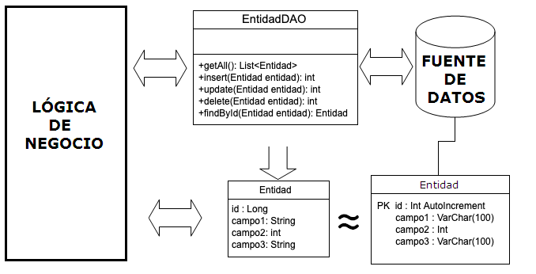

A partir de este momento, nuestra aplicación "entregará" la información que quiera compartir con la fuente de datos al DAO encapsulada en un POJO/DTO. El DAO entonces extraerá la información de esa cápsula y la codificará de forma que la fuente de datos la entienda (por ejemplo, escribiendo una sentencia `SELECT` e instanciando los objetos necesarios para comunicarse con la base de datos).

Como es lógico, al revés ocurrirá lo mismo: la fuente de datos entregará al DAO información. Éste se encargará de encapsularla de forma que nuestra lógica de negocio sea capaz de entenderla. De este modo, manteniendo una misma interfaz para los métodos del DAO (por ejemplo, un método `SELECT` que esperará siempre un objeto POJO/DTO), podremos cambiar la fuente de datos sabiendo que, si ésta cambia, únicamente será necesario modificar el "traductor" de la lógica de la aplicación a la de datos.

A riesgo de parecer repetitivo, los pasos que cumple un patrón DAO son los siguientes:

1. Nuestra aplicación encapsula la información en un POJO/DTO.
2. El DAO toma ese DTO, extrae la información y construye la lógica necesaria para comunicarse con la fuente de datos (sentencias SQL, manejo de archivos…). Este ejemplo es perfecto para una operación de INSERT, por ejemplo.
3. La fuente de datos recibe la información en el formato adecuado para tratarla.

En sentido contrario, ocurrirá lo mismo:

1. Nuestra aplicación le envía al DAO una solicitud de información.
2. El DAO realiza una petición de datos a la fuente de datos (BD).
3. La fuente de datos (BD) envía al DAO la información.
4. El DAO recopila esa información, la encapsula en el POJO/DTO (o en otro elemento que la aplicación entienda) y se la devuelve a nuestra lógica de negocio.

### 9.1 Implementando el patrón DAO en una aplicación

Vamos a llevar a cabo una implementación de DAO en una aplicación Java para entender cómo se hace.

La base de datos que vamos a usar es `ventas.sql`. Los pasos a seguir son:

1. Restaurar la base de datos `ventas.sql` sobre MySQL.


   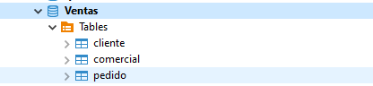

2. Desde **IntelliJ**, crear un proyecto **Maven** denominado `GestionVentas` donde añadiremos la dependencia de MySQL.

3. Crear 3 paquetes en el proyecto denominados `POJO`, `DAO` y `Main`, de forma que separaremos en varias capas la aplicación.

  
    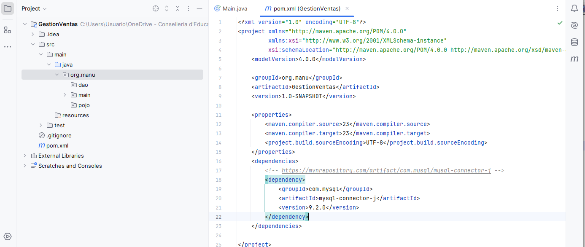
   

4. Tras ello, creamos una clase dentro del paquete `Main` que se denominará `Main.java`, que será nuestro programa principal.

5. Creamos una clase dentro del paquete `DAO` que se denominará `ConexionBD.java`, donde implementaremos el patrón singleton para la conexión a la base de datos. El código de la clase será el siguiente (recordar ajustar el usuario y la contraseña de MySQL):


``` java
package org.manu.dao;

import java.sql.Connection;
import java.sql.DriverManager;

public class ConexionBD {

    private final String USER = "profesor";
    private final String PASSWORD = "12345678";
    private final String URL = "jdbc:mysql://localhost:3306/Ventas";
    private static Connection conexion = null;

    // Cambiamos la visibilidad para controlar la construccion, tal como indica singleton
    private ConexionBD() {
        try {
            // Establecer la conexión con la BD
            conexion = DriverManager.getConnection(URL, USER, PASSWORD);
        } catch (Exception e) {
            e.printStackTrace();
        }
    }

    // Nuestro propio constructor que nos devuelve un objeto sql Connection
    public static Connection getConnection() {
        if (conexion == null) {
            new ConexionBD();
        }
        return conexion;
    }

    // Para cerrar la conexion al acabar
    public static void closeConnection() {
        try {
            conexion.close();
        } catch (Exception e) {
            e.printStackTrace();
        }
    }
}
```


1. Ya tenemos la conexión a la base de datos para poder interactuar con ella. A continuación vamos a mapear una de las tablas de la base de datos en un *POJO* o *entidad*, de forma que serán objetos de tipo *POJO* los que naveguen entre las distintas capas, tal y como indicaba la imagen de la arquitectura de la aplicación. En este caso creamos en el paquete `POJO` la clase `Cliente.java`. Siguiendo la estructura que vemos a continuación de la tabla en la BD, la clase quedará de la siguiente forma:

   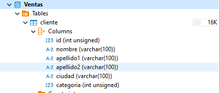


``` java
package org.manu.pojo;

public class Cliente {

    private Long id;
    private String nombre;
    private String apellido1;
    private String apellido2;
    private String ciudad;
    private int categoria;

    public Cliente() {
        super();
    }

    public Cliente(Long id, String nombre, String apellido1, String apellido2, String ciudad, int categoria) {
        super();
        this.id = id;
        this.nombre = nombre;
        this.apellido1 = apellido1;
        this.apellido2 = apellido2;
        this.ciudad = ciudad;
        this.categoria = categoria;
    }

    // Getters y Setters
    public Long getId() { return id; }
    public void setId(Long id) { this.id = id; }
    public String getNombre() { return nombre; }
    public void setNombre(String nombre) { this.nombre = nombre; }
    public String getApellido1() { return apellido1; }
    public void setApellido1(String apellido1) { this.apellido1 = apellido1; }
    public String getApellido2() { return apellido2; }
    public void setApellido2(String apellido2) { this.apellido2 = apellido2; }
    public String getCiudad() { return ciudad; }
    public void setCiudad(String ciudad) { this.ciudad = ciudad; }
    public int getCategoria() { return categoria; }
    public void setCategoria(int categoria) { this.categoria = categoria; }

    @Override
    public String toString() {
        return "Cliente{" + "id=" + id + ", nombre=" + nombre + ", apellido1=" + apellido1 + 
               ", apellido2=" + apellido2 + ", ciudad=" + ciudad + ", categoria=" + categoria + '}';
    }
}
```


1. Tras ello crearemos en el paquete `POJO` una interfaz denominada `IOperationsCRUD.java` que contendrá las cabeceras de los métodos que vamos a implementar en las clases DAO. La capa DAO implementará los métodos CRUD (Create, Read, Update, Delete) que atacarán a las tablas de la base de datos, por lo que definiremos una interfaz que contendrá los métodos a implementar. Cuando definamos esta interfaz añadiremos el uso de la clase genérica de Java mediante `<T>`, de forma que nos ahorramos realizar una conversión de tipos de clases y posibles errores de casting. Esta clase genérica nos permitirá añadir la clase con la que vamos a trabajar a la hora de implementar las operaciones. Quedará de la siguiente forma:


``` java
package org.manu.pojo;

import java.util.List;

public interface IOperationsCRUD<T> {
    public List<T> getAll();
    public T findById(T object);
    public int add(T object);
    public int update(T object);
    public int delete(T object);
}
```


1. Tras ello crearemos una clase que se encargará de implementar dicha interfaz. Esta clase se llamará `ClienteDAO.java`, y será la encargada de implementar cada método de la interfaz sobre la tabla cliente. A la hora de añadir que se implementa la interfaz, sustituiremos la clase genérica de Java, que venía indicada como `<T>`, por la clase `<Cliente>`, de forma que implementaremos dichas operaciones haciendo uso de esta clase (se listan clientes, se añade un cliente, se busca un cliente, etc.). Al poner la implementación quedará de la siguiente forma:


``` java
package org.manu.dao;

import org.manu.pojo.Cliente;
import org.manu.pojo.IOperationsCRUD;
import java.util.List;

public class ClienteDAO implements IOperationsCRUD<Cliente> {

    @Override
    public List<Cliente> getAll() {
        throw new UnsupportedOperationException("Not supported yet.");
    }

    @Override
    public Cliente findById(Cliente object) {
        throw new UnsupportedOperationException("Not supported yet.");
    }

    @Override
    public int add(Cliente object) {
        throw new UnsupportedOperationException("Not supported yet.");
    }

    @Override
    public int update(Cliente object) {
        throw new UnsupportedOperationException("Not supported yet.");
    }

    @Override
    public int delete(Cliente object) {
        throw new UnsupportedOperationException("Not supported yet.");
    }
}
```


1. El primer método que vamos a implementar es el `getAll()`, que nos devolverá una lista de clientes. Por ello necesitamos una conexión para poder ejecutar una consulta sobre la tabla cliente. Como tenemos una clase **singleton** denominada `ConexionBD.java` que nos devuelve la única conexión que hay creada en la aplicación, asegurándonos así que no se crean más conexiones, la definimos como un atributo de la clase, de forma que es compartida por todos los métodos. A partir de aquí implementamos el método `getAll()` quedando la clase de la siguiente forma:


``` java
package com.practicas.gestionventas.DAO;

import com.practicas.gestionventas.POJO.Cliente;
import java.sql.Connection;
import java.sql.ResultSet;
import java.sql.Statement;
import java.util.ArrayList;
import java.util.List;

public class ClienteDAO implements IOperationsCRUD<Cliente> {

    // Conexion compartida para todos los metodos
    private Connection conn = ConexionBD.getConnection();
    
    @Override
    public List<Cliente> getAll() {
        List<Cliente> lista = new ArrayList<Cliente>();
        try {
            Statement st = conn.createStatement();
            String sql = "SELECT * FROM cliente";
            ResultSet rs = st.executeQuery(sql);
            while (rs.next()) {
                Long idAux = rs.getLong("id");
                String nomAux = rs.getString("nombre");
                String ape1Aux = rs.getString("apellido1");
                String ape2Aux = rs.getString("apellido2");
                String ciuAux = rs.getString("ciudad");
                int catAux = rs.getInt("categoria");
                Cliente a = new Cliente(idAux, nomAux, ape1Aux, ape2Aux, ciuAux, catAux);
                lista.add(a);
            }
            rs.close();
            st.close();
            return lista;
        } catch (Exception e) {
            e.printStackTrace();
            return null;
        }
    }
    
    // ... resto de métodos
}
```


1. Tras esto podríamos instanciar un objeto de tipo `ClienteDAO` desde la clase `Main.java` e invocar el método `getAll()`, de forma que obtendríamos la lista de clientes:


``` java
package org.manu.main;

import org.manu.dao.ClienteDAO;
import org.manu.pojo.Cliente;
import java.util.List;

public class Main {
    public static void main(String[] args) {
        ClienteDAO clienteDAO = new ClienteDAO();
        List<Cliente> lista = clienteDAO.getAll();
        if ((lista != null) && (!lista.isEmpty())) {
            System.out.println("**************************");
            System.out.println("*** LISTA DE CLIENTES ****");
            System.out.println("**************************");
            lista.forEach(System.out::println);
        } else {
            System.out.println("No es posible mostrar la lista de clientes.");
        }
    }
}
```


Si lo probamos obtendremos la lista de clientes.

1. Esto hace que cada vez que tengamos que usar una operación que acceda a la tabla cliente tengamos que tener un objeto de tipo `ClienteDAO`, con el problema de que podemos crear distintos objetos `ClienteDAO` para hacer las mismas operaciones. Por ello volvemos a hacer uso del patrón **Singleton** para crear un solo objeto de tipo `ClienteDAO` y que sea siempre el mismo objeto el que acceda a la tabla cliente.
2. Pero en este caso, como vamos a tener más clases de tipo DAO, en vez de implementar el patrón en cada clase, vamos a crear una clase que se encargue de instanciar y gestionar estos objetos DAO. Por ello, vamos a seguir un nuevo patrón de diseño denominado **Factoria**, que nos permitirá crear objetos de un tipo determinado de clase, ocultando los detalles de la creación del objeto. De esta forma conseguimos una centralización de la creación y gestión de los objetos, implementando dentro de esta factoría el patrón *Singleton*.
3. Por ello creamos una clase denominada `FactoriaDAO.java` dentro del paquete DAO, y en la clase definimos un objeto estático de tipo `ClienteDAO`. Tras ello definimos el método `getClienteDAO()` usando la implementación del patrón *Singleton*. Quedaría de la siguiente forma:


``` java
package org.manu.dao;

public class FactoriaDAO {
    private static ClienteDAO clienteDAO = null;

    public static ClienteDAO getClienteDAO() {
        if (clienteDAO == null) {
            clienteDAO = new ClienteDAO();
        }
        return clienteDAO;
    }
}
```


1. Solo nos queda definir en el `Main.java` una variable estática de tipo `FactoriaDAO` y llamar al método que nos devuelve el objeto `ClienteDAO`, de forma que siempre usará el mismo objeto para trabajar con la tabla `cliente`:


``` java
package org.manu.main;

import org.manu.dao.FactoriaDAO;
import org.manu.pojo.Cliente;
import java.util.List;

public class Main {
    public static void main(String[] args) {
        List<Cliente> lista = FactoriaDAO.getClienteDAO().getAll();
        if ((lista != null) && (!lista.isEmpty())) {
            System.out.println("**************************");
            System.out.println("*** LISTA DE CLIENTES ****");
            System.out.println("**************************");
            lista.forEach(System.out::println);
        } else {
            System.out.println("No es posible mostrar la lista de clientes.");
        }
    }
}
```


1. Ahora nos quedan definir las siguientes operaciones. Si nos fijamos, vamos a usar consultas parametrizadas para poder hacer uso de ellas, por lo que la clase `ClienteDAO` quedará de la siguiente forma completa:


``` java
package org.manu.dao;

import org.manu.pojo.Cliente;
import org.manu.pojo.IOperationsCRUD;

import java.sql.Connection;
import java.sql.PreparedStatement;
import java.sql.ResultSet;
import java.sql.Statement;
import java.util.ArrayList;
import java.util.List;

public class ClienteDAO implements IOperationsCRUD<Cliente> {

    // Conexion compartida para todos los metodos
    final private Connection conn = ConexionBD.getConnection();

    @Override
    public List<Cliente> getAll() {
        List<Cliente> lista = new ArrayList<>();
        try (Statement st = conn.createStatement()) {
            String sql = "SELECT * FROM cliente";
            ResultSet rs = st.executeQuery(sql);
            while (rs.next()) {
                Long idAux = rs.getLong("id");
                String nomAux = rs.getString("nombre");
                String ape1Aux = rs.getString("apellido1");
                String ape2Aux = rs.getString("apellido2");
                String ciuAux = rs.getString("ciudad");
                int catAux = rs.getInt("categoria");
                Cliente a = new Cliente(idAux, nomAux, ape1Aux, ape2Aux, ciuAux, catAux);
                lista.add(a);
            }
            rs.close();
            return lista;
        } catch (Exception e) {
            e.printStackTrace();
            return null;
        }
    }

    @Override
    public Cliente findById(Cliente object) {
        String sql = "SELECT * FROM cliente WHERE id = ?";
        try {
            PreparedStatement ps = conn.prepareStatement(sql);
            ps.setLong(1, object.getId());
            ResultSet rs = ps.executeQuery();
            Cliente a = null;
            while (rs.next()) {
                Long idAux = rs.getLong("id");
                String nomAux = rs.getString("nombre");
                String ape1Aux = rs.getString("apellido1");
                String ape2Aux = rs.getString("apellido2");
                String ciuAux = rs.getString("ciudad");
                int catAux = rs.getInt("categoria");
                a = new Cliente(idAux, nomAux, ape1Aux, ape2Aux, ciuAux, catAux);
            }
            rs.close();
            ps.close();
            return a;
        } catch (Exception e) {
            e.printStackTrace();
            return null;
        }
    }

    @Override
    public int add(Cliente object) {
        String sql = "INSERT INTO cliente(nombre, apellido1, apellido2, ciudad, categoria) VALUES (?,?,?,?,?);";
        try {
            PreparedStatement ps = conn.prepareStatement(sql);
            ps.setString(1, object.getNombre());
            ps.setString(2, object.getApellido1());
            ps.setString(3, object.getApellido2());
            ps.setString(4, object.getCiudad());
            ps.setInt(5, object.getCategoria());
            int i = ps.executeUpdate();
            ps.close();
            return i;
        } catch (Exception e) {
            e.printStackTrace();
            return -1;
        }
    }

    @Override
    public int update(Cliente object) {
        String sql = "UPDATE cliente SET nombre=?, apellido1=?, apellido2=?, ciudad=?, categoria=? WHERE id=?;";
        try {
            PreparedStatement ps = conn.prepareStatement(sql);
            ps.setString(1, object.getNombre());
            ps.setString(2, object.getApellido1());
            ps.setString(3, object.getApellido2());
            ps.setString(4, object.getCiudad());
            ps.setInt(5, object.getCategoria());
            ps.setLong(6, object.getId());
            int i = ps.executeUpdate();
            ps.close();
            return i;
        } catch (Exception e) {
            e.printStackTrace();
            return -1;
        }
    }

    @Override
    public int delete(Cliente object) {
        String sql = "DELETE FROM cliente WHERE id=?;";
        try {
            PreparedStatement ps = conn.prepareStatement(sql);
            ps.setLong(1, object.getId());
            int i = ps.executeUpdate();
            ps.close();
            return i;
        } catch (Exception e) {
            e.printStackTrace();
            return -1;
        }
    }
}
```


1. Al trabajar con programación orientada a objetos, los métodos siempre recibirán objetos de la clase con la que trabajamos y no parámetros de tipo String, int, Date, etc.
2. Si nos fijamos, este código puede ser reutilizable para casi cualquier tabla de bases de datos, simplemente adaptando los métodos a cada tabla.
3. A partir de aquí es incluir los métodos en el `Main.java` con algún menú. Para acortar el código, hemos hecho uso del método `add` y del método `findById` para demostrar su funcionamiento. La clase quedaría de la siguiente forma:


```java
import DAO.FactoriaDAO;
import POJO.Cliente;

import java.sql.SQLException;
import java.util.List;
import java.util.Scanner;

public class Main {

    private static FactoriaDAO factoriaDAO;
    private static Scanner teclado = new Scanner(System.in);

    public static void main(String[] args) throws SQLException {
        // Insertamos un cliente
        System.out.println("Dime el nombre del cliente: ");
        String nomAux = teclado.nextLine();
        System.out.println("Dime el apellido1 del cliente: ");
        String ape1Aux = teclado.nextLine();
        System.out.println("Dime el apellido2 del cliente: ");
        String ape2Aux = teclado.nextLine();
        System.out.println("Dime la ciudad del cliente: ");
        String ciuAux = teclado.nextLine();
        System.out.println("Dime la categoria del cliente: ");
        int catAux = Integer.valueOf(teclado.nextLine());
        
        Cliente a = new Cliente();
        a.setNombre(nomAux);
        a.setApellido1(ape1Aux);
        a.setApellido2(ape2Aux);
        a.setCiudad(ciuAux);
        a.setCategoria(catAux);
        
        int i = factoriaDAO.getClienteDAO().add(a);
        if (i > 0) {
            System.out.println("Se ha insertado " + i + " clientes.");
        } else {
            System.out.println("No se han insertado el cliente.");
        }

        // Buscamos un cliente
        System.out.println("Dime el ID del cliente a buscar: ");
        Long idAux = Long.valueOf(teclado.nextLine());
        Cliente b = new Cliente();
        b.setId(idAux);
        b = factoriaDAO.getClienteDAO().findById(b);
        if (b == null) {
            System.out.println("Cliente no encontrado");
        } else {
            System.out.println(b.toString());
        }

        // Mostramos la lista de clientes
        List<Cliente> lista = factoriaDAO.getClienteDAO().getAll();
        if ((lista != null) && (!lista.isEmpty())) {
            System.out.println("**************************");
            System.out.println("*** LISTA DE CLIENTES ****");
            System.out.println("**************************");
            for (Cliente cliente : lista) {
                System.out.println(cliente.toString());
            }
        } else {
            System.out.println("No es posible mostrar la lista de clientes.");
        }
    }
}
```


Con esto podremos dar de alta un cliente, localizar un cliente y listar los clientes.

### 9.2 Mejora del patrón DAO con interfaces específicas

En muchos casos, las clases DAO tienen métodos propios que no se encuentran publicados en las interfaces comunes, como puede ser `findByNombre`, que se encargaría de devolver la lista de clientes que coinciden por un nombre. Podemos definir este método directamente en la clase, pero lo mejor es tener un interfaz propio de cada clase DAO que proporcione los métodos que va a publicar ese DAO. Por ello vamos a reestructurar la aplicación para poder tener esto.

1. Creamos dentro del paquete DAO un nuevo paquete denominado `Cliente`. Tras ello moveremos la clase `ClienteDAO.java` dentro de dicho paquete y renombramos la clase `ClienteDAO.java` a `ClienteDAOImpl.java`, de forma que `Impl` hace referencia a la implementación de los métodos. Quedará de la siguiente forma:

   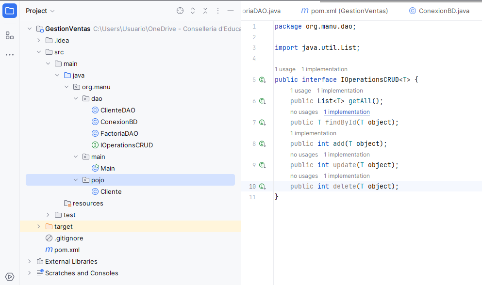
   
2. Ya solo nos queda crear el interface nuevo en el mismo paquete, que se llamará `ClienteDAO.java` (esto era antes la clase que implementaba los métodos), donde extenderá de la interface genérica de operaciones `IOperationsCRUD.java` y tendrá la cabecera del método `findByNombre`. Quedará de la siguiente forma:


``` java
package org.manu.dao;

import org.manu.pojo.Cliente;
import java.util.List;

public interface ClienteDAO extends IOperationsCRUD<Cliente> {
    public List<Cliente> findByNombre(Cliente object);
}
```


1. Modificaremos ahora que la clase `ClienteDAOImpl.java` ya no implemente la interface genérica `IOperationsCRUD` sino la interface específica `ClienteDAO.java`. Al modificarlo nos saldrá un error de que hay operaciones sin implementar, que es la nueva `findByNombre`. La implementamos quedando la clase de la siguiente forma:


``` java
package org.manu.dao;

import org.manu.pojo.Cliente;
import java.sql.Connection;
import java.sql.PreparedStatement;
import java.sql.ResultSet;
import java.sql.Statement;
import java.util.ArrayList;
import java.util.List;

public class ClienteDAOImpl implements ClienteDAO {

    // Conexion compartida para todos los metodos
    final private Connection conn = ConexionBD.getConnection();

    @Override
    public List<Cliente> getAll() {
        // ... (código del getAll como antes)
    }

    @Override
    public Cliente findById(Cliente object) {
        // ... (código del findById como antes)
    }

    @Override
    public int add(Cliente object) {
        // ... (código del add como antes)
    }

    @Override
    public int update(Cliente object) {
        // ... (código del update como antes)
    }

    @Override
    public int delete(Cliente object) {
        // ... (código del delete como antes)
    }

    @Override
    public List<Cliente> findByNombre(Cliente object) {
        String sql = "SELECT * FROM cliente WHERE nombre = ?";
        List<Cliente> lista = new ArrayList<Cliente>();
        try {
            PreparedStatement ps = conn.prepareStatement(sql);
            ps.setString(1, object.getNombre());
            ResultSet rs = ps.executeQuery();
            Cliente a = null;
            while (rs.next()) {
                Long idAux = rs.getLong("id");
                String nomAux = rs.getString("nombre");
                String ape1Aux = rs.getString("apellido1");
                String ape2Aux = rs.getString("apellido2");
                String ciuAux = rs.getString("ciudad");
                int catAux = rs.getInt("categoria");
                a = new Cliente(idAux, nomAux, ape1Aux, ape2Aux, ciuAux, catAux);
                lista.add(a);
            }
            rs.close();
            ps.close();
            return lista;
        } catch (Exception e) {
            e.printStackTrace();
            return null;
        }
    }
}
```


1. Si nos fijamos, al haber realizado esta refactorización de código nos ha modificado la clase `FactoriaDAO.java`, de forma que ahora se crea un objeto de tipo `ClienteDAOImpl` y no `ClienteDAO`. Queda de la siguiente forma:


``` java
package DAO;

import DAO.Cliente.ClienteDAOImpl;

public class FactoriaDAO {
    private static ClienteDAOImpl clienteDAO = null;

    public static ClienteDAOImpl getClienteDAO() {
        if (clienteDAO == null) {
            clienteDAO = new ClienteDAOImpl();
        }
        return clienteDAO;
    }
    
}
```


1. Con estos cambios que hemos realizado se ha quedado implementado perfectamente el patrón DAO, de forma muy optimizada y con un interface que publica sus métodos. La organización del proyecto queda de la siguiente forma:

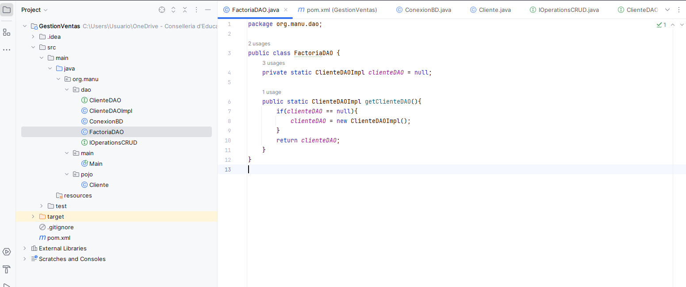